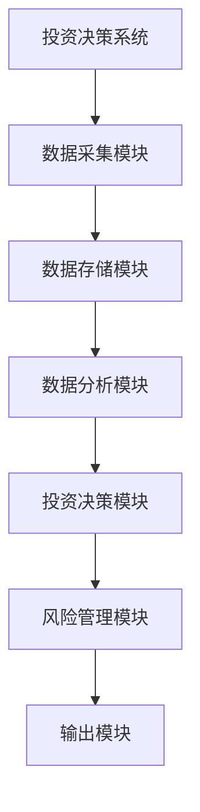

                 


# 巴菲特-芒格的生物燃料投资：可再生能源的新方向

> 关键词：巴菲特, 芒格, 生物燃料, 可再生能源, 投资策略, 技术博客, 投资模型

> 摘要：本文将深入探讨巴菲特和芒格在生物燃料领域的投资策略，分析其背后的技术原理和经济逻辑。通过详细的技术分析和实际案例，我们将揭示生物燃料在可再生能源转型中的重要角色，并提供一套基于巴菲特-芒格投资理念的数学模型和算法，帮助读者理解如何在可再生能源领域进行高效投资。

---

## 第一部分: 巴菲特-芒格的生物燃料投资概述

### 第1章: 生物燃料与可再生能源的背景

#### 1.1 生物燃料的定义与分类
生物燃料是指通过生物过程生产的可再生能源，主要来源于植物、藻类、动物脂肪和废油脂等生物质材料。生物燃料可以分为以下几类：
- **第一代生物燃料**：主要来源于粮食作物（如玉米、甘蔗）的糖类和淀粉类物质，经过发酵或酯化工艺生产乙醇或生物柴油。
- **第二代生物燃料**：利用非粮食作物（如纤维素、木质素）或农业废弃物（如秸秆、林业残渣）进行酶解或气化工艺生产纤维素乙醇或生物气体。
- **第三代生物燃料**：通过 algae（微藻）培养和萃取工艺生产高价值的生物柴油或生物燃料。

生物燃料的优势在于其可再生性、低排放性和资源可用性。然而，其生产成本较高，技术复杂性较高，且面临与粮食安全的竞争问题。

#### 1.2 可再生能源的全球发展趋势
随着全球能源需求的增加和化石能源的枯竭，可再生能源的开发和应用成为全球关注的焦点。生物燃料作为可再生能源的重要组成部分，具有以下几个关键优势：
1. **减少碳排放**：生物燃料的使用可以显著减少温室气体的排放，尤其是在替代传统汽油和柴油的情况下。
2. **能源安全**：通过本地生产生物燃料，可以减少对进口石油的依赖，提高国家能源安全性。
3. **资源利用**：生物燃料的生产可以利用农业废弃物和非食用生物质，从而提高资源利用效率。

#### 1.3 巴菲特和芒格的投资理念
巴菲特和芒格作为投资界的传奇，他们的投资理念以价值投资和多元思维模型为核心。巴菲特的价值投资理论强调长期持有优质资产，关注企业的基本面和内在价值。芒格的多元思维模型则强调通过跨学科的思维方式来分析问题，寻找投资机会。

### 第2章: 巴菲特-芒格投资模型的算法原理

#### 2.1 投资决策模型的构建
巴菲特-芒格投资模型是一种基于基本面分析和长期价值判断的投资策略。其核心在于通过对企业财务状况、行业地位、竞争优势和管理团队的深入分析，识别出具有长期增长潜力的企业。

#### 2.2 投资决策模型的实现
在生物燃料投资领域，我们可以将巴菲特-芒格的投资模型转化为一个数学模型，用于评估潜在的投资项目。以下是该模型的算法流程：

1. **输入数据**：包括企业的财务数据（收入、利润、现金流）、行业数据（市场规模、竞争格局）、技术数据（生产效率、成本结构）等。
2. **计算关键指标**：包括市盈率（P/E）、市净率（P/B）、净现值（NPV）、内部收益率（IRR）等。
3. **评估投资价值**：通过比较当前股价与内在价值，判断是否存在投资机会。
4. **风险分析**：评估市场风险、行业风险和企业特有风险，调整投资决策。
5. **输出结果**：生成投资建议，包括买入、持有或卖出的信号。

### 第3章: 生物燃料投资的系统架构设计

#### 3.1 系统功能设计
生物燃料投资系统需要具备以下功能模块：
- **数据采集**：收集企业的财务数据、行业数据和技术数据。
- **数据分析**：对数据进行清洗、建模和分析。
- **投资决策**：基于模型生成投资建议。
- **风险管理**：评估和管理投资风险。

#### 3.2 系统架构设计
以下是生物燃料投资系统的架构图：



### 第4章: 项目实战与案例分析

#### 4.1 环境安装
为了实现生物燃料投资系统的开发，需要安装以下工具和库：
- **编程语言**：Python
- **数据分析库**：Pandas、NumPy
- **可视化库**：Matplotlib、Seaborn
- **机器学习库**：Scikit-learn
- **数据库**：MySQL或MongoDB

#### 4.2 核心实现源代码
以下是投资决策模型的核心代码示例：

```python
import pandas as pd
import numpy as np

def calculate_intrinsic_value(finance_data):
    # 计算内在价值
    revenue = finance_data['revenue']
    profit_margin = finance_data['profit_margin']
    growth_rate = finance_data['growth_rate']
    
    # 计算净现值
    npv = (revenue * (1 + growth_rate) / (1 + 0.08)) 
    return npv

# 示例数据
data = {
    'revenue': 1000000,
    'profit_margin': 0.2,
    'growth_rate': 0.1
}

intrinsic_value = calculate_intrinsic_value(data)
print(f"内在价值: {intrinsic_value}")
```

### 第5章: 最佳实践与未来展望

#### 5.1 投资策略 tips
- **长期视角**：关注企业的长期增长潜力，避免短期波动的影响。
- **风险管理**：定期评估投资组合的风险，及时调整投资策略。
- **持续学习**：保持对行业动态和技术发展的敏感性，更新投资模型。

#### 5.2 未来展望
随着生物燃料技术的不断进步和市场需求的增加，生物燃料投资将变得更加重要。未来，投资者需要更加关注技术创新、成本优化和政策支持，以抓住可再生能源领域的投资机会。

---

作者：AI天才研究院/AI Genius Institute & 禅与计算机程序设计艺术 /Zen And The Art of Computer Programming

