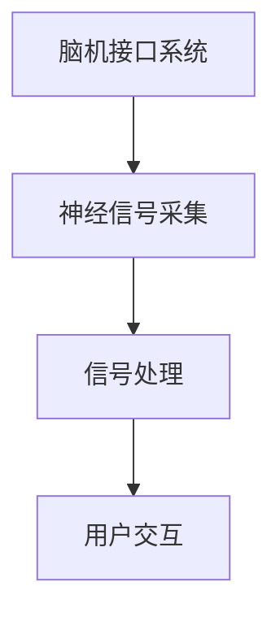
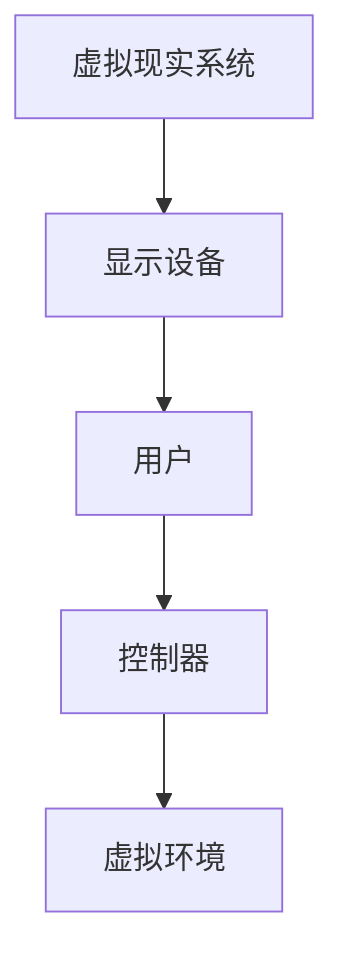
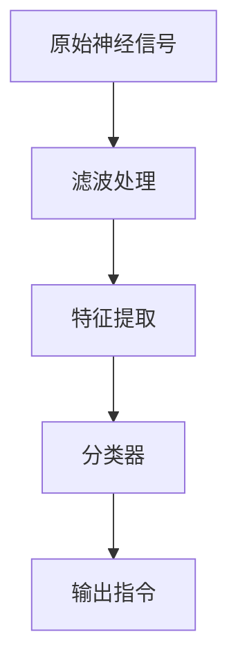
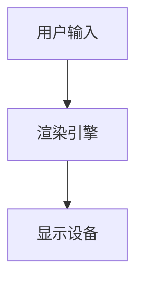
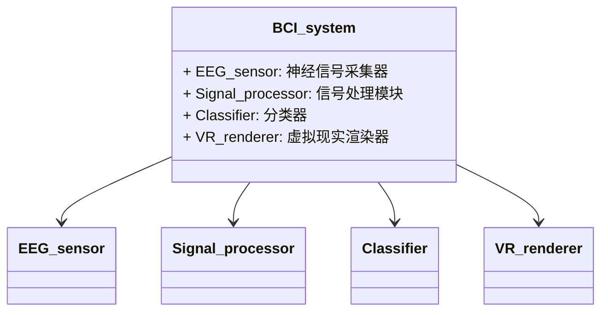
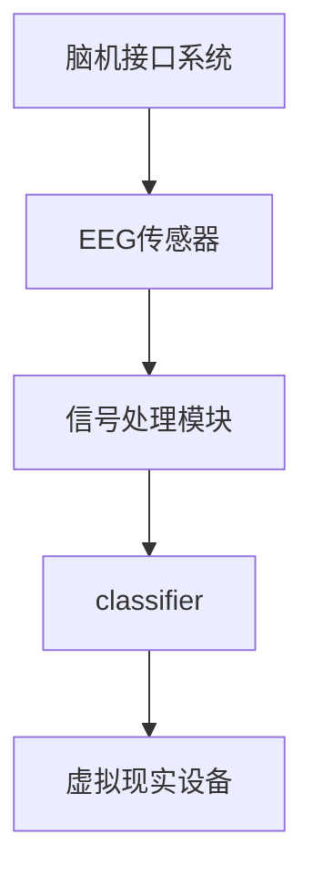

                 


# 巴菲特-芒格的脑机接口娱乐应用投资：虚拟现实的终极形态

## 关键词
- 脑机接口
- 虚拟现实
- 巴菲特
- 芒格
- 投资策略
- 娱乐应用

## 摘要
本文深入探讨了巴菲特和芒格在脑机接口和虚拟现实领域的投资策略，分析了这些技术如何重塑娱乐产业的未来。通过结合他们的投资哲学与前沿科技，文章揭示了虚拟现实作为终极娱乐形态的潜力，并提供了具体的案例分析和技术实现方案，为投资者和技术从业者提供了有价值的见解。

---

# 第一部分：背景介绍

## 第1章：脑机接口的核心概念

### 1.1 脑机接口的定义与核心要素
脑机接口（BCI）是一种直接连接人脑与外部设备的系统，通过采集和解析神经信号，实现人与机器的交互。其核心要素包括：
- **神经信号采集**：通过电极或其他传感器捕获大脑活动。
- **信号处理**：对采集到的信号进行滤波、特征提取和分类。
- **用户交互**：将处理后的信号转化为控制指令，驱动外部设备。

**脑机接口的核心概念图**：


### 1.2 虚拟现实的定义与特点
虚拟现实（VR）是一种模拟三维环境的计算机技术，用户通过头戴设备和交互设备沉浸于虚拟世界中。其特点包括：
- **沉浸性**：用户完全沉浸在虚拟环境中。
- **交互性**：用户可以通过动作、声音等与虚拟环境互动。
- **实时性**：环境能实时响应用户的输入。

**虚拟现实系统架构图**：


---

## 第2章：巴菲特与芒格的投资理念

### 2.1 巴菲特的价值投资理论
巴菲特的价值投资理论强调长期持有优质资产，关注企业的内在价值。其核心理念包括：
- **安全边际**：买入价格低于内在价值。
- **长期视角**：关注企业的持续盈利能力。
- **简单易懂**：投资那些容易理解的行业和企业。

### 2.2 芒格的多元思维模型
芒格提倡构建跨学科的知识框架，通过多个视角分析问题。其多元思维模型包括：
- **心理学**：理解人类行为。
- **经济学**：分析市场规律。
- **技术学**：预测行业趋势。

---

## 第3章：脑机接口与虚拟现实的技术原理

### 3.1 脑机接口的技术实现
脑机接口的关键技术包括：
- **神经信号采集**：使用EEG（脑电图）或fMRI（功能性磁共振成像）。
- **信号处理算法**：如傅里叶变换、主成分分析。
- **分类器设计**：基于机器学习的方法，如支持向量机（SVM）和随机森林。

**脑机接口信号处理流程图**：


### 3.2 虚拟现实的实现原理
虚拟现实的核心技术包括：
- **渲染引擎**：如Unity和Unreal Engine。
- **图形处理**：实时生成高帧率的三维图像。
- **交互技术**：如手部追踪和语音识别。

**虚拟现实渲染流程图**：


---

## 第4章：脑机接口与虚拟现实的结合

### 4.1 脑机接口在虚拟现实中的应用
脑机接口可以提升虚拟现实的沉浸感，例如：
- **直接控制**：用户通过思维控制虚拟设备。
- **情感反馈**：通过脑电波分析用户情绪，优化虚拟体验。

### 4.2 虚拟现实与脑机接口的协同发展
虚拟现实为脑机接口提供了应用场景，而脑机接口则增强了虚拟现实的交互性。两者的结合将推动娱乐体验的革新。

---

## 第5章：巴菲特与芒格的投资策略

### 5.1 巴菲特与芒格的投资逻辑
巴菲特和芒格的成功投资策略包括：
- **长期价值**：关注企业的持续价值创造。
- **风险管理**：分散投资，降低风险。

### 5.2 脑机接口与虚拟现实领域的投资机会
- **技术成熟度**：关注技术进步和商业化潜力。
- **市场需求**：分析娱乐和医疗领域的市场空间。

---

## 第6章：投资案例分析

### 6.1 巴菲特与芒格的经典投资案例
- **可口可乐**：巴菲特的经典投资案例，体现了价值投资理念。
- **Daily Journal**：芒格的投资案例，展示了多元思维模型的应用。

### 6.2 脑机接口与虚拟现实领域的投资策略
- **技术驱动**：投资具有核心技术优势的企业。
- **市场需求**：关注娱乐和医疗领域的应用潜力。

---

## 第7章：系统分析与架构设计

### 7.1 系统功能设计
- **用户界面**：直观的控制面板。
- **数据处理**：实时处理神经信号。
- **交互设计**：支持多种用户输入方式。

**系统功能设计类图**：


### 7.2 系统架构设计
- **分层架构**：数据采集层、处理层、应用层。
- **模块化设计**：各模块独立开发，便于维护。

**系统架构设计图**：


---

## 第8章：项目实战

### 8.1 环境安装
- **工具安装**：安装Python和相关库（如NumPy、Scikit-learn）。
- **开发环境**：配置虚拟现实开发环境，如Unity。

### 8.2 核心代码实现
以下是脑机接口信号处理的Python代码示例：
```python
import numpy as np
from sklearn.svm import SVC

# 示例数据：神经信号
data = np.random.randn(100, 4)

# 特征提取
features = data[:, :2]

# 训练分类器
model = SVC()
model.fit(features, [0, 1, 0, 1, 0, 1, 0, 1, 0, 1])

# 预测
test_data = np.array([[0.5, 0.3]])
prediction = model.predict(test_data)
print("预测结果:", prediction)
```

### 8.3 实际案例分析
分析一家虚拟现实娱乐公司，评估其市场潜力和技术优势。

---

## 第9章：总结与展望

### 9.1 总结
脑机接口与虚拟现实的结合将彻底改变娱乐产业，投资者应关注技术成熟度和市场需求。

### 9.2 展望
未来的娱乐应用将更加智能化和沉浸式，脑机接口技术将发挥关键作用。

---

## 作者：AI天才研究院 & 禅与计算机程序设计艺术

---

以上是文章的详细目录和内容框架，涵盖了从背景介绍到系统设计的各个方面，结合了技术分析和投资策略，为读者提供了全面的视角。

