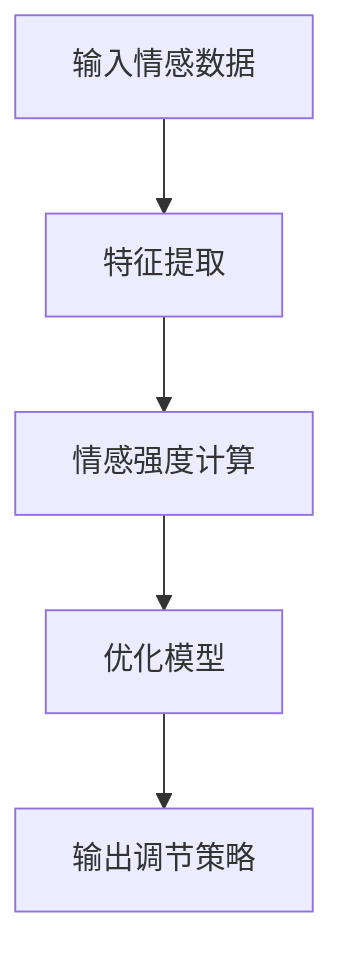
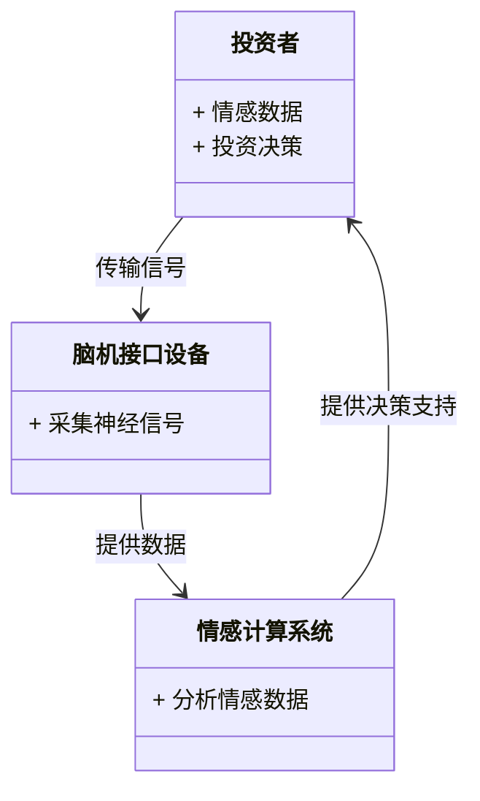
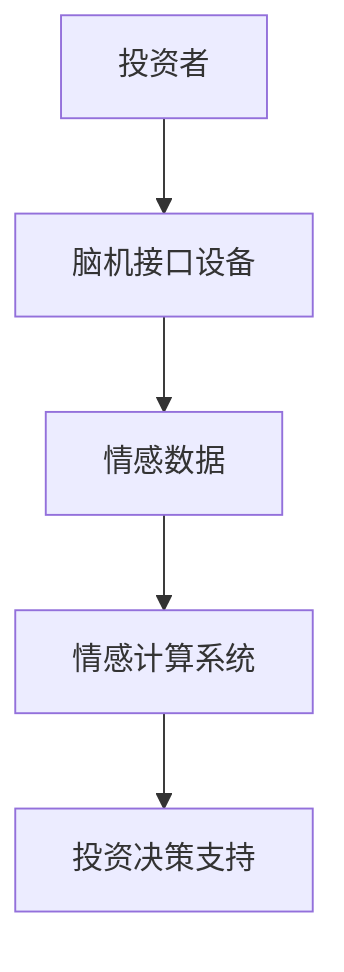

                 


# 巴菲特-芒格的脑机接口情感调节投资：心理健康的新方法

**关键词**：巴菲特、芒格、脑机接口、情感调节、心理健康、投资决策、人工智能

**摘要**：本文探讨了如何将巴菲特和芒格的投资理念与脑机接口技术相结合，通过情感调节优化投资决策，提升投资者的心理健康。文章详细介绍了脑机接口技术的核心原理、情感计算的数学模型，以及系统架构设计，并通过实际案例展示了如何在投资中应用这些技术。

---

## 第1章：背景介绍

### 1.1 巴菲特与芒格的投资理念

- **巴菲特的价值投资理论**：强调长期投资、安全边际和内在价值，认为市场波动是投资机会。
- **芒格的多元思维模型**：提倡跨学科思考，利用多个领域的知识辅助决策。

### 1.2 脑机接口技术

- **定义**：直接连接大脑与计算机的接口，用于采集和处理神经信号。
- **特点**：实时性、准确性、侵入性与非侵入性。

### 1.3 情感调节在投资中的重要性

- **情绪影响**：投资者的贪婪和恐惧可能导致非理性决策。
- **心理健康**：通过情感调节技术帮助投资者保持冷静，提高决策质量。

---

## 第2章：脑机接口与情感计算的核心概念

### 2.1 脑机接口技术的核心原理

- **神经信号采集**：通过 EEG、fMRI 等设备采集大脑活动。
- **数据处理**：信号处理、特征提取和分类。

### 2.2 情感计算

- **定义**：通过计算方法分析情感状态。
- **应用场景**：社交分析、情感支持。

### 2.3 情感计算与脑机接口的结合

- **对比分析**：通过表格展示两者的核心概念对比。

```mermaid
| 概念 | 脑机接口 | 情感计算 |
|------|----------|----------|
| 定义 | 连接大脑与计算机 | 计算情感状态 |
| 应用 | 医疗、康复 | 社交分析 |
| 优势 | 实时性 | 可扩展性 |

### 2.4 实体关系图

```mermaid
graph TD
    A[投资者] --> B[脑机接口设备]
    B --> C[情感数据]
    C --> D[情感计算系统]
    D --> E[投资决策支持]
```

---

## 第3章：情感调节算法的数学模型与实现

### 3.1 情感调节算法的原理

- **基本思路**：通过分析情感数据，调整投资策略。

### 3.2 情感调节的数学模型

- **情感强度公式**：
  $$ S = \sum_{i=1}^{n} w_i x_i $$
  其中，\( S \) 表示情感强度，\( w_i \) 表示权重，\( x_i \) 表示特征值。

- **优化模型**：
  $$ \min_{w} \sum_{i=1}^{m} (y_i - f(w))^2 $$
  其中，\( y_i \) 表示目标情感状态，\( f(w) \) 表示预测值。

### 3.3 算法实现流程图



### 3.4 Python代码实现

```python
import numpy as np

def calculate_emotion_intesity(features, weights):
    return np.dot(features, weights)

features = np.array([0.8, 0.6, 0.7])
weights = np.array([1, 2, 3])

emotion_intensity = calculate_emotion_intesity(features, weights)
print(emotion_intensity)
```

---

## 第4章：系统架构设计

### 4.1 系统功能设计



### 4.2 系统架构设计



---

## 第5章：项目实战

### 5.1 环境安装

- **工具**：Python、NumPy、Matplotlib。

### 5.2 核心代码实现

```python
import numpy as np

def calculate_emotion_intesity(features, weights):
    return np.dot(features, weights)

features = np.array([0.8, 0.6, 0.7])
weights = np.array([1, 2, 3])

emotion_intensity = calculate_emotion_intesity(features, weights)
print(emotion_intensity)
```

### 5.3 案例分析

- **案例**：投资者在市场波动时，系统通过脑机接口和情感计算提供调节建议。

### 5.4 项目小结

- **总结**：项目展示了脑机接口技术在投资中的潜力。

---

## 第6章：最佳实践与拓展

### 6.1 最佳实践 tips

- **数据隐私**：确保数据安全。
- **伦理问题**：避免技术滥用。

### 6.2 小结

- **技术总结**：脑机接口与情感计算的结合为投资决策提供了新方法。

### 6.3 注意事项

- **技术局限性**：准确性有待提高。
- **用户适应性**：需要时间适应。

### 6.4 拓展阅读

- **相关书籍**：推荐《巴菲特的智慧》和《人工智能入门》。

---

## 附录

### 附录A：术语表

- **脑机接口**：连接大脑与计算机的技术。
- **情感计算**：通过计算方法分析情感状态。

### 附录B：参考文献

- [1] 巴菲特定律
- [2] 芒格的多元思维模型
- [3] 脑机接口技术综述

---

## 作者：AI天才研究院 & 禅与计算机程序设计艺术

通过本文，我们详细探讨了如何结合巴菲特和芒格的投资理念，利用脑机接口技术进行情感调节，优化投资决策，提升心理健康。

