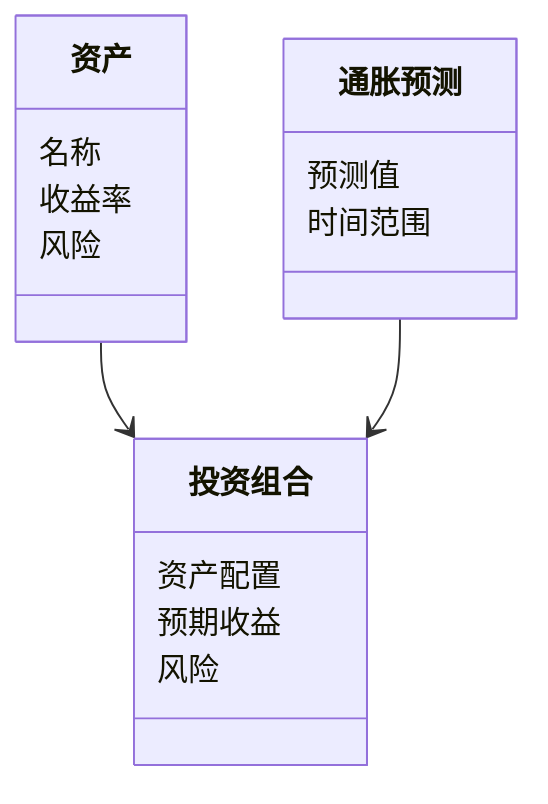
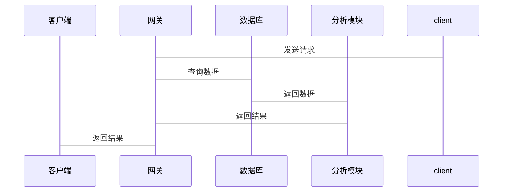

                 


# 巴菲特-芒格的通胀对冲策略：如何保护投资组合

> 关键词：通胀对冲，巴菲特策略，芒格智慧，投资组合，风险管理

> 摘要：本文深入分析了巴菲特和芒格在应对通胀方面的策略和方法，探讨了如何通过价值投资、资产配置和风险管理来保护投资组合。文章结合理论与实践，详细阐述了通胀对冲的核心原理、数学模型、系统架构和实战案例，为投资者提供了实用的指导。

---

# 第一部分: 巴菲特-芒格的通胀对冲策略概述

# 第1章: 通胀与投资的背景介绍

## 1.1 通胀的定义与类型

### 1.1.1 通胀的定义
通货膨胀（Inflation）是指物价总水平在一段时间内持续上涨的现象。通常用消费者价格指数（CPI）或生产者价格指数（PPI）来衡量。通胀的出现通常意味着货币购买力的下降。

### 1.1.2 通胀的类型与特征
通胀可以分为温和通胀、成本推动型通胀、需求拉动型通胀等。以下是通胀的主要类型和特征：

| 类型 | 特征 | 描述 |
|------|------|------|
| 温和通胀 | 低水平、可持续 | 通胀率在2%-5%之间，对经济影响较小 |
| 成本推动型通胀 | 供给侧驱动 | 由生产成本（如工资、原材料价格）上升引发 |
| 需求拉动型通胀 | 需求侧驱动 | 由总需求超过总供给引发 |
| 输入型通胀 | 外部冲击 | 由国际油价、汇率波动等外部因素引发 |

### 1.1.3 通胀对企业与个人的影响
- **对企业的影响**：成本上升、利润压缩、投资意愿下降。
- **对个人的影响**：购买力下降、生活成本增加、投资收益不确定性。

## 1.2 巴菲特与芒格的投资理念

### 1.2.1 巴菲特的价值投资理论
巴菲特的价值投资理论强调以低于内在价值的价格购买优质资产。他主张长期投资，关注企业的基本面，而非短期市场波动。

### 1.2.2 芒格的多元思维模型
芒格提倡建立多元思维模型，将不同学科的原理交叉应用，以更好地理解复杂问题。他认为，投资决策需要考虑经济、心理、社会等多个维度。

### 1.2.3 两人投资理念的异同点
| 方面 | 巴菲特 | 芒格 |
|------|------|------|
| 核心理念 | 价值投资 | 多元思维模型 |
| 投资风格 | 买入并持有 | 系统性分析 |
| 风险管理 | 资产配置 | 跨学科视角 |

## 1.3 通胀对冲的核心问题

### 1.3.1 通胀对投资组合的影响
- 资产贬值：通胀会导致货币购买力下降，固定收益资产的实际回报率下降。
- 资产重新定价：通胀预期会影响股票、债券等资产的价格。

### 1.3.2 对冲通胀的必要性
- 保护购买力：通过投资实物资产或抗通胀资产，抵消通胀对购买力的侵蚀。
- 优化收益：通过合理的资产配置，在通胀环境下实现收益最大化。

### 1.3.3 巴菲特-芒格策略的背景与目标
- 背景：20世纪70年代的石油危机和通胀冲击。
- 目标：通过长期价值投资和资产配置，实现通胀环境下的资产保值与增值。

## 1.4 本章小结
本章从通胀的定义、类型及其影响出发，介绍了巴菲特和芒格的投资理念，并提出了通胀对冲的核心问题。通过对比分析，明确了两人策略的异同点。

---

# 第二部分: 巴菲特-芒格通胀对冲的核心策略

# 第2章: 巴菲特-芒格的通胀对冲工具

## 2.1 股票投资与通胀对冲

### 2.1.1 股票的通胀对冲机制
股票作为通胀对冲工具的核心机制在于其收益与通胀的关联性。优质企业的股票能够在通胀环境下保持或提升其实际收益。

### 2.1.2 巴菲特偏爱的行业与公司
巴菲特倾向于投资具备以下特征的企业：
- 高ROE（净资产收益率）。
- 强大的竞争优势（如护城河）。
- 稳定的现金流。

### 2.1.3 股票对冲通胀的优缺点
- 优点：长期收益稳定，抵御通胀能力强。
- 缺点：短期波动大，市场风险高。

## 2.2 债券投资与通胀对冲

### 2.2.1 债券的基本原理
债券是债务工具，投资者通过持有债券获得固定利息收入和本金偿还。

### 2.2.2 通胀对债券价值的影响
通胀会导致债券的实际收益率下降，因为债券的票面利率是固定的，而通胀会侵蚀其购买力。

### 2.2.3 巴菲特对债券投资的看法
巴菲特认为债券是防御性资产，适合在低通胀环境下作为短期资金的避险工具。

## 2.3 黄金与大宗商品投资

### 2.3.1 黄金的通胀对冲作用
黄金作为避险资产，在通胀环境下通常表现良好。其价格与通胀预期高度相关。

### 2.3.2 大宗商品的投资策略
大宗商品（如原油、农产品）的价格受通胀影响较大，但波动性也较高。

### 2.3.3 巴菲特对黄金的态度
巴菲特对黄金持谨慎态度，认为其不具备生产价值，长期表现不如优质股票。

## 2.4 其他对冲工具

### 2.4.1 现金与短期资产
现金是应对短期通胀波动的工具，但长期来看，其购买力会受到通胀侵蚀。

### 2.4.2 房地产投资
房地产是实物资产，通常能抵御通胀，但流动性较差。

### 2.4.3 其他对冲工具的优缺点
- 对冲基金：高风险，收益不稳定。
- 另类投资：多样性高，但门槛高，流动性差。

## 2.5 本章小结
本章分析了股票、债券、黄金等通胀对冲工具的特点和优缺点，探讨了巴菲特和芒格在选择这些工具时的策略。

---

# 第三部分: 巴菲特-芒格通胀对冲策略的数学模型与算法

# 第3章: 通胀对冲的数学模型

## 3.1 通胀对冲的核心模型

### 3.1.1 资产回报率与通胀的关系
资产回报率与通胀的关系可以通过以下公式表示：

$$ \text{实际回报率} = \text{名义回报率} - \text{通胀率} $$

### 3.1.2 复利计算与通胀对冲
复利计算公式为：

$$ \text{终值} = \text{现值} \times (1 + \text{收益率})^n $$

其中，收益率需要考虑通胀因素。

### 3.1.3 资产配置的数学模型
资产配置可以通过以下步骤进行：
1. 确定各资产类别的风险和收益特征。
2. 优化资产配置比例，以实现风险调整后的收益最大化。

优化模型可以表示为：

$$ \min_w \text{风险} \quad \text{subject to} \quad \text{收益} \geq \text{目标收益} $$

## 3.2 巴菲特-芒格策略的算法

### 3.2.1 资产配置的优化算法
资产配置优化算法的步骤如下：

1. 收集历史数据，计算各资产类别的预期收益和风险。
2. 确定优化目标（如最大收益）和约束条件（如风险上限）。
3. 使用优化算法（如均值-方差优化）求解最优配置。

### 3.2.2 风险调整后的回报模型
风险调整后的回报可以用夏普比率来衡量：

$$ \text{夏普比率} = \frac{\text{超额收益}}{\text{收益的标准差}} $$

### 3.2.3 实际案例分析
假设我们有股票和债券两种资产，历史数据如下：

| 资产 | 收益率 | 标准差 |
|------|--------|--------|
| 股票 | 10%    | 15%    |
| 债券 | 5%     | 5%     |

目标是构建一个风险可控、收益最大化投资组合。通过优化算法，可以确定股票和债券的最优配置比例。

---

# 第四部分: 巴菲特-芒格通胀对冲策略的系统架构与实现

# 第4章: 系统分析与架构设计

## 4.1 问题场景介绍
我们希望通过构建一个投资决策系统，帮助投资者在通胀环境下优化资产配置。

## 4.2 系统功能设计

### 4.2.1 领域模型
以下是领域模型的类图：



### 4.2.2 系统架构
以下是系统架构的架构图：


### 4.2.3 系统交互
以下是系统交互的序列图：



## 4.3 系统实现

### 4.3.1 环境配置
- 操作系统：Linux
- 开发工具：Python、Jupyter Notebook
- 数据库：MySQL

### 4.3.2 核心代码实现
以下是Python代码示例：

```python
import numpy as np
import pandas as pd
from sklearn import linear_model

# 数据预处理
data = pd.read_csv('inflation_data.csv')
X = data[['GDP', '失业率', '通胀率']]
y = data['股票收益']

# 建立线性回归模型
model = linear_model.LinearRegression()
model.fit(X, y)

# 预测未来收益
future_data = pd.DataFrame({
    'GDP': [5],
    '失业率': [4],
    '通胀率': [3]
})
predicted_return = model.predict(future_data)
print(predicted_return)
```

### 4.3.3 案例分析
通过上述代码，我们可以预测未来股票收益，并据此优化资产配置。

## 4.4 本章小结
本章通过系统架构设计和实现，展示了如何将巴菲特和芒格的策略应用于实际投资决策中。

---

# 第五部分: 巴菲特-芒格通胀对冲策略的最佳实践与总结

# 第5章: 最佳实践与总结

## 5.1 小结
本文系统介绍了巴菲特和芒格的通胀对冲策略，从理论到实践，详细探讨了如何通过资产配置、风险管理等方法保护投资组合。

## 5.2 注意事项
- 风险管理是关键。
- 长期投资需要耐心和信心。
- 资产配置需根据市场环境动态调整。

## 5.3 拓展阅读
建议读者阅读以下书籍：
- 巴菲特的《巴菲特致股东的信》
- 芒格的《穷查理宝典》

## 5.4 本章小结
通过本文的分析，读者可以更好地理解通胀对冲的复杂性，并掌握巴菲特和芒格的核心策略。

---

作者：AI天才研究院/AI Genius Institute & 禅与计算机程序设计艺术 /Zen And The Art of Computer Programming

