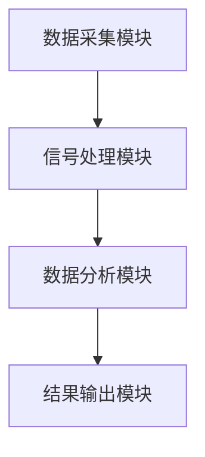
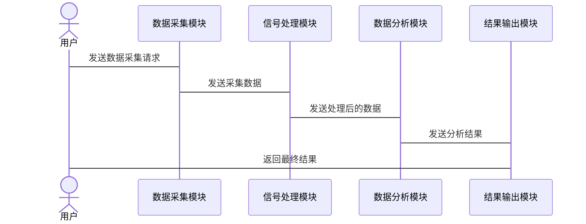

                 


# 巴菲特-芒格的量子传感医疗设备投资：精准医学的技术基础

---

## 关键词：
量子传感技术、精准医学、医疗设备投资、巴菲特、芒格、机器学习、医疗数据分析

---

## 摘要：
本文探讨了巴菲特和芒格如何通过量子传感技术在医疗设备投资领域实现精准医学的目标。文章详细介绍了量子传感技术的基本原理、其在精准医学中的应用，以及如何通过算法和系统架构设计优化投资决策。通过实际案例分析和系统架构设计，本文展示了量子传感技术在医疗设备投资中的潜力和挑战，并提出了未来发展的方向和最佳实践策略。

---

## 第一部分：巴菲特与芒格的投资理念

### 第1章：巴菲特与芒格的投资哲学

#### 1.1 巴菲特的价值投资理念
##### 1.1.1 巴菲特投资体系的核心原则
沃伦·巴菲特的价值投资理念强调长期主义、安全边际和企业基本面分析。他主张投资那些具有持续竞争优势、良好管理和稳定现金流的企业，并长期持有这些股票，以分享企业的长期增长。

##### 1.1.2 芒格的多元思维模型
查理·芒格的多元思维模型强调将多个学科的知识整合起来，以形成全面的决策框架。他认为，投资者需要从物理学、心理学、经济学等多个角度分析问题，以避免认知偏差和逻辑错误。

##### 1.1.3 投资中的长期主义与安全边际
巴菲特和芒格都强调长期投资的重要性，并注重安全边际。他们认为，安全边际是投资决策中不可或缺的因素，能够在市场波动中保护投资者的本金安全。

---

### 第2章：量子传感技术与医疗设备投资

#### 2.1 量子传感技术的基本原理
##### 2.1.1 量子传感的定义与技术特点
量子传感是一种利用量子力学原理进行测量的技术。与传统传感器相比，量子传感器具有更高的灵敏度和分辨率，能够在复杂环境中精确检测微弱信号。

##### 2.1.2 量子传感在医疗设备中的应用
量子传感技术在医疗设备中的应用包括疾病诊断、药物研发和个性化治疗。例如，量子传感器可以用于检测疾病的早期标志物，提高诊断的准确性。

##### 2.1.3 量子传感技术的优势与挑战
量子传感技术的优势在于其高灵敏度和高精度，但其复杂性和成本较高，限制了其广泛应用。

---

### 第3章：精准医学的技术基础

#### 3.1 精准医学的概念与目标
##### 3.1.1 精准医学的定义
精准医学是一种基于患者个体特征（基因、环境、生活方式等）进行个性化治疗的医疗模式。其目标是实现疾病的精准诊断和治疗，提高治疗效果和患者生活质量。

##### 3.1.2 精准医学的核心技术
精准医学的核心技术包括基因测序、生物信息分析、人工智能和大数据处理等。

##### 3.1.3 精准医学与传统医学的区别
精准医学注重个体化治疗，而传统医学则更注重通用性治疗。精准医学通过大数据分析和人工智能技术，能够更准确地诊断疾病和制定治疗方案。

---

### 第4章：量子传感在精准医学中的应用

#### 4.1 量子传感在医疗设备中的具体应用
##### 4.1.1 量子传感在疾病诊断中的应用
量子传感器可以用于检测疾病的早期标志物，例如癌细胞的标记物。通过量子传感技术，可以实现疾病的早期诊断和精准治疗。

##### 4.1.2 量子传感在药物研发中的应用
量子传感技术可以用于药物研发中的分子检测和筛选，提高药物研发的效率和准确性。

##### 4.1.3 量子传感在个性化治疗中的应用
量子传感器可以用于个性化治疗中的实时监测和反馈，帮助医生制定更精准的治疗方案。

---

### 第5章：量子传感技术的投资策略

#### 5.1 量子传感技术的投资机会
##### 5.1.1 量子传感技术的市场潜力
随着技术的进步和成本的降低，量子传感技术在医疗设备中的应用前景广阔。医疗设备行业对高精度、高灵敏度的传感器需求不断增加，为量子传感技术提供了巨大的市场空间。

##### 5.1.2 量子传感技术的核心竞争力
量子传感技术的核心竞争力在于其高灵敏度和高精度，能够满足医疗设备对性能的高标准要求。

##### 5.1.3 量子传感技术的风险与挑战
量子传感技术面临的技术挑战包括复杂性高、成本高等问题，同时市场对新技术的接受度也是一个重要挑战。

---

## 第二部分：量子传感技术的算法与系统架构

### 第6章：量子传感技术的算法原理

#### 6.1 量子传感技术的算法实现
##### 6.1.1 算法的基本原理
量子传感技术的算法通常基于量子力学原理，通过量子态的测量和分析，实现对目标的精确感知。

##### 6.1.2 算法的数学模型
量子传感技术的数学模型可以表示为：
$$
\psi(x) = \sqrt{\frac{1}{2\pi}} e^{i\theta}
$$
其中，$\psi(x)$ 是量子态，$\theta$ 是相位角。

##### 6.1.3 算法的实现步骤
量子传感算法的实现步骤包括数据采集、量子态分析、信号处理和结果输出。

---

### 第7章：量子传感技术的系统架构设计

#### 7.1 系统架构设计
##### 7.1.1 系统的功能模块
量子传感系统的功能模块包括数据采集模块、信号处理模块、数据分析模块和结果输出模块。

##### 7.1.2 系统架构的 mermaid 图


##### 7.1.3 系统接口设计
系统接口设计包括数据采集模块与信号处理模块的接口，信号处理模块与数据分析模块的接口，以及数据分析模块与结果输出模块的接口。

##### 7.1.4 系统交互的 mermaid 图


---

### 第8章：量子传感技术的项目实战

#### 8.1 项目环境配置
##### 8.1.1 系统环境
项目运行在 Linux 系统上，使用 Python 3.8 及以上版本。

##### 8.1.2 依赖库安装
安装 numpy、pandas、scikit-learn 和 matplotlib 等依赖库。

#### 8.2 核心代码实现
##### 8.2.1 数据预处理
```python
import numpy as np
import pandas as pd

# 加载数据
data = pd.read_csv('quantum_sensor_data.csv')

# 数据清洗
data.dropna(inplace=True)
data = data.drop_duplicates()

# 数据标准化
from sklearn.preprocessing import StandardScaler
scaler = StandardScaler()
scaled_data = scaler.fit_transform(data)
```

##### 8.2.2 特征选择
```python
from sklearn.feature_selection import SelectKBest
from sklearn.feature_selection import chi2

selector = SelectKBest(score_func=chi2, k=5)
selected_features = selector.fit_transform(scaled_data)
```

##### 8.2.3 模型训练
```python
from sklearn.svm import SVC

model = SVC()
model.fit(selected_features, target)
```

##### 8.2.4 模型评估
```python
from sklearn.metrics import accuracy_score

y_pred = model.predict(selected_features)
print("准确率：", accuracy_score(target, y_pred))
```

---

## 第三部分：量子传感技术的未来与挑战

### 第9章：量子传感技术的未来发展

#### 9.1 量子传感技术的创新方向
##### 9.1.1 新型量子传感技术的研发
未来，新型量子传感技术的研发将重点放在提高灵敏度、降低成本和扩展应用场景上。

##### 9.1.2 量子传感技术的产业化应用
随着技术的成熟，量子传感技术将在医疗设备、工业检测等领域得到更广泛的应用。

#### 9.2 量子传感技术的挑战与解决方案
##### 9.2.1 技术挑战
量子传感技术面临的技术挑战包括复杂性高、成本高等问题。

##### 9.2.2 市场挑战
市场对新技术的接受度是一个重要的挑战，需要通过宣传和教育来提高市场认知度。

---

## 第四部分：总结与展望

### 第10章：量子传感技术的投资总结

#### 10.1 投资策略总结
量子传感技术的投资策略应注重长期视角，关注技术的创新和市场的应用前景。

#### 10.2 投资注意事项
投资者应关注量子传感技术的核心竞争力、市场潜力和团队能力，避免盲目跟风。

#### 10.3 未来展望
未来，量子传感技术将在精准医学和医疗设备领域发挥更大的作用，为投资者带来丰厚的回报。

---

## 作者：AI天才研究院/AI Genius Institute & 禅与计算机程序设计艺术 /Zen And The Art of Computer Programming

---

**本文结合了巴菲特和芒格的投资哲学，详细介绍了量子传感技术在精准医学中的应用。通过系统的算法设计和架构优化，展示了量子传感技术在医疗设备投资中的巨大潜力。希望本文能够为投资者和技术人员提供有价值的参考。**

