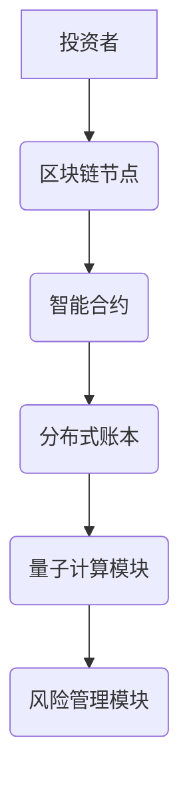
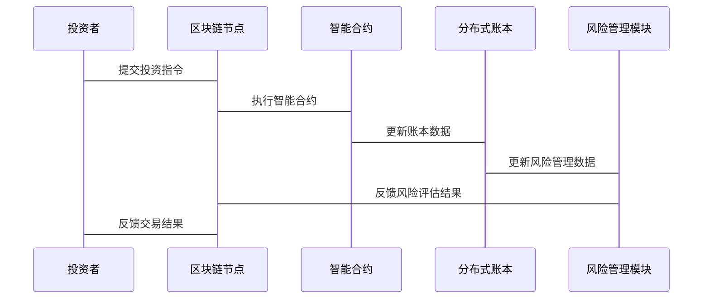

                 


# 巴菲特-芒格的量子区块链投资：下一代分布式账本技术

> 关键词：巴菲特，芒格，量子区块链，分布式账本，智能合约，去中心化金融（DeFi）

> 摘要：本文探讨了巴菲特和芒格的投资理念与量子区块链技术的结合，分析了量子区块链的核心原理及其在投资中的应用，详细介绍了量子区块链投资系统的架构设计与实现，并通过实际案例分析展示了其在金融领域的潜力。

---

## 第一部分: 巴菲特-芒格投资理念与量子区块链技术的结合

### 第1章: 巴菲特-芒格投资理念概述

#### 1.1 巴菲特-芒格投资理念的核心思想
##### 1.1.1 巴菲特的价值投资理论
巴菲特的价值投资理论强调长期投资、注重基本面分析以及安全边际。他主张投资于具有强大竞争优势和良好治理的企业，并长期持有，而非短期交易。

##### 1.1.2 芒格的多元思维模型
芒格提倡多元思维模型，即通过多个学科的思维方式来分析问题，避免单一思维的局限性。这种思维方式帮助投资者更全面地评估投资项目，降低决策风险。

##### 1.1.3 价值投资与长期主义的结合
价值投资与长期主义的结合使巴菲特和芒格的投资理念更加注重企业的内在价值和长期发展潜力，而非短期市场波动。

#### 1.2 量子区块链技术的基本概念
##### 1.2.1 区块链技术的定义与特点
区块链是一种分布式账本技术，通过去中心化、不可篡改和透明性等特点，确保数据的安全性和可靠性。

##### 1.2.2 量子计算在区块链中的应用
量子计算利用量子位的叠加和纠缠特性，能够大幅提高计算速度，解决传统区块链中的某些难题，如复杂的加密算法和大规模数据处理。

##### 1.2.3 分布式账本技术的核心原理
分布式账本技术通过多节点协作，确保数据的一致性和安全性。每个节点都保存完整的账本副本，通过共识机制达成一致，保证数据的不可篡改性。

---

### 第2章: 量子区块链技术的核心原理

#### 2.1 量子计算在区块链中的应用
##### 2.1.1 量子计算的基本原理
量子计算基于量子力学原理，利用量子位的叠加态和纠缠态进行并行计算，能够在某些特定问题上远超经典计算机的性能。

##### 2.1.2 量子计算在区块链中的潜在应用
量子计算可以用于优化区块链的共识算法、提升加密算法的安全性以及加速大规模数据分析。

##### 2.1.3 量子区块链的安全性分析
量子计算的引入可以增强区块链的安全性，防止传统密码学中的某些漏洞被利用，确保账本的不可篡改性和数据的隐私性。

#### 2.2 分布式账本技术的实现细节
##### 2.2.1 分布式账本的定义与特点
分布式账本是一种去中心化的数据存储方式，每个参与方都持有完整的账本副本，通过共识机制保证数据一致性。

##### 2.2.2 区块链的共识机制
共识机制如工作量证明（PoW）、权益证明（PoS）和拜占庭容错（BFT）等，确保分布式账本的节点能够达成一致，维护网络的安全性和稳定性。

##### 2.2.3 智能合约的实现原理
智能合约是一种自动执行的代码，部署在区块链上，根据预设条件自动执行交易或操作。它们通过区块链的虚拟机（如Ethereum的EVM）进行编译和执行。

---

### 第3章: 量子区块链在投资中的应用

#### 3.1 量子区块链在金融领域的应用
##### 3.1.1 智能合约在金融交易中的应用
智能合约可以用于自动执行金融交易，如期权、期货等衍生品的自动结算，提升交易效率并降低人为干预风险。

##### 3.1.2 去中心化金融（DeFi）的现状与趋势
DeFi通过区块链技术构建去中心化的金融体系，包括去中心化交易所、借贷平台和支付网络，提供更透明和高效的金融服务。

##### 3.1.3 量子区块链在证券交易中的潜在应用
量子区块链可以提升证券交易的透明度和效率，通过智能合约实现自动结算，降低交易成本和风险。

#### 3.2 巴菲特-芒格投资理念与量子区块链的结合
##### 3.2.1 价值投资与量子区块链技术的契合点
价值投资注重企业的长期价值，而量子区块链技术能够提供更高效和安全的交易和结算方式，两者在提升投资效率和安全性方面具有协同效应。

##### 3.2.2 量子区块链技术如何提升投资决策的准确性
通过量子计算和分布式账本技术，投资者可以实时获取更准确的市场数据和企业信息，辅助投资决策的准确性。

##### 3.2.3 量子区块链技术在风险管理中的应用
量子区块链通过智能合约和分布式账本技术，能够实时监控和管理投资风险，及时发现和应对潜在问题。

---

### 第4章: 量子区块链投资系统的架构设计

#### 4.1 系统架构设计
##### 4.1.1 系统整体架构图
以下是量子区块链投资系统的整体架构图：



##### 4.1.2 系统核心模块的功能描述
- **投资者模块**：投资者通过区块链节点提交投资指令。
- **区块链节点**：负责处理和验证交易请求。
- **智能合约**：根据预设条件自动执行交易。
- **分布式账本**：记录所有交易数据，确保数据不可篡改。
- **量子计算模块**：利用量子计算提升共识算法和数据处理效率。
- **风险管理模块**：实时监控和管理投资风险。

##### 4.1.3 系统的可扩展性设计
系统采用模块化设计，支持新增节点和智能合约的动态部署，确保系统的可扩展性和灵活性。

#### 4.2 系统接口设计
##### 4.2.1 系统主要接口的定义
- **投资者接口**：提供投资指令提交和交易查询功能。
- **区块链节点接口**：处理交易请求和验证数据。
- **智能合约接口**：定义合约逻辑和执行规则。
- **风险管理接口**：实时更新和反馈风险数据。

##### 4.2.2 接口之间的交互流程
以下是投资者提交投资指令的交互流程图：



##### 4.2.3 接口的安全性设计
系统采用多重身份验证和加密技术，确保接口的安全性和数据的隐私性。

---

### 第5章: 量子区块链投资系统的实现

#### 5.1 系统环境搭建
##### 5.1.1 开发环境的安装与配置
- 操作系统：建议使用Linux或macOS，提供更好的开发环境。
- 区块链开发框架：选择以太坊的Solidity或超级账本等框架。
- 量子计算模拟环境：使用Qiskit等量子计算开发工具包。

##### 5.1.2 区块链开发框架的选择与安装
以太坊是一个常用的智能合约平台，支持Solidity语言的智能合约开发。

##### 5.1.3 量子计算模拟环境的搭建
使用Qiskit库搭建量子计算模拟环境，安装Python和Qiskit库。

#### 5.2 系统核心模块实现
##### 5.2.1 智能合约的编写与测试
以下是智能合约的编写示例：

```solidity
// SPDX-License-Identifier: MIT
pragma solidity ^0.8.0;

contract InvestmentContract {
    address payable public investor;
    uint256 public investmentAmount;

    function invest(uint256 amount) external {
        investor = payable(msg.sender);
        investmentAmount = amount;
        // 执行投资操作
    }

    function withdraw() external {
        require(msg.sender == investor, "Only investor can withdraw");
        uint256 amount = investmentAmount;
        investmentAmount = 0;
        investor.transfer(amount);
    }
}
```

##### 5.2.2 区块链节点的部署与管理
通过以太坊的Ganache模拟器部署本地区块链节点，进行智能合约的测试和调试。

##### 5.2.3 量子计算算法的实现与优化
以下是量子计算算法的实现示例：

```python
from qiskit import QuantumCircuit, execute, Aer
from qiskit.visualization import plot_histogram

qc = QuantumCircuit(2, 2)
qc.h(0)
qc.cx(0, 1)
qc.measure([0,1], [0,1])

backend = Aer.get_backend('qasm_simulator')
job = execute(qc, backend)
result = job.result()
print(result.counts)
```

---

### 第6章: 实际案例分析与项目总结

#### 6.1 实际案例分析
通过具体案例分析量子区块链技术在投资中的实际应用，如智能合约在DeFi中的应用，量子计算在风险评估中的应用等。

#### 6.2 项目总结
总结项目的成功经验，分析存在的问题和改进方向，展望量子区块链技术在投资领域的未来发展趋势。

---

## 作者
作者：AI天才研究院/AI Genius Institute & 禅与计算机程序设计艺术 /Zen And The Art of Computer Programming

---

以上是《巴菲特-芒格的量子区块链投资：下一代分布式账本技术》的技术博客文章的完整内容，涵盖了从理论到实践的各个方面，帮助读者全面理解量子区块链技术在投资中的应用潜力。

