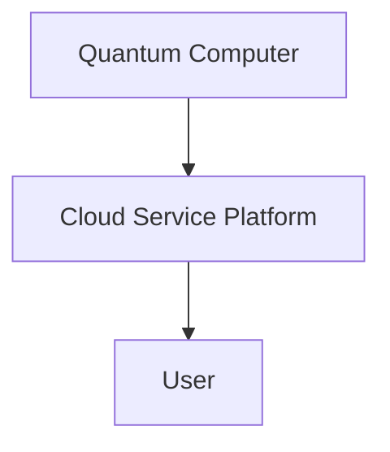
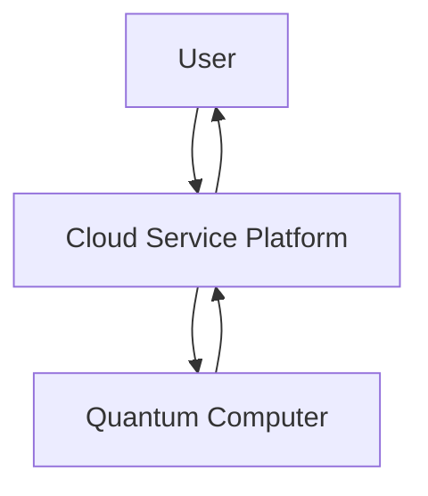
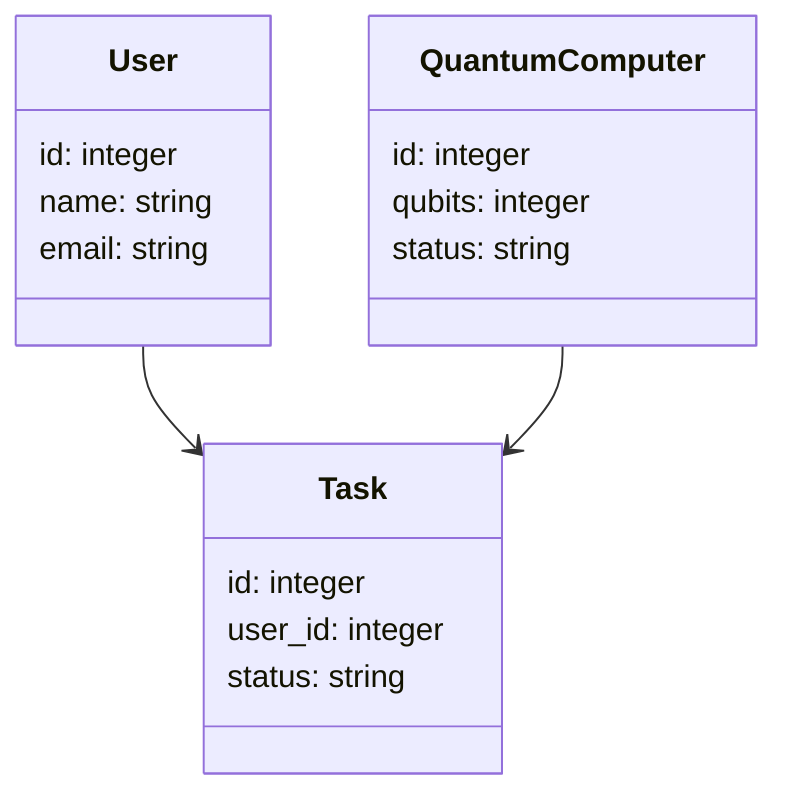
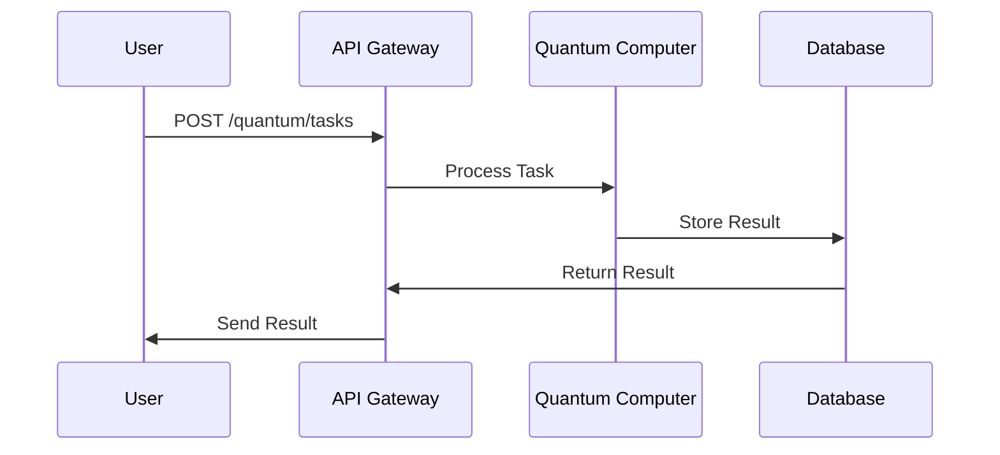

                 


# 巴菲特-芒格的量子计算云服务投资：计算能力民主化

> 关键词：量子计算，云服务，巴菲特，芒格，投资，计算能力民主化

> 摘要：本文探讨了巴菲特和芒格在量子计算云服务领域的投资策略，分析了计算能力民主化对投资的影响。通过详细阐述量子计算的基本原理、云服务的架构设计和实际项目案例，本文为读者提供了从理论到实践的全面指南。

---

# 第一部分: 量子计算与云服务的背景介绍

## 第1章: 量子计算的基本概念

### 1.1 量子计算的定义
量子计算是一种基于量子力学原理的计算方式，利用量子位（qubit）进行信息处理。与经典计算不同，量子计算利用量子叠加和纠缠效应，能够在某些情况下显著提高计算效率。

### 1.2 巴菲特与芒格的投资理念
- 巴菲特的价值投资理论强调长期持有优质资产，注重企业的内在价值。
- 芒格的多元思维模型提倡跨学科思考，关注复杂系统和杠杆效应。

### 1.3 巴菲特与芒格的量子计算投资策略
- 巴菲特和芒格将量子计算视为未来的关键技术，认为其云服务模式能够推动计算能力的民主化。

---

## 第2章: 量子计算云服务的定义与特点

### 2.1 量子计算云服务的定义
量子计算云服务是通过互联网提供量子计算资源的按需服务模式，用户无需拥有量子计算机即可使用其强大的计算能力。

### 2.2 量子计算云服务的核心特点
- **按需使用**：用户可以根据需求灵活使用量子计算资源。
- **成本效益**：通过共享资源降低使用成本。
- **易用性**：提供用户友好的界面，简化量子计算的使用流程。

### 2.3 量子计算云服务的优势与劣势
- **优势**：提高资源利用率，降低技术门槛。
- **劣势**：量子计算的纠错能力和稳定性仍需提升。

---

## 第3章: 计算能力民主化的概念与影响

### 3.1 计算能力民主化的定义
计算能力民主化指的是通过云服务等技术手段，让更多的个人和企业能够平等地获取和使用强大的计算资源。

### 3.2 计算能力民主化对社会的影响
- **推动创新**：降低技术门槛，促进更多创新。
- **缩小数字鸿沟**：让更多人能够享受到技术进步带来的好处。

### 3.3 计算能力民主化对投资的影响
- **投资机会**：量子计算云服务为投资者提供了新的投资领域。
- **投资策略**：巴菲特和芒格的投资理念在量子计算云服务中得到了新的应用。

---

# 第二部分: 量子计算云服务的核心概念与联系

## 第4章: 量子计算的核心原理

### 4.1 量子位的基本概念
量子位是量子计算的基本单位，可以同时表示0和1的状态，利用量子叠加和纠缠的特性，实现并行计算。

### 4.2 量子叠加与纠缠
- **量子叠加**：量子位可以同时处于多个状态的叠加态。
- **量子纠缠**：多个量子位之间形成纠缠关系，能够实现信息的快速传输。

### 4.3 量子计算的基本算法
- **Shor算法**：用于大数分解，对加密领域有重要影响。
- **Grover算法**：用于无序数据库的搜索，提高搜索效率。

---

## 第5章: 量子计算云服务的系统架构

### 5.1 量子计算云服务的系统组成
- **量子计算硬件**：包括量子计算机和相关设备。
- **云服务平台**：提供用户接口和资源管理功能。
- **用户端**：用户通过互联网访问量子计算服务。

### 5.2 量子计算云服务的实体关系图


### 5.3 量子计算云服务的流程图


---

# 第三部分: 量子计算云服务的算法原理

## 第6章: 量子算法的基本原理

### 6.1 Shor算法的原理与应用
Shor算法通过量子计算实现大数分解，对现代加密技术构成威胁。

### 6.2 Grover算法的原理与应用
Grover算法在无序数据库搜索中提供指数级加速，广泛应用于优化问题。

### 6.3 量子傅里叶变换的原理与应用
量子傅里叶变换是许多量子算法的核心，用于信号处理和量子搜索。

---

## 第7章: 量子计算云服务的数学模型

### 7.1 量子叠加的数学表达
$$ | \psi \rangle = \alpha |0\rangle + \beta |1\rangle $$

### 7.2 量子纠缠的数学表达
$$ | \psi \rangle = \frac{1}{\sqrt{2}}(|01\rangle + |10\rangle) $$

### 7.3 量子算法的数学模型
$$ U_f |x\rangle = |f(x)\rangle $$

---

# 第四部分: 量子计算云服务的系统分析与架构设计

## 第8章: 量子计算云服务的系统功能设计

### 8.1 量子计算云服务的功能模块
- **用户管理**：包括用户注册、认证和权限管理。
- **资源管理**：包括量子计算机的分配和监控。
- **任务管理**：包括任务提交、执行和结果返回。

### 8.2 量子计算云服务的领域模型


### 8.3 量子计算云服务的系统架构


---

## 第9章: 量子计算云服务的接口设计

### 9.1 量子计算云服务的API设计
- **REST API**：提供HTTP接口，如`POST /quantum/tasks`。
- **WebSocket API**：实时通信接口。

### 9.2 量子计算云服务的交互流程


---

# 第五部分: 量子计算云服务的项目实战

## 第10章: 量子计算云服务的环境安装

### 10.1 量子计算云服务的环境要求
- **硬件**：支持量子计算的服务器。
- **软件**：安装量子计算框架，如Qiskit。

### 10.2 量子计算云服务的安装步骤
1. 安装Qiskit库：
   ```bash
   pip install qiskit
   ```
2. 初始化量子计算机：
   ```python
   from qiskit import QuantumProgram
   qp = QuantumProgram()
   ```

---

## 第11章: 量子计算云服务的核心实现

### 11.1 量子计算云服务的代码实现
```python
from qiskit import QuantumCircuit, execute, Aer

def quantum_computation():
    qc = QuantumCircuit(2, 2)
    qc.h(0)
    qc.cx(0, 1)
    qc.measure_all()
    backend = Aer.get_backend('qasm_simulator')
    job = execute(qc, backend)
    result = job.result()
    print(result.get_counts())
```

### 11.2 代码实现的解读
- **量子电路**：定义量子门操作。
- **执行环境**：选择量子模拟器作为后端。
- **结果分析**：输出量子计算的结果。

---

## 第12章: 量子计算云服务的项目小结

### 12.1 最佳实践 tips
- **安全性**：注意量子计算云服务的数据安全。
- **性能优化**：选择合适的量子算法和优化参数。

### 12.2 小结
通过本文的介绍，读者可以全面了解量子计算云服务的投资价值和实现过程。

---

# 结语

量子计算云服务的投资不仅是技术的进步，更是计算能力民主化的体现。巴菲特和芒格的投资策略为这一领域提供了重要启示，未来量子计算云服务将在更多领域发挥其潜力。

---

作者：AI天才研究院/AI Genius Institute & 禅与计算机程序设计艺术 /Zen And The Art of Computer Programming

