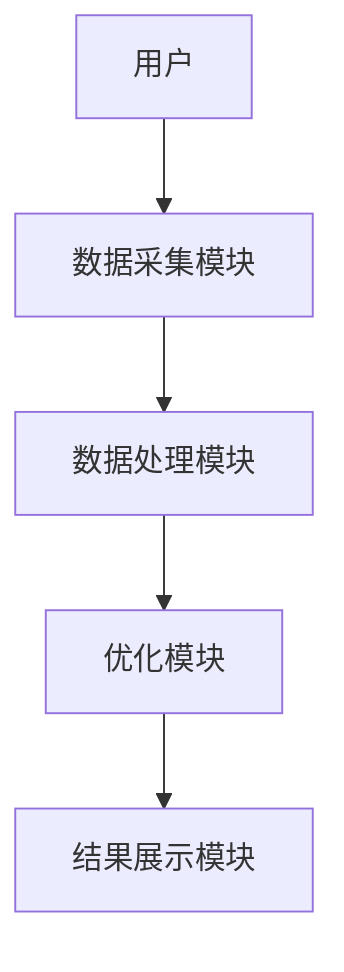

                 


# 巴菲特如何看待分散投资

## 关键词：分散投资、巴菲特、价值投资、投资组合、风险管理

## 摘要

本文深入探讨了分散投资这一重要投资策略，通过分析巴菲特的投资理念，揭示分散投资的核心原理和实际应用。文章结合现代投资组合理论，详细讲解了分散投资的数学模型和算法，同时通过项目实战展示了如何在实际投资中应用这些理论。本文还总结了分散投资的最佳实践和注意事项，为投资者提供了实用的指导。

---

# 正文

## 第一部分：分散投资的基础与背景

### 第1章：分散投资的基本概念

#### 1.1 投资的基本概念

投资是指将资金投入到各种资产中，以期获得收益的行为。投资的核心目标是通过合理配置资产，实现收益的最大化，同时控制风险。投资可以分为多种类型，包括股票、债券、房地产、黄金等。每种资产类别都有其独特的风险和收益特征。

##### 1.1.1 投资的定义与分类
- **定义**：投资是将资金用于购买资产，以期望在未来获得收益的行为。
- **分类**：根据资产类型，投资可以分为股票、债券、房地产、黄金等；根据风险偏好，可以分为高风险和低风险投资。

##### 1.1.2 为什么需要进行投资
- **资产增值**：通过投资，资金可以实现增值，例如购买股票可以获得股息和资本增值。
- **分散风险**：将资金分散投资于不同资产，可以降低单一投资的风险。

##### 1.1.3 投资的风险与收益关系
- **高风险高收益**：一般来说，风险较高的投资可能带来较高的收益，但同时也可能带来更大的损失。
- **风险厌恶**：投资者通常厌恶风险，因此会寻求在风险和收益之间找到平衡点。

#### 1.2 分散投资的必要性

分散投资是指将资金投资于多个不同的资产或资产类别，以降低整体投资组合的风险。分散投资的核心思想是“不要将所有鸡蛋放在一个篮子里”。

##### 1.2.1 单一投资的风险
- **集中投资的风险**：将所有资金投资于单一资产（如一只股票）的风险极高。如果该资产价格下跌，投资者将面临重大损失。
- **市场风险**：单一资产可能受到市场波动的影响，导致价格大幅波动。

##### 1.2.2 分散投资如何降低风险
- **风险分散**：通过投资多个不相关的资产，可以降低投资组合的整体波动性。例如，股票和债券的相关性较低，因此将资金分配到股票和债券中可以降低整体风险。
- **资产配置**：通过合理配置不同类型的资产，投资者可以在市场波动时保持投资组合的稳定性。

##### 1.2.3 分散投资的边界与外延
- **边界**：分散投资的边界在于投资者的风险承受能力和收益目标。投资者需要根据自身的财务状况和投资目标来决定投资组合的构成。
- **外延**：分散投资的外延包括全球化投资、多样化投资策略以及动态调整投资组合。

#### 1.3 分散投资的核心要素

分散投资的核心要素包括资产配置、风险管理和绩效评估。

##### 1.3.1 资产配置
- **定义**：资产配置是指将资金分配到不同资产类别（如股票、债券、房地产等）的过程。
- **重要性**：资产配置是分散投资的基础，合理的资产配置可以有效降低风险并提高收益。

##### 1.3.2 不同资产类别的特点
- **股票**：风险较高，收益潜力大。
- **债券**：相对稳定，收益较低。
- **房地产**：流动性较低，但通常能提供稳定的收益。

##### 1.3.3 投资组合的构建原则
- **目标导向**：根据投资者的目标（如保值、增值）构建投资组合。
- **风险控制**：确保投资组合的风险在可接受范围内。
- **动态调整**：定期审视和调整投资组合，以适应市场变化。

---

## 第二部分：巴菲特的投资理念与分散投资

### 第2章：巴菲特的投资策略

#### 2.1 巴菲特的价值投资理念

巴菲特是价值投资的代表人物，他强调以合理的价格购买优秀的公司股票。

##### 2.1.1 价值投资的定义
- **定义**：价值投资是一种投资策略，旨在以低于内在价值的价格购买优质资产。

##### 2.1.2 巴菲特的价值投资原则
- **长期投资**：巴菲特倡导长期持有优质资产，避免频繁交易。
- **安全边际**：购买价格低于内在价值，以提供安全边际。

##### 2.1.3 长期投资的重要性
- **复利效应**：长期持有优质资产可以利用复利效应，实现财富的长期增长。
- **避免短期波动**：长期投资可以避免短期市场波动的干扰。

#### 2.2 巴菲特分散投资的实践

巴菲特的分散投资策略体现在他的投资组合构成中。

##### 2.2.1 巴菲特的分散投资策略
- **集中投资**：虽然巴菲特定位为分散投资的倡导者，但他更倾向于集中投资于少数优质资产。
- **长期持有**：巴菲通常年持有优质资产，避免频繁交易。

##### 2.2.2 巴菲特投资组合的构成
- **主要资产**：巴菲特的投资组合主要集中在股票和债券。
- **优质公司**：他倾向于投资那些具有强大竞争优势和良好管理的公司。

##### 2.2.3 巴菲特分散投资的边界
- **风险控制**：巴菲特通过选择优质资产来控制风险。
- **长期目标**：他的分散投资策略以长期收益为目标，而非短期波动。

#### 2.3 巴菲特与分散投资的核心联系

巴菲特的分散投资理念与现代投资组合理论有相似之处。

##### 2.3.1 巴菲特分散投资的原理
- **风险分散**：通过投资优质资产，降低投资组合的风险。
- **长期收益**：通过长期持有优质资产，实现收益的最大化。

##### 2.3.2 巴菲特分散投资的属性特征对比
- **集中与分散**：巴菲特的分散投资策略更倾向于集中投资优质资产，而非广泛分散。
- **长期与短期**：巴菲特注重长期投资，而非短期收益。

##### 2.3.3 巴菲特分散投资的ER实体关系图

以下是一个简单的ER实体关系图，展示了巴菲特分散投资的核心要素：

```mermaid
er
  actor 投资者
  actor 市场
  actor 资产
  actor 风险
  actor 收益

  投资者 --> 资产: 持有
  资产 --> 收益: 产生
  资产 --> 风险: 暴露
  市场 --> 资产: 影响
```

---

## 第三部分：分散投资的数学模型与算法原理

### 第3章：分散投资的数学模型

#### 3.1 现代投资组合理论

现代投资组合理论（MPT）由哈里·马科维茨提出，是分散投资的理论基础。

##### 3.1.1 现代投资组合理论的定义
- **定义**：MPT是一种通过优化投资组合构成来最大化收益并最小化风险的理论。

##### 3.1.2 投资组合的期望收益与方差
- **期望收益**：投资组合的预期收益是各资产期望收益的加权平均。
- **方差**：衡量投资组合收益的波动性，方差越小，风险越低。

##### 3.1.3 投资组合的优化问题
- **目标函数**：最大化收益，同时最小化风险。
- **约束条件**：投资组合的权重之和为1，投资比例非负。

##### 3.1.4 现代投资组合理论的优缺点
- **优点**：提供了一种科学的投资组合优化方法。
- **缺点**：假设市场参与者理性，且资产价格符合正态分布，实际中可能不成立。

#### 3.2 马科维茨的有效前沿

有效前沿是MPT中的一个核心概念，表示在给定风险下，能够提供最高收益的投资组合。

##### 3.2.1 有效前沿的定义
- **定义**：有效前沿是指在给定风险水平下，能够提供最高预期收益的所有投资组合的集合。

##### 3.2.2 有效前沿的计算方法
- **步骤**：计算各资产的期望收益、方差和协方差，构建优化模型，求解最优投资组合。

##### 3.2.3 有效前沿的应用
- **资产配置**：通过有效前沿确定最优资产配置。
- **风险控制**：选择有效前沿上的投资组合，以实现风险和收益的最佳平衡。

#### 3.3 CAPM模型

CAPM（资本资产定价模型）用于确定资产的预期收益。

##### 3.3.1 CAPM模型的定义
- **定义**：CAPM是一种用于确定资产预期收益的模型，考虑了系统性风险和非系统性风险。

##### 3.3.2 CAPM模型的公式推导
- **公式**：$$ E(r_i) = r_f + \beta_i (E(r_m) - r_f) $$
  - \( E(r_i) \)：资产i的预期收益率
  - \( r_f \)：无风险利率
  - \( \beta_i \)：资产i的贝塔系数
  - \( E(r_m) \)：市场预期收益率

##### 3.3.3 CAPM模型的应用
- **风险调整收益**：确定资产的预期收益，考虑其系统性风险。
- **资产定价**：用于资产定价，识别被市场低估或高估的资产。

---

### 第4章：分散投资的算法实现

#### 4.1 投资组合优化的算法

投资组合优化可以通过数学规划实现。

##### 4.1.1 投资组合优化的数学模型
- **目标函数**：最大化收益或最小化风险。
- **约束条件**：权重之和为1，非负约束。

##### 4.1.2 投资组合优化的步骤
1. 确定资产列表。
2. 收集各资产的历史数据。
3. 计算各资产的期望收益、方差和协方差。
4. 建立优化模型，求解最优权重。
5. 分析结果，调整投资组合。

##### 4.1.3 投资组合优化的代码实现

以下是一个简单的投资组合优化的Python代码示例：

```python
import numpy as np
from scipy.optimize import minimize

# 假设资产的期望收益和协方差矩阵
n_assets = 3
mu = np.array([0.1, 0.15, 0.08])
cov = np.array([[0.16, 0.05, 0.03],
               [0.05, 0.25, 0.06],
               [0.03, 0.06, 0.16]])

# 定义优化目标函数
def portfolio_risk(weights, mu, cov):
    return np.dot(weights.T, np.dot(cov, weights))

# 约束条件
constraints = [{'type': 'eq', 'fun': lambda w: sum(w) - 1},
               {'type': 'ineq', 'fun': lambda w: w[i] >= 0 for i in range(n_assets)}]

# 初始权重
initial_weights = [1/3, 1/3, 1/3]

# 求解优化问题
result = minimize(portfolio_risk, initial_weights, args=(mu, cov), method='SLSQP')

# 输出结果
print("最优权重：", result.x)
print("最小方差：", result.fun)
```

##### 4.1.4 投资组合优化的算法优缺点
- **优点**：提供科学的投资组合优化方法。
- **缺点**：假设市场数据符合模型，实际中可能不准确。

---

## 第四部分：项目实战

### 第5章：分散投资的系统实现

#### 5.1 项目介绍

本项目旨在构建一个分散投资的系统，帮助投资者实现资产配置和风险控制。

##### 5.1.1 项目目标
- **资产配置**：根据投资者的风险偏好，优化资产配置。
- **风险控制**：通过分散投资降低整体风险。

##### 5.1.2 项目功能
- **数据采集**：收集各资产的历史数据。
- **风险评估**：计算各资产的风险和收益。
- **优化模型**：构建投资组合优化模型。
- **结果展示**：展示优化后的投资组合。

##### 5.1.3 系统功能设计
- **用户界面**：收集用户输入，如风险偏好。
- **数据处理**：清洗和预处理数据。
- **优化模块**：实现投资组合优化。
- **结果展示**：可视化优化结果。

##### 5.1.4 系统架构设计

以下是一个简单的系统架构图：



---

### 第5.2 章节总结

#### 5.2.1 分散投资的关键点

- **资产配置**：合理配置资产，降低风险。
- **风险控制**：通过分散投资降低整体风险。
- **长期投资**：长期持有优质资产，实现财富增长。

#### 5.2.2 项目实战的总结

- **代码实现**：通过Python代码实现投资组合优化。
- **可视化展示**：使用图表展示投资组合的优化结果。
- **结果分析**：分析优化结果，调整投资策略。

---

## 第五部分：总结与展望

### 第6章：分散投资的总结与展望

#### 6.1 总结

分散投资是一种有效的风险管理策略，通过合理配置资产，投资者可以在控制风险的同时实现收益最大化。巴菲特的分散投资理念和现代投资组合理论为我们提供了科学的指导。

#### 6.2 展望

未来，分散投资将更加依赖于数据分析和人工智能技术。投资者可以通过大数据分析和机器学习算法，进一步优化投资组合，实现更高效的风险管理和收益最大化。

---

## 作者

作者：AI天才研究院/AI Genius Institute & 禅与计算机程序设计艺术 /Zen And The Art of Computer Programming

