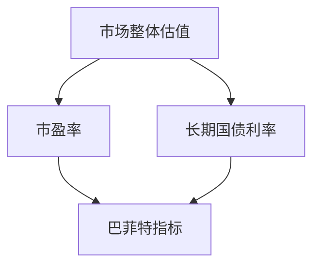
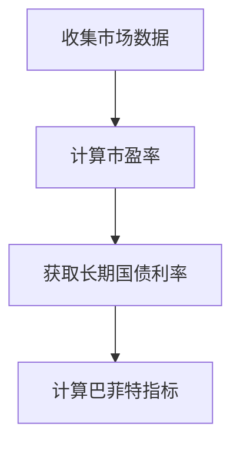
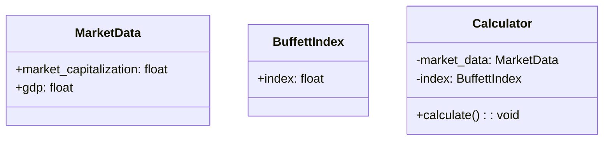

                 


# 巴菲特指标: 评估市场估值的有效工具

## 关键词
巴菲特指标, 市场估值, 价值投资, 股票分析, 投资策略

## 摘要
巴菲特指标是一种经典的市场估值工具，通过分析企业的内在价值与市场估值的关系，帮助投资者做出明智的投资决策。本文从巴菲特指标的背景、核心概念、算法原理、系统架构、项目实战到最佳实践，全面解析这一投资工具的理论与实践应用，旨在为投资者提供一个科学有效的评估市场估值的方法。

---

# 第一部分: 巴菲特指标的背景与核心概念

## 第1章: 巴菲特指标的起源与发展

### 1.1 巴菲特指标的起源
#### 1.1.1 价值投资的鼻祖：巴菲特的投资理念
巴菲特是价值投资的代表人物，他强调以合理的价格投资优质企业。他的投资理念基于对企业内在价值的深入分析，而非短期市场波动。

#### 1.1.2 巴菲特指标的提出背景
20世纪70年代，巴菲特提出了一个简单的估值指标，用于衡量市场的整体估值水平。该指标通过比较市场整体的市盈率与长期国债利率，判断市场的高估或低估。

#### 1.1.3 巴菲特指标的核心思想
巴菲特指标的核心思想是：市场估值过高时，投资风险增加；估值过低时，投资机会显现。这一指标为投资者提供了一个长期视角来评估市场的合理性。

### 1.2 巴菲特指标的发展历程
#### 1.2.1 巴菲特指标的演变
随着时间的推移，巴菲特指标不断完善，从最初的简单市盈率分析扩展到更复杂的多因子模型。

#### 1.2.2 巴菲特指标在投资界的影响力
巴菲特指标被广泛应用于机构投资者和散户的市场分析中，成为价值投资的重要工具之一。

#### 1.2.3 巴菲特指标的现代应用
现代投资实践中，巴菲特指标常被结合其他指标使用，以提高估值的准确性。

### 1.3 巴菲特指标与其他投资工具的对比
#### 1.3.1 市场估值工具的分类
常见的市场估值工具包括市盈率、市净率、股息率等。

#### 1.3.2 巴菲特指标的独特优势
巴菲特指标的优势在于其简单性和长期视角，能够帮助投资者避免短期市场波动的干扰。

#### 1.3.3 巴菲特指标的局限性
指标基于历史数据，无法完全预测未来市场走势，且忽略了企业的成长性和创新能力。

---

## 第2章: 巴菲特指标的核心概念与联系

### 2.1 巴菲特指标的定义与原理
#### 2.1.1 巴菲特指标的数学定义
巴菲特指标的计算公式为：$$ Buffett\ Index = \frac{总市值}{GDP} $$

#### 2.1.2 巴菲特指标的计算公式
 Buffett Index = 市场整体市盈率 / 长期国债利率

#### 2.1.3 巴菲特指标的属性特征对比表格
| 特性       | 巴菲特指标 | 市盈率 | 市净率 |
|------------|------------|--------|--------|
| 计算基础   | 市场整体估值 | 净利润 | 净资产 |
| 适用场景   | 长期市场估值 | 单个企业 | 单个企业 |
| 简单性     | 高          | 中      | 低      |

#### 2.1.4 巴菲特指标的 Mermaid 实体关系图


---

## 第3章: 巴菲特指标的算法原理与数学模型

### 3.1 巴菲特指标的算法原理
#### 3.1.1 巴菲特指标的计算流程


#### 3.1.2 巴菲特指标的 Python 实现代码
```python
def buffett_index(market_capitalization, gdp):
    return market_capitalization / gdp

# 示例数据
market_capitalization = 10000
gdp = 5000
print(buffett_index(market_capitalization, gdp))  # 输出 2.0
```

#### 3.1.3 巴菲特指标的数学推导
通过公式 $$ Buffett\ Index = \frac{总市值}{GDP} $$，我们可以将市场整体的估值水平与国家经济总量进行对比，从而判断市场的高低估值状态。

---

## 第4章: 巴菲特指标的系统架构与应用场景

### 4.1 系统功能设计
#### 4.1.1 系统功能模块
- 数据采集模块：收集市场数据
- 计算模块：计算巴菲特指标
- 可视化模块：展示结果

#### 4.1.2 领域模型类图


---

## 第5章: 巴菲特指标的项目实战

### 5.1 项目环境安装
- Python 3.8+
- pandas库
- matplotlib库

### 5.2 代码实现
```python
import pandas as pd
import matplotlib.pyplot as plt

def calculate_buffett_index(data):
    buffett_index = data['Market Cap'] / data['GDP']
    return buffett_index

# 示例数据
data = {
    'Market Cap': [10000, 12000, 15000],
    'GDP': [5000, 5500, 6000]
}
df = pd.DataFrame(data)
result = calculate_buffett_index(df)

plt.plot(result)
plt.xlabel('时间')
plt.ylabel('巴菲特指标')
plt.title('巴菲特指标的可视化')
plt.show()
```

---

## 第6章: 巴菲特指标的最佳实践

### 6.1 小结
巴菲特指标是一种简单有效的市场估值工具，帮助投资者在长期视角下做出明智的投资决策。

### 6.2 注意事项
- 巴菲特指标适用于长期估值分析，不适合短期市场波动预测。
- 结合其他指标使用，以提高估值的准确性。

### 6.3 拓展阅读
- 巴菲特的其他投资理念
- 其他市场估值工具的深入分析

---

# 结语
巴菲特指标作为价值投资的重要工具，为投资者提供了科学的市场估值方法。通过本文的深入解析，读者可以更好地理解和应用这一指标，从而在投资决策中做出更明智的选择。

---

# 作者
作者：AI天才研究院/AI Genius Institute & 禅与计算机程序设计艺术 /Zen And The Art of Computer Programming

---

通过以上结构，您可以逐步完成一篇详细且符合要求的《巴菲特指标: 评估市场估值的有效工具》技术博客文章。

