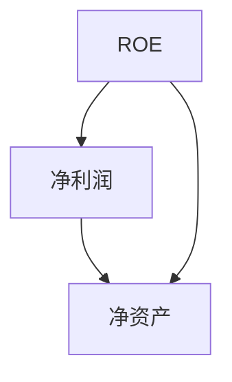

                 

# 巴菲特指标在国际市场的适用性探讨

> 关键词：巴菲特指标, 净资产收益率, 国际市场, 投资策略, 财务分析

> 摘要：巴菲特指标（ROE）作为衡量企业财务健康的重要指标，在全球投资领域具有重要地位。本文将深入探讨巴菲特指标在不同国际市场中的适用性，分析其在不同经济环境下的表现，并结合实际案例，为企业投资者提供实用的参考和建议。

---

# 第1章: 巴菲特指标的基本概念

## 1.1 巴菲特投资理念概述

### 1.1.1 巴菲特的投资哲学
巴菲特的投资理念以“价值投资”为核心，强调通过长期持有优质资产实现财富增长。他主张寻找具有持续盈利能力、良好管理团队和合理估值的企业进行投资。

### 1.1.2 巴菲特指标的核心思想
巴菲特指标的核心在于通过分析企业的财务数据，评估其盈利能力、成长潜力和竞争优势。他特别强调净资产收益率（ROE）作为衡量企业盈利能力的关键指标。

### 1.1.3 巴菲特指标的定义与特点
巴菲特指标即净资产收益率（ROE），是衡量企业净利润与股东权益之间关系的重要指标。其特点包括：
1. **简单直观**：ROE的计算公式简单，易于理解和应用。
2. **综合性强**：ROE不仅反映企业的盈利能力，还考虑了股东权益的投入。
3. **跨行业适用性**：ROE可以在不同行业间进行比较，帮助投资者识别高效率企业。

## 1.2 巴菲特指标的数学模型与公式

### 1.2.1 净资产收益率（ROE）的计算公式
$$ROE = \frac{\text{净利润}}{\text{净资产}}$$

### 1.2.2 其他相关指标的对比
在分析ROE时，还需结合以下指标：
1. **净利率（Net Profit Margin）**：衡量企业每单位收入的盈利能力。
2. **资产周转率（Asset Turnover）**：衡量企业资产的使用效率。
3. **杠杆比率（Debt-to-Equity Ratio）**：衡量企业的财务杠杆风险。

### 1.2.3 巴菲特指标的优缺点分析
- **优点**：ROE能够反映企业的整体盈利能力，帮助投资者识别高效率企业。
- **缺点**：在某些情况下，如企业负债过高或资产周转率低，ROE可能无法全面反映企业的真实情况。

## 1.3 巴菲特指标在国际市场的应用背景

### 1.3.1 全球化投资的兴起
随着全球化的深入，投资者 increasingly invest in international markets, seeking higher returns and diversification of risk.

### 1.3.2 不同市场的经济特点
不同国家和地区的经济环境、法律法规和文化差异，可能影响ROE的计算和适用性。

### 1.3.3 巴菲特指标的适用性问题
尽管ROE在全球范围内被广泛使用，但其在不同市场中的表现可能受到多种因素的影响，如税率、会计准则和经济周期等。

---

# 第2章: 巴菲特指标的核心原理

## 2.1 巴菲特指标的计算与分析

### 2.1.1 净资产收益率（ROE）的计算流程
1. **计算净利润**：净利润 = 收入 - 成本 - 费用。
2. **计算净资产**：净资产 = 股东权益 = 资产 - 负债。
3. **计算ROE**：ROE = 净利润 / 净资产。

### 2.1.2 ROE的改进与扩展
为了更好地适应不同市场的特点，投资者可以对ROE进行以下改进：
1. **调整税率影响**：考虑不同国家的税率差异，调整净利润。
2. **剔除一次性损益**：避免因一次性事件影响ROE的准确性。

### 2.1.3 ROE与其他财务指标的关系
通过结合ROE与其他指标（如净利率、资产周转率等），可以更全面地评估企业的财务健康状况。

## 2.2 巴菲特指标的数学模型与流程图

### 2.2.1 ROE的计算流程图

### 2.2.2 ROE与净利率的关系
$$\text{净利率} = \frac{\text{净利润}}{\text{收入}}$$
$$\text{资产周转率} = \frac{\text{收入}}{\text{资产}}$$
$$\text{ROE} = \text{净利率} \times \text{资产周转率} \times \text{杠杆比率}$$

---

# 第3章: 国际市场环境对巴菲特指标的影响

## 3.1 不同国家的会计准则差异

### 3.1.1 国际会计准则（IAS）与美国会计准则（US GAAP）的对比
- **IAS**：注重披露和透明度，允许更多的估计和判断。
- **US GAAP**：强调原则导向，规则更为严格。

### 3.1.2 会计准则差异对ROE的影响
不同会计准则下的ROE计算可能存在差异，影响其可比性。

## 3.2 经济周期对巴菲特指标的影响

### 3.2.1 经济周期的定义与阶段
经济周期分为衰退、复苏、增长和顶峰四个阶段。

### 3.2.2 不同经济周期中ROE的表现
- **衰退期**：企业盈利能力下降，ROE可能为负。
- **复苏期**：企业逐步恢复，ROE逐渐回升。
- **增长期**：企业盈利提升，ROE显著提高。

## 3.3 文化差异与投资决策

### 3.3.1 不同文化背景下的投资偏好
- **西方市场**：注重短期收益和高流动性。
- **东方市场**：注重长期关系和企业稳定性。

### 3.3.2 文化差异对ROE分析的影响
文化差异可能影响企业的管理风格和财务决策，进而影响ROE的计算和分析。

---

# 第4章: 巴菲特指标在不同国际市场的实际应用

## 4.1 美国市场的巴菲特指标分析

### 4.1.1 美国市场的特点
- **高度发达的金融市场**。
- **严格的会计准则**。
- **注重创新和竞争**。

### 4.1.2 美国市场中ROE的应用案例
以苹果公司为例：
- **净利润**：2020年为590亿美元。
- **净资产**：2020年为1250亿美元。
- **ROE** = 590 / 1250 ≈ 0.472，即47.2%。

## 4.2 日本市场的巴菲特指标分析

### 4.2.1 日本市场的特点
- **以制造业为主**。
- **低利率环境**。
- **注重长期投资**。

### 4.2.2 日本市场中ROE的应用案例
以丰田公司为例：
- **净利润**：2020年为845亿日元。
- **净资产**：2020年为2.5万亿日元。
- **ROE** = 845 / 25000 ≈ 0.034，即3.4%。

## 4.3 新兴市场的巴菲特指标分析

### 4.3.1 新兴市场的特点
- **高增长潜力**。
- **不稳定的经济环境**。
- **较高的风险**。

### 4.3.2 新兴市场中ROE的应用案例
以中国某科技公司为例：
- **净利润**：2020年为100亿元。
- **净资产**：2020年为500亿元。
- **ROE** = 100 / 500 = 0.2，即20%。

---

# 第5章: 如何在国际投资中有效使用巴菲特指标

## 5.1 国际投资中ROE的调整与优化

### 5.1.1 根据市场特点调整ROE
- **高税率国家**：调整净利润计算。
- **新兴市场**：考虑通货膨胀和经济波动。

### 5.1.2 结合其他指标进行综合分析
- **市盈率（P/E）**：衡量企业的估值水平。
- **市净率（P/B）**：衡量企业的资产价值。

## 5.2 风险管理与投资策略

### 5.2.1 ROE在风险管理中的应用
- **识别高风险企业**：ROE过低可能表明企业盈利能力不足。
- **监控经济周期变化**：在衰退期减少对低ROE企业的投资。

### 5.2.2 国际投资策略的制定
- **分散投资**：避免过度集中于单一市场或行业。
- **长期投资**：注重企业的持续盈利能力。

---

# 第6章: 总结与展望

## 6.1 全文总结
巴菲特指标（ROE）在全球投资领域具有重要地位，但其在不同国际市场中的适用性受到多种因素的影响，如会计准则、经济周期和文化差异等。投资者在使用ROE时，需结合其他指标进行综合分析，并根据市场特点进行调整。

## 6.2 对未来的展望
未来的研究可以进一步探讨ROE在不同市场中的适用性，开发更适用于国际投资的综合指标体系。同时，随着技术的发展，大数据和人工智能在财务分析中的应用也将为ROE的计算和分析带来新的可能性。

---

# 作者简介

作者：AI天才研究院/AI Genius Institute & 禅与计算机程序设计艺术/Zen And The Art of Computer Programming

---

这篇文章全面探讨了巴菲特指标在国际市场的适用性，结合理论分析和实际案例，为企业投资者提供了实用的参考和建议。希望对您有所帮助！

