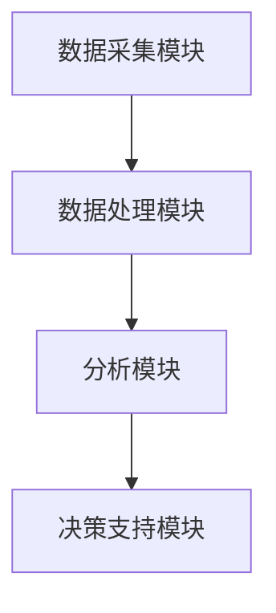

                 


# 巴菲特的产业链分析3.0：全球供应链重构下的投资机会

## 关键词：巴菲特、产业链分析、全球供应链、投资机会、系统架构、风险管理

## 摘要

本文深入探讨巴菲特的产业链分析3.0方法，结合全球供应链重构的背景，分析其对投资机会的影响。通过系统架构设计、算法原理和实际案例，揭示新兴产业链的投资潜力，为投资者提供科学的决策支持。

---

# 第1章：产业链分析概述

## 1.1 产业链分析的定义与构成

产业链分析是对产业内各环节的系统性研究，包括上游原材料供应、中游生产制造和下游产品销售。其核心在于识别关键环节和核心竞争力，帮助投资者把握产业布局和竞争优势。

## 1.2 巴菲特产业链分析的核心要素

### 1.2.1 核心竞争力分析
核心竞争力是企业长期竞争优势的来源，包括技术、成本和品牌等方面。

### 1.2.2 市场地位与竞争优势
市场地位反映企业在行业中的影响力，竞争优势则涉及成本控制、技术创新和客户关系。

### 1.2.3 财务指标与估值模型
通过财务指标评估企业的盈利能力和成长性，利用估值模型确定投资价值。

---

# 第2章：全球供应链重构的背景与影响

## 2.1 重构的驱动因素

### 2.1.1 技术进步
数字化和智能化技术推动供应链效率提升，数据驱动的决策优化了资源配置。

### 2.1.2 地缘政治
贸易摩擦和区域化趋势促使企业调整供应链布局，增强本地化生产能力。

## 2.2 供应链重构对投资的影响

### 2.2.1 区域化供应链
区域化供应链提高了抗风险能力，降低了物流成本，促进了区域经济发展。

### 2.2.2 数字化转型
数字化技术如区块链和物联网的应用，提升了供应链的透明度和效率，创造了新的投资机会。

---

# 第3章：产业链分析3.0的框架与模型

## 3.1 分析框架

### 3.1.1 系统性分析
从整体角度审视产业链，识别关键节点和风险点。

### 3.1.2 动态变化分析
关注产业链的实时动态，预测未来发展趋势。

### 3.1.3 风险与机会评估
通过数学模型评估产业链的风险和机会，指导投资决策。

## 3.2 数学模型

### 3.2.1 产业链竞争力评估模型
$$\text{竞争力指数} = \frac{\sum (\text{技术优势} + \text{成本优势})}{\text{行业平均值}} \times 100\%$$

### 3.2.2 风险评估模型
$$\text{风险值} = \alpha \times \text{政策风险} + \beta \times \text{市场风险} + \gamma \times \text{技术风险}$$

---

# 第4章：全球供应链重构下的投资机会

## 4.1 新兴产业投资机会

### 4.1.1 新能源产业
新能源技术的突破和政策支持，使其成为投资热点。

### 4.1.2 数字经济
数字化转型为企业创造新的增长点，数据资源的价值日益凸显。

## 4.2 区域经济一体化

### 4.2.1 东盟经济合作
区域供应链的本地化和合作深化，推动区域内产业整合。

### 4.2.2 区域全面经济伙伴关系协定（RCEP）
降低贸易壁垒，促进区域内供应链优化，带来投资机会。

---

# 第5章：系统架构与投资策略

## 5.1 系统功能设计

### 5.1.1 数据采集与处理
从多源数据中提取关键信息，构建产业链数据库。

### 5.1.2 分析与建模
运用数学模型评估产业链风险和机会。

## 5.2 系统架构设计



## 5.3 接口设计

### 5.3.1 数据接口
提供API接口，实现数据的实时交互。

### 5.3.2 用户接口
设计友好的UI界面，便于用户操作和查询。

---

# 第6章：项目实战与案例分析

## 6.1 实战环境安装

### 6.1.1 Python环境配置
安装Python和必要的库（如Pandas、Matplotlib）。

### 6.1.2 数据获取
从公开数据源获取产业链数据。

## 6.2 核心代码实现

```python
import pandas as pd

def compute_competitiveness(competitiveness_factors):
    return sum(competitiveness_factors) / len(competitiveness_factors) * 100

# 示例数据
data = {
    '技术优势': [0.8, 0.7, 0.9],
    '成本优势': [0.7, 0.6, 0.8]
}
df = pd.DataFrame(data)

competitiveness = compute_competitiveness([0.8, 0.7, 0.9])
print(f"竞争力指数: {competitiveness}%")
```

## 6.3 案例分析

### 6.3.1 新能源汽车产业
分析新能源汽车产业链，识别电池技术和充电设施的关键环节，评估投资机会。

---

# 第7章：总结与展望

## 7.1 总结

巴菲特的产业链分析3.0结合全球供应链重构，为投资者提供了新的视角和工具。通过系统分析和数学模型，帮助识别新兴产业链的投资机会，优化投资组合。

## 7.2 未来展望

随着技术进步和地缘政治变化，供应链重构将持续影响投资策略。未来，投资者需要更加关注区域化和数字化趋势，灵活调整投资策略。

---

# 作者：AI天才研究院 & Zen And The Art of Computer Programming

通过系统性地分析巴菲特的产业链分析方法，并结合全球供应链重构的背景，本文为投资者提供了科学的决策支持。未来，随着技术的发展和全球化的深入，产业链分析将变得更加重要，投资者需要不断学习和适应新的变化，以抓住更多的投资机会。

