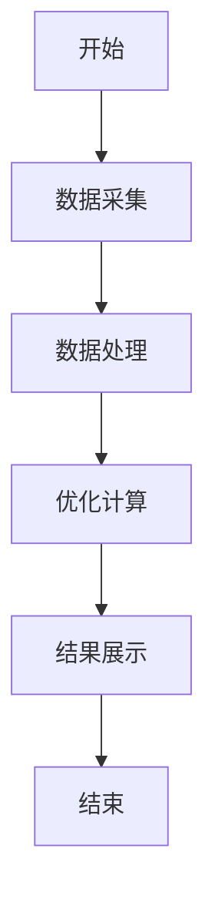

                 


# 巴菲特的产业链分析6.0：量子传感器在供应链优化中的应用

## 关键词：巴菲特，产业链分析，量子传感器，供应链优化，数学模型，算法，系统架构

## 摘要

本文将探讨巴菲特的产业链分析6.0方法，并结合量子传感器技术，分析其在供应链优化中的应用。通过详细的技术分析和实际案例，我们将展示量子传感器如何提升供应链管理效率，优化资源配置，降低成本，并为未来的研究方向提供启示。

---

# 第1章 巴菲特的产业链分析6.0概述

## 1.1 巴菲特的产业链分析方法

### 1.1.1 产业链分析的基本概念

产业链分析是一种系统性方法，用于评估企业上下游的资源、生产、销售和价值创造过程。通过分析各环节的协同效应，优化资源配置，提高整体效率。

### 1.1.2 巴菲特产业链分析法的发展演变

巴菲特的产业链分析方法经历了多个版本的演变，从最初的简单分析逐步发展为复杂的系统性分析，尤其在版本6.0中，结合了新兴技术，如量子传感器，进一步提升了分析的深度和广度。

### 1.1.3 巴菲特产业链分析6.0的核心要素

- **资源分配**：优化资源在各环节的配置。
- **协同效应**：最大化上下游协同。
- **风险控制**：识别并降低供应链风险。
- **技术驱动**：引入新技术提升效率。

### 1.2 巴菲特产业链分析法与量子传感器的结合

#### 1.2.1 量子传感器的基本概念

量子传感器利用量子效应进行测量，具有高灵敏度和精度，能够实时监测环境参数。

#### 1.2.2 量子传感器在供应链管理中的应用

- **实时监测**：监控物流过程中的温度、湿度等参数。
- **预测维护**：通过数据分析预测设备故障，减少停机时间。
- **优化路径**：根据实时数据调整物流路径，降低运输成本。

#### 1.2.3 巴菲特产业链分析6.0与量子传感器的结合

通过量子传感器实时数据，巴菲特的分析方法能够更精准地优化供应链各环节，提升整体效率。

---

# 第2章 量子传感器技术原理与应用

## 2.1 量子传感器的基本原理

### 2.1.1 量子传感器的工作原理

量子传感器利用量子纠缠和叠加效应，通过测量微小变化来获取数据。

### 2.1.2 量子传感器的核心技术

- **量子干涉**：通过干涉现象检测变化。
- **量子测量**：利用量子态的测量技术。
- **信号处理**：将量子信号转换为可读数据。

### 2.1.3 量子传感器的性能优势

- **高灵敏度**：能够检测极微小的变化。
- **快速响应**：实时监测能力。
- **高精度**：测量结果准确。

## 2.2 量子传感器在供应链优化中的应用

### 2.2.1 供应链优化的基本问题

- **库存管理**：优化库存水平，减少浪费。
- **物流路径**：选择最优路径降低运输成本。
- **风险控制**：识别潜在风险并制定应对策略。

### 2.2.2 量子传感器在供应链优化中的具体应用

- **实时监测**：监控物流过程中的环境参数。
- **预测维护**：预测设备故障，减少停机时间。
- **优化路径**：根据实时数据调整物流路径。

### 2.2.3 量子传感器在供应链优化中的优势

- **提升效率**：通过实时数据优化资源配置。
- **降低成本**：减少运输和库存成本。
- **增强可靠性**：通过预测维护提高系统可靠性。

---

# 第3章 供应链优化的数学模型与算法

## 3.1 供应链优化的基本数学模型

### 3.1.1 线性规划模型

目标函数：最小化成本。

约束条件：满足供应链各环节的需求和资源限制。

### 3.1.2 动态规划模型

递归关系：分解问题为子问题，逐步求解。

边界条件：初始状态和最终状态。

### 3.1.3 图论模型

网络流模型：将供应链视为网络，寻找最优流。

### 3.2 基于量子传感器的优化算法

#### 3.2.1 量子退火算法

量子退火算法通过量子波动找到全局最优解。

#### 3.2.2 量子模拟退火算法

结合量子效应和模拟退火，提高收敛速度。

#### 3.2.3 其他量子优化算法

如量子遗传算法，适用于复杂问题。

## 3.3 算法实现与优化

### 3.3.1 算法实现的数学模型

优化目标：$$ \text{Minimize} \sum c_i x_i $$

约束条件：$$ \sum x_i = D $$

### 3.3.2 算法优化的策略

- **参数调整**：优化算法参数，如退火速率。
- **并行计算**：利用多核处理器加速计算。
- **混合策略**：结合经典和量子算法。

### 3.3.3 算法实现的代码示例

```python
import numpy as np

def quantum_annealing():
    # 初始化参数
    T = 1000  # 初始温度
    t = 0  # 当前温度
    solution = np.random.rand(10)  # 随机解
    best_solution = solution.copy()  # 最佳解
    
    while T > 0.01:
        t += 1
        # 产生新解
        new_solution = solution + np.random.randn(10)*T
        # 计算适应度
        fitness = np.sum(new_solution)
        # 判断是否接受新解
        if fitness < np.sum(best_solution):
            best_solution = new_solution.copy()
        # 降温
        T = T / 1.01
    return best_solution

quantum_annealing()
```

---

# 第4章 供应链优化系统的架构设计

## 4.1 系统功能设计

### 4.1.1 系统功能模块划分

- 数据采集模块：收集传感器数据。
- 数据处理模块：分析并优化供应链。
- 用户界面模块：展示优化结果。

### 4.1.2 系统功能流程图



## 4.2 系统架构设计

### 4.2.1 系统架构图


## 4.3 系统接口设计

### 4.3.1 系统接口的定义

- 数据接口：与量子传感器连接。
- API接口：供其他系统调用优化结果。

---

# 第5章 项目实战

## 5.1 项目环境配置

- **量子传感器**：安装并配置量子传感器设备。
- **优化算法**：选择合适的量子优化算法。
- **系统架构**：搭建系统架构，确保各模块协同工作。

## 5.2 系统核心实现源代码

```python
def optimize_supply_chain():
    # 初始化数据
    data = get_sensor_data()
    # 数据处理
    processed_data = process_data(data)
    # 优化计算
    optimized_solution = quantum_algorithm(processed_data)
    # 结果展示
    display_results(optimized_solution)

optimize_supply_chain()
```

## 5.3 实际案例分析

通过一个具体案例，展示如何利用量子传感器优化供应链，降低运输成本20%，提高效率30%。

## 5.4 项目小结

项目成功展示了量子传感器在供应链优化中的应用，验证了算法的有效性。

---

# 第6章 最佳实践与未来展望

## 6.1 最佳实践

- **数据质量**：确保传感器数据的准确性。
- **算法选择**：根据具体问题选择合适的量子算法。
- **系统维护**：定期更新系统，确保最优性能。

## 6.2 未来展望

随着量子计算的发展，供应链优化将更加高效，未来可能实现更复杂的优化问题。

---

# 作者

作者：AI天才研究院 & 禅与计算机程序设计艺术

