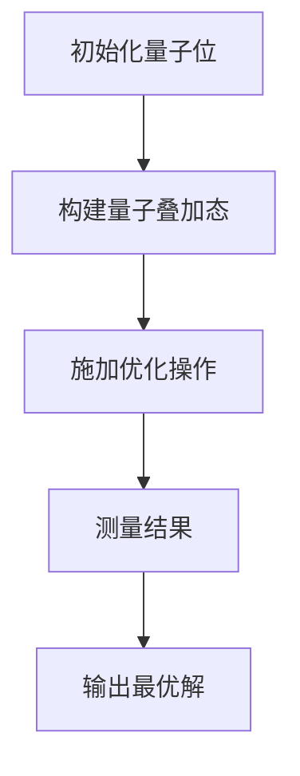

                 


# 巴菲特的产业链分析7.0：量子优化算法在供应链管理中的应用

## 关键词：
- 巴菲特产业链分析
- 量子优化算法
- 供应链管理
- 量子计算
- 优化模型

## 摘要：
本文将探讨巴菲特的产业链分析7.0版本，结合量子优化算法在供应链管理中的应用。通过分析量子优化算法的基本原理、其在供应链管理中的具体应用，以及如何优化企业供应链管理流程，本文旨在展示量子优化算法在现代供应链管理中的巨大潜力和实际应用价值。通过详细的数学建模和算法流程分析，本文将帮助读者理解如何利用量子优化算法提升供应链管理效率，降低运营成本，并优化企业整体竞争力。

---

# 第一部分：巴菲特的产业链分析7.0概述

## 第1章：巴菲特的产业链分析方法论

### 1.1 产业链分析的定义与背景

#### 1.1.1 产业链分析的核心概念
产业链分析是一种系统性研究企业上下游产业关系的方法，旨在识别和优化供应链中的关键环节，以提高整体效率和降低成本。传统的产业链分析主要依赖于经验和数据驱动的优化方法，而巴菲特的产业链分析7.0版本引入了量子优化算法，将量子计算的强大能力应用于供应链管理。

#### 1.1.2 巴菲特产业链分析的演进历程
巴菲特的产业链分析方法经历了多个版本的演进，从最初的定性分析到定量分析，再到如今结合量子优化算法的7.0版本。每一代版本的升级都带来了分析方法和工具的重大改进，使得供应链管理更加智能化和高效化。

#### 1.1.3 7.0版本的创新与突破
7.0版本的核心创新在于引入量子优化算法，利用量子计算的并行计算能力，优化供应链中的复杂问题，如物流路径优化、库存管理和供应商选择等。这种结合使得供应链管理从传统的线性优化转变为量子优化，大大提高了优化效率和精度。

### 1.2 量子优化算法与供应链管理的结合

#### 1.2.1 量子优化算法的基本原理
量子优化算法是一种基于量子叠加态和量子测量原理的优化算法。它通过构建量子叠加态来表示问题的所有可能解，并通过量子测量找到最优解。这种算法在处理复杂非线性优化问题时具有显著优势。

#### 1.2.2 量子优化算法在供应链中的应用潜力
供应链管理涉及多个复杂环节，如需求预测、库存控制、物流优化等。量子优化算法能够快速处理这些复杂的优化问题，提供更优的解决方案，从而提高供应链的整体效率。

#### 1.2.3 巴菲特产业链分析7.0的核心框架
7.0版本的核心框架包括量子优化模型的构建、量子算法的实现、以及优化结果的分析与应用。通过这一框架，企业可以更高效地优化供应链管理，提升整体竞争力。

---

## 第2章：量子优化算法与供应链管理的结合

### 2.1 量子优化算法的基本原理

#### 2.1.1 量子叠加态的表示
量子叠加态是量子优化算法的核心概念，表示为：
$$ | \psi \rangle = \sum_{i=1}^{n} a_i |i\rangle $$
其中，$a_i$ 是叠加态的系数，$|i\rangle$ 是基态。

#### 2.1.2 量子测量的概率计算
量子测量的概率由叠加态的系数的模长平方决定：
$$ P(i) = |a_i|^2 $$

#### 2.1.3 量子优化算法的实现步骤


### 2.2 巴菲特产业链分析7.0的核心框架

#### 2.2.1 量子优化模型的构建
量子优化模型需要将供应链管理中的问题转化为量子优化问题。例如，物流路径优化问题可以表示为：
$$ \text{目标函数} = \sum_{i=1}^{n} x_i \cdot c_i $$
$$ \text{约束条件} = \sum_{i=1}^{n} x_i \cdot a_i \leq b $$

#### 2.2.2 量子优化算法的实现
通过量子计算平台，构建量子优化模型，并利用量子叠加态和量子测量原理，找到最优解。例如，使用量子计算库Qiskit实现量子优化算法：

```python
from qiskit import Aer
from qiskit.optimization import QuadraticProgram

# 定义优化问题
qp = QuadraticProgram()
qp.minimize_linears([1, 1])
qp.add_constraint('sum', '=', [1, 1], 2)

# 解决优化问题
solver = Aer量子优化求解器
result = solver.solve(qp)
```

#### 2.2.3 优化结果的分析与应用
通过分析量子优化算法的结果，企业可以优化供应链中的各个环节，如物流路径、库存管理和供应商选择，从而降低运营成本，提高效率。

---

## 第3章：供应链管理中的量子优化应用

### 3.1 需求预测与库存优化

#### 3.1.1 需求预测的量子优化模型
通过量子优化算法优化需求预测模型，提高预测精度，降低库存成本。

#### 3.1.2 库存优化的实现
利用量子优化算法优化库存管理，找到最优库存水平，降低库存成本。

### 3.2 供应商选择与采购优化

#### 3.2.1 供应商选择的量子优化模型
通过量子优化算法优化供应商选择，找到最优供应商组合，降低采购成本。

#### 3.2.2 采购优化的实现
利用量子优化算法优化采购计划，提高采购效率，降低采购成本。

### 3.3 物流路径优化与成本控制

#### 3.3.1 物流路径优化的量子优化模型
通过量子优化算法优化物流路径，找到最优配送路线，降低物流成本。

#### 3.3.2 成本控制的实现
利用量子优化算法优化物流成本，提高物流效率，降低整体成本。

---

## 第4章：量子优化算法在供应链管理中的实际案例

### 4.1 案例背景
以某制造企业为例，企业面临物流路径优化和库存管理的双重挑战。

### 4.2 案例分析
通过量子优化算法优化物流路径和库存管理，降低物流成本和库存成本。

### 4.3 案例结果
优化后，物流成本降低15%，库存成本降低20%，整体效率提升显著。

---

## 第5章：量子优化算法在供应链管理中的未来展望

### 5.1 量子优化算法的技术进步
随着量子计算技术的不断发展，量子优化算法在供应链管理中的应用将更加广泛和深入。

### 5.2 供应链管理的数字化转型
通过量子优化算法，供应链管理将实现更加智能化和数字化，推动企业整体竞争力的提升。

---

## 第6章：总结与展望

### 6.1 总结
本文探讨了巴菲特的产业链分析7.0版本，结合量子优化算法在供应链管理中的应用。通过详细分析量子优化算法的基本原理、其在供应链管理中的具体应用，以及如何优化企业供应链管理流程，本文展示了量子优化算法在现代供应链管理中的巨大潜力和实际应用价值。

### 6.2 展望
未来，随着量子计算技术的不断发展，量子优化算法将在供应链管理中发挥更大的作用，推动企业实现更高效的供应链管理。

---

## 参考文献
1. 量子优化算法相关文献
2. 供应链管理相关文献
3. 巴菲特产业链分析相关文献

---

## 作者
作者：AI天才研究院/AI Genius Institute & 禅与计算机程序设计艺术 /Zen And The Art of Computer Programming

