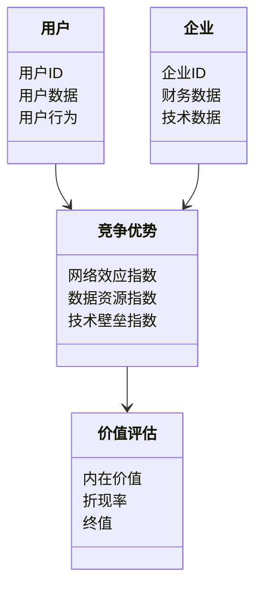

                 


# 巴菲特的价值链分析：数字平台经济下的价值重构

> 关键词：巴菲特，价值链分析，数字平台经济，价值重构，企业价值评估，竞争优势，投资策略

> 摘要：本文深入探讨了巴菲特的价值链分析在数字平台经济下的重构过程。通过分析数字平台经济的兴起及其对传统投资理念的影响，结合数学模型和算法原理，详细阐述了巴菲特价值链分析方法在数字化环境下的演变。本文还通过实际案例分析，展示了如何将这些方法应用于数字平台经济中的企业价值评估，为投资者和企业管理者提供了新的视角和工具。

---

## 第1章：巴菲特投资理念的演变

### 1.1 巴菲特投资理念的起源

#### 1.1.1 价值投资的定义与核心思想
价值投资是一种长期投资策略，强调以低于市场价值的价格购买优质资产。其核心思想是通过深入分析企业的基本面，寻找具有持续竞争优势和合理估值的企业进行投资。巴菲特将价值投资的理念发扬光大，形成了自己独特的企业分析框架。

#### 1.1.2 巴菲特投资理念的形成与发展
巴菲特的投资理念起源于格雷厄姆的价值投资理论，但他在实践中进行了创新和扩展。他强调企业竞争优势、护城河和管理层质量，形成了以企业内在价值为核心的分析框架。

#### 1.1.3 巴菲特投资理念的核心要素
1. **企业护城河**：企业能够长期保持竞争优势的结构性特征。
2. **管理层质量**：管理层的能力、诚信和决策能力。
3. **企业财务状况**：包括资产负债表、利润表和现金流的健康状况。
4. **未来现金流预测**：基于企业竞争优势和市场环境的现金流预测。

### 1.2 巴菲特投资理念的现代挑战

#### 1.2.1 数字化时代的投资新趋势
数字技术的快速发展带来了商业模式的创新，数字平台经济的兴起对企业价值评估提出了新的挑战。传统的价值链分析需要结合数字化特征进行重构。

#### 1.2.2 数字平台经济对传统投资理念的影响
数字平台经济打破了传统的价值链结构，形成了新的双边市场模式。企业价值的评估需要考虑平台的网络效应、数据资源和技术壁垒。

#### 1.2.3 巴菲特投资理念的适应性与变革
巴菲特的投资理念需要与时俱进，结合数字平台经济的特点进行调整。核心是将企业竞争优势的分析扩展到数字化能力、数据资源和技术壁垒等方面。

---

## 第2章：数字平台经济的兴起

### 2.1 数字平台经济的定义与特征

#### 2.1.1 数字平台经济的定义
数字平台经济是指通过数字技术构建的平台，连接供需双方，提供撮合交易、数据支持和价值创造的新型经济模式。

#### 2.1.2 数字平台经济的核心特征
1. **双边市场**：平台连接两个或多个用户群体，创造网络效应。
2. **数据驱动**：通过数据收集和分析，优化匹配和决策。
3. **技术驱动**：依赖于云计算、人工智能和大数据技术。

#### 2.1.3 数字平台经济与传统经济的对比
| 特征               | 传统经济       | 数字平台经济   |
|--------------------|----------------|----------------|
| 价值来源           | 物质产品       | 数据和网络效应 |
| 模式               | 线性价值链     | 平台化、生态化 |
| 技术依赖           | 低            | 高             |

### 2.2 数字平台经济的商业模式

#### 2.2.1 平台经济的双边市场特征
数字平台通过连接供需双方，创造双边网络效应。例如，电商平台连接买家和卖家，形成规模经济。

#### 2.2.2 数字平台的盈利模式
1. **佣金收入**：通过撮合交易收取佣金。
2. **数据变现**：通过数据分析提供增值服务。
3. **广告收入**：通过平台流量吸引广告商。

#### 2.2.3 数字平台经济的生态系统构建
数字平台通过吸引第三方开发者和服务提供者，构建生态体系，形成多边网络效应。

---

## 第3章：巴菲特价值链分析的核心概念

### 3.1 巴菲特价值链分析的定义

#### 3.1.1 价值链分析的定义
价值链分析是一种通过分析企业内部和外部价值链，识别竞争优势和价值来源的方法。

#### 3.1.2 巴菲特价值链分析的独特性
巴菲特将价值链分析与企业财务分析相结合，重点关注企业竞争优势和未来现金流。

#### 3.1.3 巴菲特价值链分析的适用范围
适用于所有行业的企业，尤其是具有持续竞争优势的行业。

### 3.2 巴菲特价值链分析的核心要素

#### 3.2.1 企业护城河的定义与分类
企业护城河是指企业长期保持竞争优势的结构性特征，主要包括：
1. **成本优势**：通过技术创新或规模效应降低成本。
2. **品牌优势**：强大的品牌认知度和客户忠诚度。
3. **技术壁垒**：拥有独特的专利和技术。
4. **网络效应**：用户数量的增加带来平台价值的提升。

#### 3.2.2 企业竞争优势的识别与评估
通过分析企业的护城河、管理层质量和财务状况，评估企业的竞争优势。

#### 3.2.3 企业价值的评估方法
基于未来现金流的折现模型（DCF模型），评估企业的内在价值。

---

## 第4章：巴菲特价值链分析与数字平台经济的结合

### 4.1 数字平台经济下的价值链重构

#### 4.1.1 传统价值链与数字平台价值链的对比
| 特征               | 传统价值链     | 数字平台价值链   |
|--------------------|----------------|------------------|
| 价值来源           | 物质产品       | 数据和网络效应   |
| 价值创造           | 线性过程       | 平台化、生态化   |
| 价值分配           | 线性分配       | 平台主导分配     |

#### 4.1.2 数字平台经济下价值链重构的驱动力
1. **技术驱动**：数字化技术改变价值链结构。
2. **用户需求**：用户对个性化和高效服务的需求推动价值链重构。
3. **网络效应**：平台的用户数量和参与度影响价值分配。

#### 4.1.3 数字平台经济下价值链重构的特征
1. **平台化**：价值链围绕数字平台展开。
2. **数据化**：数据成为价值创造的核心要素。
3. **生态化**：价值链形成生态系统，多方参与。

### 4.2 巴菲特价值链分析在数字平台经济中的应用

#### 4.2.1 数字平台经济下企业竞争优势的评估
1. **网络效应**：评估平台的用户数量和粘性。
2. **数据资源**：分析数据的规模和质量。
3. **技术壁垒**：评估平台的技术创新能力和专利储备。

#### 4.2.2 数字平台经济下企业价值的重构
基于数字平台的网络效应和数据资源，重新评估企业的内在价值。

#### 4.2.3 数字平台经济下企业护城河的重新定义
1. **数据护城河**：数据的规模和质量成为核心竞争力。
2. **技术护城河**：技术壁垒和创新能力。
3. **网络护城河**：用户数量和平台的网络效应。

---

## 第5章：巴菲特价值链分析的数学模型与算法原理

### 5.1 巴菲特价值链分析的数学模型

#### 5.1.1 企业价值评估的数学模型
基于未来现金流的折现模型（DCF模型）：
$$ V = \sum_{t=1}^{n} \frac{CF_t}{(1 + r)^t} + \frac{TV}{(1 + r)^n} $$
其中，$V$为企业的内在价值，$CF_t$为第$t$年的现金流，$r$为折现率，$TV$为终值。

#### 5.1.2 数字平台经济下的调整模型
考虑数字平台的网络效应和数据资源，调整现金流预测和折现率。

#### 5.1.3 企业竞争优势的量化指标
1. **网络效应指数**：衡量平台用户的数量和粘性。
2. **数据资源指数**：评估数据的规模和质量。
3. **技术壁垒指数**：量化技术专利和创新能力。

### 5.2 巴菲特价值链分析的算法原理

#### 5.2.1 算法流程
1. **数据收集**：收集企业的财务数据、用户数据和技术数据。
2. **竞争优势评估**：计算企业竞争优势的量化指标。
3. **价值评估**：基于数学模型评估企业的内在价值。

#### 5.2.2 算法实现
以下是基于Python的现金流折现模型代码示例：

```python
def discounted_cash_flow_model(cash_flows, discount_rate, terminal_value):
    present_value = 0
    for t in range(len(cash_flows)):
        present_value += cash_flows[t] / (1 + discount_rate) ** t
    present_value += terminal_value / (1 + discount_rate) ** len(cash_flows)
    return present_value

# 示例数据
cash_flows = [100, 200, 300]
discount_rate = 0.1
terminal_value = 1000

# 计算内在价值
intrinsic_value = discounted_cash_flow_model(cash_flows, discount_rate, terminal_value)
print("企业内在价值：", intrinsic_value)
```

---

## 第6章：系统分析与架构设计方案

### 6.1 问题场景介绍

#### 6.1.1 数字平台经济下的企业价值评估
通过数字平台的用户数据和技术数据，评估企业的竞争优势和内在价值。

#### 6.1.2 系统功能需求
1. 数据采集：收集企业的财务数据、用户数据和技术数据。
2. 竞争优势评估：计算企业竞争优势的量化指标。
3. 价值评估：基于数学模型评估企业的内在价值。

### 6.2 系统功能设计

#### 6.2.1 领域模型设计
以下是领域模型的Mermaid类图：



### 6.3 系统架构设计

#### 6.3.1 系统架构设计
以下是系统架构的Mermaid图：

```mermaid
container 数字平台经济价值评估系统 {
    class 数据采集模块 {
        collect data from企业
        collect data from用户
    }
    class 数据处理模块 {
        process data
        compute竞争优势指标
    }
    class 价值评估模块 {
        calculate内在价值
        output报告
    }
}
```

---

## 第7章：项目实战

### 7.1 环境安装

#### 7.1.1 安装Python和相关库
安装Python和以下库：
- NumPy
- Pandas
- Matplotlib

### 7.2 系统核心实现

#### 7.2.1 竞争优势评估代码
以下是竞争优势评估的Python代码：

```python
import numpy as np
import pandas as pd

def calculate_competitive_advantages(users, technology):
    network_effect = len(users) * (len(users) - 1) / 2
    data_quality = sum(technology['patents']) + technology['R&D investment']
    technology_barrier = technology['patents'] * 10 + technology['R&D investment']
    return network_effect, data_quality, technology_barrier

# 示例数据
users = pd.DataFrame({'UserID': [1, 2, 3, 4, 5]})
technology = {'patents': 10, 'R&D investment': 50}

network_effect, data_quality, technology_barrier = calculate_competitive_advantages(users, technology)
print("网络效应指数：", network_effect)
print("数据资源指数：", data_quality)
print("技术壁垒指数：", technology_barrier)
```

### 7.3 项目总结

#### 7.3.1 关键点总结
1. 数字平台经济下的价值链重构需要考虑网络效应和数据资源。
2. 巴菲特的价值链分析方法需要结合数字平台经济的特点进行调整。

#### 7.3.2 未来趋势
随着数字技术的进一步发展，数字平台经济的价值链重构将继续深入，企业竞争优势的评估将更加依赖数据和技术。

---

## 第8章：最佳实践与小结

### 8.1 小结

#### 8.1.1 本文总结
本文探讨了巴菲特的价值链分析在数字平台经济下的重构过程，结合数学模型和系统设计，展示了如何将传统投资理念应用于数字化环境。

#### 8.1.2 未来展望
未来的研究可以进一步探讨数字平台经济下的风险管理、投资策略优化以及全球化的价值评估。

### 8.2 注意事项

#### 8.2.1 投资者需要注意的事项
1. 保持对数字平台经济的敏感性，及时调整投资策略。
2. 注重数据资源和技术壁垒的分析，评估企业的竞争优势。

#### 8.2.2 企业需要注意的事项
1. 加强数据资源的管理和应用。
2. 提升技术壁垒，保持竞争优势。

### 8.3 拓展阅读

#### 8.3.1 推荐书籍
1. 《巴菲特的午餐：投资智慧》
2. 《数字平台经济：理论与实践》

#### 8.3.2 推荐博客和资源
1. 巴菲特投资理念的数字化转型研究。
2. 数字平台经济的最新动态和趋势。

---

## 作者：AI天才研究院/AI Genius Institute & 禅与计算机程序设计艺术 /Zen And The Art of Computer Programming

