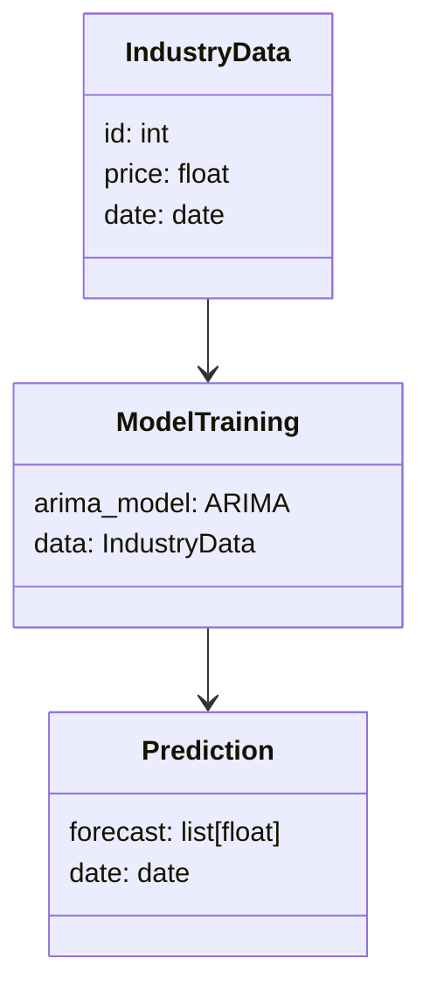

                 


# 巴菲特的周期性行业投资：数字化转型中的机遇把握

---

## 关键词：
- 巴菲特投资理论  
- 周期性行业  
- 数字化转型  
- 价值投资  
- 人工智能  
- 数据分析  

---

## 摘要：
本文从巴菲特的价值投资理念出发，结合周期性行业的特点，深入探讨数字化转型对周期性行业投资的影响。通过分析周期性行业的供需关系、价格波动以及数字化转型的技术应用，揭示如何利用人工智能、大数据等技术手段提升投资决策的准确性。文章还详细讲解了周期性行业投资的算法模型、系统架构设计以及实际案例，为投资者提供了理论与实践相结合的指导。

---

## 第一部分: 巴菲特投资理念与周期性行业概述

### 第1章: 巴菲特投资理念概述

#### 1.1 巴菲特的价值投资理论
##### 1.1.1 价值投资的核心理念
巴菲特的价值投资理论强调“以合理的价格买入优质的资产”。他认为，投资的本质是购买企业的一部分，而非单纯追求股票价格的波动。投资者应关注企业的基本面，包括盈利能力、财务健康状况和管理层能力。

##### 1.1.2 巴菲特的投资策略
巴菲特的投资策略可以概括为以下几点：
- **长期投资**：避免频繁交易，专注于长期价值。
- **安全边际**：以低于内在价值的价格买入资产。
- **优质企业**：选择具有持续竞争优势的企业。

##### 1.1.3 巴菲特投资成功的关键因素
巴菲特的成功离不开他对企业基本面的深刻理解、对行业周期的把握以及对市场情绪的洞察。他的投资哲学强调纪律性和耐心。

#### 1.2 周期性行业的特点
##### 1.2.1 周期性行业的定义
周期性行业是指其产品或服务的需求和供给受到经济周期波动显著影响的行业。这些行业的业绩表现与宏观经济波动密切相关。

##### 1.2.2 周期性行业的供需关系
周期性行业的供需关系通常受到经济周期的影响。在经济繁荣时期，需求增加；在经济衰退时期，需求下降。例如，钢铁、汽车和能源等行业都属于典型的周期性行业。

##### 1.2.3 周期性行业的价格波动
周期性行业的价格波动较大，通常与供需关系和市场情绪密切相关。价格波动为企业提供了套利机会，但也带来了投资风险。

#### 1.3 数字化转型对企业的影响
##### 1.3.1 数字化转型的定义
数字化转型是指企业利用数字技术（如大数据、人工智能、云计算等）改造业务流程、商业模式和决策方式，以提升效率和竞争力。

##### 1.3.2 数字化转型对企业竞争力的影响
数字化转型可以帮助企业实现数据驱动的决策，优化生产流程，提高客户体验，从而在竞争中占据优势。

##### 1.3.3 数字化转型对周期性行业的机遇与挑战
周期性行业在数字化转型中面临双重挑战：一方面，数字化技术可以提升企业的运营效率和市场响应能力；另一方面，周期性行业的价格波动可能放大数字化转型的成本风险。

---

## 第二部分: 周期性行业与数字化转型的核心概念

### 第2章: 周期性行业与数字化转型的核心概念

#### 2.1 周期性行业的核心概念
##### 2.1.1 周期性行业的供需关系
周期性行业的供需关系受到宏观经济波动的影响。例如，在经济繁荣时期，汽车行业的需求增加，带动钢铁行业的生产。

##### 2.1.2 周期性行业的价格波动
周期性行业的价格波动通常与供需关系和市场情绪有关。例如，油价的波动直接影响能源行业的收益。

##### 2.1.3 周期性行业的财务指标
周期性行业的财务指标（如收入、利润、库存）通常受到经济周期的影响。投资者应关注这些指标的变化趋势。

#### 2.2 数字化转型的核心概念
##### 2.2.1 数字化转型的定义
数字化转型是企业利用数字技术（如大数据、人工智能、物联网）重构业务流程和商业模式的过程。

##### 2.2.2 数字化转型的关键技术
- **大数据分析**：利用海量数据进行预测和决策。
- **人工智能**：通过机器学习优化生产和市场策略。
- **云计算**：提供弹性计算资源，支持企业数字化转型。

##### 2.2.3 数字化转型的实施步骤
1. **战略规划**：明确数字化转型的目标和路径。
2. **技术选型**：选择适合的技术和工具。
3. **数据采集**：建立数据采集和存储系统。
4. **系统集成**：整合现有系统和新系统。
5. **持续优化**：根据反馈不断优化系统。

#### 2.3 周期性行业与数字化转型的联系
##### 2.3.1 周期性行业在数字化转型中的角色
周期性行业通过数字化转型可以更好地应对经济波动，优化生产和销售流程。

##### 2.3.2 数字化转型对周期性行业的影响
数字化转型可以帮助周期性企业提高效率、降低成本，并在经济波动中保持竞争优势。

##### 2.3.3 周期性行业与数字化转型的协同效应
周期性行业与数字化转型的协同效应体现在数据驱动的决策、智能化的生产和个性化的服务。

---

## 第三部分: 巴菲特选股标准与数字化转型

### 第3章: 巴菲特选股标准与数字化转型

#### 3.1 巴菲特选股标准
##### 3.1.1 企业的财务状况
巴菲特注重企业的财务健康状况，包括盈利能力、资产负债情况和现金流。

##### 3.1.2 企业的竞争优势
巴菲特倾向于投资具有持续竞争优势的企业，例如低成本、强大的品牌和专利。

##### 3.1.3 企业的管理层能力
巴菲特认为，优秀的管理层是企业长期成功的关键因素。

#### 3.2 数字化转型对选股标准的影响
##### 3.2.1 数字化转型对企业财务状况的影响
数字化转型可以通过提高效率降低成本，改善企业的财务状况。

##### 3.2.2 数字化转型对企业竞争优势的影响
数字化转型可以帮助企业建立数据驱动的竞争优势，例如通过人工智能优化生产流程。

##### 3.2.3 数字化转型对管理层能力的影响
数字化转型要求企业管理层具备技术背景和数字化决策能力。

---

## 第四部分: 算法原理与系统架构

### 第4章: 周期性行业投资的算法模型

#### 4.1 周期性行业投资的算法模型
##### 4.1.1 时间序列分析
时间序列分析是预测周期性行业趋势的重要方法。常用的模型包括ARIMA（自回归积分滑动平均模型）和GARCH（广义自回归条件异方差模型）。

##### 4.1.2 ARIMA模型的数学公式
ARIMA模型的数学公式如下：
$$
ARIMA(p, d, q) = y_t - \mu = \phi_1 y_{t-1} + \phi_2 y_{t-2} + \dots + \phi_p y_{t-p} + \theta_1 \epsilon_{t-1} + \theta_2 \epsilon_{t-2} + \dots + \theta_q \epsilon_{t-q} + \epsilon_t
$$

##### 4.1.3 基于ARIMA模型的周期性行业预测
通过ARIMA模型可以预测周期性行业的价格趋势，从而为投资决策提供支持。

#### 4.2 算法实现
##### 4.2.1 ARIMA模型的实现步骤
1. 数据预处理：检查数据的平稳性。
2. 模型参数选择：确定ARIMA的参数p、d、q。
3. 模型训练：使用历史数据训练模型。
4. 模型预测：基于训练好的模型预测未来的价格趋势。

##### 4.2.2 Python实现
以下是基于Python的ARIMA模型实现代码：
```python
from statsmodels.tsa.arima_model import ARIMA
import pandas as pd
import matplotlib.pyplot as plt

# 加载数据
data = pd.read_csv('industry_data.csv')

# 数据预处理
diff_data = data['price'].diff().dropna()

# 模型训练
model = ARIMA(data['price'], order=(5, 1, 0))
model_fit = model.fit()

# 模型预测
forecast = model_fit.forecast(steps=10)
```

---

## 第五部分: 系统分析与架构设计

### 第5章: 系统功能设计与架构

#### 5.1 系统功能设计
##### 5.1.1 领域模型设计
以下是领域模型的类图（使用mermaid）：


##### 5.1.2 系统架构设计
以下是系统架构图（使用mermaid）：


##### 5.1.3 系统接口设计
系统接口包括数据接口、模型接口和用户接口。

---

## 第六章: 项目实战

### 第6章: 项目实战

#### 6.1 项目背景
本项目旨在利用数字化技术分析周期性行业的投资机会。

#### 6.2 核心代码实现
以下是项目核心代码：
```python
from statsmodels.tsa.arima_model import ARIMA
import pandas as pd
import matplotlib.pyplot as plt

# 加载数据
data = pd.read_csv('industry_data.csv')

# 数据预处理
diff_data = data['price'].diff().dropna()

# 模型训练
model = ARIMA(data['price'], order=(5, 1, 0))
model_fit = model.fit()

# 模型预测
forecast = model_fit.forecast(steps=10)
```

#### 6.3 项目小结
通过本项目，我们可以看到数字化技术在周期性行业投资中的巨大潜力。

---

## 第七部分: 最佳实践与小结

### 第7章: 最佳实践与小结

#### 7.1 最佳实践
- **数据质量**：确保数据的准确性和完整性。
- **模型选择**：根据实际情况选择合适的模型。
- **持续优化**：定期更新模型和优化系统。

#### 7.2 投资策略建议
- **长期投资**：关注企业的基本面和长期价值。
- **风险管理**：合理控制投资风险，避免过度杠杆。

#### 7.3 注意事项
- **技术风险**：数字化技术的应用可能面临技术瓶颈。
- **市场风险**：周期性行业的价格波动可能带来投资风险。

#### 7.4 拓展阅读
- 《巴菲特投资策略》
- 《时间序列分析与应用》

---

## 作者信息

作者：AI天才研究院/AI Genius Institute & 禅与计算机程序设计艺术 /Zen And The Art of Computer Programming

---

通过本文，我们深入探讨了巴菲特的周期性行业投资策略，并结合数字化转型的技术应用，揭示了投资机会的把握方法。希望本文能为投资者提供有价值的参考和启发。

