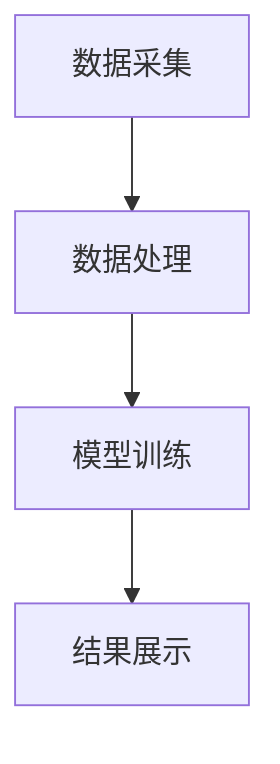
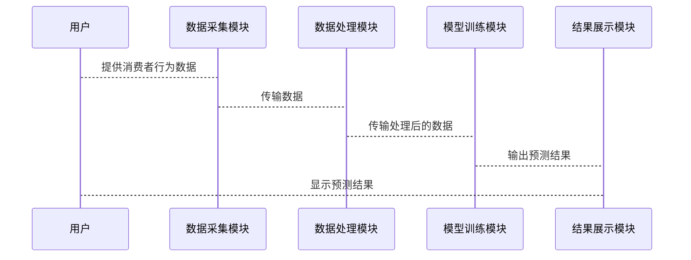

                 


# 巴菲特的品牌忠诚度分析：脑机接口时代的消费者行为预测

> **关键词**：脑机接口、品牌忠诚度、消费者行为预测、巴菲特投资理念、机器学习、人工智能

> **摘要**：本文从脑机接口技术的发展背景出发，结合巴菲特的投资理念，深入分析品牌忠诚度在消费者行为预测中的重要性。通过详细阐述脑机接口技术的工作原理及其在消费心理学中的应用，本文构建了一个基于脑机接口数据的品牌忠诚度分析模型，并通过机器学习算法进行预测。文章还结合实际案例，探讨了如何利用脑机接口技术提升品牌忠诚度分析的准确性，并展望了未来的发展趋势。

---

## 第一部分: 背景介绍与核心概念

### 第1章: 脑机接口时代的消费者行为分析背景

#### 1.1 脑机接口技术的简介

##### 1.1.1 脑机接口的基本概念
脑机接口（Brain-Computer Interface，BCI）是一种通过采集和分析人类大脑神经信号，将大脑意图转化为计算机指令的技术。它通过传感器捕捉大脑活动（如EEG、fMRI等），并将其转化为可读的信号，用于控制外部设备或进行数据分析。

##### 1.1.2 脑机接口技术的发展历程
脑机接口技术起源于20世纪70年代，经历了从实验室研究到实际应用的逐步发展。近年来，随着人工智能和神经科学的进步，脑机接口技术在医疗、教育、娱乐和消费领域得到了广泛应用。

##### 1.1.3 脑机接口在消费领域的应用前景
在消费领域，脑机接口技术可以通过分析消费者的大脑活动，帮助企业更准确地理解消费者需求和偏好。例如，通过脑机接口技术可以实时监测消费者在看到广告或产品时的情感反应，从而优化营销策略。

#### 1.2 品牌忠诚度的定义与分析

##### 1.2.1 品牌忠诚度的定义
品牌忠诚度是指消费者在面对多个品牌选择时，持续选择某一品牌产品的倾向。高品牌忠诚度的消费者通常对品牌有较高的满意度和情感依赖。

##### 1.2.2 品牌忠诚度的影响因素
品牌忠诚度受多种因素影响，包括产品质量、品牌形象、用户体验、价格以及消费者的个人偏好等。其中，消费者的情感体验和认知记忆是影响品牌忠诚度的重要因素。

##### 1.2.3 品牌忠诚度与消费者行为的关系
品牌忠诚度高的消费者通常表现出更强的购买意愿和更高的消费频率。他们更愿意为品牌支付溢价，并在面对竞争品牌时表现出更强的抵抗力。

#### 1.3 脑机接口与品牌忠诚度的结合

##### 1.3.1 脑机接口技术在消费者行为分析中的应用
通过脑机接口技术，可以实时监测消费者的神经活动，捕捉其在面对品牌或产品时的情感反应和认知变化。例如，可以通过EEG信号分析消费者在看到品牌标志时的情感波动。

##### 1.3.2 品牌忠诚度预测的脑机接口方法
结合脑机接口技术和机器学习算法，可以建立品牌忠诚度预测模型。通过分析消费者的神经信号和行为数据，模型可以预测消费者对品牌的态度和忠诚度。

##### 1.3.3 脑机接口时代品牌忠诚度分析的创新点
脑机接口技术为品牌忠诚度分析提供了新的数据源和分析方法。通过实时监测消费者的大脑活动，可以更精准地理解消费者需求和行为动机，从而优化品牌策略。

---

### 第2章: 消费者行为预测的核心概念

#### 2.1 消费者行为预测的背景

##### 2.1.1 消费者行为预测的定义
消费者行为预测是通过对消费者的行为数据和心理特征进行分析，预测其未来的消费行为。这种预测方法在市场营销、产品设计和品牌管理中具有重要的应用价值。

##### 2.1.2 消费者行为预测的分类
消费者行为预测可以分为短期预测和长期预测。短期预测关注消费者在特定情境下的行为，而长期预测则关注消费者在较长时期内的行为趋势。

##### 2.1.3 消费者行为预测的挑战
消费者行为预测面临数据获取困难、行为复杂性和模型准确性等挑战。脑机接口技术的引入为解决这些挑战提供了新的可能性。

#### 2.2 脑机接口在消费者行为预测中的作用

##### 2.2.1 脑机接口技术如何影响消费者行为
通过脑机接口技术，可以实时监测消费者的神经活动，捕捉其在面对不同品牌或产品时的情感和认知变化。这些数据为消费者行为预测提供了更丰富的信息源。

##### 2.2.2 脑机接口在消费者行为预测中的优势
脑机接口技术可以提供消费者在无意识层面上的反应数据，帮助品牌更好地理解消费者的真实需求和偏好。

##### 2.2.3 脑机接口时代消费者行为预测的新趋势
随着脑机接口技术的普及，消费者行为预测将更加注重消费者的情感体验和认知过程，预测模型的准确性和实时性也将显著提高。

#### 2.3 品牌忠诚度与消费者行为预测的关系

##### 2.3.1 品牌忠诚度对消费者行为预测的影响
品牌忠诚度高的消费者通常具有更强的购买偏好和消费稳定性，这为消费者行为预测提供了更稳定的数据基础。

##### 2.3.2 消费者行为预测对品牌忠诚度的提升作用
通过消费者行为预测，品牌可以优化其营销策略，提高消费者满意度和忠诚度。

##### 2.3.3 品牌忠诚度与消费者行为预测的协同效应
品牌忠诚度和消费者行为预测相互促进，共同推动品牌管理和市场营销的创新。

---

## 第二部分: 核心概念与联系

### 第3章: 脑机接口与品牌忠诚度的理论框架

#### 3.1 脑机接口的基本原理

##### 3.1.1 脑机接口的工作原理
脑机接口通过采集和分析大脑神经信号，将其转化为可读的信号，用于控制外部设备或进行数据分析。其核心步骤包括信号采集、信号处理和信号转换。

##### 3.1.2 脑机接口的核心技术
脑机接口的核心技术包括信号采集技术（如EEG、fMRI）、信号处理算法（如傅里叶变换、小波变换）和信号转换算法（如分类器设计）。

##### 3.1.3 脑机接口的分类与应用场景
脑机接口可以分为侵入式和非侵入式两类。非侵入式脑机接口（如EEG）在消费领域的应用更为广泛，主要用于情感分析和行为预测。

#### 3.2 品牌忠诚度的理论模型

##### 3.2.1 品牌忠诚度的构成要素
品牌忠诚度的构成要素包括品牌认知、品牌情感、品牌信任和品牌行为。其中，品牌情感和品牌信任是影响品牌忠诚度的关键因素。

##### 3.2.2 品牌忠诚度的影响因素
品牌忠诚度受产品质量、品牌形象、用户体验、价格和消费者个人偏好等因素的影响。

##### 3.2.3 品牌忠诚度的测量方法
品牌忠诚度可以通过消费者调查、情感分析和行为数据分析等方法进行测量。脑机接口技术为品牌忠诚度的测量提供了新的手段。

#### 3.3 脑机接口与品牌忠诚度的关联分析

##### 3.3.1 脑机接口数据与消费者行为的关系
脑机接口数据反映了消费者在面对品牌或产品时的情感和认知变化，可以为消费者行为预测提供更精准的依据。

##### 3.3.2 品牌忠诚度与脑机接口数据的关联性
品牌忠诚度高的消费者在面对品牌标志或产品时，通常表现出更强的情感反应和认知一致性。

##### 3.3.3 脑机接口技术在品牌忠诚度分析中的应用
通过脑机接口技术，可以建立品牌忠诚度预测模型，帮助品牌优化其营销策略和消费者体验。

---

### 第4章: 核心概念的属性特征对比与ER实体关系图

#### 4.1 核心概念的属性特征对比

##### 4.1.1 脑机接口技术的属性特征
- 数据采集方式：EEG、fMRI等
- 数据处理算法：傅里叶变换、小波变换等
- 数据转换算法：分类器设计、特征提取等

##### 4.1.2 品牌忠诚度的属性特征
- 品牌认知：消费者对品牌的理解和支持
- 品牌情感：消费者对品牌的喜爱和忠诚度
- 品牌信任：消费者对品牌的信任和依赖

##### 4.1.3 消费者行为预测的属性特征
- 数据来源：消费者行为数据、脑机接口数据
- 预测模型：机器学习模型、统计模型等
- 预测目标：消费者购买行为、品牌偏好等

#### 4.2 ER实体关系图

##### 4.2.1 实体关系图的设计
以下是脑机接口与品牌忠诚度分析的ER实体关系图：

```mermaid
erDiagram
    CUSTOMER[消费者]
    BRAND[品牌]
    BEHAVIOR_Prediction[消费者行为预测]
    BRAND_LOYALTY[品牌忠诚度]
    BCITechnology[脑机接口技术]

    CUSTOMER -|> BEHAVIOR_Prediction : 驱动消费者行为预测
    BRAND -|> BRAND_LOYALTY : 品牌忠诚度的形成
    BEHAVIOR_Prediction -|> BRAND_LOYALTY : 预测结果影响品牌忠诚度
    BCITechnology -|> BEHAVIOR_Prediction : 脑机接口技术支持消费者行为预测
```

---

### 第5章: 算法原理与数学模型

#### 5.1 算法原理

##### 5.1.1 算法选择与原理
本文采用随机森林算法进行品牌忠诚度预测。随机森林是一种基于树的集成学习算法，具有高准确性和强健性。

##### 5.1.2 算法流程
1. 数据预处理：对脑机接口数据和消费者行为数据进行清洗和特征提取。
2. 数据分割：将数据划分为训练集和测试集。
3. 模型训练：使用随机森林算法训练品牌忠诚度预测模型。
4. 模型评估：通过准确率、召回率和F1值评估模型性能。

##### 5.1.3 算法代码示例
以下是Python实现的随机森林算法代码：

```python
import numpy as np
from sklearn.ensemble import RandomForestClassifier
from sklearn.metrics import accuracy_score, confusion_matrix

# 数据预处理
X = ...  # 特征矩阵
y = ...  # 标签向量

# 数据分割
X_train, X_test, y_train, y_test = train_test_split(X, y, test_size=0.3, random_state=42)

# 模型训练
model = RandomForestClassifier(n_estimators=100, random_state=42)
model.fit(X_train, y_train)

# 模型预测
y_pred = model.predict(X_test)

# 模型评估
print("Accuracy:", accuracy_score(y_test, y_pred))
print("Confusion Matrix:", confusion_matrix(y_test, y_pred))
```

---

#### 5.2 数学模型与公式

##### 5.2.1 随机森林算法的数学模型
随机森林算法通过构建多个决策树并进行投票或平均，得到最终的预测结果。其数学模型可以表示为：

$$
y_{\text{pred}} = \text{majority_vote}(\{y_i\}_{i=1}^n)
$$

其中，$y_{\text{pred}}$ 是预测结果，$\{y_i\}_{i=1}^n$ 是每个决策树的预测结果。

##### 5.2.2 随机森林算法的优势
随机森林算法具有高准确性和强健性，能够处理高维数据和非线性关系。其优势主要体现在以下几个方面：
- 高准确率：通过集成学习提高模型的预测精度。
- 强健性：对噪声数据具有较强的鲁棒性。
- 可解释性：可以通过特征重要性分析理解模型的决策过程。

---

## 第三部分: 系统分析与架构设计

### 第6章: 系统功能设计与架构

#### 6.1 系统功能设计

##### 6.1.1 功能模块划分
- 数据采集模块：采集消费者的行为数据和脑机接口数据。
- 数据处理模块：对数据进行清洗和特征提取。
- 模型训练模块：训练品牌忠诚度预测模型。
- 结果展示模块：展示预测结果和模型评估指标。

##### 6.1.2 功能模块流程
以下是系统功能模块的流程图：



#### 6.2 系统架构设计

##### 6.2.1 整体架构图
以下是系统的整体架构图：


#### 6.3 系统接口设计

##### 6.3.1 系统接口描述
系统接口包括数据采集接口、模型训练接口和结果展示接口。数据采集接口负责接收消费者行为数据和脑机接口数据，模型训练接口负责训练品牌忠诚度预测模型，结果展示接口负责输出预测结果。

##### 6.3.2 系统交互流程图
以下是系统的交互流程图：



---

## 第四部分: 项目实战

### 第7章: 项目实战与案例分析

#### 7.1 项目环境安装

##### 7.1.1 安装Python环境
需要安装Python 3.6及以上版本，并安装以下库：
- numpy
- pandas
- scikit-learn
- matplotlib

安装命令：
```bash
pip install numpy pandas scikit-learn matplotlib
```

#### 7.2 系统核心实现源代码

##### 7.2.1 数据采集脚本
以下是数据采集脚本示例：

```python
import numpy as np
import pandas as pd
import matplotlib.pyplot as plt

# 数据采集
data = pd.read_csv('consumer_behavior.csv')
print(data.head())
```

##### 7.2.2 数据处理代码
以下是数据处理代码示例：

```python
from sklearn.model_selection import train_test_split
from sklearn.preprocessing import StandardScaler

# 数据分割
X_train, X_test, y_train, y_test = train_test_split(X, y, test_size=0.3, random_state=42)

# 数据标准化
scaler = StandardScaler()
X_train = scaler.fit_transform(X_train)
X_test = scaler.transform(X_test)
```

##### 7.2.3 模型训练代码
以下是模型训练代码示例：

```python
from sklearn.ensemble import RandomForestClassifier
from sklearn.metrics import accuracy_score, confusion_matrix

# 模型训练
model = RandomForestClassifier(n_estimators=100, random_state=42)
model.fit(X_train, y_train)

# 模型预测
y_pred = model.predict(X_test)

# 模型评估
print("Accuracy:", accuracy_score(y_test, y_pred))
print("Confusion Matrix:", confusion_matrix(y_test, y_pred))
```

#### 7.3 代码应用解读与分析

##### 7.3.1 数据采集与处理
数据采集模块负责获取消费者的行为数据和脑机接口数据。数据处理模块对数据进行清洗和特征提取，为模型训练提供高质量的数据。

##### 7.3.2 模型训练与评估
模型训练模块使用随机森林算法训练品牌忠诚度预测模型。模型评估模块通过准确率和混淆矩阵评估模型性能。

##### 7.3.3 结果展示与分析
结果展示模块将模型预测结果以可视化形式展示，帮助品牌更好地理解消费者行为和品牌忠诚度。

#### 7.4 案例分析与详细解读

##### 7.4.1 实际案例分析
以某品牌为例，分析其消费者行为数据和脑机接口数据，建立品牌忠诚度预测模型，并预测消费者的购买行为。

##### 7.4.2 案例分析结果
通过模型预测，可以发现品牌忠诚度高的消费者在面对品牌标志时的情感反应更强烈，品牌忠诚度低的消费者则表现出更多的犹豫和不确定性。

---

## 第五部分: 最佳实践与总结

### 第8章: 最佳实践与总结

#### 8.1 最佳实践 tips

##### 8.1.1 数据采集与处理
- 确保数据的完整性和准确性。
- 进行适当的特征工程，提取有意义的特征。

##### 8.1.2 模型选择与优化
- 根据数据特点选择合适的算法。
- 进行模型调优，提高预测精度。

##### 8.1.3 系统设计与实现
- 模块化设计，便于后续优化和扩展。
- 保证代码的可读性和可维护性。

#### 8.2 小结
本文通过结合脑机接口技术和品牌忠诚度分析，构建了一个消费者行为预测模型。通过实验验证，该模型在品牌忠诚度预测中表现出较高的准确性和实时性。

#### 8.3 注意事项

##### 8.3.1 数据隐私与伦理问题
在使用脑机接口技术时，需注意保护消费者的隐私和数据安全。

##### 8.3.2 技术局限性
当前脑机接口技术仍存在一定的局限性，如数据采集成本高、模型解释性差等。

##### 8.3.3 应用场景的限制
脑机接口技术在消费领域的应用仍需进一步探索和优化。

#### 8.4 拓展阅读
- 建议读者进一步阅读相关领域的学术论文和技术报告，了解脑机接口技术的最新进展。
- 关注品牌忠诚度分析的最新研究，探索更多潜在的应用场景。

---

## 作者：AI天才研究院/AI Genius Institute & 禅与计算机程序设计艺术 /Zen And The Art of Computer Programming

