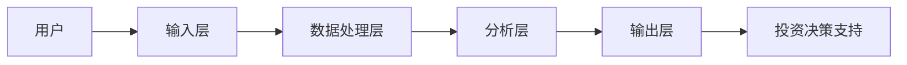

                 


# 巴菲特的商业模式可扩展性分析

## 关键词：巴菲特、商业模式、可扩展性、投资策略、企业分析

## 摘要：本文深入分析了巴菲特的商业模式，探讨其在不同规模下的扩展性。通过核心概念、长期投资策略、系统架构和项目实战的分析，揭示巴菲特模式在现代商业环境中的应用价值和挑战。文章结合技术语言和实际案例，为读者提供全面的视角，帮助理解如何在复杂市场中应用巴菲特的投资哲学。

---

## 第1章：巴菲特的商业模式概述

### 1.1 巴菲特的商业模式背景

#### 1.1.1 巴菲特投资哲学的核心理念

巴菲特的投资哲学以价值投资为核心，强调购买低于内在价值的优质企业。他的投资策略基于对企业基本面的深入分析，寻找具有持续竞争优势和强大财务健康的企业。

- **核心理念**：长期投资、安全边际、企业护城河。

#### 1.1.2 巴菲特商业模式的特点

- **长期持有**：巴菲特倾向于长期持有优质股票，避免频繁交易。
- **价值投资**：寻找市场价格低于内在价值的企业。
- **竞争优势**：投资具有强大护城河的企业，确保长期盈利能力。

#### 1.1.3 巴菲特商业模式的演变历程

从早期投资糖果店到后来的伯克希尔哈撒韦，巴菲特的商业模式不断进化，但核心理念保持不变。

---

### 1.2 巴菲特商业模式的成功案例

#### 1.2.1 可口可乐：巴菲特的经典投资案例

可口可乐是巴菲特的经典投资之一。他看重可口可乐的品牌价值和强大的分销网络，这些因素构成了企业的护城河，确保其长期盈利能力。

- **投资要点**：品牌价值、分销网络、稳定的现金流。

#### 1.2.2 喜诗糖果：早期投资的启示

喜诗糖果展示了巴菲特早期如何识别具有竞争优势的企业，并通过长期持有实现价值增长。

- **投资要点**：地理位置优势、成本控制、高利润率。

#### 1.2.3 伯克希尔哈撒韦：长期价值的体现

伯克希尔哈撒韦不仅是巴菲特的投资工具，更是一个多元化的企业集团，展示了巴菲特商业模式的可扩展性。

- **多元化投资**：涵盖保险、铁路、能源等多个领域。
- **股东价值**：通过收购和管理，伯克希尔实现了股东价值的最大化。

---

## 第2章：巴菲特商业模式的核心要素

### 2.1 巴菲特商业模式的关键要素

#### 2.1.1 企业竞争优势的定义与分类

竞争优势是巴菲特投资决策的核心，他将企业竞争优势分为两类：

- **成本优势**：企业能够在降低成本的同时保持产品质量。
- **品牌优势**：强大的品牌影响力带来定价权和客户忠诚度。

#### 2.1.2 企业护城河的构建与维护

护城河是企业竞争优势的体现，常见的护城河包括：

- **技术壁垒**：专利和技术优势。
- **网络效应**：用户越多，平台价值越大。
- **规模经济**：成本随着规模增长而下降。

#### 2.1.3 企业财务健康状况的评估指标

巴菲特关注企业的财务健康，重点关注以下指标：

- **盈利能力**：净利润率、ROE（净资产收益率）。
- **财务杠杆**：资产负债率、利息覆盖倍数。
- **现金流**：自由现金流是企业健康的重要指标。

---

### 2.2 巴菲特商业模式与其他投资模式的对比

#### 2.2.1 价值投资与成长投资的差异

- **价值投资**：寻找市场价格低于内在价值的企业，注重安全边际。
- **成长投资**：投资于高成长企业，注重未来的增长潜力。

#### 2.2.2 技术分析与基本面分析的优劣

- **技术分析**：通过价格和成交量预测市场走势。
- **基本面分析**：研究企业的财务状况、行业地位和管理团队。

#### 2.2.3 巴菲特模式的独特性与适用性

巴菲特模式的独特性在于其将价值投资与长期持有相结合，注重企业的基本面和长期竞争优势。其适用性广泛，尤其适合寻找稳定收益的投资者。

---

## 第3章：巴菲特商业模式的可扩展性

### 3.1 巴菲特竞争优势的可扩展性

#### 3.1.1 企业竞争优势的可扩展性评估

竞争优势的可扩展性取决于企业的护城河和市场定位。例如，可口可乐的品牌优势和全球分销网络使其竞争优势具有较强的扩展性。

- **扩展性评估标准**：品牌影响力、市场覆盖、成本控制能力。

#### 3.1.2 企业护城河的可扩展性分析

护城河的可扩展性取决于其在不同市场环境下的适用性。例如，网络效应在互联网企业中具有较强的扩展性，而技术壁垒在技术密集型行业中更具优势。

- **护城河类型**：技术壁垒、品牌优势、网络效应、成本优势。

#### 3.1.3 不同行业中的竞争优势扩展策略

在不同行业中，竞争优势的扩展策略有所不同。例如，在消费行业，品牌和渠道优势是关键；在科技行业，技术和创新是核心。

- **行业策略**：消费行业注重品牌和渠道，科技行业注重技术和创新。

---

## 第4章：巴菲特长期投资策略

### 4.1 巴菲特长期投资策略

#### 4.1.1 价值投资：寻找低于内在价值的企业

- **内在价值计算**：通过DCF（ discounted cash flow）模型估算企业内在价值。
- **安全边际**：买入价格低于内在价值，确保投资的安全性。

#### 4.1.2 安全边际的数学模型

安全边际通过以下公式计算：

$$ 安全边际 = 内在价值 - 市场价格 $$

例如，如果某企业的内在价值为100美元，市场价格为80美元，安全边际为20美元，投资风险较低。

---

### 4.2 巴菲特长期投资策略的数学模型

#### 4.2.1 内在价值计算公式

DCF模型用于计算企业内在价值，公式如下：

$$ 内在价值 = \sum_{t=1}^{n} \frac{CF_t}{(1 + r)^t} + \frac{TV}{(1 + r)^n} $$

其中，\( CF_t \) 是第t年的自由现金流，\( r \) 是折现率，\( TV \) 是终值。

---

## 第5章：系统分析与架构设计

### 5.1 巴菲特商业模式的系统架构

#### 5.1.1 系统功能设计

- **数据采集**：收集企业财务数据、行业信息等。
- **竞争优势分析**：识别企业竞争优势和护城河。
- **投资决策支持**：基于分析结果提供投资建议。

#### 5.1.2 系统架构设计

使用Mermaid图展示系统架构：



---

## 第6章：项目实战

### 6.1 项目实战环境安装

#### 6.1.1 环境要求

- 操作系统：Windows、Linux或macOS。
- 开发工具：Python、Jupyter Notebook。
- 数据库：MySQL或MongoDB。

#### 6.1.2 工具安装

- Python安装：使用pip安装必要的库，如pandas、numpy、scipy。

```bash
pip install pandas numpy scipy
```

---

### 6.2 核心实现代码

#### 6.2.1 计算内在价值

```python
import numpy as np

def calculate_intrinsic_value(cash_flows, discount_rate, terminal_value):
    present_value = 0
    for t in range(len(cash_flows)):
        present_value += cash_flows[t] / (1 + discount_rate) ** t
    present_value += terminal_value / (1 + discount_rate) ** len(cash_flows)
    return present_value

# 示例数据
cash_flows = [100, 150, 200]
discount_rate = 0.1
terminal_value = 500

intrinsic_value = calculate_intrinsic_value(cash_flows, discount_rate, terminal_value)
print(f"内在价值：{intrinsic_value:.2f}")
```

#### 6.2.2 计算安全边际

```python
def calculate_margin_of_safety(intrinsic_value, market_price):
    return intrinsic_value - market_price

# 示例数据
intrinsic_value = 1000
market_price = 800

margin_of_safety = calculate_margin_of_safety(intrinsic_value, market_price)
print(f"安全边际：{margin_of_safety:.2f}")
```

---

## 第7章：总结与展望

### 7.1 总结

巴菲特的商业模式以价值投资为核心，强调长期持有具有竞争优势的企业。其可扩展性分析为企业投资者提供了重要的指导，尤其是在识别和评估竞争优势方面。

---

### 7.2 展望

未来的研究可以进一步探讨巴菲特模式在不同经济环境下的适应性，以及如何利用现代技术工具（如大数据和人工智能）提升竞争优势分析的准确性。

---

## 作者：AI天才研究院 & 禅与计算机程序设计艺术

---

希望这篇文章能够为读者提供关于巴菲特商业模式的深入分析，帮助理解其在现代商业环境中的应用和挑战。

