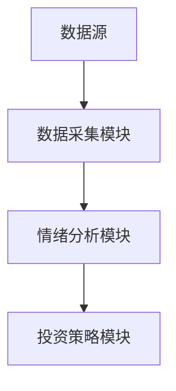

                 


# 巴菲特的市场情绪利用：如何在市场恐慌中保持冷静

---

## 关键词

- 市场情绪
- 投资策略
- 恐慌时期
- 逆向投资
- 巴菲特
- 市场波动率

---

## 摘要

本文深入探讨了巴菲特如何利用市场情绪，特别是在市场恐慌时期如何保持冷静并制定明智的投资策略。文章从市场情绪的基本概念出发，分析了恐慌情绪的来源及其对市场的影响，并结合巴菲特的价值投资理念，详细阐述了逆向投资策略的实施方法。通过数学模型和实际案例，文章揭示了恐慌时期的投资机会，并提供了构建市场情绪监控系统的实用方案。最后，文章总结了恐慌时期的投资要点，并给出了保持冷静的具体建议。

---

# 第1章: 市场情绪与投资概述

## 1.1 市场情绪的基本概念

### 1.1.1 市场情绪的定义

市场情绪（Market Sentiment）是指投资者对市场的整体看法和预期，通常通过市场参与者的交易行为和市场指标来衡量。市场情绪可以分为乐观（bullish）和悲观（bearish）两类，分别对应市场的上涨和下跌趋势。

### 1.1.2 市场情绪的核心要素

市场情绪的核心要素包括：

- **投资者心理**：个体或群体的心理预期和行为。
- **市场指标**：如股价波动率、成交量等。
- **外部因素**：经济数据、政策变化、国际局势等。

### 1.1.3 市场情绪与投资决策的关系

市场情绪直接影响投资者的决策，乐观情绪可能导致市场上涨，而悲观情绪则可能导致市场下跌。然而，市场情绪并非总是理性的，它可能会导致市场过度波动。

---

## 1.2 巴菲特的投资理念

### 1.2.1 巴菲特的投资哲学

巴菲特的投资哲学以“价值投资”为核心，强调购买被市场低估的优质资产，并长期持有。他认为市场的短期波动不可预测，但长期趋势是可以通过基本面分析来判断的。

### 1.2.2 巴菲特的价值投资策略

巴菲特的价值投资策略包括以下几点：

1. **寻找具有持续竞争优势的企业**：选择那些能够在未来持续盈利的企业。
2. **关注企业的内在价值**：通过分析企业的财务报表和行业地位，评估其内在价值。
3. **长期持有**：避免频繁交易，减少交易成本。

### 1.2.3 巴菲特与市场情绪的关系

巴菲特认为市场情绪是投资中的噪音，真正的投资者应该忽略短期波动，专注于企业的长期价值。

---

## 1.3 恐慌情绪的来源与影响

### 1.3.1 市场恐慌情绪的定义

市场恐慌情绪是指投资者在市场出现大幅下跌时，出于恐惧而大量抛售资产的行为。这种情绪通常是由于市场出现重大负面事件或市场参与者预期市场将进一步下跌所引发的。

### 1.3.2 恐慌情绪的常见触发因素

1. **重大经济事件**：如经济衰退、企业破产、政策变化等。
2. **市场波动加剧**：如股票市场的大幅下跌或波动率的急剧上升。
3. **媒体报道**：负面新闻和市场评论可能加剧市场的恐慌情绪。

### 1.3.3 恐慌情绪对市场的影响

1. **市场流动性下降**：恐慌情绪可能导致投资者大量抛售资产，导致市场流动性下降。
2. **资产价格超调**：恐慌情绪可能导致资产价格偏离其内在价值，出现超调。
3. **市场波动加剧**：恐慌情绪会加剧市场的波动性，可能导致市场的剧烈震荡。

---

## 1.4 本章小结

本章介绍了市场情绪的基本概念，分析了巴菲特的投资理念，并探讨了恐慌情绪的来源及其对市场的影响。市场情绪是投资者决策的重要因素，但恐慌情绪可能导致市场过度波动，投资者需要理性应对。

---

# 第2章: 市场情绪指标与量化分析

## 2.1 常见市场情绪指标

### 2.1.1 恐慌指数（VIX）

VIX指数，即“恐慌指数”，是衡量市场波动性的指标。VIX指数越高，市场波动性越大，投资者的恐慌情绪越强。

公式：$$\text{VIX} = \sqrt{\frac{1}{n}\sum_{i=1}^{n}(r_i - \mu)^2}$$

其中，$r_i$是资产的收益率，$\mu$是收益率的均值，$n$是样本数量。

### 2.1.2 市场波动率

市场波动率是衡量资产价格波动性的指标，通常用标准差来衡量。

公式：$$\text{波动率} = \sqrt{\frac{1}{n}\sum_{i=1}^{n}(x_i - \mu)^2}$$

其中，$x_i$是资产的价格，$\mu$是价格的均值，$n$是样本数量。

### 2.1.3 市场成交量

市场成交量是一定时间内资产的交易量，反映了市场的活跃程度。成交量的增加可能表明市场情绪的高涨或恐慌。

---

## 2.2 情绪指标的数学模型

### 2.2.1 市场波动率计算公式

$$\text{波动率} = \sqrt{\frac{1}{n}\sum_{i=1}^{n}(x_i - \mu)^2}$$

### 2.2.2 恐慌指数的计算方法

$$\text{VIX} = \sqrt{\frac{1}{n}\sum_{i=1}^{n}(r_i - \mu)^2}$$

---

## 2.3 情绪指标的应用场景

### 2.3.1 情绪指标在市场预测中的应用

投资者可以通过分析市场波动率和VIX指数来预测市场的短期走势。例如，当VIX指数显著上升时，可能预示市场将出现大幅波动。

### 2.3.2 情绪指标在投资决策中的应用

投资者可以利用市场情绪指标来优化投资组合。例如，在市场恐慌时，可以通过分析市场波动率和成交量来寻找被低估的投资标的。

---

## 2.4 本章小结

本章介绍了常见的市场情绪指标，包括VIX指数和市场波动率，并提供了相应的数学模型。投资者可以通过这些指标来分析市场情绪，并做出更明智的投资决策。

---

# 第3章: 巴菲特的恐慌应对策略

## 3.1 逆向投资策略

### 3.1.1 逆向投资的定义

逆向投资是一种在市场恐慌时买入，市场乐观时卖出的投资策略。巴菲特是逆向投资的倡导者，他认为市场恐慌时，资产价格往往被低估，是买入的好时机。

### 3.1.2 逆向投资的实施步骤

1. **识别市场恐慌**：通过市场情绪指标判断市场是否处于恐慌状态。
2. **分析资产价值**：评估资产的内在价值，判断其是否被低估。
3. **买入资产**：在市场恐慌时，买入被低估的资产。

### 3.1.3 逆向投资的典型案例

2008年金融危机期间，巴菲特利用市场恐慌，大量买入优质资产，如通用电气和高盛的股票，取得了显著的收益。

---

## 3.2 价值评估与恐慌时期的投资机会

### 3.2.1 价值评估的基本原理

价值评估是通过分析企业的财务报表和行业地位，评估其内在价值。在市场恐慌时，许多优质资产的价格被低估，提供了投资机会。

### 3.2.2 恐慌时期的价值发现机会

市场恐慌时，许多投资者急于抛售资产，导致资产价格低于其内在价值。此时，投资者可以通过价值评估找到被低估的资产。

### 3.2.3 如何识别被低估的投资标的

投资者可以通过分析市盈率（P/E）、市净率（P/B）等指标，判断资产是否被低估。

---

## 3.3 长期视角与恐慌时期的纪律性

### 3.3.1 长期投资的重要性

长期投资可以帮助投资者忽略市场的短期波动，专注于企业的长期价值。

### 3.3.2 恐慌时期的投资纪律

在市场恐慌时，投资者需要保持纪律，避免情绪化决策。巴菲特强调，投资者应该在市场恐慌时保持冷静，坚持长期投资策略。

### 3.3.3 如何避免情绪化决策

投资者可以通过制定明确的投资计划和纪律，避免情绪化决策。例如，设定投资目标和止盈止损点，避免被市场情绪左右。

---

## 3.4 本章小结

本章详细讲解了巴菲特的恐慌应对策略，包括逆向投资、价值评估和长期投资。在市场恐慌时，投资者可以通过这些策略找到投资机会，并保持冷静。

---

# 第4章: 市场情绪与投资系统分析

## 4.1 系统目标与范围

### 4.1.1 系统目标

构建一个市场情绪监控系统，帮助投资者实时分析市场情绪，并制定相应的投资策略。

### 4.1.2 系统范围

系统包括数据采集、情绪分析和投资策略制定三个模块。

---

## 4.2 系统功能设计

### 4.2.1 数据采集模块

数据采集模块负责收集市场数据，如股票价格、成交量等。

### 4.2.2 情绪分析模块

情绪分析模块通过分析市场数据，计算市场波动率和VIX指数，判断市场情绪。

### 4.2.3 投资策略模块

投资策略模块根据市场情绪和资产价值，制定投资策略，如逆向投资。

---

## 4.3 系统架构设计

### 4.3.1 系统架构图（Mermaid）



---

## 4.4 系统交互设计

### 4.4.1 数据采集流程

1. 数据采集模块从数据源获取市场数据。
2. 数据采集模块将数据传递给情绪分析模块。

### 4.4.2 情绪分析流程

1. 情绪分析模块计算市场波动率和VIX指数。
2. 情绪分析模块判断市场情绪。

### 4.4.3 投资策略制定流程

1. 投资策略模块根据市场情绪和资产价值，制定投资策略。
2. 投资策略模块输出投资建议。

---

## 4.5 本章小结

本章介绍了市场情绪监控系统的构建，包括系统目标、功能设计和架构设计。投资者可以通过该系统实时分析市场情绪，并制定相应的投资策略。

---

# 第5章: 项目实战与经验分享

## 5.1 环境安装

### 5.1.1 Python环境安装

安装Python和相关库，如Pandas、Matplotlib等。

### 5.1.2 数据源获取

从金融数据供应商获取市场数据，如股票价格、成交量等。

---

## 5.2 核心实现代码

### 5.2.1 数据采集代码

```python
import pandas as pd
import requests

# 下载数据
url = "https://example.com/data"
data = requests.get(url).content
df = pd.read_csv(url)
```

### 5.2.2 情绪分析代码

```python
import pandas as pd
import numpy as np

# 计算市场波动率
def calculate_volatility(prices):
    returns = np.log(prices.pct_change().dropna())
    volatility = np.std(returns)
    return volatility

# 计算VIX指数
def calculate_vix(returns):
    vix = np.sqrt(np.mean(returns**2))
    return vix

# 应用函数
prices = df['Close']
volatility = calculate_volatility(prices)
vix = calculate_vix(prices.pct_change())
```

### 5.2.3 投资策略代码

```python
import pandas as pd
import numpy as np

# 逆向投资策略
def reverse_strategy(prices, volatility_threshold=0.2):
    signal = volatility > volatility_threshold
    return signal

# 生成信号
signal = reverse_strategy(prices)
```

---

## 5.3 案例分析

### 5.3.1 案例背景

2020年新冠疫情爆发期间，市场恐慌情绪达到顶峰，VIX指数急剧上升。

### 5.3.2 数据分析

分析股票价格和市场波动率，发现许多优质资产的价格被低估。

### 5.3.3 投资策略

在市场恐慌时，买入被低估的资产，如科技股和金融股。

---

## 5.4 本章小结

本章通过实际案例展示了市场情绪监控系统的应用，帮助投资者在市场恐慌时制定明智的投资策略。

---

# 第6章: 总结与最佳实践

## 6.1 本章总结

本文详细探讨了巴菲特如何利用市场情绪，特别是在市场恐慌时期如何保持冷静并制定明智的投资策略。通过分析市场情绪指标和价值评估，投资者可以在市场恐慌时找到投资机会。

---

## 6.2 最佳实践 tips

1. **保持冷静**：市场恐慌时，避免情绪化决策，坚持长期投资策略。
2. **逆向投资**：在市场恐慌时，寻找被低估的资产进行投资。
3. **价值评估**：通过分析企业的财务报表和行业地位，评估其内在价值。
4. **系统分析**：构建市场情绪监控系统，实时分析市场情绪，并制定相应的投资策略。

---

## 6.3 注意事项

1. **风险提示**：投资有风险，投资者需谨慎决策。
2. **持续学习**：市场环境不断变化，投资者需持续学习和更新知识。

---

## 6.4 拓展阅读

- 巴菲特的经典著作《聪明的投资者》
- 《投资学原理》
- 《金融市场与机构》

---

# 作者：AI天才研究院/AI Genius Institute & 禅与计算机程序设计艺术 /Zen And The Art of Computer Programming

---

通过本文的分析，投资者可以在市场恐慌时保持冷静，并利用市场情绪制定明智的投资策略。希望本文的内容能够为投资者提供有价值的见解和实用的策略。

