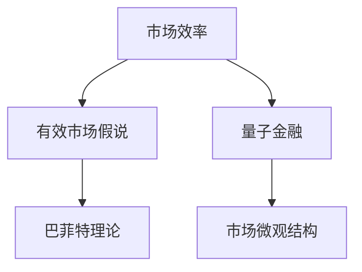
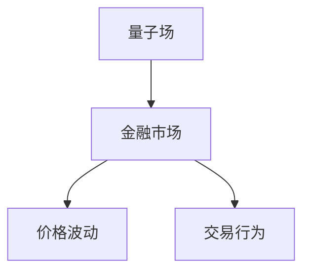
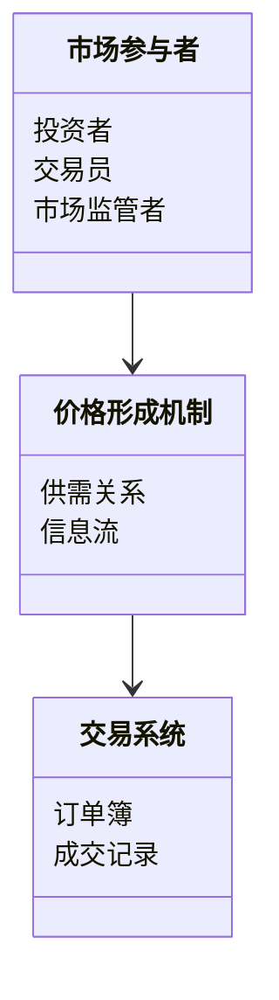
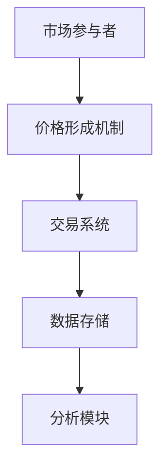
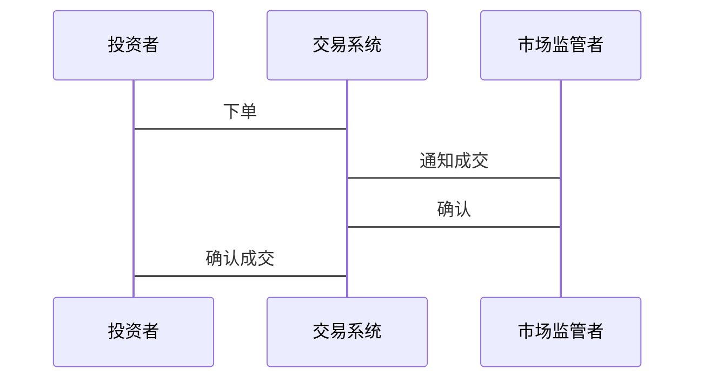

                 


# 巴菲特的市场效率理论批判：量子金融对市场微观结构的影响

## 关键词：市场效率，巴菲特，量子金融，市场微观结构，量子概率论，交易策略

## 摘要

本文批判性地分析了巴菲特的市场效率理论，探讨了量子金融对市场微观结构的影响。首先，我们介绍了有效市场假说的背景及其在巴菲特投资理念中的应用，揭示其局限性。接着，我们深入量子金融的基本原理，包括量子概率论和量子场论，并展示了它们如何应用于金融市场。通过分析价格形成机制和交易策略，我们探讨了量子金融对市场微观结构的具体影响。最后，我们总结了量子金融的优势和挑战，展望了其未来的发展方向。

---

## 第1章：背景介绍

### 1.1 问题背景

#### 1.1.1 有效市场假说的起源与局限性

有效市场假说（EMH）由Fama在1970年提出，认为市场价格反映了所有可获得的信息，因此股票价格是其内在价值的“有效”反映。然而，EMH存在局限性，尤其是在应对复杂市场动态方面。传统金融学假设价格服从随机游走，但近年来，随着市场复杂性增加，这种假设受到挑战。

#### 1.1.2 巴菲特投资理念的核心思想

巴菲特的投资理念基于价值投资，主张购买价格低于其内在价值的股票。他认为市场并非总是有效，存在长期被低估的股票。这种观点与EMH的短期有效性和长期无效性相矛盾，特别是在市场波动加剧时。

#### 1.1.3 量子金融的起源与发展

量子金融结合量子力学原理和金融市场分析，由 physicists如Odzijewicz和Baaquie提出。其核心思想是金融市场可视为量子系统，价格波动遵循量子力学规律。

### 1.2 核心概念

#### 1.2.1 市场效率的定义与衡量标准

市场效率指价格反映信息的充分程度。衡量标准包括弱、强、半强有效市场，但均存在局限性。

#### 1.2.2 量子金融的核心原理

量子金融使用量子概率论，考虑价格波动的量子特性，与经典概率模型不同。

#### 1.2.3 市场微观结构的定义与分析框架

市场微观结构涉及价格形成机制、交易行为等，分析框架包括订单簿、交易量和价格波动。

### 1.3 问题描述

#### 1.3.1 巴菲特理论的批判视角

EMH未能解释市场中的非理性行为和价格偏差，巴菲特的理论提供了长期视角，但缺乏微观结构分析。

#### 1.3.2 量子金融对市场效率的挑战

量子金融挑战了EMH，认为市场价格波动具有量子特性，可能超越经典概率模型。

#### 1.3.3 市场微观结构与量子金融的关联

市场微观结构提供复杂环境，量子金融能更好地建模这些动态。

### 1.4 问题解决

#### 1.4.1 巴菲特理论的修正与扩展

引入量子概率论，扩展其分析框架，考虑价格波动的量子特性。

#### 1.4.2 量子金融在市场微观结构中的应用

应用于价格预测和交易策略优化，提供新的建模工具。

#### 1.4.3 综合分析框架的构建

整合量子金融和市场微观结构，构建综合分析框架。

### 1.5 边界与外延

#### 1.5.1 巴菲特理论的适用范围

适用于长期投资，但需结合量子金融进行短期分析。

#### 1.5.2 量子金融的理论边界

适用于复杂市场，需考虑计算资源和数据质量限制。

#### 1.5.3 市场微观结构的复杂性

涉及多方因素，需系统分析。

### 1.6 概念结构与核心要素

#### 1.6.1 概念图（Mermaid）



---

## 第2章：量子金融的基本原理

### 2.1 量子概率论

#### 2.1.1 量子概率的基本概念

量子概率基于量子态的叠加和测量的坍缩，与经典概率不同。

#### 2.1.2 与经典概率的对比

表格对比经典概率和量子概率的关键特征。

| 特性 | 经典概率 | 量子概率 |
|------|----------|----------|
| 描述 | 事件发生的可能性 | 状态叠加与坍缩 |
| 模型 | 马尔可夫链 | 量子态模型 |

#### 2.1.3 量子概率在金融中的应用

应用于价格波动建模和风险评估。

### 2.2 量子场论与金融市场

#### 2.2.1 量子场论的简介

量子场论描述粒子相互作用，应用于金融市场建模。

#### 2.2.2 金融市场中的量子场模型

Mermaid图示金融市场中的量子场模型：



---

## 第3章：量子金融对市场微观结构的影响

### 3.1 价格形成机制

#### 3.1.1 量子概率模型

$$ P(p_i) = |ψ(p_i)|^2 $$

#### 3.1.2 价格预测模型

使用量子随机过程模型，展示价格预测流程。

### 3.2 交易策略

#### 3.2.1 量子交易策略

基于量子概率论设计的交易策略。

#### 3.2.2 实际案例分析

分析量子策略在高频交易中的应用。

### 3.3 市场参与者的互动

#### 3.3.1 互动模型

展示市场参与者在量子模型下的互动。

#### 3.3.2 量子博弈论

应用于市场参与者决策建模。

---

## 第4章：系统分析与架构设计

### 4.1 系统功能设计

#### 4.1.1 领域模型（Mermaid）

展示市场微观结构的领域模型：



### 4.2 系统架构设计

#### 4.2.1 总体架构（Mermaid）

展示系统总体架构：



### 4.3 系统接口设计

定义模块间接口，如价格数据获取接口。

### 4.4 系统交互（Mermaid）

展示交易过程中的交互：



---

## 第5章：项目实战

### 5.1 环境安装

安装Python和量子计算库，如Qiskit。

### 5.2 核心实现

实现量子随机漫步模型：

```python
from qiskit import QuantumCircuit, simulate

def quantum_random_walk(n_steps):
    qc = QuantumCircuit(n_steps)
    # 初始化量子态
    qc.initialize([1, 0], 0)
    # 进行n_steps次量子步
    for i in range(1, n_steps):
        qc.cswap(i, 0, i+1)
    result = simulate(qc).run()
    return result.get_state_vector()

print(quantum_random_walk(3))
```

### 5.3 代码解读

解释代码功能，展示量子随机漫步的应用。

### 5.4 案例分析

分析量子随机漫步在价格预测中的应用。

### 5.5 项目小结

总结项目成果和应用前景。

---

## 第6章：总结与展望

### 6.1 量子金融的优势

预测精度和模型复杂性优势。

### 6.2 挑战与局限

计算资源和数据质量限制。

### 6.3 未来发展方向

结合AI和大数据，进一步优化模型。

---

## 作者：AI天才研究院 & 禅与计算机程序设计艺术

---

通过以上内容，文章系统地分析了量子金融对市场微观结构的影响，结合理论、模型和实际案例，为读者提供了全面的视角。

