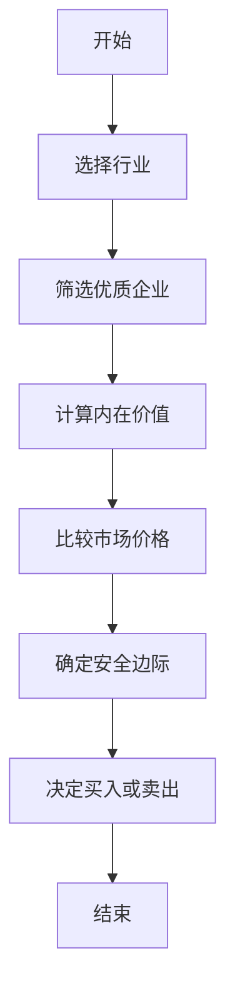
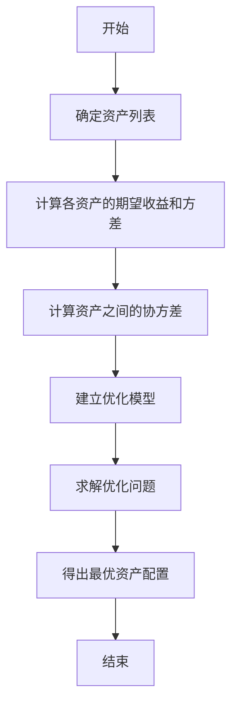
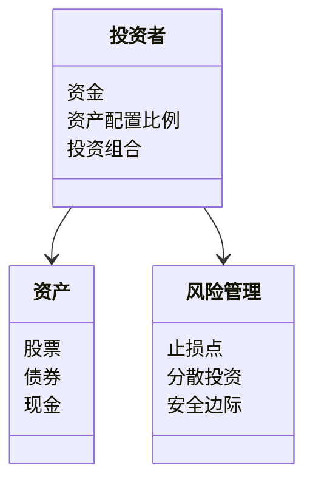
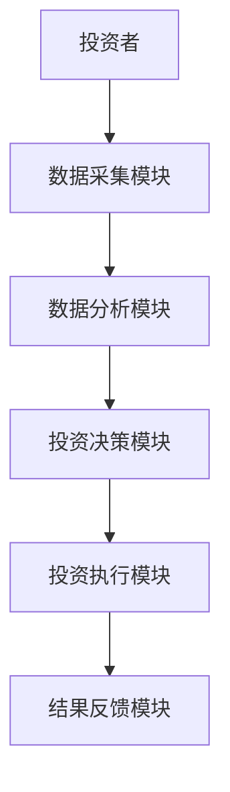
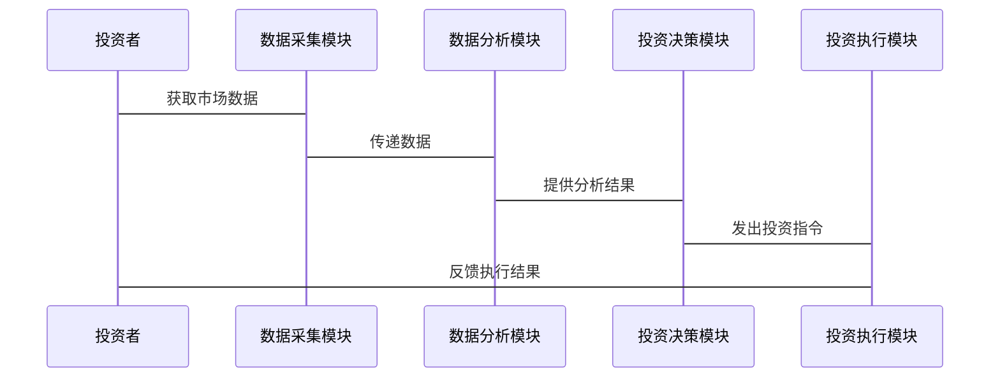

                 


# 巴菲特的现金管理艺术：在不确定性中保持灵活性

> 关键词：巴菲特，现金管理，投资策略，风险管理，价值投资，安全边际，长期投资

> 摘要：本文深入探讨了巴菲特的现金管理艺术，分析了他在不确定性中保持灵活性的核心原则和策略。通过价值投资、安全边际、资产配置等核心概念的详细解读，结合数学模型和算法的分析，本文为读者提供了在复杂市场环境中有效管理现金的实用方法。

---

## # 第一部分：现金管理的基本概念与重要性

### ## 第1章：现金管理的基本概念与重要性

#### ### 1.1 现金管理的定义与核心要素

- **现金管理的定义**：现金管理是指通过合理配置和管理现金及现金等价物，以实现资产保值、增值和风险控制的过程。
- **现金管理的核心要素**：
  - 资产配置：决定投资组合中股票、债券等资产的比例。
  - 风险管理：识别和控制投资中的潜在风险。
  - 时间跨度：长期投资与短期投资的平衡。
- **现金管理与投资的关系**：现金管理是投资决策的重要组成部分，直接影响投资组合的收益和风险。

#### ### 1.2 巴菲特的现金管理理念

- **巴菲特的背景与投资风格**：
  - 巴菲特是全球著名的价值投资者，强调长期投资和安全边际。
  - 他的投资理念以“买入并持有”为核心，注重企业的内在价值。
- **巴菲特现金管理的核心思想**：
  - 现金是企业的“氧气”，必须保持充足的流动性。
  - 通过价值投资，寻找被市场低估的企业进行长期投资。
  - 在市场波动中，利用现金的灵活性，捕捉投资机会。
- **巴菲特现金管理的独特之处**：
  - 强调安全边际，避免过度冒险。
  - 注重企业基本面分析，而非市场短期波动。

#### ### 1.3 现金管理在不确定性中的重要性

- **不确定性环境下的现金管理策略**：
  - 在市场下跌时，保持足够的现金以抓住投资机会。
  - 在市场上涨时，合理配置资产以避免过度风险。
- **现金管理如何帮助应对市场波动**：
  - 通过分散投资降低风险。
  - 利用现金的流动性，在市场底部增加投资。
- **现金管理在个人与企业中的作用**：
  - 对个人投资者：保护本金，实现财富增值。
  - 对企业：确保运营稳定，抓住扩张机会。

---

## # 第二部分：现金管理的核心原则与策略

### ## 第2章：现金管理的核心原则

#### ### 2.1 价值投资原则

- **价值投资的定义与特点**：
  - 价值投资是寻找市场价格低于内在价值的企业进行投资。
  - 强调企业基本面分析，包括盈利能力、财务状况、行业地位等。
- **巴菲特的价值投资理念**：
  - 买入价格低于内在价值的企业股票。
  - 长期持有优质企业，分享其成长收益。
- **价值投资与成长投资的区别**：
  - 价值投资：寻找被低估的企业，注重安全边际。
  - 成长投资：投资于高成长企业，注重未来收益。

#### ### 2.2 安全边际原则

- **安全边际的定义与作用**：
  - 安全边际是指市场价格与内在价值之间的差额。
  - 通过安全边际，降低投资风险，提高投资收益。
- **巴菲特如何应用安全边际原则**：
  - 在买入股票时，要求市场价格低于内在价值。
  - 通过安全边际，确保在市场波动中不易亏损。
- **安全边际与投资风险的关系**：
  - 安全边际越高，投资风险越低。
  - 在市场恐慌时，安全边际可能大幅增加，带来投资机会。

#### ### 2.3 长期投资原则

- **长期投资的优势与挑战**：
  - 长期投资可以避免短期波动的影响，获得复利收益。
  - 挑战在于需要耐心等待，抵御短期诱惑。
- **巴菲特的长期投资策略**：
  - 长期持有优质企业，分享其成长收益。
  - 避免频繁交易，减少交易成本和税收负担。
- **长期投资与短期投资的对比**：
  - 长期投资：注重复利效应，风险较低。
  - 短期投资：风险较高，收益不稳定。

### ## 第3章：资产配置策略

#### ### 3.1 资产配置的基本概念

- **资产配置的定义与重要性**：
  - 资产配置是指将资金分配到不同资产类别（股票、债券、现金等）的过程。
  - 通过资产配置，降低风险，提高收益。
- **资产配置的种类与比例**：
  - 股票：高风险，高收益。
  - 债券：低风险，稳定收益。
  - 现金：流动性高，安全性强。
- **资产配置与风险控制的关系**：
  - 合理的资产配置可以分散风险。
  - 根据市场环境调整资产配置比例。

#### ### 3.2 巴菲特的资产配置策略

- **巴菲特的资产配置模型**：
  - 70%股票，20%债券，10%现金及其他。
  - 根据市场环境调整比例。
- **股票与债券的配置比例**：
  - 股票：长期持有优质企业。
  - 债券：提供稳定的利息收入。
- **其他资产的配置策略**：
  - 现金：保持充足的流动性。
  - 其他资产：如房地产信托基金等。

#### ### 3.3 资产配置的动态调整

- **资产配置的定期评估与调整**：
  - 定期评估市场环境和投资目标。
  - 根据变化调整资产配置比例。
- **不同市场环境下的资产配置策略**：
  - 牛市：增加股票配置，减少债券配置。
  - 熊市：增加现金配置，减少股票配置。
- **资产配置与投资目标的关系**：
  - 根据投资目标调整资产配置。
  - 长期目标：增加股票配置。
  - 短期目标：增加债券和现金配置。

---

## # 第三部分：现金管理的数学模型与算法

### ## 第4章：巴菲特现金管理的数学模型与算法

#### ### 4.1 价值投资的数学模型

- **内在价值的计算公式**：
  - 内在价值 = 未来现金流的现值
  - 公式：$$内在价值 = \sum_{t=1}^{n} \frac{CF_t}{(1 + r)^t}$$
  - 其中，CF_t是第t年的现金流，r是折现率。
- **安全边际的计算公式**：
  - 安全边际 = 内在价值 - 市场价格
  - 公式：$$安全边际 = 内在价值 - 市场价格$$
- **巴菲特选股模型的mermaid流程图**：



#### ### 4.2 投资组合的优化算法

- **投资组合优化的目标**：
  - 最大化收益，最小化风险。
  - 使用均值-方差优化模型。
- **均值-方差优化的数学公式**：
  - 最优化问题：$$\min \sigma^2$$
  - 约束条件：$$\sum w_i = 1$$
  - 其中，σ²是投资组合的方差，w_i是各资产的权重。
- **投资组合优化的mermaid流程图**：



#### ### 4.3 风险控制的算法

- **风险控制的目标**：
  - 通过分散投资降低风险。
  - 使用止损策略控制亏损。
- **分散投资的数学模型**：
  - 投资分散化公式：$$\sigma_p^2 = \sum w_i^2 \sigma_i^2 + \sum w_i w_j \sigma_{i,j}$$
  - 其中，σ_p²是投资组合的方差，σ_i²是各资产的方差，σ_{i,j}是资产i和j的协方差。
- **止损策略的实现**：
  - 设定止损点，当价格下跌至止损点时，立即卖出。
  - 公式：$$止损价格 = 买入价格 \times (1 - \text{止损比例})$$

---

## # 第四部分：系统分析与架构设计

### ## 第5章：系统架构与实现

#### ### 5.1 问题场景介绍

- **问题背景**：
  - 投资者需要在不确定的市场环境中管理现金，实现财富增值。
  - 需要一个系统化的解决方案，帮助投资者做出科学的决策。
- **项目介绍**：
  - 开发一个基于巴菲特现金管理理念的投资管理系统。
  - 提供资产配置、风险控制、投资组合优化等功能。

#### ### 5.2 系统功能设计

- **领域模型mermaid类图**：



- **系统架构设计mermaid架构图**：



#### ### 5.3 系统接口设计

- **接口描述**：
  - 数据采集模块：从市场数据源获取股票、债券等资产的价格和基本面数据。
  - 数据分析模块：计算内在价值、安全边际等指标。
  - 投资决策模块：根据分析结果，生成投资建议。
  - 投资执行模块：执行买卖指令，调整资产配置。

#### ### 5.4 系统交互mermaid序列图



---

## # 第五部分：项目实战与案例分析

### ## 第6章：项目实战

#### ### 6.1 环境安装与配置

- **环境要求**：
  - Python 3.8+
  - 导入库：numpy、pandas、scipy、matplotlib。
  - 安装步骤：
    ```bash
    pip install numpy pandas scipy matplotlib
    ```

#### ### 6.2 核心实现源代码

- **计算内在价值的Python代码**：

```python
import numpy as np

def calculate_intrinsic_value(cash_flows, discount_rate):
    present_value = 0
    for t, cf in enumerate(cash_flows):
        present_value += cf / (1 + discount_rate) ** t
    return present_value

# 示例数据
cash_flows = [100, 120, 150, 200]
discount_rate = 0.08

intrinsic_value = calculate_intrinsic_value(cash_flows, discount_rate)
print(f"内在价值为：{intrinsic_value}")
```

- **资产配置优化的Python代码**：

```python
import numpy as np
from scipy.optimize import minimize

def portfolio_variance(weights, covariance_matrix):
    return np.dot(weights.T, np.dot(covariance_matrix, weights))

# 示例数据
covariance_matrix = np.array([[0.04, 0.02], [0.02, 0.05]])
weights = np.array([0.5, 0.5])

# 优化问题
def optimization_function(weights, covariance_matrix):
    return portfolio_variance(weights, covariance_matrix)

# 约束条件
constraints = [{'type': 'eq', 'fun': lambda w: sum(w) - 1}]

# 求解优化问题
result = minimize(optimization_function, weights, args=(covariance_matrix,), constraints=constraints)
print(f"最优权重为：{result.x}")
```

#### ### 6.3 实际案例分析

- **案例选择**：
  - 以可口可乐公司为例，分析巴菲特的投资决策。
- **基本面分析**：
  - 可口可乐的盈利能力、财务状况、行业地位。
- **估值计算**：
  - 计算可口可乐的内在价值，确定买入价格。
- **投资策略**：
  - 长期持有，定期评估，动态调整。

#### ### 6.4 代码应用解读与分析

- **代码解读**：
  - 计算内在价值的代码展示了如何通过现金流现值法评估企业价值。
  - 资产配置优化的代码展示了如何通过数学模型实现投资组合的最优化。
- **案例分析**：
  - 通过具体案例，展示如何将代码应用于实际投资决策中。

---

## # 第六部分：小结与展望

### ## 第7章：小结与展望

#### ### 7.1 小结

- **总结全文**：
  - 巴菲特的现金管理艺术以价值投资为核心，强调安全边际和长期投资。
  - 通过合理的资产配置和风险管理，可以在不确定性中保持灵活性。
- **主要收获**：
  - 理解了巴菲特的投资理念和现金管理策略。
  - 掌握了价值投资、资产配置等核心概念和数学模型。

#### ### 7.2 展望

- **未来研究方向**：
  - 深入研究巴菲特的具体投资案例，总结成功的经验。
  - 探讨在不同市场环境下的现金管理策略。
- **读者建议**：
  - 多阅读巴菲特的相关书籍，如《巴菲特致股东的信》。
  - 实践巴菲特的投资理念，结合实际情况灵活运用。

---

## # 附录

### ## 附录A：推荐书籍与工具

- **推荐书籍**：
  - 《巴菲特致股东的信》
  - 《投资之道》
  - 《证券分析》
- **推荐工具**：
  - 财务分析工具：Excel、Python（pandas、numpy）
  - 数据可视化工具：Matplotlib、Tableau
  - 投资组合管理工具：Morningstar、Finviz

### ## 附录B：常见问题解答

- **Q1：巴菲特的投资策略适合所有人吗？**
  - 不是，巴菲特的投资策略适合长期投资者，需要具备一定的财务知识和耐心。
- **Q2：如何计算内在价值？**
  - 使用现金流现值法，考虑企业的未来现金流和贴现率。
- **Q3：资产配置的比例如何调整？**
  - 根据市场环境和个人风险承受能力，定期评估和调整。

### ## 附录C：联系方式与进一步学习

- **联系方式**：
  - Email：contact@investor.com
  - 微信公众号：巴菲特投资学院
- **进一步学习**：
  - 关注我们的公众号，获取更多投资干货。
  - 参加我们的投资课程，提升投资能力。

---

## # 作者信息

作者：AI天才研究院/AI Genius Institute & 禅与计算机程序设计艺术/Zen And The Art of Computer Programming

---

通过本文，读者可以全面理解巴菲特的现金管理艺术，掌握其核心原则和策略，并在实际操作中灵活运用这些方法，实现财富的长期增值。

