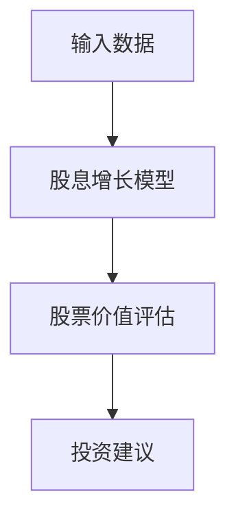

                 


# 巴菲特的股息增长策略：通货膨胀时代的收益来源

## 关键词：
巴菲特, 股息增长策略, 投资策略, 通货膨胀, 收益来源, 股息收益率, 股息再投资

## 摘要：
在通货膨胀时代，股息增长策略成为一种有效的投资方式，尤其在巴菲特的投资理念中，股息增长策略不仅提供了稳定的现金流，还能在通胀中保持甚至提升购买力。本文详细分析了股息增长策略的背景、理论模型、实际案例，并探讨了其在通货膨胀环境下的应用和风险管理。

---

## 第一部分: 股息增长策略的背景与基础

### 第1章: 股息增长策略概述

#### 1.1 股息增长策略的定义与特点
股息增长策略是一种投资策略，投资者通过投资那些能够持续增长股息的公司，获得稳定的现金流和资本增值。其核心在于寻找那些股息收益率合理且股息增长稳定的公司。

##### 1.1.1 股息的定义与作用
股息是公司分配给股东的利润部分，通常以每股形式计算。股息的作用包括提供稳定的收入来源、增强股价稳定性、吸引长期投资者等。

##### 1.1.2 股息增长策略的核心特点
- 股息持续增长：公司具有稳定的盈利能力和持续的股息增长能力。
- 稳定性：股息增长公司通常具有较强的财务实力和市场地位。
- 长期复利效应：通过股息再投资，投资者能够实现资产的长期增值。

##### 1.1.3 股息增长策略与股息收益率的区别
股息收益率是指股息与股价的比率，而股息增长策略更关注股息的未来增长潜力，强调股息的可持续性和增长性。

#### 1.2 巴菲特的投资理念
巴菲特的投资哲学强调价值投资、长期持有和安全边际。他认为，股息增长策略能够为投资者提供稳定的现金流，同时反映公司的盈利能力和成长性。

##### 1.2.1 巴菲特的投资哲学
- 买入优秀的公司，而非股票。
- 重视公司的基本面，包括盈利能力、财务健康和行业地位。

##### 1.2.2 巴菲特对股息增长策略的重视
巴菲特认为，股息增长公司通常具有稳定的盈利能力和良好的管理团队。他倾向于投资那些能够持续派发股息并增长股息的公司。

##### 1.2.3 巴菲特投资策略的长期视角
巴菲特强调长期投资，认为短期市场波动不应影响长期投资决策。股息增长策略与他的长期视角高度契合。

---

### 第2章: 股息增长策略的背景与重要性

#### 2.1 通货膨胀时代的投资挑战
通货膨胀会侵蚀固定收益资产的购买力，传统投资策略在通胀环境下往往表现不佳。

##### 2.1.1 通货膨胀对投资收益的影响
- 货币购买力下降。
- 固定收益资产的实际收益降低。
- 股票收益可能受到负面影响，但优质股息增长公司能够通过提价和增加股息应对通胀。

##### 2.1.2 传统投资策略的局限性
- 短期交易风险较高。
- 无法有效应对通货膨胀的影响。
- 高度依赖市场波动，难以实现稳定的收益。

##### 2.1.3 股息增长策略在通货膨胀中的优势
- 股息增长能够部分抵消通货膨胀的影响。
- 股票的内在价值增长能够抵御通货膨胀。
- 股息再投资能够在通胀中实现资产的保值和增值。

#### 2.2 股息增长策略的核心优势
- 稳定的现金流来源：股息收入能够为投资者提供稳定的现金流。
- 抗跌性与防御性：股息增长公司通常具有较强的财务实力和市场地位，能够在市场波动中表现较好。
- 长期复利效应：通过股息再投资，投资者能够实现资产的长期增值。

---

### 第3章: 股息增长策略的理论基础

#### 3.1 股息增长模型
股息增长模型是一种用于评估股票内在价值的数学模型，假设股息以恒定的速率增长。

##### 3.1.1 股息增长模型的定义
股息增长模型（Dividend Growth Model）假设股息以固定增长率（g）增长，股票的内在价值可以通过未来股息的现值之和计算得出。

##### 3.1.2 股息增长模型的数学公式
$$P = \frac{D_0(1+g)}{r - g}$$
其中，P为股票价格，D0为当前股息，g为股息增长率，r为折现率。

##### 3.1.3 股息增长模型的假设条件
- 股息以恒定速率增长。
- 折现率保持不变。
- 股票无限期限支付股息。

#### 3.2 股息增长模型的适用性分析
股息增长模型适用于那些股息稳定增长且能够长期支付股息的公司。这种模型在评估成长型股票时尤为重要。

---

### 第4章: 股息增长策略的系统分析

#### 4.1 股息增长策略的系统架构
股息增长策略的系统架构包括以下几个部分：
- **输入层**：市场数据、公司基本面数据。
- **处理层**：股息增长模型计算、公司基本面分析。
- **输出层**：股票价值评估、投资建议。

#### 4.2 股息增长模型的系统架构图


#### 4.3 股息增长模型的算法实现
```python
def dividend_growth_model(current_dividend, growth_rate, discount_rate):
    return (current_dividend * (1 + growth_rate)) / (discount_rate - growth_rate)
```

---

## 第五部分: 股息增长策略的实战应用

### 第5章: 股息增长策略的项目实战

#### 5.1 股票选择标准
- 股息收益率合理。
- 股息增长历史稳定。
- 公司基本面良好。

#### 5.2 投资组合管理
- 定期再平衡投资组合。
- 选择股息增长潜力大的公司。
- 保持长期投资。

#### 5.3 风险管理策略
- 分散投资以降低风险。
- 定期评估投资组合的表现。
- 保持对市场环境的关注。

---

## 第六部分: 总结与展望

### 6.1 总结
股息增长策略在通货膨胀时代具有重要的收益来源作用，能够为投资者提供稳定的现金流和长期的资本增值。巴菲特的投资理念为股息增长策略提供了坚实的理论基础。

### 6.2 展望
随着通货膨胀压力的增加，股息增长策略将成为更多投资者的首选。未来，随着技术的进步和数据分析能力的提升，股息增长策略将更加精准和高效。

---

## 作者：AI天才研究院 & 禅与计算机程序设计艺术

---

