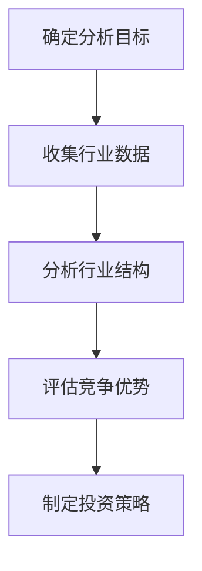
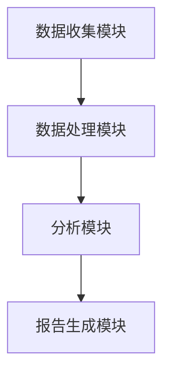
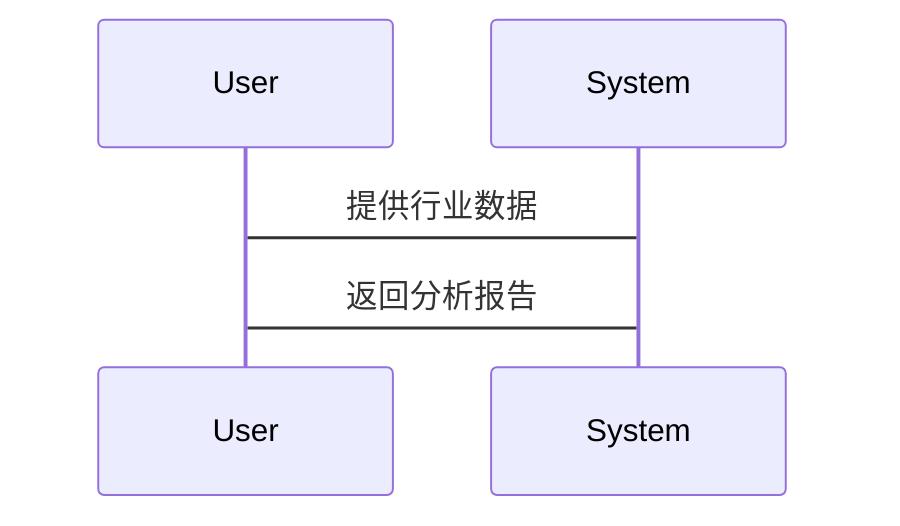

                 


# 巴菲特的行业分析方法：如何识别具有持久竞争优势的行业

## 关键词：巴菲特, 投资分析, 行业分析, 竞争优势, 护城河, 财务指标

## 摘要：本文将详细探讨巴菲特的行业分析方法，帮助读者识别具有持久竞争优势的行业。通过分析巴菲特的核心投资理念、行业分析的核心概念、具体的分析方法和经典投资案例，本文旨在为读者提供一套系统化的行业分析框架，帮助他们在投资决策中找到具有长期竞争优势的行业。

---

# 第一部分：引言

## 第1章：巴菲特投资理念概述

### 1.1 巴菲特的生平与投资哲学

沃伦·巴菲特（Warren Buffett）是全球最著名的职业投资人之一。他出生于1930年，早年通过投资俱乐部和合伙企业积累了丰富的投资经验。巴菲特的投资哲学以“价值投资”为核心，强调寻找具有长期竞争优势的企业进行投资。他的投资理念不仅帮助他积累了巨大的财富，也为全球投资者提供了宝贵的经验。

### 1.2 巴菲特的核心投资理念

巴菲特的核心投资理念包括以下几个方面：
1. **长期投资**：巴菲特反对短期投机，主张长期持有优质资产。
2. **安全边际**：在投资时，要确保买入价格低于企业的内在价值。
3. **竞争优势**：寻找具有强大竞争优势的企业，这些企业能够持续盈利并抵御竞争。

### 1.3 本书的核心目标与框架

本书的核心目标是帮助读者掌握巴菲特的行业分析方法，识别具有持久竞争优势的行业。我们将从行业分析的基本概念出发，逐步深入探讨巴菲特的分析框架、具体方法和实战案例。

---

# 第二部分：行业分析的核心概念

## 第2章：行业分析的基本概念

### 2.1 行业的定义与分类

行业是指从事相同性质的企业活动的集合。根据不同的标准，行业可以分为多种类型，例如按产品类型分类（如制造业、服务业）或按市场结构分类（如垄断行业、竞争行业）。

### 2.2 行业分析的维度与指标

行业分析可以从以下几个维度进行：
1. **市场结构**：分析行业的市场集中度、竞争状况等。
2. **行业生命周期**：分析行业所处的发展阶段（导入期、成长期、成熟期、衰退期）。
3. **财务指标**：分析行业的平均利润率、市盈率、ROE（净资产收益率）等。

### 2.3 行业生命周期与竞争优势

行业生命周期对竞争优势的形成有重要影响。例如，在成熟期，企业需要依赖成本优势或品牌优势来保持竞争力。

---

## 第3章：巴菲特的“护城河”理论

### 3.1 护城河的定义与类型

护城河是指企业抵御竞争的能力。巴菲特将护城河分为以下几种类型：
1. **成本优势**：企业能够以更低的成本生产产品。
2. **品牌优势**：强大的品牌能够吸引更多的消费者。
3. **技术优势**：拥有独特的技术或专利。
4. **网络效应**：产品或服务的使用价值随着用户数量的增加而增加。

### 3.2 各种护城河的优缺点对比

- **成本优势**：优点是能够持续降低成本，缺点是可能受到技术进步的威胁。
- **品牌优势**：优点是能够在品牌忠诚度高的市场中获得溢价，缺点是品牌价值可能受到市场竞争的影响。
- **技术优势**：优点是能够在技术壁垒高的行业中保持竞争优势，缺点是技术可能被模仿或替代。
- **网络效应**：优点是用户数量的增加能够增强产品的价值，缺点是网络效应可能受到政策或市场的限制。

### 3.3 护城河在行业分析中的应用

护城河是巴菲特分析行业时的核心概念。他认为，只有具有强大护城河的行业才能在长期竞争中占据优势。

---

## 第4章：行业分析的核心要素

### 4.1 行业的市场结构

市场结构对行业竞争格局有重要影响。例如，在垄断市场中，企业具有更强的定价权；在完全竞争市场中，企业需要依赖成本或创新来维持竞争优势。

### 4.2 行业的竞争格局

竞争格局包括行业内主要企业的市场份额、竞争强度等。分析竞争格局可以帮助投资者判断行业的未来发展趋势。

### 4.3 行业的财务特征

行业的财务特征包括平均利润率、ROE、市盈率等。这些指标可以帮助投资者判断行业的盈利能力和发展潜力。

---

# 第三部分：巴菲特特定律与行业分析方法

## 第5章：巴菲特特定律与投资策略

### 5.1 巴菲特定律的数学模型

巴菲特特定律是指企业价值的计算方法。以下是其数学模型：

$$ 企业价值 = 企业未来现金流的现值 $$

其中，未来现金流的计算需要考虑行业的增长率和贴现率。

### 5.2 投资策略的制定步骤

1. **确定投资目标**：明确投资目标和风险承受能力。
2. **行业筛选**：选择具有长期竞争优势的行业。
3. **企业分析**：分析企业的财务状况、竞争优势和管理层能力。
4. **估值分析**：计算企业的内在价值，确定买入价格。
5. **投资决策**：根据分析结果做出投资决策。

### 5.3 投资策略的优缺点分析

优点：
- 选择具有长期竞争优势的企业，能够获得稳定的收益。
- 通过安全边际降低投资风险。

缺点：
- 需要对行业和企业进行深入分析，耗时耗力。
- 市场波动可能影响短期收益。

---

## 第6章：行业分析的PEST框架

### 6.1 政治因素对行业的影响

政治因素包括政府政策、法律法规等。例如，环保政策的变化可能对制造业产生重大影响。

### 6.2 经济因素对行业的影响

经济因素包括经济增长率、利率、通货膨胀等。例如，利率上升可能增加企业的融资成本。

### 6.3 社会因素对行业的影响

社会因素包括消费者偏好、文化趋势等。例如，健康意识的增强可能推动保健品行业的发展。

### 6.4 技术因素对行业的影响

技术因素包括技术创新、技术进步等。例如，人工智能技术的发展可能改变多个行业的竞争格局。

---

## 第7章：巴菲特的行业评估指标

### 7.1 行业的ROE分析

ROE（净资产收益率）是衡量企业盈利能力的重要指标。通常，ROE越高，企业的盈利能力越强。

### 7.2 行业的市盈率分析

市盈率是衡量企业价值的重要指标。市盈率越低，可能意味着企业被低估。

### 7.3 行业的市场占有率分析

市场占有率是衡量企业竞争力的重要指标。市场占有率越高，企业的竞争优势越强。

---

# 第四部分：巴菲特经典投资案例分析

## 第8章：巴菲特的经典投资案例

### 8.1 可口可乐的案例分析

可口可乐拥有强大的品牌优势和广泛的分销网络，这些都是其竞争优势的体现。

### 8.2 苹果公司的案例分析

苹果公司依靠其创新能力和品牌优势，在科技行业中占据了领先地位。

### 8.3 其他经典投资案例分析

例如，巴菲特对美国运通的投资，主要是因为其强大的网络效应和行业地位。

---

## 第9章：案例分析的启示

### 9.1 成功案例的共性总结

成功案例的共性包括强大的竞争优势、稳定的财务状况和优秀的管理层。

### 9.2 失败案例的经验教训

失败案例的主要教训是忽视了行业风险或企业竞争优势的脆弱性。

### 9.3 案例分析的未来启示

未来投资需要更加关注行业趋势和技术变革，以识别新的竞争优势。

---

# 第五部分：行业分析的系统架构与工具

## 第10章：行业分析的系统架构

### 10.1 行业分析的流程图



### 10.2 数据收集与处理的架构

数据收集包括行业报告、财务报表、市场数据等。数据处理需要清洗、整理和分析。

### 10.3 分析工具的选型与实现

常用的分析工具包括Excel、SPSS、Python等。Python在数据分析中具有强大的功能，例如使用Pandas库进行数据处理。

---

## 第11章：巴菲特特定律的数学模型与算法

### 11.1 巴菲特定律的数学模型

$$ 企业价值 = \sum_{t=1}^{n} \frac{\text{现金流}}{(1 + r)^t} $$

其中，r是贴现率，t是时间。

### 11.2 巴菲特定律的算法实现

```python
import numpy as np

def calculate_intrinsic_value(cash_flows, discount_rate):
    return np.npv(discount_rate, cash_flows)
```

---

# 第六部分：项目实战

## 第12章：项目实战

### 12.1 项目背景介绍

选择一个具体的行业，例如科技行业，进行深入分析。

### 12.2 系统功能设计

设计一个行业分析系统，包括数据收集、分析工具和报告生成模块。

### 12.3 系统架构设计



### 12.4 系统接口设计

接口设计包括数据接口、用户界面和报告输出接口。

### 12.5 系统交互设计



---

## 第13章：项目实现与应用

### 13.1 环境安装

安装必要的工具和库，例如Python、Pandas、NumPy等。

### 13.2 核心实现源代码

```python
import pandas as pd

# 数据加载
df = pd.read_csv('industry_data.csv')

# 数据分析
df['ROE'] = df['净利润'] / df['净资产']

# 数据可视化
import matplotlib.pyplot as plt

plt.plot(df['年份'], df['ROE'])
plt.title('行业ROE趋势')
plt.xlabel('年份')
plt.ylabel('ROE')
plt.show()
```

### 13.3 代码应用解读与分析

上述代码加载行业数据，计算ROE，并生成趋势图。通过分析ROE趋势，可以判断行业的盈利能力。

### 13.4 实际案例分析与详细讲解

以科技行业为例，分析其ROE趋势和竞争优势。

### 13.5 项目小结

通过项目实战，读者可以掌握行业分析的工具和方法，为实际投资决策提供支持。

---

# 第七部分：结论与展望

## 第14章：结论与展望

### 14.1 本书的核心内容总结

通过分析巴菲特的行业分析方法，我们掌握了如何识别具有持久竞争优势的行业。

### 14.2 未来投资的趋势与机会

未来，随着技术进步和行业变革，投资者需要更加关注新兴行业和技术驱动的竞争优势。

### 14.3 投资的注意事项与风险管理

投资者需要注意行业风险、市场波动和宏观经济环境的变化，合理分散投资风险。

---

# 附录

## 附录A：行业分析工具

常用的行业分析工具包括：
1. **Excel**：用于数据处理和图表分析。
2. **Python**：用于高级数据分析和可视化。
3. **行业报告平台**：如Morgan士丹利、麦肯锡等机构的行业报告。

## 附录B：数学公式汇总

- ROE公式：$$ ROE = \frac{\text{净利润}}{\text{净资产}} $$
- 市盈率公式：$$ P/E = \frac{\text{股价}}{\text{每股收益}} $$

---

# 作者：AI天才研究院 & 禅与计算机程序设计艺术

