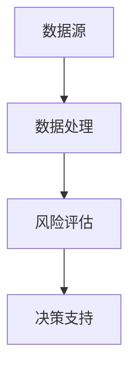
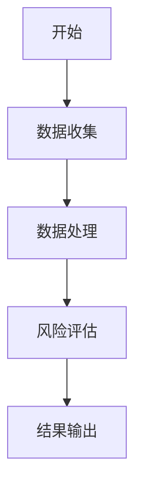

                 

# 巴菲特的风险管理：如何避免永久性资本损失

## 关键词：
- 巴菲特
- 风险管理
- 投资策略
- 永久性资本损失
- 价值投资
- 安全边际
- 长期投资

## 摘要：
本文详细探讨了巴菲特的风险管理策略，特别是如何通过价值投资和安全边际的概念来避免永久性资本损失。文章从巴菲特的投资哲学出发，分析了风险管理的核心原则，包括资产配置、分散投资和内在价值评估。通过数学模型和实际案例，展示了如何将这些理论应用于实际投资中，帮助读者构建稳健的投资组合，实现长期财富增长。

---

## 第一部分：巴菲特投资理念概述

### 第1章：巴菲特投资哲学与风险管理

#### 1.1 巴菲特投资哲学的核心理念

##### 1.1.1 价值投资的定义与核心要素
价值投资是一种以内在价值为导向的投资方法，强调购买价格低于内在价值的资产。核心要素包括：
- **内在价值**：资产在合理市场条件下的公平价格。
- **安全边际**：购买价格与内在价值之间的折扣，用于降低风险。
- **长期视角**：关注企业的长期盈利能力，而非短期市场波动。

##### 1.1.2 巴菲特的价值投资方法论
巴菲特的方法论基于格雷厄姆的价值投资体系，强调：
- **安全边际**：确保购买价格远低于内在价值。
- **企业基本面**：分析企业的财务状况、盈利能力和发展前景。
- **长期持有**：避免频繁交易，降低交易成本和税务负担。

##### 1.1.3 风险管理在巴菲特投资体系中的地位
风险管理是巴菲特投资体系的核心，旨在通过避免永久性资本损失来保护投资本金。他强调：
- **分散投资**：通过投资于多个优质企业降低风险。
- **避免集中风险**：不将所有资金投资于单一资产或行业。
- **长期复利效应**：通过时间的积累，实现财富的稳步增长。

#### 1.2 巴菲特风险管理的核心原则

##### 1.2.1 避免永久性资本损失的重要性
永久性资本损失是指投资本金的永久性减少，通常由于错误的投资决策或市场崩盘导致。巴菲特认为，避免这类损失是风险管理的核心。

##### 1.2.2 安全边际的概念与应用
安全边际是巴菲特价值投资体系的核心概念，指购买价格低于内在价值的部分。通过建立安全边际，投资者可以降低因估值错误或市场波动带来的风险。

##### 1.2.3 长期投资与复利效应
长期投资通过复利效应实现财富的稳步增长。巴菲特强调，复利效应需要时间来发挥作用，因此长期持有优质资产是关键。

---

### 第2章：巴菲特投资组合管理策略

#### 2.1 投资组合的构建原则

##### 2.1.1 资产配置的多元化策略
多元化是降低投资风险的有效方法。巴菲特建议将资金分配到不同资产类别和行业中，避免过度集中。

##### 2.1.2 个股选择的标准与流程
- **行业分析**：选择具备竞争优势和长期增长潜力的行业。
- **财务分析**：评估企业的盈利能力、资产负债表和现金流。
- **管理层评估**：考察管理层的诚信和能力。

##### 2.1.3 长期持有与动态调整的平衡
巴菲特主张长期持有优质资产，但也会根据市场变化和企业基本面进行动态调整。

#### 2.2 风险控制的具体措施

##### 2.2.1 避免过度集中投资的风险
集中投资可能导致重大损失，因此分散投资是必要的。

##### 2.2.2 通过分散投资降低非系统性风险
分散投资可以降低非系统性风险，但并不能完全消除系统性风险。

##### 2.2.3 定期评估与调整投资组合
定期评估投资组合的表现，根据市场变化和个人财务状况进行调整。

---

## 第二部分：风险管理的核心原则

### 第3章：安全边际与内在价值评估

#### 3.1 安全边际的定义与计算

##### 3.1.1 安全边际的数学模型
安全边际 = 购买价格 - 内在价值

##### 3.1.2 安全边际与投资风险的关系
安全边际越大，投资风险越小。

##### 3.1.3 如何在实际投资中应用安全边际
通过分析企业的内在价值，选择具备较大安全边际的投资标的。

#### 3.2 内在价值的评估方法

##### 3.2.1 现金流折现模型（DCF）的应用
DCF模型通过将未来现金流折现，计算企业的内在价值。

##### 3.2.2 市盈率与市净率的比较分析
- 市盈率 = 股价 / 每股收益
- 市净率 = 股价 / 每股净资产

##### 3.2.3 行业与企业特性的综合考量
考虑行业前景、企业竞争优势和财务状况，综合评估内在价值。

---

### 第4章：市场波动与情绪管理

#### 4.1 市场波动对投资决策的影响

##### 4.1.1 市场情绪的周期性变化
市场情绪通常呈现周期性波动，投资者应避免被短期情绪左右。

##### 4.1.2 如何在市场波动中保持理性
- 长期视角：关注企业的长期价值，忽略短期波动。
- 安全边际：通过安全边际降低市场波动的影响。

##### 4.1.3 市场波动中的风险管理策略
- 保持分散投资。
- 定期评估投资组合。

---

## 第三部分：系统架构与风险管理框架

### 第5章：系统化风险管理框架

#### 5.1 风险管理系统的架构设计

##### 5.1.1 系统功能设计
- 数据收集：收集市场数据和企业基本面信息。
- 风险评估：评估投资标的的风险。
- 决策支持：提供风险管理建议。

##### 5.1.2 系统架构图

#### 5.2 风险评估算法

##### 5.2.1 风险评估流程图

##### 5.2.2 风险评估数学模型
$$
\text{风险评分} = \sum_{i=1}^{n} w_i \cdot r_i
$$
其中，\( w_i \) 是风险因素的权重，\( r_i \) 是风险因素的评分。

---

## 第四部分：项目实战与案例分析

### 第6章：实战案例分析

#### 6.1 投资环境与目标设定

##### 6.1.1 投资目标
选择具备长期增长潜力的行业和企业。

##### 6.1.2 投资环境分析
分析宏观经济、行业趋势和市场状况。

#### 6.2 核心代码实现

##### 6.2.1 数据收集与处理
使用Python收集和处理市场数据。

##### 6.2.2 风险评估与分析
使用算法评估投资标的的风险。

#### 6.3 案例分析与经验总结

##### 6.3.1 投资案例分析
以投资 Coca-Cola 为例，分析其长期表现。

##### 6.3.2 经验总结
- 长期持有优质资产。
- 保持安全边际。
- 定期评估和调整投资组合。

---

## 第五部分：总结与行动指南

### 第7章：总结与行动指南

#### 7.1 本文总结
巴菲特的风险管理策略强调长期投资、价值投资和安全边际，旨在避免永久性资本损失。

#### 7.2 投资者的行动指南
1. **学习巴菲特的投资哲学**：理解价值投资的核心理念。
2. **建立风险管理框架**：制定适合自己的风险管理策略。
3. **实践投资策略**：选择优质资产，长期持有，定期评估。

---

## 作者：AI天才研究院 & 禅与计算机程序设计艺术

---

### 附录：相关工具与资源
- **Python代码库**：用于数据处理和风险评估。
- **工具与资源**：推荐的书籍和工具。

---

通过本文的详细分析，读者可以系统地理解巴菲特的风险管理策略，并将其应用于实际投资中，避免永久性资本损失，实现长期财富增长。

