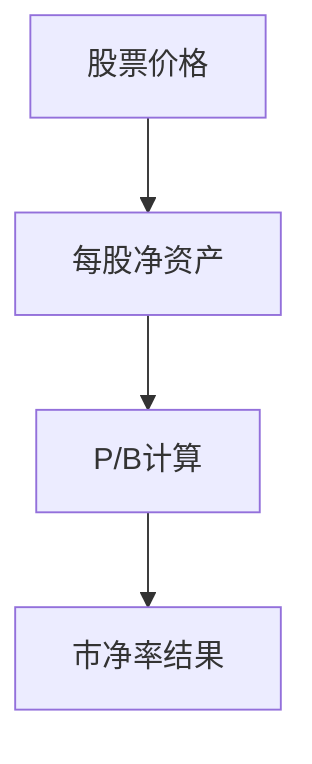
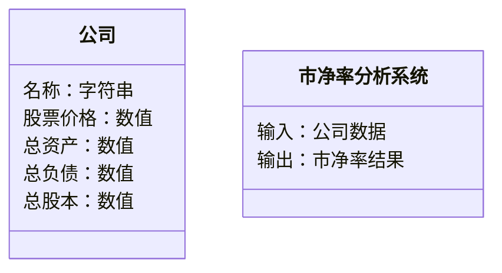
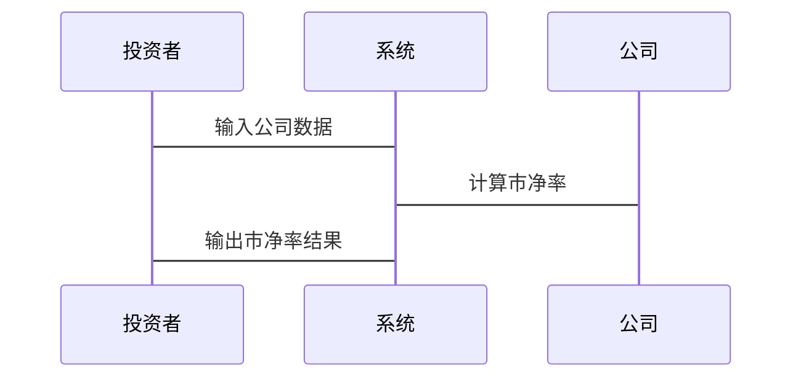

                 


# 市净率（P/B）分析：资产基础估值的应用

## 关键词：
市净率，P/B，资产估值，财务分析，投资决策，股票分析，市盈率，市销率

## 摘要：
市净率（P/B）是评估企业价值的重要指标之一，基于资产基础进行估值。本文系统地分析了市净率的定义、计算方法、核心概念、算法原理、系统架构设计，以及实际项目中的应用。通过详细的案例分析和代码实现，帮助读者掌握市净率在资产估值中的应用，并指导投资决策。

---

# 第1章: 市净率（P/B）的基本概念与背景

## 1.1 市净率的定义与背景

### 1.1.1 什么是市净率（P/B）
市净率（Price-to-Book Ratio，简称P/B）是衡量企业价值的重要指标之一，用于评估股票价格与每股净资产之间的关系。它反映了市场对公司资产的估值，常用于判断股票是否被高估或低估。

市净率的计算公式为：
$$ P/B = \frac{\text{市场价}}{\text{每股净资产}} $$

其中，每股净资产是公司总资产减去总负债后除以总股本得到的值。

### 1.1.2 市净率的计算公式
市净率的计算公式可以拆解为两个部分：
1. **市场价**：股票的当前市场价格。
2. **每股净资产**：公司每股市价对应的净资产价值。

市净率的计算公式为：
$$ P/B = \frac{\text{股票价格}}{\text{每股净资产}} $$

### 1.1.3 市净率在资产估值中的重要性
市净率是基于资产基础的估值指标，特别适用于重资产行业（如银行、房地产等）。它可以帮助投资者评估公司资产的实际价值，判断是否存在资产泡沫。

---

## 1.2 市净率与其他估值指标的对比

### 1.2.1 市盈率（P/E）的定义与特点
市盈率（Price-to-Earnings Ratio，简称P/E）是股票价格与每股收益的比率，反映了市场对公司盈利能力的估值。

$$ P/E = \frac{\text{股票价格}}{\text{每股收益}} $$

市盈率的优点在于能够直接反映公司的盈利能力，但其缺点是容易受到公司利润波动的影响。

### 1.2.2 市净率与市盈率的异同
| 指标 | 定义 | 优点 | 缺点 |
|------|------|------|------|
| P/B | 股票价格与每股净资产的比率 | 能够反映资产的实际价值 | 不适用于轻资产行业 |
| P/E | 股票价格与每股收益的比率 | 反映盈利能力 | 易受利润波动影响 |

### 1.2.3 市净率与市销率（P/S）的对比
市销率（Price-to-Sales Ratio，简称P/S）是股票价格与每股销售收入的比率，适用于收入稳定但利润较低的行业。

| 指标 | 定义 | 适用场景 |
|------|------|----------|
| P/B | 股票价格与每股净资产的比率 | 重资产行业 |
| P/S | 股票价格与每股销售收入的比率 | 轻资产行业 |

---

## 1.3 市净率在不同行业的应用特点

### 1.3.1 银行行业的市净率分析
银行行业的市净率通常较低，因为其资产主要包括贷款和存款，且资产流动性较高。银行的市净率低于1时，通常被认为是低估的信号。

### 1.3.2 制造业的市净率分析
制造业的市净率通常较高，因为其资产主要包括存货和生产设备。制造业的市净率高于行业平均水平时，可能表明公司存在资产泡沫。

### 1.3.3 高科技行业的市净率分析
高科技行业的市净率通常较高，因为其资产主要包括无形资产（如专利、技术）。高科技行业的市净率高于行业平均水平时，可能表明公司具有较高的成长潜力。

---

## 1.4 本章小结
本章介绍了市净率的基本概念、计算公式以及与其他估值指标的对比。市净率是一种基于资产基础的估值指标，特别适用于重资产行业。通过与其他指标的对比，可以帮助投资者更好地理解市净率的适用场景和局限性。

---

# 第2章: 市净率的核心概念与原理

## 2.1 市净率的分子与分母

### 2.1.1 市场价的计算方法
市场价是指股票在二级市场的当前价格。假设某公司股票的价格为$P$，则市场价为$P$。

### 2.1.2 每股净资产的计算方法
每股净资产是公司净资产除以总股本。净资产是总资产减去总负债，计算公式为：
$$ \text{净资产} = \text{总资产} - \text{总负债} $$

每股净资产为：
$$ \text{每股净资产} = \frac{\text{净资产}}{\text{总股本}} $$

### 2.1.3 市净率的计算公式
市净率的计算公式为：
$$ P/B = \frac{\text{股票价格}}{\text{每股净资产}} $$

---

## 2.2 市净率的属性特征对比

### 2.2.1 市净率的正向与反向指标
市净率的正向指标包括市盈率（P/E）和市销率（P/S），反向指标包括市净率的倒数（B/P）。

### 2.2.2 市净率的行业差异性
不同行业的市净率差异较大。例如，银行行业的市净率通常较低，而高科技行业的市净率较高。

### 2.2.3 市净率的时间序列分析
通过时间序列分析，可以观察市净率的变化趋势。例如，市净率的上升可能表明资产泡沫的形成，而市净率的下降可能表明资产价值的低估。

---

## 2.3 市净率的ER实体关系图

```mermaid
er
actor: 投资者
goal: 分析公司资产价值
system: 市净率分析系统
```

---

## 2.4 本章小结
本章详细讲解了市净率的分子与分母的计算方法，并通过对比分析，展示了市净率的属性特征。通过ER实体关系图，可以更好地理解市净率分析的系统架构。

---

# 第3章: 市净率的算法原理与数学模型

## 3.1 市净率的算法原理

### 3.1.1 市净率的计算流程
1. 收集公司财务数据，包括总资产、总负债和总股本。
2. 计算净资产：$\text{净资产} = \text{总资产} - \text{总负债}$。
3. 计算每股净资产：$\text{每股净资产} = \frac{\text{净资产}}{\text{总股本}}$。
4. 获取股票价格：$P$。
5. 计算市净率：$P/B = \frac{P}{\text{每股净资产}}$。

### 3.1.2 市净率的流程图



---

## 3.2 市净率的数学模型与公式

### 3.2.1 市净率的计算公式
市净率的计算公式为：
$$ P/B = \frac{\text{股票价格}}{\text{每股净资产}} $$

其中，每股净资产的计算公式为：
$$ \text{每股净资产} = \frac{\text{净资产}}{\text{总股本}} = \frac{\text{总资产} - \text{总负债}}{\text{总股本}} $$

---

## 3.3 市净率的Python代码实现

### 3.3.1 环境安装
需要安装以下Python库：
- pandas
- numpy
- matplotlib

### 3.3.2 核心代码实现

```python
import pandas as pd
import numpy as np
import matplotlib.pyplot as plt

# 示例数据
data = {
    '公司名称': ['A公司', 'B公司', 'C公司'],
    '股票价格': [50, 60, 70],
    '总资产': [200, 300, 400],
    '总负债': [100, 150, 200],
    '总股本': [10, 15, 20]
}

df = pd.DataFrame(data)

# 计算净资产
df['净资产'] = df['总资产'] - df['总负债']
# 计算每股净资产
df['每股净资产'] = df['净资产'] / df['总股本']
# 计算市净率
df['P/B'] = df['股票价格'] / df['每股净资产']

# 可视化市净率
plt.figure(figsize=(10, 6))
plt.plot(df['公司名称'], df['P/B'], 'ro-')
plt.title('市净率分析')
plt.xlabel('公司名称')
plt.ylabel('P/B')
plt.show()
```

---

## 3.4 本章小结
本章详细讲解了市净率的算法原理和数学模型，并通过Python代码实现了市净率的计算和可视化。通过代码实现，可以更好地理解市净率的计算过程和应用方法。

---

# 第4章: 市净率的系统分析与架构设计

## 4.1 问题场景介绍
假设某投资机构需要对多个公司进行资产估值分析，希望通过市净率指标筛选出低估的股票。

## 4.2 系统功能设计

### 4.2.1 领域模型


### 4.2.2 系统架构
```mermaid
container 容器 {
    组件1
    组件2
    组件3
}
```

### 4.2.3 接口设计
系统接口包括数据输入接口和结果输出接口。

### 4.2.4 交互流程


---

## 4.3 本章小结
本章通过系统架构设计，展示了市净率分析系统的整体框架。通过领域模型和交互流程图，可以更好地理解市净率分析的系统实现过程。

---

# 第5章: 市净率分析的项目实战

## 5.1 项目背景
某投资机构需要对银行行业的公司进行资产估值分析，希望通过市净率指标筛选出低估的股票。

## 5.2 环境安装
需要安装以下工具：
- Python 3.8+
- pandas
- numpy
- matplotlib

## 5.3 核心代码实现

```python
import pandas as pd
import numpy as np
import matplotlib.pyplot as plt

# 示例数据
data = {
    '公司名称': ['A银行', 'B银行', 'C银行'],
    '股票价格': [10, 15, 20],
    '总资产': [500, 600, 700],
    '总负债': [300, 400, 500],
    '总股本': [100, 150, 200]
}

df = pd.DataFrame(data)

# 计算净资产
df['净资产'] = df['总资产'] - df['总负债']
# 计算每股净资产
df['每股净资产'] = df['净资产'] / df['总股本']
# 计算市净率
df['P/B'] = df['股票价格'] / df['每股净资产']

# 可视化市净率
plt.figure(figsize=(10, 6))
plt.plot(df['公司名称'], df['P/B'], 'ro-')
plt.title('银行行业市净率分析')
plt.xlabel('公司名称')
plt.ylabel('P/B')
plt.show()
```

---

## 5.4 实际案例分析与详细解读
以某银行公司为例，假设其股票价格为20元，总资产为700亿元，总负债为500亿元，总股本为200亿元。则：
- 净资产 = 700 - 500 = 200亿元
- 每股净资产 = 200 / 200 = 1元
- 市净率 = 20 / 1 = 20

市净率为20，远高于行业平均水平，可能表明该银行存在资产泡沫。

---

## 5.5 本章小结
本章通过实际案例分析，展示了市净率分析在项目中的具体应用。通过代码实现和案例解读，可以帮助投资者更好地理解市净率的分析方法。

---

# 第6章: 市净率分析的最佳实践与注意事项

## 6.1 小结
市净率是一种重要的资产估值指标，特别适用于重资产行业。通过市净率分析，可以判断股票是否被高估或低估。

## 6.2 注意事项
1. 市净率分析需要结合行业特点，不同行业的市净率标准不同。
2. 市净率分析需要结合其他估值指标（如市盈率、市销率）进行综合判断。
3. 市净率分析需要关注公司的财务健康状况，避免因公司财务造假而误判。

## 6.3 拓展阅读
1. 《投资学原理》
2. 《股票估值指标详解》
3. 《财务报表分析入门》

---

# 作者：AI天才研究院/AI Genius Institute & 禅与计算机程序设计艺术 /Zen And The Art of Computer Programming

