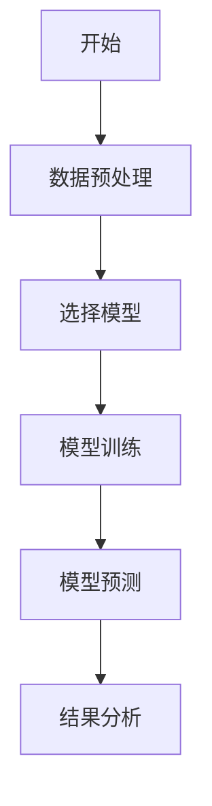
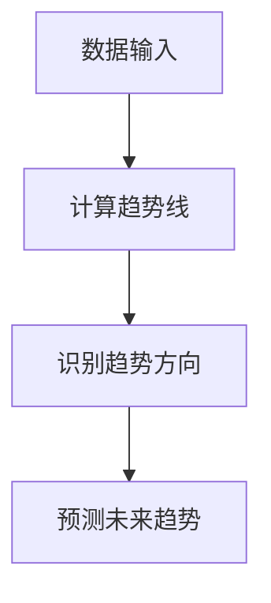
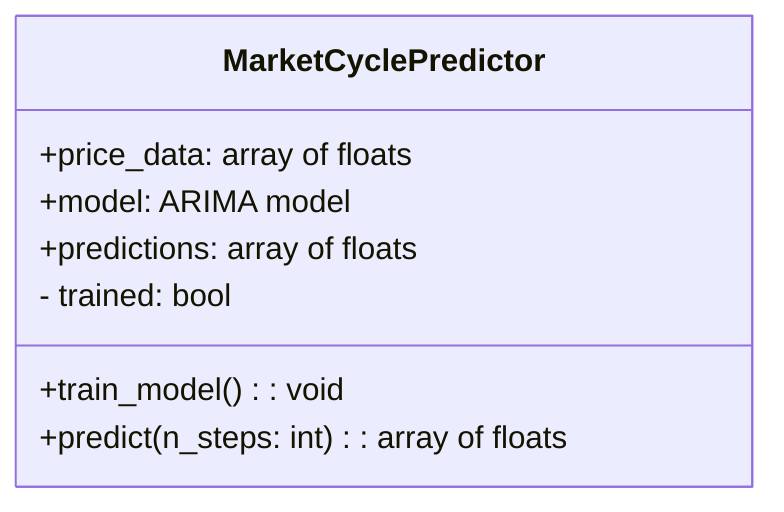
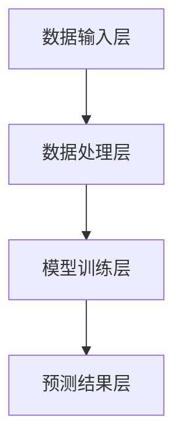
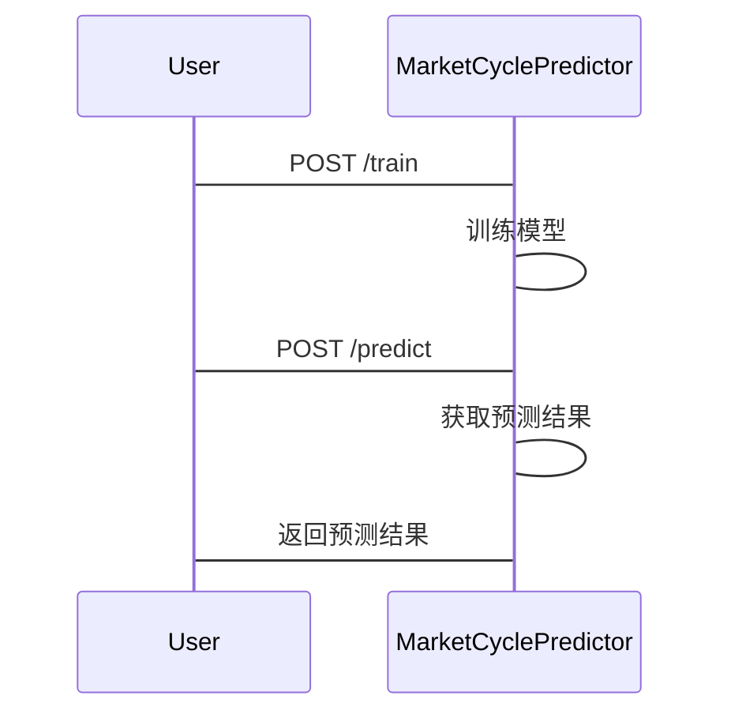

                 


# 市场周期理论：理解牛熊交替的规律

> 关键词：市场周期理论、牛熊交替、技术分析、基本面分析、统计分析

> 摘要：本文深入探讨市场周期理论的核心概念、分析方法和预测模型。通过背景介绍、理论模型对比、算法原理、系统设计和项目实战，帮助读者理解市场周期的规律，掌握分析与预测的方法。

---

## 第一部分：市场周期理论的背景与基础

### 第1章：市场周期的基本概念

#### 1.1 市场周期的定义与特征

市场周期是指市场在经济发展过程中经历的周期性波动，通常包括繁荣、衰退、萧条和复苏四个阶段。每个阶段的特征各异，但整体呈现出周期性交替的规律。

**特征：**
- **周期性**：市场波动呈现明显的周期性。
- **波动性**：市场在周期中的波动幅度不一。
- **复杂性**：受多种因素影响，周期难以预测。

#### 1.2 市场周期的历史演变

市场周期并非新现象，历史上的经济波动为研究提供了丰富案例。从工业革命到现代，市场周期的形态和驱动因素发生了变化。

**演变趋势：**
- 从单一因素驱动到多因素交织。
- 周期长度和波动幅度变化。

#### 1.3 市场周期与经济周期的关系

市场周期与经济周期密切相关，但存在差异。市场周期侧重于价格波动，而经济周期关注整体经济活动的变化。

**关系：**
- 市场周期是经济周期的晴雨表。
- 经济政策影响市场周期的波动。

### 第2章：市场周期的核心理论模型

#### 2.1 道氏理论

**起源与发展：**
- 道氏理论由查尔斯·道提出，强调价格走势反映所有信息。

**主要观点：**
- 市场波动遵循波浪模式，分为上升趋势、下跌趋势和横向整理。
- 价格走势由主要趋势和次要趋势组成。

**优缺点：**
- 优点：提供整体市场走势的框架。
- 缺点：缺乏具体买卖信号。

#### 2.2 江恩理论

**基本原理：**
- 强调价格波动的几何对称性，关注支撑位和阻力位。

**主要工具：**
- 使用圆形和方形图，分析价格波动周期。

**实际应用：**
- 帮助投资者识别关键价格点。

#### 2.3 艾略特波浪理论

**概述：**
- 将市场波动视为波浪形式，分为五浪和三浪结构。

**核心要素：**
- 主浪和调整浪的交替出现。

**应用案例：**
- 用于股票市场的短期和中期趋势预测。

### 第3章：市场周期的驱动因素

#### 3.1 经济基本面因素

**经济增长与市场周期：**
- 经济增长推动市场繁荣，反之则导致衰退。

**利率与市场周期：**
- 利率下降通常伴随市场上涨，反之则引发下跌。

#### 3.2 市场情绪与投资者行为

**市场情绪的波动：**
- 群体心理影响市场周期，投资者情绪从乐观到悲观交替变化。

**投资者行为：**
- 羊群效应加剧市场波动。

#### 3.3 政策与制度因素

**政府政策的影响：**
- 财政政策和货币政策直接影响市场周期。

**制度变化：**
- 制度创新推动市场周期演变。

---

## 第二部分：市场周期的分析与预测

### 第4章：市场周期的分析方法

#### 4.1 技术分析方法

**技术分析工具：**
- 移动平均线、MACD、RSI等指标。

**应用：**
- 识别趋势和转折点，辅助交易决策。

#### 4.2 基本面分析方法

**基本面分析要素：**
- 公司财务状况、行业前景、宏观经济环境。

**应用：**
- 评估企业价值，预测市场走势。

#### 4.3 统计与计量分析方法

**统计分析工具：**
- 时间序列分析、回归分析。

**应用：**
- 模型化市场周期，提供数据支持。

### 第5章：算法原理

#### 5.1 时间序列分析

**流程图：**



**数学模型：**
$$ ARIMA(p, d, q) $$

**Python代码示例：**
```python
from statsmodels.tsa.arima.model import ARIMA
import pandas as pd

data = pd.read_csv('market_data.csv')
model = ARIMA(data['price'], order=(5,1,0))
model_fit = model.fit()
forecast = model_fit.forecast(steps=10)
print(forecast)
```

#### 5.2 趋势分析

**流程图：**



**数学模型：**
$$ T_t = \alpha T_{t-1} + (1-\alpha)P_t $$

**Python代码示例：**
```python
import numpy as np

prices = [100, 105, 110, 115, 120]
alpha = 0.3
trend = []
for i in range(len(prices)):
    if i == 0:
        trend.append(prices[i])
    else:
        trend.append(alpha * trend[i-1] + (1-alpha)*prices[i])
print(trend)
```

### 第6章：数学模型

#### 6.1 移动平均线（MA）

**公式：**
$$ MA_t = \frac{1}{n} \sum_{i=1}^{n} P_{t-i+1} $$

**应用：**
- 识别价格趋势，判断买卖信号。

#### 6.2 指数平滑（ES）

**公式：**
$$ ES_t = \alpha P_t + (1-\alpha)ES_{t-1} $$

**应用：**
- 用于短期趋势预测。

### 第7章：系统分析与架构设计

#### 7.1 问题场景介绍

市场周期预测系统旨在帮助投资者识别市场趋势，做出投资决策。

#### 7.2 功能设计

**领域模型：**



#### 7.3 系统架构设计

**架构图：**



#### 7.4 接口设计

**API接口：**
- `/train`：训练模型。
- `/predict`：获取预测结果。

#### 7.5 交互设计

**序列图：**



### 第8章：项目实战

#### 8.1 环境安装

**所需工具：**
- Python 3.8+
- Jupyter Notebook
- statsmodels库

**安装命令：**
```bash
pip install statsmodels
```

#### 8.2 核心实现

**数据预处理：**
```python
import pandas as pd

data = pd.read_csv('market_data.csv')
data['date'] = pd.to_datetime(data['date'])
data.set_index('date', inplace=True)
```

**模型训练与预测：**
```python
from statsmodels.tsa.arima.model import ARIMA

model = ARIMA(data['price'], order=(5,1,0))
model_fit = model.fit()
forecast = model_fit.forecast(steps=10)
```

#### 8.3 案例分析

**分析结果：**
预测未来10天的价格走势，识别潜在的买卖信号。

#### 8.4 项目小结

通过实战项目，验证了模型的有效性，展示了理论的实际应用价值。

---

## 第三部分：总结与扩展

### 第9章：最佳实践

- **持续学习：** 关注市场动态和新理论。
- **风险管理：** 控制仓位，避免过度杠杆。
- **结合多种方法：** 技术分析与基本面分析结合。

### 第10章：小结

市场周期理论是理解市场波动的关键，通过分析和预测，投资者可以做出更明智的决策。

### 第11章：注意事项

- 市场周期分析具有局限性，需结合实际情况。
- 风险控制是投资的重要部分。

### 第12章：拓展阅读

- 建议阅读《投资学》和《金融时间序列分析》深入学习。

---

作者：AI天才研究院 & 禅与计算机程序设计艺术

---

通过以上结构，文章系统地介绍了市场周期理论的各个方面，结合理论、算法和实际案例，帮助读者全面理解市场周期的规律。

