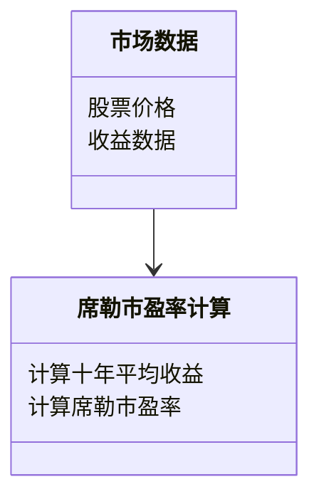
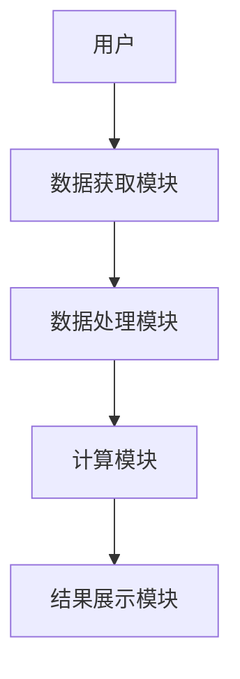
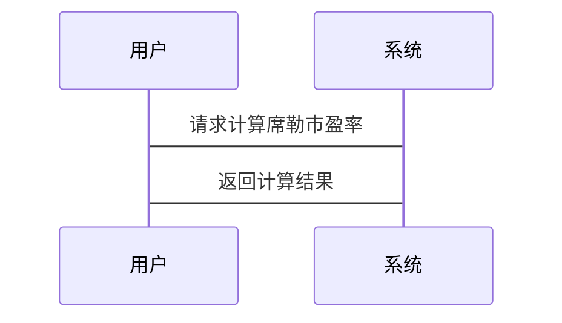

                 


# 席勒市盈率: 从标准化收益角度衡量市场估值

## 关键词:
- 席勒市盈率
- 市场估值
- 标准化收益
- 估值指标
- 市场分析

## 摘要:
席勒市盈率是一种基于十年平均收益的市场估值指标，由诺贝尔经济学奖得主罗伯特·席勒提出。它通过标准化收益的概念，解决了传统市盈率的短期波动问题，为投资者提供了更长期、稳定的市场估值参考。本文将从概念、计算方法、数学模型、系统设计和实际应用等多个方面，详细分析席勒市盈率的原理和应用，帮助读者更好地理解和使用这一重要的市场估值工具。

---

# 第一部分: 席勒市盈率的背景与核心概念

## 第1章: 市盈率的基本概念与传统市盈率的局限性

### 1.1 市盈率的定义与计算方法

#### 1.1.1 市盈率的定义
市盈率（Price-to-Earnings Ratio，简称P/E）是衡量股票估值的重要指标，表示股票价格与每股收益的比率。其公式为：

$$
\text{市盈率} = \frac{\text{股票价格}}{\text{每股收益}}
$$

市盈率反映了市场对每股收益的定价，是投资者评估股票价值的重要工具之一。

#### 1.1.2 市盈率的计算公式
以某公司为例，假设股票价格为$P$，每股收益为$EPS$，则市盈率为：

$$
\text{市盈率} = \frac{P}{EPS}
$$

#### 1.1.3 市盈率的局限性
尽管市盈率是一个常用的估值指标，但它存在一些局限性：
1. **收益波动性**：如果某一年的收益异常高或低，市盈率可能会失真。
2. **短期性**：市盈率只考虑了最近一年的收益，无法反映长期趋势。
3. **行业差异**：不同行业的市盈率标准不同，难以横向比较。

### 1.2 传统市盈率的不足之处

#### 1.2.1 收益波动性对估值的影响
假设某公司的收益在过去几年波动较大，传统市盈率可能无法准确反映其真实估值。

#### 1.2.2 市盈率的短期性问题
传统市盈率仅基于最近一年的收益，可能无法捕捉长期趋势，尤其是在经济周期波动较大的情况下。

#### 1.2.3 市盈率的行业适用性差异
不同行业的收益模式和增长潜力不同，简单的市盈率比较可能不准确。

---

## 第2章: 席勒市盈率的提出背景与核心思想

### 2.1 席勒市盈率的提出背景

#### 2.1.1 罗伯特·席勒与行为金融学
罗伯特·席勒是2013年诺贝尔经济学奖得主，他的研究重点在于金融市场中的行为因素和长期估值问题。

#### 2.1.2 市场估值的长期性问题
席勒指出，短期波动和市场情绪会影响资产价格，而传统市盈率无法反映长期趋势。

#### 2.1.3 市盈率的改进需求
席勒提出，需要一个更稳定的估值指标来减少短期波动的影响。

### 2.2 席勒市盈率的核心思想

#### 2.2.1 使用十年平均收益的逻辑
席勒市盈率采用过去十年的平均收益，以减少短期波动的影响。

#### 2.2.2 标准化收益的概念
标准化收益是指将历史收益进行平滑处理，以反映长期趋势。

#### 2.2.3 席勒市盈率的长期视角
席勒市盈率通过长期收益数据，提供一个更稳定的估值参考。

---

# 第二部分: 席勒市盈率的核心概念与数学模型

## 第3章: 席勒市盈率的定义与计算方法

### 3.1 席勒市盈率的定义

#### 3.1.1 标准化收益的定义
标准化收益是将过去十年的收益进行平均，公式为：

$$
\text{标准化收益} = \frac{1}{10} \sum_{i=1}^{10} \text{收益}_i
$$

#### 3.1.2 席勒市盈率的公式
席勒市盈率的公式为：

$$
\text{席勒市盈率} = \frac{\text{当前股价}}{\text{十年平均收益}}
$$

#### 3.1.3 市盈率与标准化收益的关系
席勒市盈率通过标准化收益，将短期波动的影响降至最低。

### 3.2 席勒市盈率的计算步骤

#### 3.2.1 收益数据的获取与处理
收集过去十年的收益数据，去除异常值。

#### 3.2.2 十年平均收益的计算
计算十年平均收益，并确保数据的平滑性。

#### 3.2.3 席勒市盈率的最终计算
将当前股价除以十年平均收益，得到席勒市盈率。

---

## 第4章: 席勒市盈率与其他估值指标的对比

### 4.1 市盈率与市净率的对比

#### 4.1.1 市盈率与市净率的定义
市净率（P/B）是股票价格与每股净资产的比率。

#### 4.1.2 适用场景的差异
市盈率适用于收益稳定的公司，市净率适用于资产密集型行业。

#### 4.1.3 席勒市盈率的独特性
席勒市盈率结合了长期收益数据，提供了更稳定的估值参考。

### 4.2 席勒市盈率与传统市盈率的对比

#### 4.2.1 计算方法的差异
传统市盈率使用最近一年收益，席勒市盈率使用十年平均收益。

#### 4.2.2 适用场景的差异
传统市盈率适用于短期分析，席勒市盈率适用于长期趋势分析。

#### 4.2.3 优缺点分析
传统市盈率灵活性高，但受短期波动影响；席勒市盈率稳定性好，但计算复杂。

---

# 第三部分: 席勒市盈率的算法原理与数学模型

## 第5章: 席勒市盈率的数学模型

### 5.1 席勒市盈率的公式推导

#### 5.1.1 收益的标准化处理
通过十年平均收益，消除短期波动影响。

#### 5.1.2 市盈率的计算
使用标准化收益计算席勒市盈率，公式如前所述。

---

# 第四部分: 席勒市盈率的系统分析与架构设计

## 第6章: 系统分析与架构设计

### 6.1 项目介绍

#### 6.1.1 项目背景
构建一个基于席勒市盈率的市场估值系统，帮助投资者进行长期估值分析。

### 6.2 系统功能设计

#### 6.2.1 领域模型
使用Mermaid绘制领域模型类图，展示系统的主要组件和交互。



### 6.3 系统架构设计

#### 6.3.1 系统架构图
使用Mermaid绘制系统架构图，展示系统的模块划分和交互流程。



### 6.4 系统接口设计

#### 6.4.1 接口描述
- 数据获取接口：从数据库或API获取历史收益数据。
- 计算接口：调用席勒市盈率计算模块。

### 6.5 系统交互设计

#### 6.5.1 交互流程图
使用Mermaid绘制系统交互流程图，展示用户如何与系统进行交互。



---

# 第五部分: 席勒市盈率的项目实战

## 第7章: 项目实战

### 7.1 环境安装

#### 7.1.1 安装Python
确保安装了Python 3.8或更高版本。

#### 7.1.2 安装依赖库
安装必要的Python库，如pandas、numpy、requests。

### 7.2 核心实现

#### 7.2.1 数据获取
从指定数据源获取过去十年的收益数据。

#### 7.2.2 数据处理
计算十年平均收益，并平滑处理异常值。

#### 7.2.3 计算席勒市盈率
使用当前股价和十年平均收益计算席勒市盈率。

### 7.3 应用案例

#### 7.3.1 苹果公司案例
以苹果公司为例，展示如何计算其席勒市盈率。

### 7.4 代码实现

#### 7.4.1 Python代码

```python
import pandas as pd
import numpy as np

# 数据获取
def get_earnings(ticker):
    # 假设从API获取过去十年的收益数据
    response = requests.get(f'https://api.example.com/earnings/{ticker}')
    data = response.json()
    return pd.DataFrame(data)

# 数据处理
def calculate_shiller_pe(ticker):
    df = get_earnings(ticker)
    if df.empty:
        return None
    # 计算十年平均收益
    average_earnings = df['Earnings'].rolling(10).mean().iloc[-1]
    # 获取当前股价
    current_price = get_current_price(ticker)
    if current_price is None:
        return None
    # 计算席勒市盈率
    shiller_pe = current_price / average_earnings
    return shiller_pe

# 应用示例
ticker = 'AAPL'
pe = calculate_shiller_pe(ticker)
print(f"席勒市盈率：{pe:.2f}")
```

---

# 第六部分: 最佳实践与总结

## 第8章: 最佳实践与总结

### 8.1 关键点总结
- 理解席勒市盈率的核心思想和计算方法。
- 熟练掌握十年平均收益的计算技巧。

### 8.2 注意事项
- 数据来源的准确性影响计算结果。
- 考虑通货膨胀等宏观经济因素的影响。

### 8.3 拓展阅读
- 席勒的著作《非理性繁荣》。
- 其他市场估值指标的学习。

---

# 作者
作者：AI天才研究院 & 禅与计算机程序设计艺术

---

以上是《席勒市盈率: 从标准化收益角度衡量市场估值》的技术博客文章的完整目录大纲和部分具体内容。

