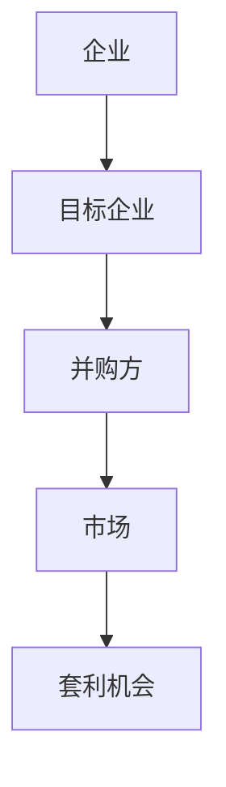
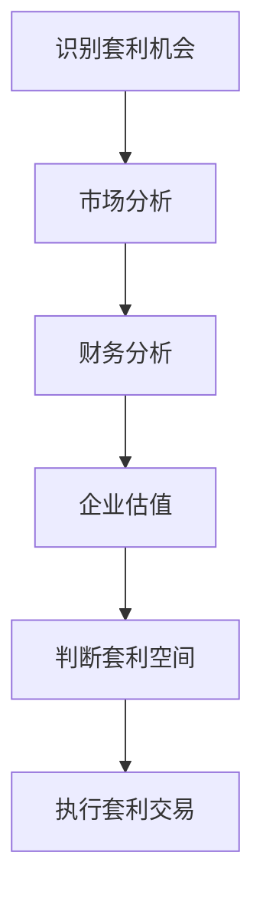

                 


# 并购套利策略：从企业重组中获利

## 关键词：
并购套利、企业重组、财务分析、套利机会、风险管理、市场分析

## 摘要：
并购套利是一种通过企业重组和市场套利相结合的投资策略，旨在从企业合并、收购或重组过程中获取超额收益。本文深入探讨了并购套利的核心概念、数学模型、算法原理、系统架构及实际案例，为投资者提供了从企业重组中获利的详细策略和方法。

---

# 第一部分: 背景介绍

## 第1章: 并购套利的背景与概念

### 1.1 并购套利的定义与背景
- **1.1.1 什么是并购套利**  
  并购套利是指投资者通过识别企业重组中的价值低估或高估机会，利用市场价差进行套利交易，从而在企业合并或收购过程中获得超额收益。这种策略通常依赖于市场效率的不足，即某些企业的真实价值未被市场充分反映。

- **1.1.2 并购套利的起源与发展**  
  并购套利起源于20世纪60年代，随着并购活动的增加，套利者开始关注企业重组中的价格差异。随着金融市场的成熟，套利机会逐渐减少，但通过深入分析企业价值，套利者仍能找到潜在的机会。

- **1.1.3 并购套利的市场环境**  
  并购套利的市场环境包括市场流动性、信息不对称、企业估值差异等因素。在信息不对称的情况下，套利者能够利用市场定价错误，通过套利交易获利。

### 1.2 企业重组与并购的基本概念
- **1.2.1 企业重组的定义与类型**  
  企业重组是指通过调整资本结构、资产出售、合并或分拆等方式，优化企业价值的过程。常见的重组类型包括资产剥离、股权置换、债务重组等。

- **1.2.2 并购的基本流程与分类**  
  并购分为横向并购、纵向并购和混合并购。横向并购是同行业企业之间的并购，旨在扩大市场份额；纵向并购是上下游企业之间的并购，以提高垂直整合效率；混合并购则是跨行业并购。

- **1.2.3 并购与套利的关系**  
  并购是套利的驱动力。在并购过程中，目标企业的价值可能被低估或高估，套利者通过买入低估资产或卖出高估资产，从中获利。

### 1.3 并购套利的市场机会
- **1.3.1 市场套利的机会与挑战**  
  市场套利的机会来源于信息不对称和市场定价错误。然而，套利者需要面对市场波动、交易成本和监管风险等挑战。

- **1.3.2 并购套利的潜在收益**  
  通过识别企业重组中的价值低估，套利者可以在并购交易中获得超额收益。

- **1.3.3 市场套利的边界与外延**  
  套利的边界在于市场效率和信息透明度。随着市场的成熟，套利机会逐渐减少，但通过深入分析企业价值，套利者仍能找到潜在的机会。

## 第2章: 并购套利的核心概念与联系

### 2.1 核心概念原理
- **2.1.1 并购套利的基本原理**  
  并购套利的核心在于识别企业重组中的价值低估或高估，利用市场定价差异进行套利交易。套利者通常关注目标企业的市盈率、市净率等指标，寻找低估或高估的机会。

- **2.1.2 套利机会的识别与评估**  
  套利机会的识别需要通过财务分析、市场分析和企业估值来确定。套利者需要评估目标企业的内在价值，判断市场定价是否偏离实际价值。

- **2.1.3 并购套利的数学模型**  
  通过数学模型评估企业的内在价值，套利者可以识别套利机会。常见的模型包括市盈率模型、市净率模型和现金流折现模型。

### 2.2 核心概念属性特征对比
- **2.2.1 并购套利与传统投资的对比**  
  并购套利与传统投资的主要区别在于，套利者关注短期价差，而传统投资者关注长期价值增长。

- **2.2.2 不同类型套利的特征分析**  
  不同类型的套利策略（如跨市场套利、事件驱动套利）有不同的特征和风险。

- **2.2.3 套利机会的量化指标**  
  套利机会的量化指标包括价差、波动率和交易成本等。套利者需要综合考虑这些指标，判断是否值得进行套利交易。

### 2.3 ER实体关系图架构


---

# 第二部分: 并购套利的算法原理

## 第3章: 并购套利的数学模型与公式

### 3.1 套利机会的数学模型
- **3.1.1 并购套利的数学公式**  
  $$ EV = \frac{E}{V} $$  
  其中，EV是企业价值，E是企业的市场价值，V是企业的实际价值。

- **3.1.2 企业价值评估的公式**  
  $$ EV = \frac{EBIT \times (1 - tax\_rate)}{WACC} $$  
  其中，EBIT是息税前利润，tax\_rate是税率，WACC是加权平均资本成本。

- **3.1.3 套利收益的计算公式**  
  $$ Profit = Price_{target} - Price_{market} $$  
  其中，$Price_{target}$是目标企业的实际价值，$Price_{market}$是市场定价。

### 3.2 套利机会识别的算法流程


---

# 第三部分: 并购套利的系统分析与架构设计

## 第4章: 系统分析与架构设计

### 4.1 问题场景介绍
- **4.1.1 系统目标**  
  设计一个并购套利系统，能够实时监控市场数据，识别套利机会，并指导套利交易。

### 4.2 项目介绍
- **4.2.1 项目目标**  
  开发一个基于并购套利策略的投资系统，帮助投资者识别套利机会，优化投资组合。

### 4.3 系统功能设计
- **4.3.1 领域模型**  
  ```mermaid
  classDiagram
      class 企业 {
          EV
          EBIT
          tax_rate
          WACC
      }
      class 市场 {
          Price_market
      }
      class 套利机会 {
          Price_target
          Profit
      }
      企业 --> 套利机会
      市场 --> 套利机会
  ```

- **4.3.2 系统架构设计**  
  ```mermaid
  graph TD
      A[数据源] --> B[数据处理层]
      B --> C[算法层]
      C --> D[用户界面层]
  ```

### 4.4 系统接口设计
- **4.4.1 数据接口**  
  系统需要从市场数据源获取企业财务数据和市场数据，接口设计需要考虑数据格式和传输效率。

### 4.5 系统交互设计
- **4.5.1 交互流程**  
  ```mermaid
  sequenceDiagram
      User -> 数据源: 获取市场数据
      数据源 -> 数据处理层: 处理数据
      数据处理层 -> 算法层: 运行套利算法
      算法层 -> 用户界面层: 显示套利机会
      User -> 系统: 执行套利交易
  ```

---

# 第四部分: 并购套利的项目实战

## 第5章: 项目实战

### 5.1 环境安装
- **5.1.1 环境要求**  
  需要安装Python、Pandas、NumPy、Matplotlib等库。

### 5.2 系统核心实现源代码
```python
import pandas as pd
import numpy as np

def calculate_ev(ebit, tax_rate, wacc):
    return ebit * (1 - tax_rate) / wacc

def identify_arbitrage_opportunity(ebit, tax_rate, wacc, market_price):
    ev = calculate_ev(ebit, tax_rate, wacc)
    arbitrage = ev - market_price
    return arbitrage

# 示例数据
ebit = 100
tax_rate = 0.2
wacc = 0.1
market_price = 50

arbitrage = identify_arbitrage_opportunity(ebit, tax_rate, wacc, market_price)
print(f"套利机会：{arbitrage}")
```

### 5.3 代码应用解读与分析
- **5.3.1 代码解读**  
  代码首先定义了计算企业价值的函数`calculate_ev`，然后定义了识别套利机会的函数`identify_arbitrage_opportunity`，最后通过示例数据计算套利机会。

### 5.4 实际案例分析
- **5.4.1 案例分析**  
  假设某企业EBIT为100，税率20%，WACC为10%，市场价为50。计算企业价值为100*(1-0.2)/0.1=80，套利机会为80-50=30。

### 5.5 项目小结
- **5.5.1 总结**  
  通过代码实现套利机会的识别，投资者可以快速找到潜在的套利机会，并进行相应的投资决策。

---

# 第五部分: 并购套利的最佳实践

## 第6章: 最佳实践

### 6.1 小结
- **6.1.1 总结**  
  并购套利是一种有效的投资策略，通过识别企业重组中的价值低估，投资者可以在市场定价错误中获利。

### 6.2 注意事项
- **6.2.1 风险提示**  
  套利者需要注意市场波动、交易成本和监管风险，避免过度杠杆化。

### 6.3 拓展阅读
- **6.3.1 推荐书籍**  
  《并购套利实战指南》、《企业估值与并购策略》。

### 6.4 作者信息
- **作者**：AI天才研究院/AI Genius Institute  
- **联系方式**：[联系邮箱](mailto:contact@aising genius.com)  

---

# 结语
并购套利是一种复杂但潜力巨大的投资策略，通过深入分析企业价值和市场定价，套利者可以在企业重组中获利。希望本文能为投资者提供有价值的 insights 和 practical guidance。

--- 

**作者：AI天才研究院/AI Genius Institute**  
**邮箱：contact@aising.com**

