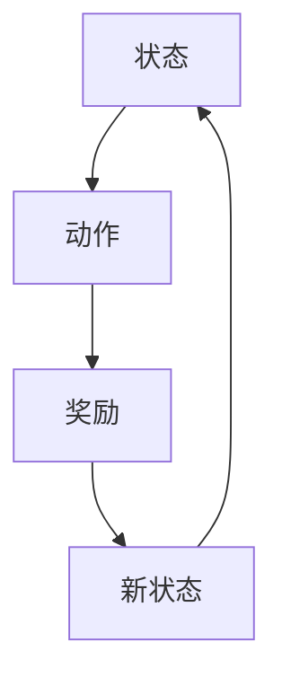
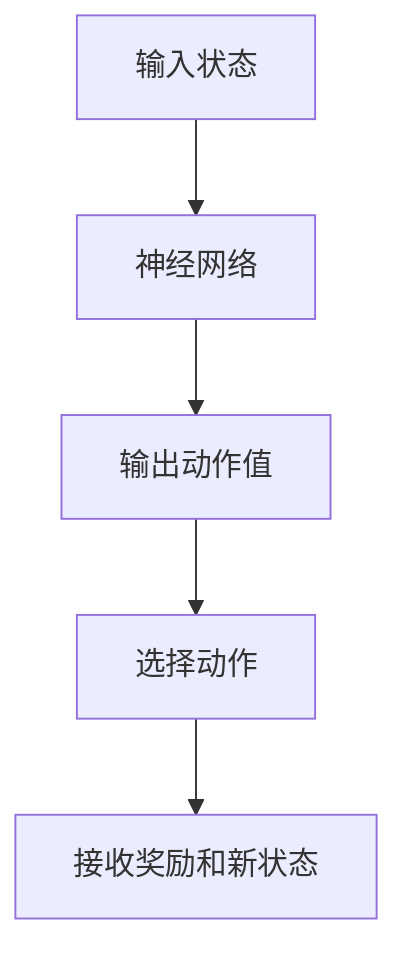
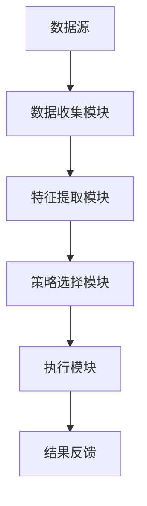
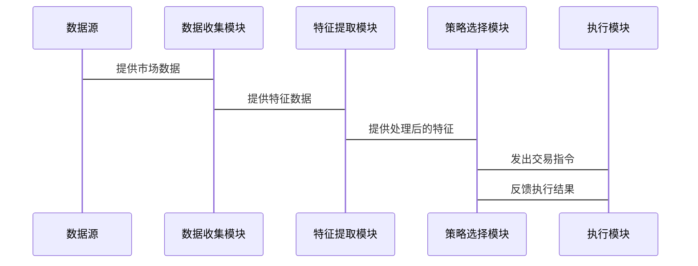

                 


# 强化学习在交易执行优化中的应用

> 关键词：强化学习，交易执行优化，深度强化学习，Q-learning，DQN，马尔可夫决策过程

> 摘要：本文探讨了强化学习在交易执行优化中的应用，分析了强化学习的核心概念、算法原理及其在金融交易中的实际应用。通过详细讲解强化学习的理论基础，结合实际案例，展示了如何利用强化学习优化交易策略，减少市场冲击，提高交易效率。文章还讨论了系统的架构设计、项目的实现细节以及最佳实践，为读者提供全面的视角。

---

# 第一部分: 强化学习与交易执行优化概述

## 第1章: 强化学习与交易执行优化概述

### 1.1 强化学习的基本概念

#### 1.1.1 强化学习的定义与核心概念

强化学习（Reinforcement Learning，RL）是一种机器学习范式，其中智能体通过与环境的交互来学习最优策略。智能体在环境中执行动作，观察结果，并根据收到的奖励信号来调整其行为，以最大化累积奖励。

**关键概念：**
- **状态（State）**：环境在某一时刻的观测。
- **动作（Action）**：智能体在某一状态下选择的行为。
- **奖励（Reward）**：智能体执行动作后获得的反馈，用于评估动作的好坏。
- **策略（Policy）**：智能体选择动作的概率分布，决定如何从当前状态中选择动作。
- **价值函数（Value Function）**：衡量从当前状态开始遵循策略所能获得的期望奖励。

#### 1.1.2 强化学习与监督学习、无监督学习的区别

- **监督学习（Supervised Learning）**：基于标记的训练数据，学习输入到输出的映射。
- **无监督学习（Unsupervised Learning）**：在无标签数据中发现模式和结构。
- **强化学习（Reinforcement Learning）**：通过与环境交互，学习最优策略，具有延迟奖励和不确定性。

#### 1.1.3 强化学习在金融领域的应用前景

金融领域是强化学习的重要应用场景，特别是在交易执行优化、风险管理和资产配置等方面。强化学习能够处理动态市场环境中的复杂决策问题，帮助投资者在不确定性中做出更优决策。

### 1.2 交易执行优化的背景与挑战

#### 1.2.1 交易执行的基本概念

交易执行是指在金融市场中按照一定策略将订单分解并执行的过程，旨在以最优价格和最小的市场冲击完成交易。

#### 1.2.2 交易执行优化的常见问题与挑战

- **市场冲击（Market Impact）**：大额交易可能导致价格波动，增加交易成本。
- **延迟（Execution Delays）**：订单处理时间过长可能错失市场机会。
- **流动性风险**：在低流动性市场中执行大额订单可能面临困难。

#### 1.2.3 强化学习在交易执行优化中的优势

- **适应性**：强化学习能够根据市场变化动态调整策略。
- **复杂决策**：适用于多因素影响的复杂决策问题。
- **高效性**：通过模拟训练快速找到最优策略。

### 1.3 本章小结

本章介绍了强化学习的基本概念及其在金融领域的应用前景，分析了交易执行优化的背景与挑战，并探讨了强化学习在其中的优势。接下来将深入探讨强化学习的核心概念与算法原理。

---

# 第二部分: 强化学习的核心概念与算法原理

## 第2章: 强化学习的核心概念

### 2.1 马尔可夫决策过程（MDP）

#### 2.1.1 状态空间与动作空间的定义

- **状态空间（State Space）**：所有可能的状态集合，每个状态代表环境的一个配置。
- **动作空间（Action Space）**：智能体在每个状态下可以执行的动作集合。

#### 2.1.2 奖励函数与价值函数的解释

- **奖励函数（Reward Function）**：定义智能体在执行某个动作后获得的奖励，通常为标量值。
- **价值函数（Value Function）**：衡量从当前状态开始遵循策略所能获得的期望累积奖励。

#### 2.1.3 策略与价值函数的关系

- **策略（Policy）**：决定智能体如何选择动作的规则。
- **价值函数**：评估策略的质量，帮助选择最优动作。

#### MDP示意图



### 2.2 强化学习的主要算法

#### 2.2.1 Q-learning算法

Q-learning是一种基于价值函数的强化学习算法，通过更新Q表（Q-table）来学习最优策略。

- **Q值更新公式**：

$$ Q(s, a) = Q(s, a) + \alpha (r + \gamma \max Q(s', a') - Q(s, a)) $$

其中：
- \( \alpha \) 是学习率。
- \( \gamma \) 是折扣因子。

#### 2.2.2 深度强化学习算法（如DQN）

深度Q网络（DQN）结合了深度神经网络和Q-learning，能够处理高维状态空间。

- **DQN架构**：



#### 2.2.3 策略梯度方法

策略梯度方法直接优化策略，通过梯度上升最大化累积奖励。

- **策略梯度更新公式**：

$$ \theta = \theta + \alpha \nabla_\theta J(\theta) $$

### 2.3 强化学习算法的优缺点对比

| 算法       | 优点                           | 缺点                           |
|------------|--------------------------------|--------------------------------|
| Q-learning | 简单，易于实现                 | 适用于离散状态和动作空间       |
| DQN        | 处理高维状态空间，鲁棒性高       | 训练不稳定，需要经验回放         |
| 策略梯度    | 直接优化策略，适用于连续动作     | 计算复杂，收敛较慢               |

### 2.4 本章小结

本章详细讲解了强化学习的核心概念，包括马尔可夫决策过程、Q-learning、DQN和策略梯度方法。接下来将通过实际案例，展示强化学习在交易执行优化中的应用。

---

# 第三部分: 强化学习算法的数学模型与公式

## 第3章: Q-learning算法的数学模型

### 3.1 Q-learning的基本原理

Q-learning通过更新Q表，学习状态-动作对的期望奖励。

- **Q值更新公式**：

$$ Q(s, a) = Q(s, a) + \alpha (r + \gamma \max Q(s', a') - Q(s, a)) $$

### 3.2 DQN算法的数学模型

DQN使用深度神经网络近似Q值函数。

- **损失函数**：

$$ \mathcal{L} = \mathbb{E}[ (r + \gamma Q(s', a') - Q(s, a))^2 ] $$

### 3.3 策略梯度方法的数学模型

策略梯度通过梯度上升优化策略。

- **策略梯度更新公式**：

$$ \theta = \theta + \alpha \nabla_\theta J(\theta) $$

### 3.4 本章小结

本章通过数学模型和公式，详细讲解了Q-learning、DQN和策略梯度方法的原理。接下来将结合实际案例，展示这些算法在交易执行优化中的应用。

---

# 第四部分: 强化学习在交易执行优化中的系统分析与架构设计

## 第4章: 系统分析与架构设计方案

### 4.1 问题场景介绍

交易执行优化系统需要实时监控市场数据，根据策略选择最优执行方式。

### 4.2 系统功能设计

- **数据收集模块**：收集市场数据和交易历史。
- **特征提取模块**：提取影响交易执行的关键特征。
- **策略选择模块**：基于强化学习算法选择最优动作。
- **执行模块**：根据策略执行交易。

### 4.3 系统架构设计



### 4.4 系统接口设计

- **输入接口**：接收市场数据和订单信息。
- **输出接口**：输出交易执行指令和结果反馈。

### 4.5 系统交互流程



### 4.6 本章小结

本章通过系统架构设计，展示了强化学习在交易执行优化中的应用。接下来将通过实际案例，详细讲解系统的实现过程。

---

# 第五部分: 强化学习在交易执行优化中的项目实战

## 第5章: 项目实战

### 5.1 环境搭建

- **工具安装**：安装Python、TensorFlow、Keras等。
- **数据准备**：收集历史交易数据和市场数据。

### 5.2 系统核心实现

#### 5.2.1 数据收集模块

```python
class DataCollector:
    def collect_data(self):
        # 收集市场数据
        pass
```

#### 5.2.2 特征提取模块

```python
class FeatureExtractor:
    def extract_features(self, data):
        # 提取特征
        pass
```

#### 5.2.3 策略选择模块

```python
class StrategySelector:
    def select_strategy(self, features):
        # 选择策略
        pass
```

#### 5.2.4 执行模块

```python
class ExecutionModule:
    def execute_trade(self, strategy):
        # 执行交易
        pass
```

### 5.3 实际案例分析

#### 5.3.1 案例背景

假设我们有一个股票交易系统，需要优化订单执行策略，以最小化市场冲击。

#### 5.3.2 系统实现

```python
class TradingAgent:
    def __init__(self):
        self.data_collector = DataCollector()
        self.feature_extractor = FeatureExtractor()
        self.strategy_selector = StrategySelector()
        self.execution_module = ExecutionModule()

    def execute_trade(self, order):
        data = self.data_collector.collect_data()
        features = self.feature_extractor.extract_features(data)
        strategy = self.strategy_selector.select_strategy(features)
        self.execution_module.execute_trade(order, strategy)
```

#### 5.3.3 结果分析

通过训练和测试，评估策略的执行效果，优化参数以提高收益。

### 5.4 本章小结

本章通过实际案例，展示了如何利用强化学习优化交易执行策略。接下来将总结最佳实践和注意事项。

---

# 第六部分: 强化学习在交易执行优化中的最佳实践

## 第6章: 最佳实践

### 6.1 系统设计注意事项

- **数据质量**：确保数据的准确性和完整性。
- **模型调参**：合理调整学习率、折扣因子等参数。
- **风险管理**：建立风险控制机制，避免过度交易。

### 6.2 实际应用中的挑战

- **数据稀疏性**：市场数据可能不足，影响模型训练。
- **模型过拟合**：避免模型在训练数据上过拟合，降低泛化能力。
- **交易成本**：考虑交易费用和滑点对策略的影响。

### 6.3 未来发展方向

- **多目标优化**：同时考虑收益、风险和流动性等多目标。
- **分布式计算**：利用分布式计算加速模型训练。
- **实时交易**：优化实时交易执行的响应速度和准确性。

### 6.4 本章小结

本章总结了强化学习在交易执行优化中的最佳实践和未来发展方向，为读者提供了实用的建议。

---

# 作者信息

作者：AI天才研究院/AI Genius Institute  
联系方式：[email protected]  
个人简介：专注于人工智能与计算机科学的交叉研究，致力于通过技术创新推动金融领域的智能化发展。

---

以上是《强化学习在交易执行优化中的应用》的技术博客文章的完整内容，涵盖了从基础概念到实际应用的各个方面，结合理论与实践，为读者提供了全面的视角。

