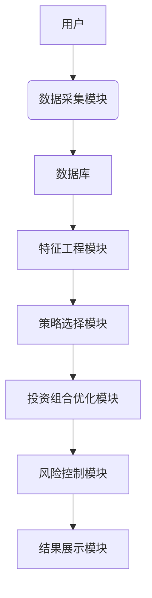
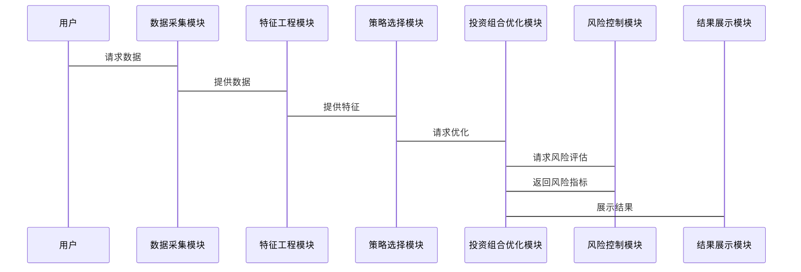
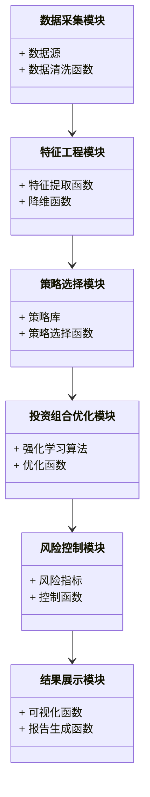

                 


# 第四部分: 投资组合管理系统的系统分析与架构设计

## 第4章: 投资组合管理系统的系统分析与架构设计

### 4.1 系统功能模块划分与设计

#### 4.1.1 数据采集与预处理模块
##### 数据源介绍
- 市场数据：包括股票价格、指数、基金净值等。
- 金融新闻：通过自然语言处理提取情感指标。
- 宏观经济指标：GDP、利率、通货膨胀率等。

##### 数据处理流程
1. 数据清洗：处理缺失值、异常值。
2. 数据转换：标准化、归一化处理。
3. 时间序列处理：处理股票价格等时间序列数据。

#### 4.1.2 特征工程与策略选择模块
##### 特征工程
- 选择与投资组合相关的特征，如波动率、收益、相关性等。
- 使用因子分析或主成分分析（PCA）进行降维。

##### 策略选择
- 基于强化学习的策略：使用DQN、PPO等算法。
- 基于传统金融理论的策略：马科维茨有效前沿、均值-方差优化。

#### 4.1.3 投资组合优化与风险控制模块
##### 投资组合优化
- 使用强化学习算法进行优化。
- 对比传统优化方法（如拉格朗日乘数法）的优劣。

##### 风险控制
- 设置最大回撤、风险价值（VaR）等风险指标。
- 动态调整投资组合以应对市场波动。

### 4.2 系统架构设计

#### 4.2.1 系统架构的mermaid图


#### 4.2.2 系统功能模块的详细设计
- **数据采集模块**：负责从多个数据源获取实时或历史数据。
- **特征工程模块**：对数据进行预处理和特征提取。
- **策略选择模块**：根据不同的市场情况选择合适的策略。
- **投资组合优化模块**：使用强化学习算法优化投资组合。
- **风险控制模块**：监控和控制投资组合的风险。
- **结果展示模块**：以可视化的方式展示投资组合的表现。

### 4.3 系统接口设计与交互流程

#### 4.3.1 系统接口的设计
- 数据接口：与数据源（如API）交互。
- 用户接口：供用户输入参数或查看结果。
- 算法接口：与其他模块交互，如特征工程和风险控制。

#### 4.3.2 系统交互的mermaid序列图


# 第五部分: 强化学习在投资组合管理中的项目实战

## 第5章: 强化学习在投资组合管理中的项目实战

### 5.1 项目环境搭建

#### 5.1.1 安装必要的Python库
```bash
pip install numpy pandas gym matplotlib seaborn scikit-learn keras tensorflow
```

#### 5.1.2 环境配置
- 设置虚拟环境。
- 安装Jupyter Notebook用于开发和调试。

### 5.2 核心代码实现

#### 5.2.1 DQN算法实现

##### DQN类代码
```python
import numpy as np
import tensorflow as tf
from tensorflow.keras import layers

class DQN:
    def __init__(self, state_size, action_size, learning_rate=0.001):
        self.state_size = state_size
        self.action_size = action_size
        self.learning_rate = learning_rate
        self.model = self.build_model()

    def build_model(self):
        model = tf.keras.Sequential()
        model.add(layers.Dense(64, activation='relu', input_dim=self.state_size))
        model.add(layers.Dense(64, activation='relu'))
        model.add(layers.Dense(self.action_size, activation='linear'))
        model.compile(loss='mean_squared_error', optimizer=tf.keras.optimizers.Adam(self.learning_rate))
        return model

    def remember(self, state, action, reward, next_state):
        # 这里需要实现记忆存储，可能需要一个记忆库类
        pass

    def act(self, state):
        state = np.array([state])
        prediction = self.model.predict(state)[0]
        action = np.argmax(prediction)
        return action

    def train(self, batch):
        states = np.array([transition[0] for transition in batch])
        actions = np.array([transition[1] for transition in batch], dtype=int)
        rewards = np.array([transition[2] for transition in batch])
        next_states = np.array([transition[3] for transition in batch])

        targets = self.model.predict(states)
        next_q_values = self.model.predict(next_states)
        targets[range(len(batch)), actions] = rewards + np.max(next_q_values, axis=1)
        self.model.fit(states, targets, epochs=1, verbose=0)
```

#### 5.2.2 环境类代码
```python
import gym
import numpy as np

class InvestmentEnv(gym.Env):
    def __init__(self, data):
        self.data = data
        self.current_step = 0
        self.state_size = len(data[0])
        self.action_space = gym.spaces.Discrete(3)  # 0: 卖出，1: 持有，2: 买入
        self.observation_space = gym.spaces.Box(low=-np.inf, high=np.inf, shape=(self.state_size,))

    def reset(self):
        self.current_step = 0
        return self.data[self.current_step]

    def step(self, action):
        self.current_step += 1
        state = self.data[self.current_step-1]
        next_state = self.data[self.current_step]
        reward = self.calculate_reward(state, action, next_state)
        done = self.current_step >= len(self.data)-1
        return next_state, reward, done, {}

    def calculate_reward(self, state, action, next_state):
        # 根据动作和状态变化计算奖励
        # 这里需要具体实现
        return 0
```

### 5.3 代码实现与解读

#### 5.3.1 DQN算法实现解读
- **初始化**：创建DQN对象，设置状态和动作空间大小，学习率。
- **模型构建**：使用Keras构建DQN的神经网络模型。
- **记忆存储**：将状态、动作、奖励、下一个状态存储起来。
- **选择动作**：根据当前状态预测最优动作。
- **训练模型**：使用经验回放更新神经网络。

#### 5.3.2 环境类实现解读
- **初始化**：加载数据，设置环境参数。
- **重置环境**：开始新的 episodes，初始化当前步骤。
- **执行动作**：根据动作更新环境状态，计算奖励，判断是否结束。
- **计算奖励**：根据动作和状态变化计算奖励值。

### 5.4 项目实战案例分析

#### 5.4.1 数据准备
- 从Yahoo Finance获取股票数据。
- 数据预处理：计算移动平均线、相对强弱指数（RSI）等技术指标。

#### 5.4.2 算法训练与测试
- 使用DQN算法在训练数据上进行训练。
- 在测试数据上进行回测，计算收益和风险指标。

#### 5.4.3 结果分析
- 对比强化学习策略与传统投资策略的收益和风险。
- 绘制投资组合的收益曲线和风险曲线。

### 5.5 项目小结
- 强化学习在投资组合管理中的潜力巨大。
- DQN算法能够有效捕捉市场机会，但需要处理好超参数选择和市场适应性问题。
- 未来可以考虑结合其他算法或引入更多的市场数据特征来提升性能。

# 第六部分: 总结与展望

## 第6章: 强化学习在投资组合管理中的总结与展望

### 6.1 本章总结
- 强化学习为投资组合管理提供了新的思路和方法。
- DQN、PPO等算法在模拟环境中表现优异，但在实际市场中仍需谨慎应用。
- 系统设计和算法优化是未来研究的重要方向。

### 6.2 未来研究方向
- **算法优化**：探索更适合金融市场的强化学习算法。
- **多目标优化**：在收益、风险、流动性等多个目标之间找到平衡点。
- **实时交易系统**：开发能够实时调整投资组合的交易系统。
- **市场适应性**：研究如何使强化学习模型更好地适应市场变化。

### 6.3 注意事项与最佳实践
- **数据质量**：确保数据的准确性和完整性。
- **模型解释性**：避免过于复杂的模型，保持一定的可解释性。
- **风险控制**：设置合理的止损机制，避免重大损失。
- **持续学习**：金融市场变化莫测，模型需要持续优化和更新。

### 6.4 拓展阅读
- 推荐阅读相关书籍和论文，深入理解强化学习与金融的结合。
- 关注学术会议和行业报告，了解最新的研究成果和应用案例。

# 作者

作者：AI天才研究院/AI Genius Institute & 禅与计算机程序设计艺术 /Zen And The Art of Computer Programming

---

### 附录

#### 附录A: 强化学习算法的数学模型与公式

##### DQN算法
- 状态值函数：$Q(s, a) = r + \gamma \max Q(s', a')$
- 损失函数：$\text{损失} = \frac{1}{2}(y - Q(s,a))^2$

##### PPO算法
- 策略更新：$\theta_{t+1} = \theta_t + \epsilon \text{梯度}$
- 增益函数：$J(\theta) = \mathbb{E}[\log \pi(a|s) \cdot A(s,a)]$

#### 附录B: 系统架构图的详细说明

##### 系统架构类图


#### 附录C: 项目代码示例

##### DQN实现代码
```python
import gym
import numpy as np
import tensorflow as tf

class DQN:
    def __init__(self, state_space, action_space, lr=0.001):
        self.state_space = state_space
        self.action_space = action_space
        self.lr = lr
        self.model = self.build_model()

    def build_model(self):
        model = tf.keras.Sequential([
            tf.keras.layers.Dense(64, activation='relu', input_dim=self.state_space),
            tf.keras.layers.Dense(64, activation='relu'),
            tf.keras.layers.Dense(self.action_space, activation='linear')
        ])
        model.compile(optimizer=tf.keras.optimizers.Adam(self.lr), loss='mean_squared_error')
        return model

    def remember(self, state, action, reward, next_state):
        # 这里需要实现记忆存储
        pass

    def act(self, state):
        state = np.array([state])
        prediction = self.model.predict(state)[0]
        return np.argmax(prediction)

    def train(self, batch):
        states = np.array([b[0] for b in batch])
        actions = np.array([b[1] for b in batch], dtype=int)
        rewards = np.array([b[2] for b in batch])
        next_states = np.array([b[3] for b in batch])

        targets = self.model.predict(states)
        next_q_values = self.model.predict(next_states)
        targets[range(len(batch)), actions] = rewards + np.max(next_q_values, axis=1)
        self.model.fit(states, targets, epochs=1, verbose=0)
```

##### 环境实现代码
```python
import gym
import numpy as np

class InvestmentEnv(gym.Env):
    def __init__(self, data):
        self.data = data
        self.current_step = 0
        self.state_size = len(data[0])
        self.action_space = gym.spaces.Discrete(3)
        self.observation_space = gym.spaces.Box(low=-np.inf, high=np.inf, shape=(self.state_size,))

    def reset(self):
        self.current_step = 0
        return self.data[self.current_step]

    def step(self, action):
        self.current_step += 1
        state = self.data[self.current_step-1]
        next_state = self.data[self.current_step]
        reward = self._get_reward(state, action, next_state)
        done = self.current_step >= len(self.data)
        return next_state, reward, done, {}

    def _get_reward(self, state, action, next_state):
        # 根据具体策略计算奖励
        return 0
```

---

### 附录结束

---

通过以上详细的内容，我们系统地探讨了强化学习在投资组合管理中的创新应用，从理论到实践，从算法到系统设计，为读者提供了全面而深入的指导。

