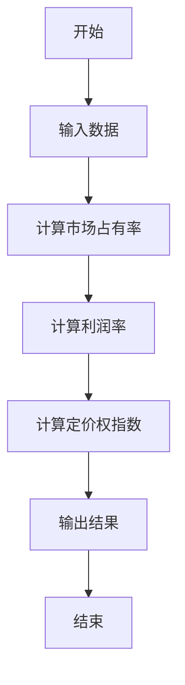
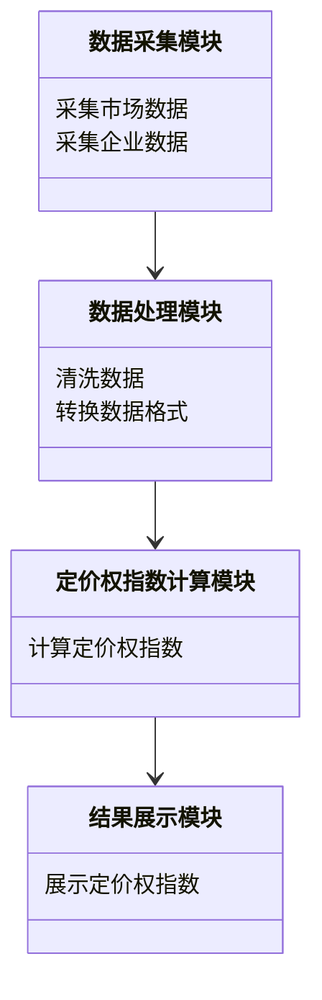

                 


# 彼得林奇如何分析公司的定价权随时间的变化

> 关键词：定价权、彼得林奇、投资策略、市场分析、企业价值

> 摘要：本文将详细探讨彼得·林奇如何分析公司定价权随时间的变化，通过背景介绍、核心概念、算法原理、系统架构设计、项目实战等多维度展开，帮助读者深入理解定价权的动态变化及其对投资决策的影响。

---

# 目录

1. [背景介绍](#背景介绍)
   - [1.1 定价权的基本概念](#11-定价权的基本概念)
   - [1.2 彼得·林奇的定价权分析方法](#12-彼得林奇的定价权分析方法)

2. [核心概念](#核心概念)
   - [2.1 定价权的定义与属性](#21-定价权的定义与属性)
   - [2.2 定价权与企业价值的关系](#22-定价权与企业价值的关系)
   - [2.3 定价权的时间维度分析](#23-定价权的时间维度分析)

3. [算法原理](#算法原理)
   - [3.1 定价权指数计算算法](#31-定价权指数计算算法)
   - [3.2 时间序列分析模型](#32-时间序列分析模型)

4. [系统架构设计](#系统架构设计)
   - [4.1 系统功能设计](#41-系统功能设计)
   - [4.2 系统架构图](#42-系统架构图)
   - [4.3 接口设计与交互流程](#43-接口设计与交互流程)

5. [项目实战](#项目实战)
   - [5.1 实战环境安装](#51-实战环境安装)
   - [5.2 核心代码实现](#52-核心代码实现)
   - [5.3 实战案例分析](#53-实战案例分析)

6. [小结与最佳实践](#小结与最佳实践)
   - [6.1 小结](#61-小结)
   - [6.2 注意事项](#62-注意事项)
   - [6.3 拓展阅读](#63-拓展阅读)

---

## 背景介绍

### 1.1 定价权的基本概念

定价权是企业在市场上对其产品或服务制定价格的能力。它是企业核心竞争力的体现，直接影响企业的利润和市场地位。定价权不仅关乎当前的市场表现，还与企业的长期发展密切相关。

#### 定价权的定义与内涵

定价权是指企业在市场上对其产品或服务制定价格的能力。它不仅仅是一个简单的定价行为，而是企业在市场竞争中对价格的掌控能力。一个拥有强大定价权的企业，能够通过调整价格来影响市场需求，从而实现利润最大化。

#### 定价权在企业中的作用

定价权在企业中扮演着至关重要的角色。它不仅影响企业的利润，还决定了企业在市场中的地位。强大的定价权意味着企业可以在价格波动中保持稳定，甚至引领市场趋势。

#### 定价权与企业价值的关系

定价权是企业价值的重要组成部分。一个拥有强大定价权的企业，通常具有较高的市场地位和盈利能力，从而能够为股东创造更大的价值。

### 1.2 彼得·林奇的定价权分析方法

#### 彼得·林奇的简介

彼得·林奇是美国著名的职业基金经理人，被誉为“成长股投资之父”。他在投资领域有着丰富的经验和独到的见解，尤其擅长分析企业的定价权及其对投资决策的影响。

#### 定价权分析在投资中的应用

彼得·林奇认为，定价权是企业盈利能力的重要指标。他通过分析企业的定价权，判断其在市场中的竞争力和长期发展潜力。

---

## 核心概念

### 2.1 定价权的定义与属性

#### 定价权的定义

定价权是企业在市场上对其产品或服务制定价格的能力，反映了企业在市场中的竞争力和影响力。

#### 定价权的属性

- **市场地位**：企业在市场中的地位直接影响其定价权。
- **品牌影响力**：强大的品牌可以帮助企业获得更大的定价权。
- **成本结构**：企业的成本结构也会影响其定价能力。

#### 定价权与市场地位的关系

市场地位是定价权的重要影响因素。通常，市场占有率高的企业具有更强的定价权。

### 2.2 定价权与企业价值的关系

#### 定价权对企业价值的影响

定价权是企业价值的重要组成部分。强大的定价权意味着企业能够通过调整价格来实现更高的利润，从而提升企业价值。

#### 企业价值的计算公式

企业价值 = 收入 × 定价权指数

### 2.3 定价权的时间维度分析

#### 短期定价权波动

短期定价权波动受到市场供需变化和宏观经济环境的影响。

#### 中期定价权变化

中期定价权变化受到行业竞争格局和企业发展战略的影响。

#### 长期定价权趋势

长期定价权趋势受到企业创新能力和市场环境的长期影响。

---

## 算法原理

### 3.1 定价权指数计算算法

#### 算法流程图



#### 定价权指数计算公式

$$\text{定价权指数} = \frac{\text{市场占有率} \times \text{利润率}}{\text{行业平均利润率}}$$

### 3.2 时间序列分析模型

#### 时间序列分析模型

$$P_t = \alpha P_{t-1} + \beta \epsilon_t$$

---

## 系统架构设计

### 4.1 系统功能设计

#### 系统功能模块

- 数据采集模块
- 数据处理模块
- 定价权指数计算模块
- 结果展示模块

#### 系统功能设计图



---

## 项目实战

### 5.1 实战环境安装

#### 安装Python环境

```bash
python --version
pip install numpy
pip install pandas
pip install matplotlib
```

### 5.2 核心代码实现

#### Python代码实现

```python
import numpy as np
import pandas as pd
import matplotlib.pyplot as plt

# 示例数据
data = {
    '市场占有率': [0.3, 0.4, 0.5, 0.6, 0.7],
    '利润率': [0.2, 0.3, 0.4, 0.5, 0.6],
    '行业平均利润率': [0.1, 0.2, 0.3, 0.4, 0.5]
}

df = pd.DataFrame(data)

# 计算定价权指数
df['定价权指数'] = (df['市场占有率'] * df['利润率']) / df['行业平均利润率']

# 绘制定价权指数变化图
plt.plot(df['定价权指数'], 'b-', marker='o')
plt.title('定价权指数变化图')
plt.xlabel('时间')
plt.ylabel('定价权指数')
plt.show()
```

### 5.3 实战案例分析

#### 案例分析

以某公司为例，分析其定价权指数的变化趋势，判断其定价权的强弱。

---

## 小结与最佳实践

### 6.1 小结

本文详细探讨了彼得·林奇如何分析公司定价权随时间的变化，通过背景介绍、核心概念、算法原理、系统架构设计和项目实战等多维度展开，帮助读者深入理解定价权的动态变化及其对投资决策的影响。

### 6.2 注意事项

- 在分析定价权时，需要综合考虑市场环境、行业竞争和企业自身情况。
- 数据的准确性和及时性是定价权分析的重要前提。

### 6.3 拓展阅读

- 彼得·林奇的著作《彼得·林奇的投资哲学》
- 《定价策略与市场分析》

---

作者：AI天才研究院/AI Genius Institute & 禅与计算机程序设计艺术 /Zen And The Art of Computer Programming

