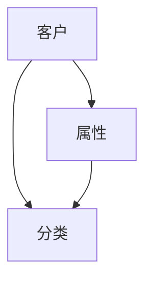
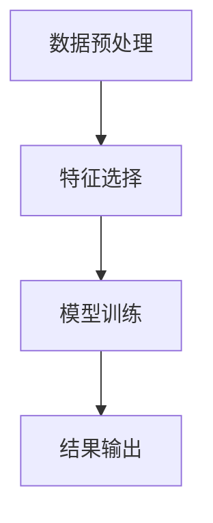
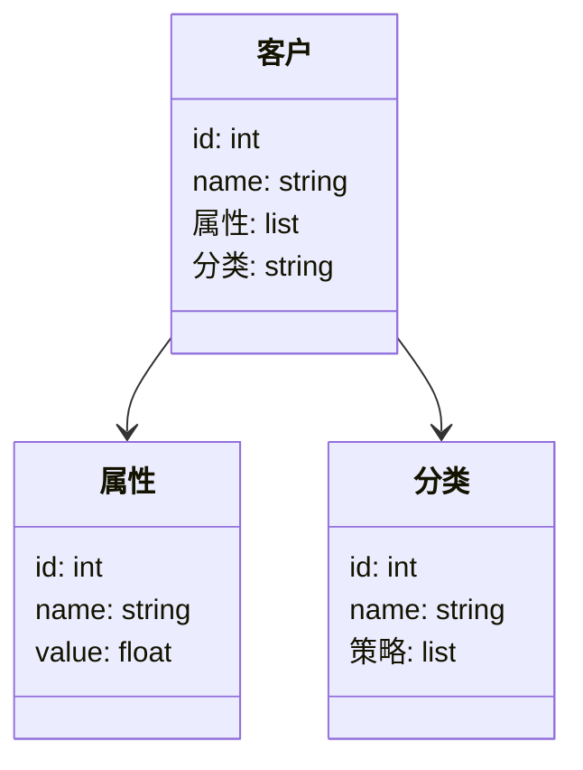

                 


# 彼得林奇如何分析公司的客户分层策略

## 关键词：客户分层，策略分析，彼得林奇，投资分析，客户管理

## 摘要：本文从彼得林奇的视角出发，结合技术方法，详细分析公司客户分层策略的制定与实施。通过背景介绍、核心概念、算法原理、系统架构、项目实战等部分，全面解析客户分层策略的构建过程，帮助读者掌握如何利用分层策略优化客户管理，提升投资效率。

---

## 第一部分：客户分层策略的背景与基础

## 第1章：客户分层策略概述

### 1.1 客户分层策略的基本概念

#### 1.1.1 什么是客户分层
客户分层是指根据客户的行为、特征、价值等维度，将客户划分为不同层次的过程。通过分层，企业可以更精准地制定营销策略、优化资源配置，提升客户满意度和忠诚度。

#### 1.1.2 客户分层的意义与价值
客户分层能够帮助企业：
- **精准营销**：针对不同层次的客户制定个性化的服务策略。
- **资源优化**：将有限资源分配给高价值客户，提高投资回报率。
- **风险控制**：识别高风险客户，降低损失概率。

#### 1.1.3 客户分层与客户管理的关系
客户分层是客户管理的重要组成部分，通过分层可以更有效地进行客户维护、客户开发和客户关系管理。

### 1.2 彼得林奇的客户分层分析方法

#### 1.2.1 彼得林奇的分析风格
彼得·林奇以其独特的投资风格闻名，他注重基本面分析，善于从公司财务数据中发现投资机会。他的客户分层分析方法同样注重数据驱动，强调通过数据分析发现客户的核心特征。

#### 1.2.2 客户分层策略的核心思想
- **数据驱动**：通过数据分析提取客户特征。
- **分层管理**：根据不同层次的客户需求制定策略。
- **动态调整**：根据市场变化和客户需求调整分层策略。

#### 1.2.3 分层策略在投资中的应用
彼得·林奇将客户分层策略应用于投资分析，通过客户分层识别高潜力投资标的，优化投资组合。

### 1.3 本章小结
本章介绍了客户分层的基本概念和彼得·林奇的分析方法，为后续分析奠定了基础。

---

## 第二部分：客户分层策略的核心概念与联系

## 第2章：客户分层策略的核心要素

### 2.1 客户分层的属性特征对比

| 属性维度   | 低价值客户 | 中价值客户 | 高价值客户 |
|------------|------------|------------|------------|
| 购买频率   | 低         | 中         | 高         |
| 贡献度     | 低         | 中         | 高         |
| 潜在价值   | 低         | 中         | 高         |

### 2.2 客户分层的ER实体关系图



### 2.3 本章小结
本章通过属性对比和ER图展示了客户分层的核心要素，为后续分析提供了数据基础。

---

## 第三部分：客户分层策略的算法原理

## 第3章：客户分层的算法原理

### 3.1 客户分层的核心算法

#### 3.1.1 聚类算法
聚类算法常用于客户分层，常用算法包括K-means和层次聚类。

#### 3.1.2 分类算法
分类算法用于已知客户分层后的预测，常用算法包括决策树和逻辑回归。

#### 3.1.3 综合算法的选择
根据数据特征选择合适的算法组合。

### 3.2 分层算法的mermaid流程图



### 3.3 算法的Python实现

#### 3.3.1 数据预处理代码
```python
import pandas as pd
data = pd.read_csv('customer_data.csv')
data.dropna(inplace=True)
```

#### 3.3.2 模型训练代码
```python
from sklearn.cluster import KMeans
model = KMeans(n_clusters=3)
model.fit(data)
```

#### 3.3.3 结果输出代码
```python
clusters = model.labels_
print(clusters)
```

### 3.4 数学模型与公式

#### 3.4.1 K-means算法公式
$$ \text{目标函数} = \sum_{i=1}^{k} \sum_{j=1}^{n_i} (x_{ij} - \mu_i)^2 $$

#### 3.4.2 聚类评估指标
$$ \text{轮廓系数} = \frac{1}{n} \sum_{i=1}^{n} (\text{silhouette}(i)) $$

### 3.5 本章小结
本章详细介绍了客户分层的算法原理，包括聚类算法的选择和实现。

---

## 第四部分：客户分层策略的系统分析与架构设计

## 第4章：系统分析与架构设计

### 4.1 系统分析

#### 4.1.1 问题场景介绍
企业需要根据客户数据进行分层，优化客户服务和营销策略。

### 4.2 系统功能设计

#### 4.2.1 领域模型类图


### 4.3 系统架构设计

#### 4.3.1 系统架构图


### 4.4 本章小结
本章通过系统分析和架构设计，展示了客户分层策略的实现过程。

---

## 第五部分：项目实战

## 第5章：项目实战

### 5.1 环境安装
安装Python和相关库：
```bash
pip install pandas scikit-learn mermaid
```

### 5.2 核心代码实现

#### 5.2.1 数据预处理
```python
import pandas as pd
data = pd.read_csv('customer_data.csv')
data.dropna(inplace=True)
```

#### 5.2.2 模型训练
```python
from sklearn.cluster import KMeans
model = KMeans(n_clusters=3)
model.fit(data)
```

#### 5.2.3 结果输出
```python
clusters = model.labels_
print(clusters)
```

### 5.3 案例分析
以某公司客户数据为例，进行分层分析，识别高价值客户。

### 5.4 项目小结
本章通过实战展示了客户分层策略的实现过程。

---

## 第六部分：总结与最佳实践

## 第6章：总结与最佳实践

### 6.1 小结
本文详细介绍了彼得·林奇的客户分层分析方法，结合技术方法，展示了如何优化客户管理。

### 6.2 注意事项
- 数据质量对分层结果影响重大，需注意数据清洗。
- 分层结果需结合业务实际，动态调整。

### 6.3 拓展阅读
推荐阅读《彼得·林奇的成功投资》和相关技术书籍。

---

## 作者：AI天才研究院/AI Genius Institute & 禅与计算机程序设计艺术 /Zen And The Art of Computer Programming

---

本文通过系统化的分析，结合彼得·林奇的客户分层策略，为读者提供了从理论到实践的全面指导，帮助读者掌握客户分层的实现方法，提升客户管理水平。

