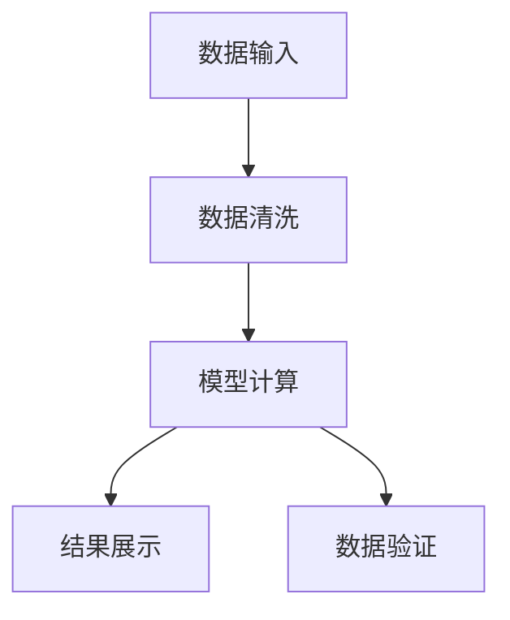
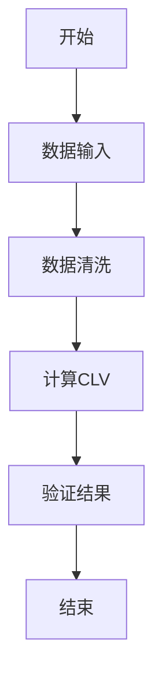

                 


# 彼得林奇如何分析公司的客户终身价值预测模型准确性

> 关键词：客户终身价值（CLV），彼得林奇，预测模型，模型准确性，投资分析

> 摘要：本文深入分析了彼得林奇如何评估客户终身价值（CLV）预测模型的准确性。通过介绍CLV模型的核心概念、算法原理、系统架构以及实际案例分析，详细探讨了彼得林奇的分析方法和策略，帮助读者理解如何在实际投资中应用这些模型。

---

# 第1章: 客户终身价值（CLV）模型概述

## 1.1 客户终身价值（CLV）的定义与重要性

### 1.1.1 客户终身价值的基本概念
客户终身价值（Customer Lifetime Value，CLV）是指一个客户在与企业交互的整个生命周期内为企业带来的净收益。它综合考虑了客户为企业带来的收入、成本以及时间价值等因素，是企业制定客户管理策略的重要依据。

### 1.1.2 CLV在企业价值评估中的重要性
CLV模型能够帮助企业识别高价值客户，优化资源分配，制定有效的客户保留策略。对于投资者来说，CLV模型能够帮助他们评估企业的客户资产价值，进而判断企业的长期盈利能力。

### 1.1.3 彼得林奇对CLV模型的独特见解
彼得林奇认为，CLV模型的准确性直接关系到企业的估值。他强调，模型的假设必须基于可靠的数据和合理的假设，同时需要结合企业的实际运营情况。

---

## 1.2 彼得林奇的投资哲学与分析方法

### 1.2.1 彼得林奇的投资者背景与投资风格
彼得林奇是富达投资集团的传奇经理人，以其对基本面分析的执着而闻名。他强调对企业的深入研究，关注企业的财务状况、管理团队和行业地位。

### 1.2.2 彼得林奇分析模型的核心理念
彼得林奇认为，任何模型的准确性都取决于数据的质量和假设的合理性。他注重模型的可验证性和实际应用场景，反对过度复杂的模型。

### 1.2.3 彼得林奇对CLV模型准确性的关注点
彼得林奇关注CLV模型的输入数据是否准确，模型假设是否合理，以及模型输出的结果是否能够与企业的实际情况相符。

---

## 1.3 CLV模型的优缺点与适用场景

### 1.3.1 CLV模型的主要优势
1. **全面性**：CLV模型综合考虑了客户的价值和生命周期，能够提供更全面的客户价值评估。
2. **战略指导性**：CLV模型帮助企业制定长期客户管理策略，优化资源配置。

### 1.3.2 CLV模型的主要局限性
1. **数据依赖性**：CLV模型的准确性高度依赖于数据的完整性和准确性。
2. **假设敏感性**：CLV模型的假设（如客户流失率、贴现率）对结果影响较大，如果假设不合理，模型结果可能偏离实际。

### 1.3.3 CLV模型的适用场景与边界条件
CLV模型适用于客户关系管理、市场营销、客户保留等领域。然而，模型的准确性依赖于企业的数据质量和对模型假设的合理设定。

---

## 1.4 本章小结

### 1.4.1 CLV模型的核心概念回顾
客户终身价值（CLV）是企业在客户生命周期内从客户处获得的净收益，是企业制定客户管理策略的重要依据。

### 1.4.2 彼得林奇对CLV模型准确性关注点的总结
彼得林奇强调模型的可验证性和实际应用场景，认为模型的假设和数据质量是影响模型准确性的重要因素。

---

# 第2章: CLV模型的核心要素与计算方法

## 2.1 CLV模型的核心要素

### 2.1.1 收入预测
收入预测是CLV模型的核心要素之一，主要包括客户的年收入贡献和客户生命周期长度。

### 2.1.2 成本预测
成本预测包括获取客户和维护客户所产生的成本，如营销费用和客户服务费用。

### 2.1.3 时间价值与贴现率
时间价值是指资金在未来的价值，贴现率用于将未来的现金流折现为当前价值。

### 2.1.4 客户流失率
客户流失率是影响CLV模型的重要因素，高流失率会显著降低客户终身价值。

---

## 2.2 CLV模型的计算公式与数学推导

### 2.2.1 基本CLV公式
$$ CLV = \frac{R - C}{1 + d} $$
其中：
- \( R \) 表示客户的年收入贡献
- \( C \) 表示客户的年成本
- \( d \) 表示贴现率

### 2.2.2 带时间价值的CLV公式
$$ CLV = \frac{R - C}{(1 + d)^n} $$
其中：
- \( n \) 表示客户生命周期长度

---

## 2.3 彼得林奇对模型准确性的关注点

### 2.3.1 数据质量的重要性
彼得林奇认为，CLV模型的准确性高度依赖于数据的完整性和准确性，尤其是收入和成本数据。

### 2.3.2 模型假设的合理性
彼得林奇强调，模型假设必须基于企业的实际情况，避免过于理想化的假设。

### 2.3.3 模型结果的可验证性
彼得林奇要求模型的输出结果能够通过实际数据进行验证，以确保模型的准确性。

---

## 2.4 本章小结

### 2.4.1 CLV模型核心要素总结
CLV模型的核心要素包括收入预测、成本预测、时间价值与贴现率、客户流失率等。

### 2.4.2 彼得林奇对CLV模型准确性关注点总结
彼得林奇关注数据质量、模型假设和模型结果的可验证性，认为这些是影响模型准确性的重要因素。

---

# 第3章: 彼得林奇分析CLV模型准确性的方法论

## 3.1 数据收集与清洗

### 3.1.1 数据来源与收集方法
彼得林奇通常通过企业的财务报表、客户数据库和行业报告等渠道收集数据。

### 3.1.2 数据清洗与预处理
彼得林奇强调数据清洗的重要性，包括处理缺失值、异常值和重复值。

---

## 3.2 模型假设与验证

### 3.2.1 模型假设的合理性
彼得林奇要求模型假设必须基于企业的实际情况，避免过于理想化的假设。

### 3.2.2 模型的验证方法
彼得林奇通常通过历史数据验证模型的准确性，比较模型预测值与实际值的差异。

---

## 3.3 模型优化与调整

### 3.3.1 模型参数的调整
彼得林奇会根据验证结果调整模型参数，以提高模型的准确性。

### 3.3.2 模型的持续优化
彼得林奇强调模型的持续优化，定期更新数据和参数，以适应市场变化。

---

## 3.4 本章小结

### 3.4.1 彼得林奇分析CLV模型准确性的方法总结
彼得林奇通过数据收集与清洗、模型假设验证、模型优化与调整等方法，确保CLV模型的准确性。

### 3.4.2 数据质量与模型假设的重要性
彼得林奇认为，数据质量和模型假设是影响CLV模型准确性的重要因素。

---

# 第4章: 系统架构与算法实现

## 4.1 系统架构设计

### 4.1.1 系统功能模块
1. 数据输入模块
2. 模型计算模块
3. 结果展示模块
4. 数据验证模块

### 4.1.2 系统架构图


---

## 4.2 算法实现

### 4.2.1 算法流程图


### 4.2.2 算法实现代码
```python
def calculate_clv(customers, R, C, d, n):
    clv = (R - C) / (1 + d) ** n
    return clv

# 示例
customers = 1000
R = 100
C = 50
d = 0.05
n = 5

clv = calculate_clv(customers, R, C, d, n)
print(f"客户终身价值：{clv}")
```

---

## 4.3 模型验证与优化

### 4.3.1 模型验证方法
彼得林奇通过比较模型预测值与实际值的差异，评估模型的准确性。

### 4.3.2 模型优化策略
彼得林奇会根据验证结果调整模型参数，优化模型的准确性。

---

## 4.4 本章小结

### 4.4.1 系统架构与算法实现总结
本文设计了一个CLV模型的系统架构，并通过Python代码实现了模型的计算和验证。

### 4.4.2 模型验证与优化的重要性
彼得林奇通过模型验证和优化，确保CLV模型的准确性，为企业提供可靠的客户价值评估。

---

# 第5章: 项目实战与案例分析

## 5.1 项目背景与目标

### 5.1.1 项目背景
本文通过一个虚构的电商企业案例，展示如何应用CLV模型评估客户终身价值。

### 5.1.2 项目目标
通过实际案例分析，验证CLV模型的准确性，并为企业制定客户管理策略提供依据。

---

## 5.2 数据准备与环境安装

### 5.2.1 数据准备
1. 收集客户数据，包括收入、成本、客户生命周期长度等。
2. 数据清洗与预处理。

### 5.2.2 环境安装
1. 安装Python
2. 安装必要的库（如pandas、numpy）

---

## 5.3 核心代码实现

### 5.3.1 数据清洗与预处理
```python
import pandas as pd

# 读取数据
data = pd.read_csv('customer_data.csv')

# 数据清洗
data.dropna(inplace=True)
data.drop_duplicates(inplace=True)
```

### 5.3.2 CLV模型计算
```python
def calculate_clv(customers, R, C, d, n):
    clv = (R - C) / (1 + d) ** n
    return clv

# 示例计算
R = 100
C = 50
d = 0.05
n = 5

clv = calculate_clv(1000, R, C, d, n)
print(f"客户终身价值：{clv}")
```

---

## 5.4 案例分析与结果解读

### 5.4.1 案例分析
通过实际数据计算CLV，验证模型的准确性，并分析影响CLV的主要因素。

### 5.4.2 结果解读
根据计算结果，为企业制定客户管理策略提供依据。

---

## 5.5 本章小结

### 5.5.1 项目实战总结
本文通过一个实际案例展示了CLV模型的应用过程，包括数据准备、模型计算和结果解读。

### 5.5.2 案例分析的启示
彼得林奇通过实际案例分析，验证了CLV模型的准确性，并为企业提供了客户管理的建议。

---

# 第6章: 总结与展望

## 6.1 总结

### 6.1.1 CLV模型的核心概念
客户终身价值（CLV）是企业在客户生命周期内从客户处获得的净收益，是企业制定客户管理策略的重要依据。

### 6.1.2 彼得林奇分析CLV模型准确性的方法
彼得林奇通过数据收集与清洗、模型假设验证、模型优化与调整等方法，确保CLV模型的准确性。

---

## 6.2 未来展望

### 6.2.1 CLV模型的发展趋势
随着大数据和人工智能技术的发展，CLV模型将更加精准和智能化。

### 6.2.2 彼得林奇方法的延伸与扩展
彼得林奇的分析方法可以应用于更多领域的模型准确性评估。

---

## 6.3 最佳实践 tips

### 6.3.1 数据质量的重要性
彼得林奇强调，数据质量是影响CLV模型准确性的重要因素。

### 6.3.2 模型假设的合理性
彼得林奇要求模型假设必须基于企业的实际情况，避免过于理想化的假设。

### 6.3.3 模型的持续优化
彼得林奇强调模型的持续优化，定期更新数据和参数，以适应市场变化。

---

## 6.4 本章小结

### 6.4.1 全文总结
本文深入分析了彼得林奇如何评估客户终身价值（CLV）预测模型的准确性，展示了CLV模型的应用过程和实际案例分析。

### 6.4.2 未来展望
随着技术的发展，CLV模型将更加精准和智能化，彼得林奇的分析方法也将应用于更多领域的模型准确性评估。

---

# 作者信息

作者：AI天才研究院/AI Genius Institute & 禅与计算机程序设计艺术 /Zen And The Art of Computer Programming

---

以上是《彼得林奇如何分析公司的客户终身价值预测模型准确性》的技术博客文章的完整内容。文章从CLV模型的基本概念、算法原理、系统架构、项目实战到总结展望，全面解析了彼得林奇的分析方法和策略，帮助读者理解和应用这些知识。

