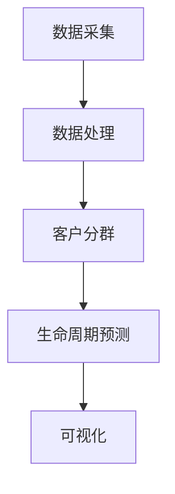
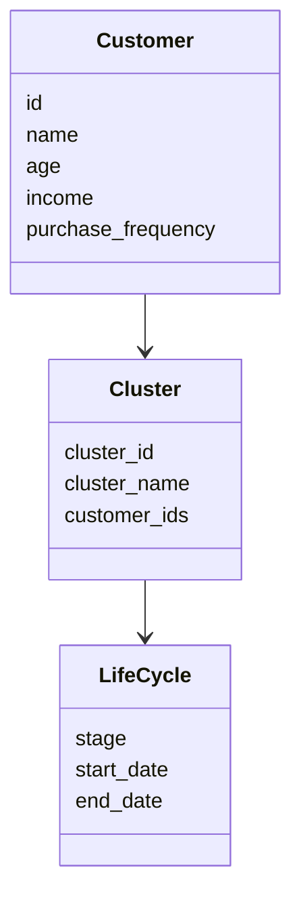
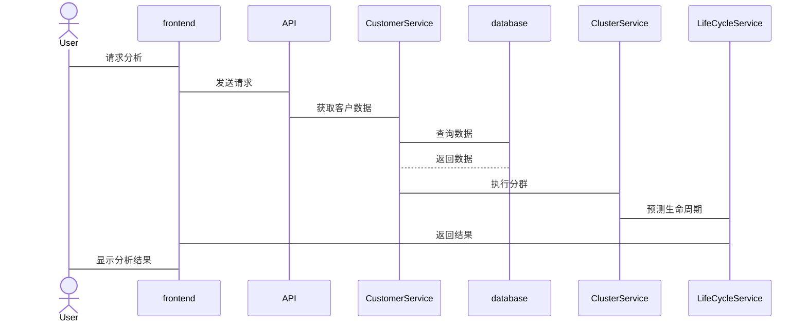

                 


---

# 彼得林奇如何分析公司的客户结构

> 关键词：彼得林奇，客户结构分析，投资策略，企业价值，客户生命周期

> 摘要：本文详细探讨了彼得·林奇如何通过分析公司的客户结构来评估企业价值。通过系统化的分析框架和实际案例，文章揭示了客户结构对企业财务健康和投资决策的关键影响，为投资者提供了深入的洞察和实用的分析工具。

---

## 第一部分：彼得·林奇投资理念与客户结构分析的背景

### 第1章：彼得·林奇投资理念与客户结构分析的背景

#### 1.1 彼得·林奇投资理念的核心要素

##### 1.1.1 彼得·林奇的投资哲学

彼得·林奇是全球最著名的投资经理之一，以其独特的投资哲学闻名。他的核心理念是通过深入分析企业的基本面，尤其是客户结构、财务状况和行业地位，来判断企业的长期价值。他认为，企业的价值不仅仅体现在财务报表上，更取决于其客户基础的健康性和稳定性。

##### 1.1.2 客户结构分析在投资中的重要性

客户结构分析是彼得·林奇投资方法中的重要组成部分。他认为，企业的客户结构直接决定了企业的收入来源和成长潜力。一个健康的客户结构意味着企业能够持续获得稳定的收入，抵御市场波动，从而为投资者带来长期收益。

##### 1.1.3 企业客户结构分析的定义与范围

客户结构分析是对企业客户群体的组成、特征和行为的系统性研究。它包括对客户来源、客户生命周期、客户价值贡献以及客户满意度等方面的分析。通过客户结构分析，投资者可以更好地理解企业的市场地位和未来发展前景。

---

#### 1.2 客户结构分析的背景与演变

##### 1.2.1 投资分析方法的历史演变

投资分析方法经历了从简单的企业财务指标分析到更复杂的客户结构分析的演变。早期的分析主要关注企业的财务数据，如利润表和资产负债表。随着市场竞争的加剧，投资者逐渐意识到客户结构对企业发展的重要性。

##### 1.2.2 彼得·林奇客户结构分析的创新

彼得·林奇在客户结构分析方面做出了重要创新。他提出，客户结构不仅仅是客户数量的问题，更是一个动态的过程，涉及客户生命周期的不同阶段。他强调通过客户结构分析来预测企业的未来表现。

##### 1.2.3 当前客户结构分析的挑战与趋势

随着数字化技术的发展，客户结构分析的复杂性也在增加。现代企业需要应对更多样化的客户需求，同时面对数据量爆炸带来的挑战。未来的客户结构分析将更加依赖大数据技术，以实时捕捉和分析客户行为。

---

#### 1.3 本书的核心目标与框架

##### 1.3.1 本书的核心目标

本书旨在通过彼得·林奇的客户结构分析方法，帮助投资者和企业管理者更好地理解客户结构对企业价值的影响。通过系统化的分析框架和实际案例，读者将能够掌握如何利用客户结构分析来做出更明智的投资决策。

##### 1.3.2 目录结构与学习路径

- **引言**：介绍彼得·林奇的投资理念和客户结构分析的重要性。
- **核心概念与框架**：详细讲解客户结构分析的基本原理和彼得·林奇的核心要素。
- **算法原理与实现**：探讨客户结构分析的算法实现和代码示例。
- **系统分析与设计**：分析客户结构分析的系统架构和接口设计。
- **项目实战**：通过实际案例展示客户结构分析的应用和实现。

##### 1.3.3 学习本书的注意事项

读者需要具备基本的财务分析和编程知识。建议在阅读过程中结合实际案例进行思考，并尝试将分析方法应用到具体的企业中。

---

## 第二部分：客户结构分析的核心概念与框架

### 第2章：客户结构分析的核心概念与框架

#### 2.1 客户结构分析的基本原理

##### 2.1.1 客户结构的定义与组成

客户结构是指企业客户群体的组成和分布情况，包括客户来源、客户规模、客户类型和客户行为等方面。一个健康的客户结构通常具有多样化的客户来源和稳定的客户群体。

##### 2.1.2 客户结构分析的维度与层次

客户结构分析可以从多个维度进行，包括客户生命周期、客户价值、客户满意度和客户行为等。不同维度的分析可以帮助投资者全面了解客户的结构特征。

##### 2.1.3 客户结构分析的边界与外延

客户结构分析的边界包括企业的核心客户群体和潜在客户。外延则涉及客户市场的宏观环境和行业趋势。

---

#### 2.2 彼得·林奇客户结构分析的核心要素

##### 2.2.1 客户群体的分类与特征

彼得·林奇将客户群体分为核心客户、潜力客户和边缘客户。核心客户是企业的主要收入来源，潜力客户具有较高的增长潜力，边缘客户则可能对企业造成负面影响。

##### 2.2.2 客户需求的层次与结构

客户需求可以分为功能性需求和情感需求。功能性需求是客户购买产品的基本动机，而情感需求则影响客户的忠诚度和满意度。

##### 2.2.3 客户生命周期与企业价值的关系

客户生命周期包括获取阶段、成长阶段、成熟阶段和衰退阶段。不同阶段的客户对企业价值的影响不同，企业需要通过客户结构分析来优化客户生命周期管理。

---

#### 2.3 客户结构分析的数学模型与公式

##### 2.3.1 客户价值的量化模型

客户价值可以通过客户生命周期价值（Customer Lifetime Value, CLV）来量化。公式如下：

$$
CLV = \frac{R}{(1 + r)^n}
$$

其中，$R$ 是客户的未来收益，$r$ 是贴现率，$n$ 是客户生命周期的长度。

##### 2.3.2 客户生命周期的数学表达

客户生命周期可以通过以下公式进行预测：

$$
T_{\text{life}} = \frac{C}{\text{客户获取速度}}
$$

其中，$C$ 是客户总数，客户获取速度是企业获取新客户的速度。

##### 2.3.3 客户结构对企业利润的影响公式

客户结构对企业利润的影响可以通过以下公式进行评估：

$$
\text{利润} = \sum (\text{客户价值} \times \text{客户数量}) - \text{成本}
$$

---

## 第三部分：客户结构分析的算法原理与实现

### 第3章：客户结构分析的算法原理与实现

#### 3.1 客户结构分析的算法原理

##### 3.1.1 数据预处理与特征提取

数据预处理包括数据清洗、特征选择和数据标准化。特征提取则是从客户数据中提取关键特征，如客户购买频率、购买金额和客户满意度。

##### 3.1.2 客户分群算法的选择与应用

常用的客户分群算法包括聚类分析（如K-means）和分类分析（如决策树）。聚类分析适用于客户分群，而分类分析适用于客户生命周期预测。

##### 3.1.3 客户生命周期预测的算法原理

客户生命周期预测可以通过逻辑回归、随机森林等机器学习算法实现。算法通过历史数据预测客户的生命周期阶段。

---

#### 3.2 客户结构分析的系统架构设计

##### 3.2.1 系统功能模块划分

- 数据采集模块
- 数据处理模块
- 客户分群模块
- 生命周期预测模块
- 可视化模块

##### 3.2.2 数据流与信息流的架构图



##### 3.2.3 系统接口设计与交互流程

- 数据输入接口：接收客户数据
- 数据处理接口：清洗和标准化数据
- 分群接口：执行客户分群算法
- 预测接口：预测客户生命周期
- 可视化接口：展示分析结果

---

#### 3.3 算法实现与代码示例

##### 3.3.1 数据预处理代码示例

```python
import pandas as pd
import numpy as np

# 数据清洗
data = pd.read_csv('customer_data.csv')
data.dropna(inplace=True)

# 特征选择
selected_features = ['age', 'income', 'purchase_frequency']
data = data[selected_features]
```

##### 3.3.2 客户分群算法实现

```python
from sklearn.cluster import KMeans

# 客户分群
model = KMeans(n_clusters=3, random_state=42)
model.fit(data)
clusters = model.predict(data)
```

##### 3.3.3 客户生命周期预测的代码实现

```python
from sklearn.ensemble import RandomForestClassifier

# 生命周期预测
X = data.drop(columns=['status'])
y = data['status']
model = RandomForestClassifier(n_estimators=100, random_state=42)
model.fit(X, y)
predictions = model.predict(X)
```

---

## 第四部分：客户结构分析的系统分析与设计

### 第4章：客户结构分析的系统分析与设计

#### 4.1 问题场景与项目介绍

##### 4.1.1 问题背景与目标

项目目标是通过客户结构分析，帮助企业优化客户管理，提高客户满意度和忠诚度。

##### 4.1.2 项目范围与约束条件

项目范围包括客户分群和生命周期预测，约束条件包括数据隐私和计算资源限制。

##### 4.1.3 项目利益相关者分析

主要利益相关者包括企业高管、市场营销团队和财务部门。

---

#### 4.2 系统功能设计

##### 4.2.1 领域模型设计（Mermaid类图）



##### 4.2.2 系统架构设计（Mermaid架构图）


##### 4.2.3 系统接口设计与交互流程（Mermaid序列图）



---

#### 4.3 系统实现与测试

##### 4.3.1 系统核心功能实现

- 数据采集与处理
- 客户分群与生命周期预测
- 结果可视化与报告生成

##### 4.3.2 系统测试与验证

- 单元测试：验证各模块功能
- 集成测试：验证系统整体功能
- 用户测试：收集用户反馈

##### 4.3.3 系统性能优化与维护

- 数据存储优化
- 算法性能优化
- 系统维护与更新

---

## 第五部分：客户结构分析的项目实战

### 第5章：客户结构分析的项目实战

#### 5.1 环境安装与数据准备

##### 5.1.1 系统环境要求

- Python 3.8+
- 软件包：pandas、numpy、scikit-learn、matplotlib

##### 5.1.2 数据获取与清洗

```python
import pandas as pd
import numpy as np

# 数据清洗
data = pd.read_csv('customer_data.csv')
data.dropna(inplace=True)
```

##### 5.1.3 数据存储与管理

使用数据库存储客户数据，确保数据安全和高效访问。

---

#### 5.2 系统核心功能实现

##### 5.2.1 客户分群算法实现

```python
from sklearn.cluster import KMeans

# 客户分群
model = KMeans(n_clusters=3, random_state=42)
model.fit(data[['age', 'income']])
clusters = model.predict(data[['age', 'income']])
```

##### 5.2.2 客户生命周期预测

```python
from sklearn.ensemble import RandomForestClassifier

# 生命周期预测
X = data[['age', 'income', 'purchase_frequency']]
y = data['status']
model = RandomForestClassifier(n_estimators=100, random_state=42)
model.fit(X, y)
predictions = model.predict(X)
```

##### 5.2.3 客户价值评估与可视化

```python
import matplotlib.pyplot as plt

# 可视化客户分群结果
plt.scatter(data['age'], data['income'], c=clusters)
plt.xlabel('Age')
plt.ylabel('Income')
plt.title('Customer Clustering')
plt.show()
```

---

#### 5.3 代码应用与案例分析

##### 5.3.1 代码实现与解读

通过上述代码实现客户分群和生命周期预测，帮助企业识别不同类型的客户并优化客户管理策略。

##### 5.3.2 实际案例分析与讲解

以某零售企业为例，分析其客户结构，识别核心客户和潜力客户，制定针对性的营销策略。

---

## 结论

通过彼得·林奇的客户结构分析方法，投资者和企业管理者可以更好地理解客户结构对企业价值的影响。结合系统的分析框架和实际案例，读者能够掌握如何利用客户结构分析做出更明智的投资决策。

---

## 作者

作者：AI天才研究院/AI Genius Institute  
引用：《禅与计算机程序设计艺术》、《计算机程序的构造和解释》  
---

本文为原创文章，转载请注明出处！

