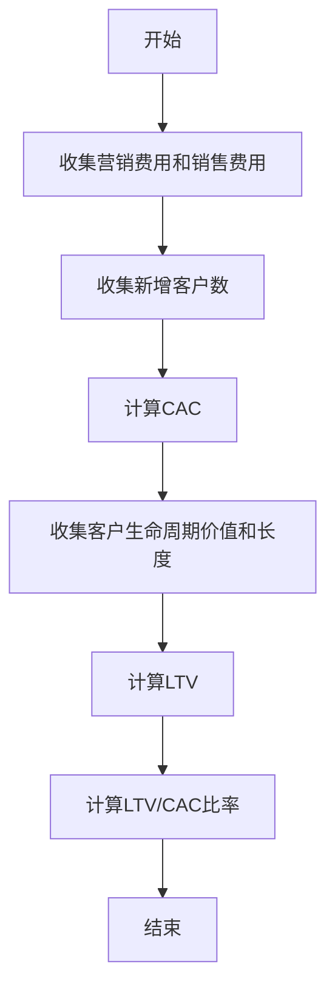

                 


# 彼得林奇如何分析公司的客户获取成本与终身价值比率

> 关键词：彼得林奇，客户获取成本，终身价值比率，投资分析，企业价值评估

> 摘要：本文深入分析了彼得·林奇如何通过客户获取成本（Customer Acquisition Cost，CAC）与终身价值（Lifetime Value，LTV）的比率来评估公司的投资价值。文章从概念背景、数学模型、算法原理、系统架构到实际案例，全面阐述了这一分析方法的核心思想和应用实践。通过详细讲解CAC和LTV的计算公式、ER实体关系图、领域模型类图、系统架构图以及实际案例分析，本文为投资者和企业管理者提供了实用的分析工具和决策参考。

---

## 第一部分: 背景介绍

### 第1章: 客户获取成本与终身价值比率的核心概念

#### 1.1 问题背景

- **客户获取成本（CAC）**：企业在获取新客户的过程中所花费的总成本，包括营销费用、销售费用以及其他直接或间接用于吸引客户的支出。CAC的高低直接影响企业的市场扩展能力和盈利能力。
  
- **终身价值（LTV）**：客户在企业生命周期内为企业带来的总收入减去相关成本后的净现值。LTV反映了客户对企业长期价值的贡献。

- **问题解决**：通过分析CAC和LTV的比率（LTV/CAC），投资者可以评估客户的价值是否能够覆盖获取客户的成本，从而判断企业的投资回报潜力。

#### 1.2 问题描述

- **客户获取成本的构成与影响因素**：CAC的构成包括营销支出、销售团队成本、渠道费用等。影响CAC的因素包括市场竞争状况、目标客户群体的特征、营销策略的有效性等。

- **终身价值的计算与影响因素**：LTV的计算基于客户生命周期价值（Revenue per Customer，RPM）和客户生命周期长度（T）的乘积。影响LTV的因素包括客户留存率、购买频率、客单价等。

- **问题的边界与外延**：CAC和LTV的分析不仅限于单个客户，还需要考虑客户群体的整体表现和市场环境的变化。

#### 1.3 核心概念与联系

- **核心概念原理**：CAC和LTV是企业价值评估的重要指标，CAC反映了获取客户的成本，而LTV反映了客户为企业带来的长期收益。两者的比率（LTV/CAC）是衡量客户价值与获取成本之间平衡的关键指标。

- **对比分析**：通过对比分析CAC和LTV，可以发现客户获取策略的有效性，以及客户生命周期管理的优化空间。

- **ER实体关系图架构**：以下是CAC和LTV的核心实体关系图：

```mermaid
erd
    客户
    产品
    销售渠道
    营销活动
    CAC
    LTV

    客户 --> CAC: 贡献的获取成本
    客户 --> LTV: 贡献的终身价值
```

---

## 第二部分: 核心概念与联系

### 第2章: 客户获取成本与终身价值比率的数学模型

#### 2.1 核心概念原理

- **CAC的数学公式**：
  $$ CAC = \frac{\text{营销费用} + \text{销售费用}}{\text{新增客户数}} $$

- **LTV的数学公式**：
  $$ LTV = \text{客户生命周期价值} \times \text{客户生命周期长度} $$

- **LTV/CAC比率的数学公式**：
  $$ LTV/CAC = \frac{\text{LTV}}{\text{CAC}} $$

#### 2.2 概念属性特征对比表格

| 概念 | 定义 | 影响因素 | 计算公式 |
|------|------|----------|----------|
| CAC  | 客户获取成本 | 营销费用、销售费用、新增客户数 | $$ CAC = \frac{\text{营销费用} + \text{销售费用}}{\text{新增客户数}} $$ |
| LTV  | 终身价值 | 客户生命周期价值、客户生命周期长度 | $$ LTV = \text{客户生命周期价值} \times \text{客户生命周期长度} $$ |
| LTV/CAC | 终身价值与客户获取成本的比率 | LTV、CAC | $$ LTV/CAC = \frac{LTV}{CAC} $$ |

#### 2.3 ER实体关系图架构

```mermaid
erd
    客户
    产品
    销售渠道
    营销活动
    CAC
    LTV

    客户 --> CAC: 贡献的获取成本
    客户 --> LTV: 贡献的终身价值
```

---

## 第三部分: 算法原理讲解

### 第3章: CAC与LTV的算法原理

#### 3.1 算法原理

- **CAC的计算**：
  通过收集企业的营销费用、销售费用和新增客户数，计算出单个客户的获取成本。

- **LTV的计算**：
  通过分析客户的购买频率、客单价和生命周期长度，计算客户为企业带来的长期价值。

- **LTV/CAC比率的计算**：
  将LTV除以CAC，得出客户价值与获取成本的比率，从而判断客户获取策略的经济性。

#### 3.2 算法流程图



#### 3.3 Python代码实现

```python
# 示例代码：计算CAC和LTV

营销费用 = 100000
销售费用 = 50000
新增客户数 = 500
客户生命周期价值 = 1000
客户生命周期长度 = 5

CAC = (营销费用 + 销售费用) / 新增客户数
LTV = 客户生命周期价值 * 客户生命周期长度
LTV_CAC_ratio = LTV / CAC

print(f"CAC = {CAC:.2f}")
print(f"LTV = {LTV:.2f}")
print(f"LTV/CAC 比率 = {LTV_CAC_ratio:.2f}")
```

---

## 第四部分: 系统分析与架构设计

### 第4章: 系统架构设计

#### 4.1 问题场景介绍

- 企业需要通过分析CAC和LTV，优化客户获取策略，提升投资回报率。

#### 4.2 系统功能设计

- **领域模型**：
  ```mermaid
  classDiagram
      class 客户 {
          ID
          购买历史
          生命周期价值
      }
      class 营销活动 {
          活动ID
          营销费用
      }
      class 销售渠道 {
          渠道ID
          销售费用
      }
      class CAC {
          ID
          计算值
      }
      class LTV {
          ID
          计算值
      }
      客户 --> CAC: 贡献CAC
      客户 --> LTV: 贡献LTV
  ```

- **系统架构设计**：
  ```mermaid
  architecture
      前端 --> 后端
      后端 --> 数据库
      数据库 --> CAC模块
      数据库 --> LTV模块
  ```

- **系统接口设计**：
  - API接口：提供CAC和LTV的计算接口。
  - 数据接口：收集客户数据、营销活动数据和销售数据。

- **系统交互流程**：
  ```mermaid
  sequenceDiagram
      客户端 --> API Gateway: 请求CAC计算
      API Gateway --> CAC模块: 计算CAC
      CAC模块 --> 数据库: 获取数据
      CAC模块 --> API Gateway: 返回CAC值
      客户端 --> API Gateway: 请求LTV计算
      API Gateway --> LTV模块: 计算LTV
      LTV模块 --> 数据库: 获取数据
      LTV模块 --> API Gateway: 返回LTV值
  ```

---

## 第五部分: 项目实战

### 第5章: 项目实战

#### 5.1 环境安装

- 安装Python和相关库（如pandas、numpy）。
- 安装Mermaid工具以生成图表。

#### 5.2 核心实现

- **CAC计算**：
  ```python
  营销费用 = 100000
  销售费用 = 50000
  新增客户数 = 500
  CAC = (营销费用 + 销售费用) / 新增客户数
  ```

- **LTV计算**：
  ```python
  客户生命周期价值 = 1000
  客户生命周期长度 = 5
  LTV = 客户生命周期价值 * 客户生命周期长度
  ```

- **比率计算**：
  ```python
  LTV_CAC_ratio = LTV / CAC
  ```

#### 5.3 案例分析

- 假设某公司营销费用为10万元，销售费用为5万元，新增客户数为500人，客户生命周期价值为1000元，客户生命周期长度为5年。计算得出：
  - CAC = 300元/人
  - LTV = 5000元/人
  - LTV/CAC = 5000 / 300 ≈ 16.67

---

## 第六部分: 最佳实践

### 第6章: 最佳实践

#### 6.1 经验总结

- 定期更新CAC和LTV数据，以反映市场变化。
- 结合客户细分策略，优化客户获取成本和提升客户生命周期价值。

#### 6.2 注意事项

- 确保数据的准确性和完整性。
- 合理设置客户生命周期模型的参数。

#### 6.3 拓展阅读

- 彼得·林奇的《投资哲学》
- 客户价值管理相关书籍

---

## 附录

### 附录A: 算法实现代码

```python
营销费用 = 100000
销售费用 = 50000
新增客户数 = 500
客户生命周期价值 = 1000
客户生命周期长度 = 5

CAC = (营销费用 + 销售费用) / 新增客户数
LTV = 客户生命周期价值 * 客户生命周期长度
LTV_CAC_ratio = LTV / CAC

print(f"CAC = {CAC:.2f}")
print(f"LTV = {LTV:.2f}")
print(f"LTV/CAC 比率 = {LTV_CAC_ratio:.2f}")
```

### 附录B: 图表索引

- ER实体关系图
- 领域模型类图
- 系统架构图
- 算法流程图

---

## 作者

作者：AI天才研究院/AI Genius Institute & 禅与计算机程序设计艺术 /Zen And The Art of Computer Programming

---

通过以上结构和内容的详细描述，您可以根据需要进一步补充和完善每个章节的具体内容，确保文章的完整性和专业性。

