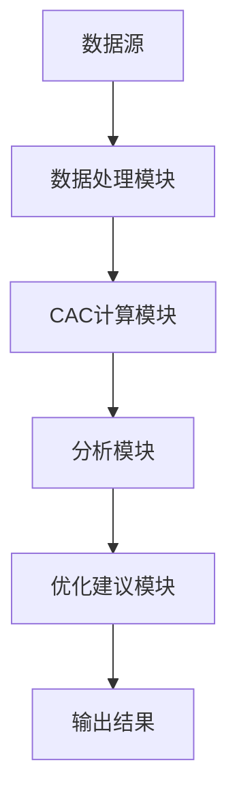
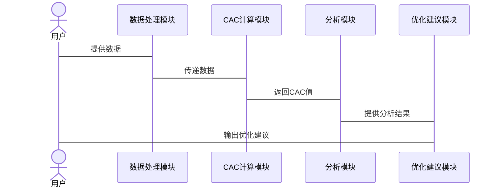

                 


# 彼得林奇如何分析公司的客户获取成本效率变化

## 关键词：彼得·林奇、客户获取成本（CAC）、CAC效率、CAC回收期、CAC利润率、客户生命周期价值（CLTV）

## 摘要：本文深入探讨彼得·林奇分析客户获取成本（CAC）的方法，分析其重要性、计算方法、优化策略，并通过实际案例展示如何通过CAC效率变化优化企业增长策略。

---

## 第1章：CAC的基本概念

### 1.1 CAC的定义与重要性

客户获取成本（Customer Acquisition Cost, CAC）是指企业为了吸引一位新客户所花费的总成本。CAC的计算包括广告支出、销售团队成本、营销活动支出等直接或间接用于客户获取的费用。CAC是衡量企业客户获取效率的重要指标，也是评估企业增长健康性的关键指标之一。

彼得·林奇在其投资分析中，尤为关注CAC的效率变化。他认为，CAC不仅是财务指标，更是企业战略的重要组成部分。一个高效的CAC意味着企业能够以更低的成本获取更多的客户，从而提高整体盈利能力。

### 1.2 CAC的计算方法

CAC的计算公式为：

$$CAC = \frac{\text{广告支出} + \text{销售成本} + \text{其他客户获取费用}}{\text{新增客户数}}$$

这个公式看似简单，但要准确计算CAC，需要详细分析各项费用的构成。例如，广告支出可能包括搜索引擎广告、社交媒体广告、内容营销等；销售成本则包括销售团队的工资、奖金、培训费用等。其他客户获取费用可能包括客户关系管理（CRM）系统的维护费用、市场活动费用等。

### 1.3 彼得·林奇对CAC的独特见解

彼得·林奇认为，CAC的效率变化不仅反映了企业的营销能力，还反映了企业的市场定位和客户价值主张。他提出，CAC的优化需要结合企业的市场策略和客户细分，避免一刀切的优化方法。

---

## 第2章：CAC的行业差异性分析

### 2.1 不同行业的CAC特点

不同行业的CAC差异显著。例如，SaaS（软件即服务）行业的CAC通常较高，因为其客户获取渠道可能依赖于在线广告和销售团队，而电商行业的CAC可能较低，因为其客户获取渠道可能更多依赖于搜索引擎广告和社交媒体营销。

以下是不同行业CAC的对比表格：

| 行业         | CAC特点                           |
|--------------|----------------------------------|
| SaaS         | 高，依赖线上广告和销售团队         |
| 电商         | 中等，依赖搜索引擎和社交媒体广告   |
| 金融科技     | 高，依赖线下渠道和信任建立         |
| 消费品制造   | 低，依赖实体渠道和品牌影响力       |

### 2.2 彼得·林奇如何识别行业中的CAC机会

彼得·林奇通过分析行业的CAC趋势，寻找那些能够持续降低CAC的企业。他认为，一个企业在其行业中能够实现CAC的稳步下降，通常意味着其市场策略和客户获取渠道的有效性在提高。

例如，在SaaS行业，彼得·林奇可能会关注那些能够通过改进产品用户体验和增加客户口碑传播来降低CAC的企业。

### 2.3 CAC在SaaS、电商等领域的具体应用

在SaaS领域，CAC的优化通常与产品生命周期和客户留存率密切相关。彼得·林奇强调，SaaS企业应关注CAC回收期（CAC Payback Period），即企业收回CAC成本所需的时间。一个短的CAC回收期意味着企业能够更快地从客户获取中获得回报。

在电商领域，CAC的优化则更多依赖于广告投放的精准度和客户转化率。彼得·林奇建议，电商企业应通过A/B测试优化广告文案和页面设计，从而降低CAC。

---

## 第3章：CAC的客户细分分析

### 3.1 不同客户群体的CAC差异

客户群体的差异会导致CAC的差异。例如，企业客户和个人客户在CAC上可能有显著差异。企业客户可能需要更长的销售周期和更高的销售成本，而个人客户可能更多依赖于广告投放和社交媒体营销。

以下是不同客户群体CAC差异的对比表格：

| 客户群体     | CAC特点                           |
|--------------|----------------------------------|
| 企业客户     | 高，依赖销售团队和定制化服务       |
| 个人客户     | 中等，依赖广告和在线营销           |
| 高端客户     | 高，依赖定制化服务和高端销售团队   |
| 普通客户     | 低，依赖批量广告投放和简单销售流程 |

### 3.2 高价值客户与低价值客户的CAC对比

高价值客户通常具有更高的客户生命周期价值（CLTV），但其CAC可能也较高。例如，在SaaS行业，高价值客户可能需要更多的定制化服务和销售支持，从而导致较高的CAC。而低价值客户可能更多依赖于自动化营销和批量广告投放，导致较低的CAC。

彼得·林奇强调，企业应关注CAC与CLTV的比率（CAC Margin）。一个健康的CAC Margin意味着企业能够从客户中获得足够的利润。

### 3.3 如何通过CAC分析优化客户获取策略

彼得·林奇建议，企业应根据客户群体的CAC差异，制定差异化的客户获取策略。例如，对于高价值客户，企业应投入更多的资源进行定制化营销；而对于低价值客户，企业应更多依赖自动化营销和批量广告投放。

---

## 第4章：CAC的数学模型与算法原理

### 4.1 CAC的计算公式与数学模型

CAC的计算公式为：

$$CAC = \frac{\sum \text{客户获取费用}}{\text{新增客户数}}$$

其中，$\sum \text{客户获取费用}$包括广告支出、销售成本和其他相关费用。

CAC的动态变化可以用以下公式表示：

$$CAC_{t+1} = CAC_t \times (1 + \text{变化率})$$

其中，$\text{变化率}$取决于企业的市场策略和行业环境。

### 4.2 CAC效率优化的算法原理

彼得·林奇提出的CAC优化算法如下：

1. **数据收集**：收集广告支出、销售成本、新增客户数等数据。
2. **CAC计算**：根据公式计算CAC。
3. **CAC分析**：分析CAC的变化趋势，识别影响CAC的主要因素。
4. **优化策略制定**：根据分析结果，制定CAC优化策略，例如优化广告投放渠道、提高销售团队效率等。
5. **实施优化**：实施优化策略，并持续监控CAC的变化。

该算法可以通过Python代码实现，例如：

```python
# 示例代码：CAC计算与分析
def calculate_cac(advertising_cost, sales_cost, new_customers):
    return (advertising_cost + sales_cost) / new_customers

advertising_cost = 100000  # 广告支出
sales_cost = 50000          # 销售成本
new_customers = 1000        # 新增客户数

cac = calculate_cac(advertising_cost, sales_cost, new_customers)
print(f"CAC: {cac:.2f}")

# 分析CAC变化趋势
cac_changes = [100, 90, 85, 80, 75]
print("CAC变化趋势:", cac_changes)
```

### 4.3 通过机器学习预测CAC变化趋势

机器学习可以用于预测CAC的变化趋势。例如，使用线性回归模型预测CAC的未来变化。

```python
# 示例代码：机器学习预测CAC变化趋势
import pandas as pd
from sklearn.linear_model import LinearRegression

data = pd.DataFrame({
    '广告支出': [100000, 90000, 80000, 70000],
    '销售成本': [50000, 45000, 40000, 35000],
    'CAC': [100, 90, 85, 80]
})

model = LinearRegression()
model.fit(data[['广告支出', '销售成本']], data['CAC'])

# 预测CAC
new_advertising_cost = 80000
new_sales_cost = 40000
predicted_cac = model.predict([[new_advertising_cost, new_sales_cost]])
print(f"预测CAC: {predicted_cac[0]:.2f}")
```

---

## 第5章：系统架构与CAC分析框架

### 5.1 CAC分析的系统功能设计

CAC分析系统需要具备以下功能：

1. **数据采集**：收集广告支出、销售成本、新增客户数等数据。
2. **CAC计算**：根据公式计算CAC。
3. **CAC分析**：分析CAC的变化趋势，识别影响CAC的主要因素。
4. **优化建议**：根据分析结果，提供优化策略建议。

### 5.2 系统架构设计

以下是CAC分析系统的架构图：



### 5.3 系统接口与交互设计

系统接口设计：

1. **输入接口**：广告支出、销售成本、新增客户数。
2. **输出接口**：CAC值、CAC变化趋势、优化建议。

系统交互设计：



---

## 第6章：项目实战：彼得·林奇视角下的CAC分析

### 6.1 实战背景与目标

假设我们是一家SaaS公司，希望通过优化CAC提高客户获取效率。我们计划通过分析过去一年的广告支出、销售成本和新增客户数，计算当前的CAC，并根据分析结果制定优化策略。

### 6.2 数据收集与处理

收集过去一年的广告支出、销售成本和新增客户数数据，如下表所示：

| 月份   | 广告支出 | 销售成本 | 新增客户数 | CAC |
|--------|----------|----------|------------|-----|
| 1月    | 100000   | 50000    | 1000       | 150 |
| 2月    | 90000    | 45000    | 900        | 135 |
| 3月    | 80000    | 40000    | 800        | 120 |
| 4月    | 70000    | 35000    | 700        | 105 |
| 5月    | 60000    | 30000    | 600        | 90  |

### 6.3 CAC的计算与分析

根据数据，我们可以看到CAC呈下降趋势，说明我们的客户获取效率在提高。然而，我们需要进一步分析影响CAC的主要因素，例如广告支出和销售成本的变化。

### 6.4 CAC优化策略的制定与实施

根据分析结果，我们制定了以下优化策略：

1. **优化广告投放渠道**：减少低效广告渠道的支出，增加高效广告渠道的投入。
2. **提高销售团队效率**：通过培训和激励措施，提高销售团队的客户转化率。
3. **优化客户细分策略**：针对高价值客户制定定制化营销策略，降低高价值客户的CAC。

### 6.5 实战总结与经验分享

通过本次实战，我们成功降低了CAC，并提高了客户获取效率。这为我们未来的企业增长提供了重要启示：CAC的优化需要结合企业的实际情况，制定差异化的策略。

---

## 第7章：最佳实践与注意事项

### 7.1 CAC分析的关键点

1. **数据准确性**：确保数据的准确性和完整性。
2. **策略差异性**：根据不同行业和客户群体制定差异化的CAC优化策略。
3. **持续监控**：持续监控CAC的变化趋势，及时调整优化策略。

### 7.2 注意事项与常见误区

1. **避免短期优化**：避免仅关注短期CAC优化，忽视长期客户价值。
2. **数据驱动决策**：避免主观臆断，以数据驱动决策。
3. **团队协作**：CAC优化需要销售、市场、数据分析等多部门协作。

### 7.3 如何持续优化CAC效率

1. **定期分析**：定期进行CAC分析，监控变化趋势。
2. **优化渠道**：持续优化广告投放渠道和销售策略。
3. **客户细分**：根据客户细分制定差异化的CAC优化策略。

---

## 第8章：总结与展望

### 8.1 本文总结

本文深入探讨了彼得·林奇分析客户获取成本（CAC）的方法，分析了其重要性、计算方法、优化策略，并通过实际案例展示了如何通过CAC效率变化优化企业增长策略。

### 8.2 CAC分析的未来发展趋势

随着人工智能和大数据技术的发展，CAC分析将更加智能化和个性化。未来的CAC分析将更多依赖于机器学习和人工智能技术，实现精准的CAC预测和优化。

### 8.3 对企业增长的启示

CAC分析不仅是财务指标，更是企业战略的重要组成部分。企业应关注CAC的变化趋势，制定差异化的CAC优化策略，从而实现持续增长。

---

## 作者：AI天才研究院/AI Genius Institute & 禅与计算机程序设计艺术 /Zen And The Art of Computer Programming

---

以上是《彼得林奇如何分析公司的客户获取成本效率变化》的技术博客文章的完整目录和内容概要。如果需要进一步扩展某个部分的内容，可以继续深入撰写。

