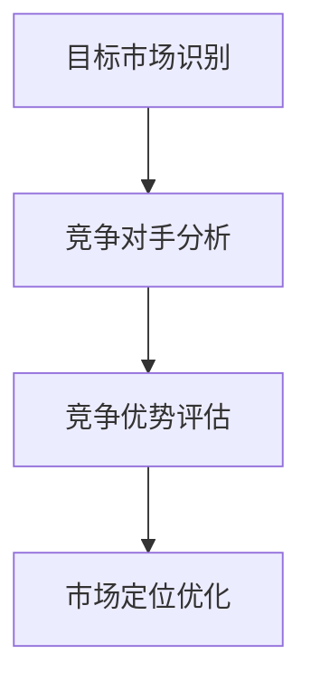
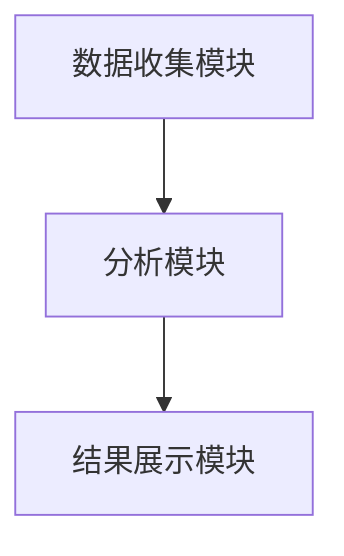

                 


# 彼得林奇如何分析公司的市场定位策略

**关键词**：彼得·林奇、市场定位策略、投资分析、竞争优势、市场定位框架

**摘要**：本文深入分析了彼得·林奇的市场定位策略，探讨其如何通过市场定位评估公司价值。文章从背景、核心概念、分析框架、数学模型、系统架构到实战案例，全面解析市场定位策略的重要性及其在投资决策中的应用。

---

# 第一部分：市场定位策略的背景与核心概念

## 第1章：市场定位策略的背景与核心概念

### 1.1 彼得·林奇与投资分析概述

彼得·林奇是投资界备受尊敬的大师，以其独特的选股策略闻名。他的市场定位分析是投资决策中的重要环节，帮助投资者识别公司的市场定位及其潜在价值。

#### 1.1.1 彼得·林奇及其投资理念

彼得·林奇强调基本面分析，注重公司市场定位、竞争优势和财务状况。他认为，成功的投资源于对公司的深入了解，包括其市场定位和行业地位。

#### 1.1.2 市场定位策略的定义与背景

市场定位策略是公司确定其产品或服务在目标市场中的位置。明确的市场定位有助于公司制定有效的营销策略，吸引目标客户，建立竞争优势。

#### 1.1.3 市场定位策略在投资分析中的作用

市场定位策略帮助投资者评估公司是否在目标市场中占据有利位置。通过分析市场定位，投资者可以判断公司的盈利潜力和成长空间。

#### 1.1.4 市场定位与竞争优势的关系

市场定位直接影响公司的竞争优势。准确的市场定位使公司能够针对特定客户群体，提供独特的价值主张，从而在竞争中脱颖而出。

---

### 1.2 市场定位策略的核心要素

市场定位策略的核心在于明确公司的目标市场、产品特点和竞争优势。

#### 1.2.1 产品定位的核心要素

产品定位涉及产品功能、价格、品牌形象等方面，旨在满足目标客户的需求。

#### 1.2.2 市场定位与竞争优势的关系

竞争优势是市场定位成功的关键。通过独特的价值主张，公司可以在竞争中占据优势地位。

#### 1.2.3 市场定位的边界与外延

市场定位的边界在于明确的目标市场和客户群体。外延则涉及市场调研、竞争对手分析等。

---

## 第2章：市场定位策略的分类与对比

市场定位策略的分类和对比有助于投资者选择适合的策略。

### 2.1 市场定位策略的分类

市场定位策略可分为成本领先、差异化和聚焦三种主要类型。

#### 2.1.1 成本领先策略

成本领先策略通过降低生产成本，提供价格优势，吸引价格敏感的客户。

#### 2.1.2 差异化策略

差异化策略通过提供独特的产品或服务，满足特定客户群体的需求，建立品牌忠诚度。

#### 2.1.3 聚焦策略

聚焦策略集中于特定市场或客户群体，通过深度挖掘客户需求，提供定制化产品或服务。

### 2.2 各种定位策略的优缺点对比

每种市场定位策略都有其优缺点，投资者需根据公司实际情况选择合适的策略。

| 定位策略 | 优点 | 缺点 |
|----------|------|------|
| 成本领先 | 低成本优势 | 难以差异化 |
| 差异化   | 高客户忠诚度 | 成本较高 |
| 聚焦     | 高客户满意度 | 市场覆盖有限 |

---

# 第二部分：彼得·林奇的市场定位分析框架

## 第2章：彼得·林奇的市场定位分析方法

### 2.1 彼得·林奇的市场定位分析框架

彼得·林奇的市场定位分析框架包括目标市场识别、竞争对手分析和竞争优势评估。

#### 2.1.1 分析框架的核心步骤

1. **目标市场识别**：确定公司的目标市场和客户群体。
2. **竞争对手分析**：评估竞争对手的市场定位和竞争优势。
3. **竞争优势评估**：分析公司在目标市场的竞争优势和劣势。

#### 2.1.2 分析框架的流程图



### 2.2 数学模型与公式

彼得·林奇的市场定位分析框架中，市场定位评分是关键指标。

#### 2.2.1 市场定位评分公式

$$ \text{市场定位评分} = \frac{(\text{目标市场契合度} + \text{竞争优势})}{2} $$

其中：
- 目标市场契合度：公司产品与目标市场的需求匹配程度。
- 竞争优势：公司在目标市场的竞争优势评分。

#### 2.2.2 市场定位评分的应用

通过市场定位评分，投资者可以评估公司的市场定位优劣，从而做出投资决策。

---

## 第3章：系统架构与技术实现

### 3.1 系统架构设计

#### 3.1.1 系统功能设计

系统功能包括数据收集、分析模块和结果展示。

#### 3.1.2 系统架构设计



### 3.2 核心实现源代码

#### 3.2.1 数据收集与预处理

```python
import pandas as pd

# 数据收集
data = pd.read_csv('market.csv')

# 数据预处理
data.dropna(inplace=True)
data = data[['公司', '市场定位评分', '竞争优势']]
```

#### 3.2.2 市场定位评分计算

```python
def calculate_market_position(company_data):
    return (company_data['目标市场契合度'] + company_data['竞争优势']) / 2

market_position = company_data.apply(calculate_market_position, axis=1)
```

---

## 第4章：项目实战与案例分析

### 4.1 实战环境安装

#### 4.1.1 工具安装

安装Python和必要的库：

```bash
pip install pandas matplotlib
```

### 4.2 数据收集与分析

#### 4.2.1 数据收集

从公开数据源获取公司市场定位数据。

#### 4.2.2 数据分析

计算市场定位评分并生成可视化图表。

```python
import matplotlib.pyplot as plt

market_position.plot(kind='bar')
plt.title('市场定位评分')
plt.show()
```

---

## 第5章：总结与展望

### 5.1 总结

本文详细探讨了彼得·林奇的市场定位分析策略，从背景、框架到系统实现，全面解析了市场定位策略在投资分析中的重要性。

### 5.2 展望

未来，随着数据分析技术的发展，市场定位分析将更加精准和高效。投资者需不断学习和适应新的分析方法和技术。

---

**作者：AI天才研究院/AI Genius Institute & 禅与计算机程序设计艺术 /Zen And The Art of Computer Programming**

