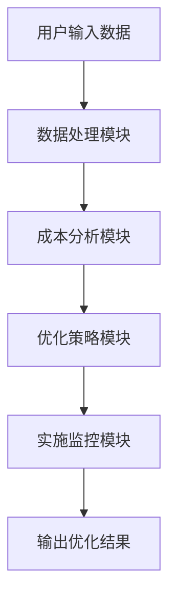
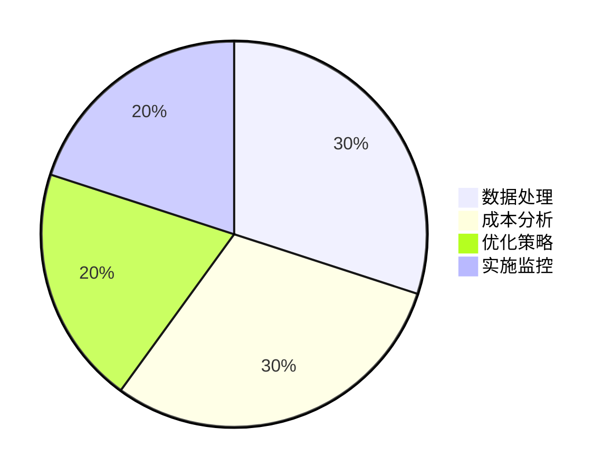
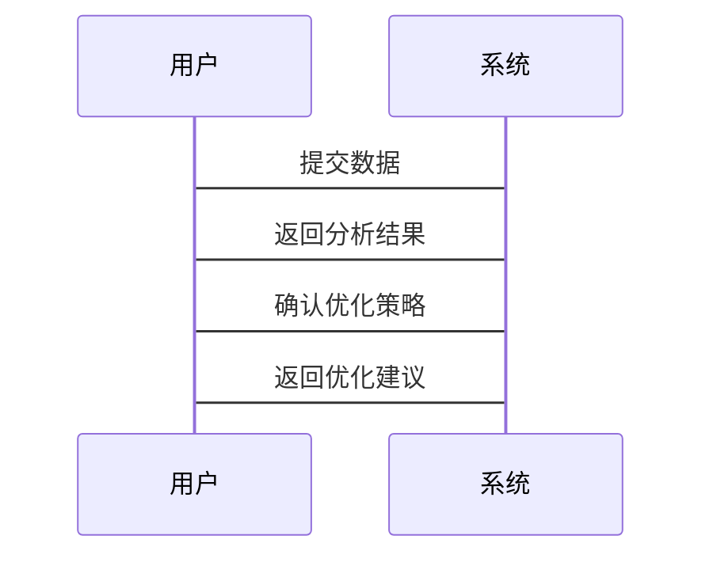

                 


# 彼得林奇如何分析公司的成本结构优化对盈利能力的影响

> 关键词：彼得·林奇，成本结构优化，盈利能力，投资分析，系统架构设计

> 摘要：本文深入探讨了彼得·林奇的成本结构优化方法及其对盈利能力的影响。通过系统分析和算法讲解，结合具体案例，展示了如何优化成本结构以提升企业盈利能力。

---

## 第一章：背景介绍

### 1.1 彼得·林奇的投资理念

彼得·林奇是美国著名投资家，以其在富达投资公司的长期成功而闻名。他的投资理念强调深入分析公司的基本面，尤其是成本结构和盈利能力。他认为，成本结构是决定公司长期盈利能力的关键因素。

#### 1.1.1 投资策略
林奇的投资策略以价值投资为核心，注重分析公司的财务状况、行业地位和管理层能力。他强调，一个公司的成本结构决定了其在市场中的竞争力和盈利能力。

#### 1.1.2 分析方法
林奇通过分析公司的财务报表，尤其是成本构成，来评估公司的运营效率和盈利能力。他认为，优化成本结构是提升企业竞争力的重要手段。

#### 1.1.3 投资哲学
林奇的投资哲学强调长期投资和深入研究。他认为，投资者应该关注公司的长期发展趋势，而非短期市场波动。

### 1.2 成本结构优化的背景

#### 1.2.1 成本结构的定义
成本结构是指企业在生产和运营过程中所发生的各项成本的构成及其比例。优化成本结构意味着在不影响产品或服务质量的前提下，降低不必要的成本，提高效率。

#### 1.2.2 优化的必要性
随着市场竞争的加剧，企业需要不断优化成本结构以保持盈利能力。通过优化成本结构，企业可以降低成本，提高利润率，增强市场竞争力。

#### 1.2.3 与盈利能力的关系
成本结构优化直接影响企业的盈利能力。通过降低固定成本和变动成本，企业可以提高边际利润，从而增强整体盈利能力。

### 1.3 本章小结
本章介绍了彼得·林奇的投资理念及其对成本结构优化的重视，分析了成本结构优化的背景及其对盈利能力的影响。

---

## 第二章：成本结构优化的核心概念

### 2.1 成本结构的定义与分类

#### 2.1.1 成本结构的定义
成本结构是指企业在生产和运营过程中所发生的各项成本的构成及其比例。优化成本结构意味着在不影响产品或服务质量的前提下，降低不必要的成本，提高效率。

#### 2.1.2 成本结构的分类
成本结构可以分为固定成本和变动成本。固定成本包括租金、工资等，而变动成本则与生产量相关，如原材料和销售费用。

#### 2.1.3 成本结构优化的边界与外延
成本结构优化的边界在于不影响产品或服务质量的前提下。外延则包括供应链优化、生产流程改进和采购策略调整。

### 2.2 成本结构与盈利能力的关系

#### 2.2.1 成本结构对盈利能力的影响
成本结构直接影响企业的利润。高成本结构可能导致低利润率，而优化的成本结构则有助于提高利润率。

#### 2.2.2 成本结构优化对盈利能力的提升
通过优化成本结构，企业可以降低单位产品成本，提高边际利润，从而增强整体盈利能力。

#### 2.2.3 成本结构优化的数学模型
我们可以使用线性回归模型来分析成本结构与盈利能力之间的关系。设利润为因变量，成本为自变量，建立回归模型：

$$ 利润 = \beta_0 + \beta_1 \times 成本 + \epsilon $$

其中，$\beta_0$ 是截距，$\beta_1$ 是成本的回归系数，$\epsilon$ 是误差项。

### 2.3 成本结构优化的核心要素

#### 2.3.1 成本构成要素
成本结构主要包括固定成本和变动成本。固定成本如租金、工资，变动成本如原材料和销售费用。

#### 2.3.2 成本优化的关键点
优化关键点包括降低固定成本、减少浪费、提高生产效率和优化采购策略。

#### 2.3.3 成本结构优化的步骤
优化步骤包括识别成本构成、分析成本动因、制定优化策略和实施优化措施。

### 2.4 本章小结
本章详细介绍了成本结构优化的核心概念，包括定义、分类、与盈利能力的关系以及优化的关键要素和步骤。

---

## 第三章：成本结构优化算法原理

### 3.1 成本结构优化算法概述

#### 3.1.1 算法的基本原理
成本结构优化算法通过分析各项成本，识别浪费和低效环节，制定优化策略，从而降低总成本。

#### 3.1.2 算法的核心步骤
1. 数据收集与分析
2. 成本动因识别
3. 优化策略制定
4. 实施与监控

#### 3.1.3 算法的适用场景
适用于制造、零售和服务业等行业的成本优化。

### 3.2 成本结构优化算法的数学模型

#### 3.2.1 数学模型的定义
使用线性规划模型来优化成本结构：

$$ \text{最小化} \sum_{i=1}^{n} c_i x_i $$
$$ \text{满足} \sum_{i=1}^{n} a_i x_i \leq b $$

其中，$c_i$ 是单位成本，$x_i$ 是产量，$a_i$ 是资源消耗系数，$b$ 是资源总量。

#### 3.2.2 数学模型的公式推导
通过线性规划求解上述模型，找到最优解以最小化总成本。

#### 3.2.3 数学模型的应用实例
假设某公司生产两种产品，A和B，分别消耗3和2个单位的资源，成本分别为5和4。目标是最小化总成本，满足总资源不超过12个单位。

建立模型：
$$ \text{最小化} \ 5x_A + 4x_B $$
$$ 3x_A + 2x_B \leq 12 $$
$$ x_A, x_B \geq 0 $$

解得：$x_A = 4$, $x_B = 0$，总成本为20。

### 3.3 算法的实现与优化

#### 3.3.1 算法的实现步骤
1. 数据预处理
2. 建立数学模型
3. 求解模型
4. 验证结果

#### 3.3.2 算法的优化方法
使用Python的scipy.optimize库求解线性规划问题。

#### 3.3.3 算法的复杂度分析
线性规划的时间复杂度取决于变量和约束的数量，通常为多项式时间。

### 3.4 本章小结
本章介绍了成本结构优化算法的基本原理、数学模型和实现方法，并通过实例展示了算法的应用。

---

## 第四章：系统分析与架构设计方案

### 4.1 项目介绍

#### 4.1.1 项目目标
开发一个成本结构优化系统，帮助企业优化成本结构，提高盈利能力。

#### 4.1.2 项目范围
包括数据收集、成本分析、优化策略制定和实施监控。

### 4.2 系统功能设计

#### 4.2.1 系统功能模块划分
- 数据输入与处理模块
- 成本分析模块
- 优化策略制定模块
- 实施监控模块

#### 4.2.2 系统功能流程图


### 4.3 系统架构设计

#### 4.3.1 系统架构图


### 4.4 系统接口设计

#### 4.4.1 系统接口定义
- 数据接口：接收财务数据
- 分析接口：输出成本分析结果
- 优化接口：制定优化策略

#### 4.4.2 系统接口实现
使用REST API进行数据传输。

### 4.5 系统交互设计

#### 4.5.1 系统交互流程图


### 4.6 本章小结
本章详细介绍了成本结构优化系统的构建过程，包括功能设计、架构设计和接口设计。

---

## 第五章：项目实战

### 5.1 环境安装

#### 5.1.1 安装Python
```bash
python --version
pip install numpy scipy
```

#### 5.1.2 安装必要的库
```bash
pip install numpy scipy matplotlib
```

### 5.2 核心代码实现

#### 5.2.1 成本结构优化的Python代码
```python
from scipy.optimize import linprog

c = [-5, -4]  # 目标函数系数（求最小化）
A = [[3, 2]]    # 约束矩阵
b = [12]        # 约束向量

result = linprog(c, A, b, bounds=(0, None), method='highs')
print(result)
```

#### 5.2.2 代码解读
上述代码使用scipy.optimize.linprog求解线性规划问题，返回最优解。

### 5.3 代码应用解读与分析

#### 5.3.1 代码运行结果
解得：$x_A = 4$, $x_B = 0$，总成本为20。

#### 5.3.2 代码优化建议
通过调整目标函数和约束条件，可以适应不同企业的成本结构优化需求。

### 5.4 实际案例分析

#### 5.4.1 案例背景
某制造公司生产两种产品，目标优化成本结构。

#### 5.4.2 数据收集与分析
收集过去三年的财务数据，分析成本构成。

#### 5.4.3 优化策略制定
通过数学模型确定最优生产组合，降低总成本。

#### 5.4.4 实施与监控
实施优化策略，定期监控成本变化，确保优化效果。

### 5.5 项目总结

#### 5.5.1 项目成果
成功优化成本结构，提高企业盈利能力。

#### 5.5.2 项目经验
通过系统化的分析和优化，企业可以显著降低成本，提高利润。

---

## 第六章：总结与扩展

### 6.1 最佳实践 tips

#### 6.1.1 成本结构优化的关键点
- 识别成本构成
- 分析成本动因
- 制定优化策略
- 实施与监控

#### 6.1.2 系统架构设计的注意事项
- 确保数据安全
- 优化系统性能
- 提供良好的用户体验

### 6.2 小结
本文通过系统分析和算法讲解，结合具体案例，展示了如何优化成本结构以提升企业盈利能力。

### 6.3 注意事项
- 数据分析需准确
- 优化策略需结合企业实际情况
- 系统实施需谨慎

### 6.4 拓展阅读
建议阅读彼得·林奇的《投资之道》和相关成本优化的书籍。

---

## 作者：AI天才研究院/AI Genius Institute & 禅与计算机程序设计艺术/Zen And The Art of Computer Programming

---

通过以上结构和内容，文章详细讲解了彼得·林奇的成本结构优化方法，并结合实际案例和系统设计，展示了如何通过优化成本结构来提升企业盈利能力。希望这篇文章能够为读者提供有价值的见解和实用的方法。

