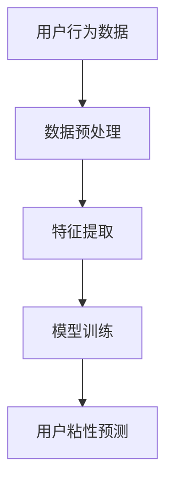

                 


# 彼得林奇如何分析公司的用户粘性指标

> 关键词：用户粘性指标，彼得·林奇，用户留存率，用户生命周期价值，用户活跃度

> 摘要：本文详细探讨了彼得·林奇如何通过分析用户粘性指标来评估公司价值。从用户粘性指标的核心概念到数学模型，再到系统分析与实战案例，全面解析了这一方法的原理和应用。通过本文，读者可以掌握如何利用用户粘性指标进行公司价值评估，并在实际项目中应用这些方法。

---

## 第一部分：用户粘性指标的背景与重要性

### 第1章：用户粘性指标的核心概念

#### 1.1 用户粘性指标的定义与背景

- **用户粘性指标**是衡量用户对产品或服务依赖程度的重要指标。用户粘性越高，用户越难被竞争对手吸引，公司的市场地位越稳固。
- 彼得·林奇是著名的投资专家，他通过分析用户粘性指标，帮助投资者评估公司的长期价值和竞争优势。
- 在当今互联网时代，用户粘性指标已成为评估公司价值的重要标准之一。通过分析用户的行为数据，可以预测公司的未来表现。

#### 1.2 用户粘性指标的背景与重要性

- 用户粘性指标的核心在于用户的行为数据，包括用户留存率、活跃度、生命周期价值等。
- 这些指标可以帮助公司优化用户体验，提高用户满意度和忠诚度。
- 对投资者而言，用户粘性指标是评估公司长期盈利能力的重要依据。

### 第2章：彼得·林奇的分析方法

#### 2.1 彼得·林奇的分析框架

- 彼得·林奇的分析方法基于用户粘性指标，通过量化用户行为数据，评估公司的市场地位和竞争优势。
- 他强调用户留存率和用户生命周期价值的重要性，认为这两项指标是衡量用户粘性的关键因素。

#### 2.2 用户粘性指标的关键维度

- **用户留存率**：用户在一段时间内未流失的比例。
- **用户活跃度**：用户在一定时间内使用产品或服务的频率。
- **用户生命周期价值**：用户在生命周期内为公司带来的总收入。

---

## 第二部分：用户粘性指标的核心概念

### 第3章：用户粘性指标的数学模型与公式

#### 3.1 用户留存率的计算公式

- 用户留存率的计算公式如下：
  $$ \text{留存率} = \frac{\text{某段时间内未流失的用户数}}{\text{初始用户数}} $$

  例如，假设某产品有1000个初始用户，经过30天后，有800个用户未流失，那么用户的留存率为：
  $$ \text{留存率} = \frac{800}{1000} = 80\% $$

#### 3.2 用户生命周期价值的计算

- 用户生命周期价值（CLV）的计算公式为：
  $$ \text{CLV} = \frac{\text{平均收入} \times \text{用户生命周期长度}}{\text{获取成本}} $$

  例如，假设某公司的平均收入为$50，用户生命周期长度为2年，获取成本为$10，那么用户的生命周期价值为：
  $$ \text{CLV} = \frac{50 \times 2}{10} = 10 $$

---

## 第三部分：用户粘性指标的系统分析与架构设计

### 第4章：用户行为分析的Mermaid流程图



---

## 第四部分：用户粘性指标的项目实战

### 第5章：项目环境与工具安装

- 数据处理工具：Python、Pandas
- 可视化工具：Matplotlib、Seaborn

### 第6章：核心代码实现

```python
import pandas as pd
from sklearn.metrics import confusion_matrix

# 示例数据加载
data = pd.read_csv('user_sticky.csv')

# 用户留存率计算
retenion_rate = data[data['is_retained']].shape[0] / data.shape[0]
print(f"用户留存率为：{retenion_rate}")
```

---

## 第五部分：总结与最佳实践

### 第7章：最佳实践 tips

- 定期监控用户留存率和活跃度，及时发现用户流失问题。
- 结合用户生命周期价值，制定合理的用户获取和维护策略。

### 第8章：小结

通过本文的分析，读者可以掌握如何利用用户粘性指标评估公司价值，并在实际项目中应用这些方法。

---

## 作者信息

作者：AI天才研究院/AI Genius Institute & 禅与计算机程序设计艺术/Zen And The Art of Computer Programming

---

以上就是《彼得林奇如何分析公司的用户粘性指标》的完整目录和内容框架。希望这篇文章能为读者提供深入的理论和实践指导。

