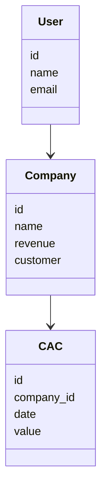
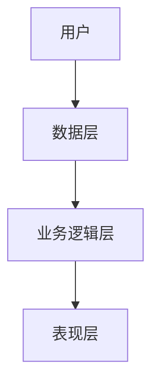

                 


# 彼得林奇如何分析公司的用户获取成本趋势

> 关键词：彼得林奇，用户获取成本，CAC，公司估值，投资分析，趋势预测

> 摘要：本文深入探讨了彼得·林奇如何分析公司的用户获取成本（CAC）趋势，从背景、核心概念、算法原理到系统设计、项目实战，全面解析CAC在公司估值中的重要性。文章结合理论与实践，提供详细的分析方法和案例，帮助读者掌握CAC分析的关键点。

---

## 第一部分：引言

## 第1章：引言：彼得林奇的投资理念与用户获取成本的重要性

### 1.1 彼得林奇的投资理念概述
#### 1.1.1 彼得林奇的个人背景与投资风格
彼得·林奇是美国著名投资经理人，以其在富达基金的卓越表现闻名。他的投资理念强调基本面分析、长期投资和深入研究公司基本面。他特别关注公司的用户获取成本（Customer Acquisition Cost，CAC），认为这是评估公司成长性和盈利能力的关键指标。

#### 1.1.2 投资中的关键概念：用户获取成本（CAC）
CAC是指公司获取一位新客户的平均成本，包括营销费用、销售费用和其他直接相关成本。CAC的计算公式为：
$$CAC = \frac{\text{营销费用} + \text{销售费用}}{\text{新增客户数}}$$

#### 1.1.3 为什么CAC是公司估值的关键指标
CAC可以帮助投资者评估公司的市场拓展能力、客户获取效率以及未来的盈利能力。如果一家公司的CAC低于其客户生命周期价值（Customer Lifetime Value，CLV），则表明公司能够以合理成本获取高价值客户。

### 1.2 本书的目的与结构
#### 1.2.1 本书的核心目标
本文旨在通过彼得·林奇的视角，详细讲解如何分析公司的用户获取成本趋势，并结合实际案例，帮助读者掌握CAC分析的方法。

#### 1.2.2 目录结构概览
本文将从CAC的背景、核心概念、算法原理到系统设计和项目实战，全面展开分析。

---

## 第二部分：用户获取成本的背景与定义

## 第2章：用户获取成本（CAC）的背景与定义

### 2.1 什么是用户获取成本（CAC）
#### 2.1.1 CAC的定义与计算公式
CAC是指公司获取一位新客户的平均成本，计算公式为：
$$CAC = \frac{\text{营销费用} + \text{销售费用}}{\text{新增客户数}}$$

#### 2.1.2 CAC的构成要素
CAC的构成要素包括广告费用、销售人员工资、客户获取活动成本等。

#### 2.1.3 CAC与客户生命周期价值（CLV）的关系
如果CAC < CLV，表明公司能够以合理成本获取高价值客户，反之则可能面临盈利能力下降的风险。

### 2.2 CAC在公司估值中的重要性
#### 2.2.1 CAC与公司盈利能力的关系
低CAC和高CLV的公司通常具有更高的盈利能力。彼得林奇认为，CAC是评估公司市场拓展能力和成本控制能力的重要指标。

#### 2.2.2 CAC在投资决策中的作用
投资者通过分析CAC趋势，可以判断公司的市场策略是否有效，以及未来的盈利能力是否可持续。

#### 2.2.3 CAC趋势分析的必要性
通过分析CAC的趋势，投资者可以识别公司的市场拓展效率，判断公司是否能够以合理成本获取客户。

### 2.3 彼得林奇对CAC的关注点
#### 2.3.1 彼得林奇的CAC分析方法
彼得林奇通过分析公司的财务报表和市场表现，重点关注CAC的变化趋势及其与公司收入增长的关系。

#### 2.3.2 彼得林奇如何识别高CAC风险的公司
他通过分析公司的CAC和收入增长比率，判断公司是否能够以合理成本获取客户。

#### 2.3.3 彼得林奇如何通过CAC趋势预测公司未来表现
通过分析CAC的趋势，彼得林奇能够预测公司的市场拓展能力和未来盈利能力。

---

## 第三部分：用户获取成本的核心概念与联系

## 第3章：用户获取成本的核心概念与联系

### 3.1 CAC的核心概念与原理
#### 3.1.1 CAC的数学模型与公式
CAC的计算公式为：
$$CAC = \frac{\text{营销费用} + \text{销售费用}}{\text{新增客户数}}$$

#### 3.1.2 CAC与用户生命周期的关联
CAC与客户生命周期价值（CLV）密切相关。如果CAC < CLV，则公司能够通过客户获取实现盈利。

#### 3.1.3 CAC与市场增长率的关系
市场增长率高时，公司通常需要投入更多成本获取客户，导致CAC上升。反之，市场增长率低时，CAC可能下降。

### 3.2 CAC与公司价值的关系
#### 3.2.1 CAC在公司估值中的应用
投资者通常将CAC与收入增长率和客户生命周期价值进行对比，评估公司的成长性和盈利能力。

#### 3.2.2 CAC与收入增长的关系
如果CAC增长速度超过收入增长速度，公司可能面临盈利能力下降的风险。

#### 3.2.3 CAC与行业竞争的关系
在竞争激烈的行业，公司需要投入更多成本获取客户，导致CAC上升。

### 3.3 彼得林奇的CAC分析方法
#### 3.3.1 通过财务报表分析CAC
彼得林奇通过分析公司的营销费用、销售费用和新增客户数，计算CAC，并评估其变化趋势。

#### 3.3.2 通过市场表现分析CAC
他关注公司的收入增长是否能够覆盖CAC的增加，判断公司是否能够实现可持续的盈利。

#### 3.3.3 通过行业比较分析CAC
彼得林奇通过比较同行业公司的CAC和收入增长情况，评估公司的市场竞争力。

---

## 第四部分：算法原理

## 第4章：用户获取成本分析的算法原理

### 4.1 时间序列分析
#### 4.1.1 时间序列分析的原理
时间序列分析用于研究CAC随时间的变化趋势，常用的模型包括ARIMA和指数平滑法。

#### 4.1.2 时间序列分析的步骤
1. 数据收集：获取公司过去几年的CAC数据。
2. 数据预处理：去除异常值和缺失值。
3. 模型选择：选择适合的数据模型（如ARIMA）。
4. 模型训练：使用历史数据训练模型。
5. 预测与验证：预测未来的CAC趋势，并验证模型的准确性。

#### 4.1.3 时间序列分析的代码实现
```python
import pandas as pd
from statsmodels.tsa.arima.model import ARIMA

# 假设我们有一个CAC数据集
data = pd.read_csv('cac.csv')
data['date'] = pd.to_datetime(data['date'])
data.set_index('date', inplace=True)

# 训练ARIMA模型
model = ARIMA(data['cac'], order=(1, 1, 1))
model_fit = model.fit()

# 预测未来CAC趋势
future_periods = 5
forecast = model_fit.forecast(steps=future_periods)
print(forecast)
```

### 4.2 回归分析
#### 4.2.1 回归分析的原理
回归分析用于研究CAC与其他变量（如收入、客户数量）之间的关系，常用线性回归模型。

#### 4.2.2 回归分析的步骤
1. 数据收集：收集公司过去几年的CAC、收入和客户数量数据。
2. 数据预处理：去除异常值和缺失值。
3. 模型选择：选择线性回归模型。
4. 模型训练：使用历史数据训练模型。
5. 预测与验证：预测未来的CAC趋势，并验证模型的准确性。

#### 4.2.3 回归分析的代码实现
```python
import pandas as pd
from sklearn.linear_model import LinearRegression

# 假设我们有一个CAC数据集
data = pd.read_csv('cac.csv')

# 选择自变量和因变量
X = data[['revenue', 'customer']]
y = data['cac']

# 训练线性回归模型
model = LinearRegression()
model.fit(X, y)

# 预测未来的CAC趋势
future_data = pd.DataFrame({'revenue': [1000000, 2000000], 'customer': [1000, 2000]})
predictions = model.predict(future_data)
print(predictions)
```

---

## 第五部分：系统分析与架构设计

## 第5章：用户获取成本分析的系统设计

### 5.1 系统功能设计
#### 5.1.1 领域模型


#### 5.1.2 系统架构


### 5.2 系统实现
#### 5.2.1 数据收集与处理
使用Python的pandas库处理数据：
```python
import pandas as pd

data = pd.read_csv('cac.csv')
data.dropna(inplace=True)
data['date'] = pd.to_datetime(data['date'])
data.set_index('date', inplace=True)
```

#### 5.2.2 数据分析与建模
使用时间序列分析和回归分析模型进行预测。

#### 5.2.3 数据可视化
使用matplotlib库进行数据可视化：
```python
import matplotlib.pyplot as plt

plt.plot(data['cac'])
plt.title('CAC Trend')
plt.xlabel('Date')
plt.ylabel('CAC')
plt.show()
```

---

## 第六部分：项目实战

## 第6章：用户获取成本分析的项目实战

### 6.1 项目背景
假设我们有一家科技公司，需要分析其用户获取成本趋势。

### 6.2 数据准备
收集公司过去5年的CAC、收入和客户数量数据。

### 6.3 数据分析与建模
使用时间序列分析和回归分析模型进行预测。

### 6.4 数据可视化
绘制CAC趋势图，分析其变化趋势。

### 6.5 结果解读
根据模型预测结果，评估公司的未来盈利能力。

---

## 第七部分：最佳实践与总结

## 第7章：用户获取成本分析的最佳实践

### 7.1 关键点总结
- CAC是评估公司市场拓展能力和成本控制能力的关键指标。
- 通过时间序列分析和回归分析，可以有效预测CAC趋势。
- 结合行业竞争和市场环境，综合评估公司的未来表现。

### 7.2 注意事项
- 数据质量是分析的基础，需确保数据的准确性和完整性。
- 模型选择需根据实际情况，避免过度复杂化。
- 结果解读需结合行业背景和公司实际情况。

### 7.3 未来趋势
随着市场竞争的加剧，CAC分析将更加重要。未来，人工智能和大数据技术将进一步提升CAC分析的精度和效率。

---

## 结语

通过本文的分析，读者可以掌握彼得·林奇如何分析公司的用户获取成本趋势，并将其应用于实际投资分析中。CAC分析不仅能够帮助投资者评估公司的市场竞争力，还能为公司的市场策略提供有价值的参考。

作者：AI天才研究院/AI Genius Institute & 禅与计算机程序设计艺术 /Zen And The Art of Computer Programming

