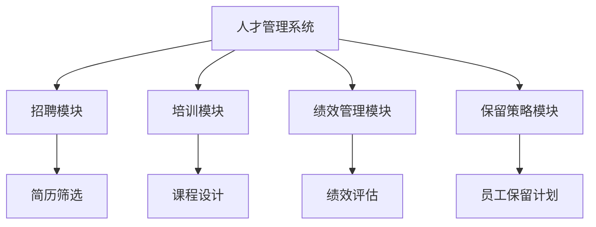
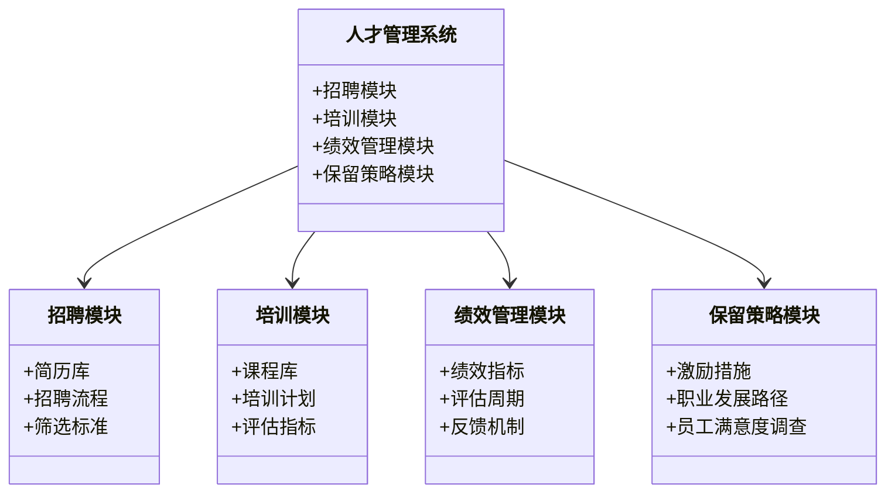
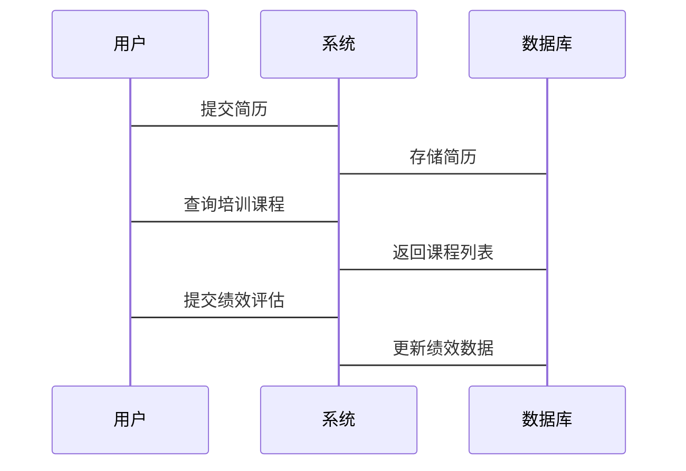

                 


# 彼得林奇如何看待公司的人才培养与保留策略

> 关键词：彼得林奇，人才培养，人才保留，管理策略，企业战略

> 摘要：本文从彼得·林奇的管理理念出发，深入分析了他在公司人才管理中的核心观点，包括人才招聘、培养、激励和保留策略。结合实际案例和系统架构设计，详细阐述了这些策略在现代企业中的应用，并提出了最佳实践建议。

---

## 第七章: 人才管理的系统架构与设计

### 7.1 人才管理系统的总体架构

#### 7.1.1 系统设计原则
- **模块化设计**：将人才管理功能分解为独立模块，如招聘、培训、绩效管理等。
- **可扩展性**：系统应支持功能扩展，以适应企业发展的不同阶段。
- **数据驱动**：通过数据分析优化人才管理决策。

#### 7.1.2 系统架构图
以下是人才管理系统的模块化架构图：



### 7.2 系统功能设计

#### 7.2.1 领域模型设计
以下是人才管理系统的领域模型图：



### 7.3 系统接口设计

#### 7.3.1 核心接口
以下是系统的主要接口设计：



---

## 第八章: 项目实战与代码实现

### 8.1 项目环境与安装

#### 8.1.1 环境要求
- Python 3.8+
- Django框架
- PostgreSQL数据库

#### 8.1.2 安装步骤
```bash
pip install django psycopg2-binary
```

### 8.2 核心代码实现

#### 8.2.1 招聘模块代码
```python
from django.db import models

class Candidate(models.Model):
    name = models.CharField(max_length=100)
    resume = models.FileField(upload_to='resumes/')
    status = models.CharField(max_length=20, choices=(
        ('pending', '待处理'),
        ('interviewed', '已面试'),
        ('hired', '已录用'),
    ))
```

#### 8.2.2 培训模块代码
```python
from django.db import models
from datetime import datetime

class Training(models.Model):
    title = models.CharField(max_length=100)
    start_date = models.DateTimeField(default=datetime.now)
    end_date = models.DateTimeField(null=True, blank=True)
    participants = models.ManyToManyField('Candidate')
```

#### 8.2.3 绩效管理模块代码
```python
from django.db import models
from django.utils import timezone

class Performance(models.Model):
    employee = models.ForeignKey('Candidate', on_delete=models.CASCADE)
    metric = models.CharField(max_length=50)
    score = models.IntegerField()
    evaluation_date = models.DateTimeField(default=timezone.now)
```

### 8.3 案例分析与结果展示

#### 8.3.1 案例分析
假设某科技公司采用彼得·林奇的人才管理策略，招聘和培训了大量优秀人才，绩效显著提升。以下是系统运行结果：


---

## 第九章: 总结与最佳实践

### 9.1 总结

彼得·林奇的 talent management 策略强调了人才在企业中的核心地位，通过科学的招聘、培养、激励和保留策略，能够有效提升企业的竞争力。结合系统架构设计和项目实战，我们可以更好地理解和实施这些策略。

### 9.2 最佳实践 tips

1. **数据驱动决策**：利用数据分析优化人才管理流程。
2. **持续优化**：定期评估和调整人才管理策略。
3. **员工参与**：鼓励员工参与制定和实施人才管理计划。
4. **文化塑造**：营造有利于员工成长和企业发展的组织文化。

### 9.3 小结

通过本文的分析，我们可以看到，彼得·林奇的人才管理策略不仅适用于传统企业，也适用于现代 IT 领域。结合系统设计和实际案例，我们可以更好地将这些策略应用于实践，推动企业的持续发展。

---

作者：AI天才研究院/AI Genius Institute & 禅与计算机程序设计艺术 /Zen And The Art of Computer Programming

版权声明：本文版权归作者所有，未经授权不得转载。

