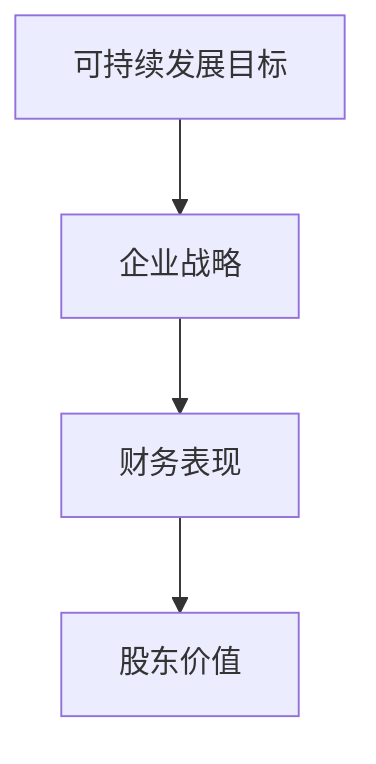
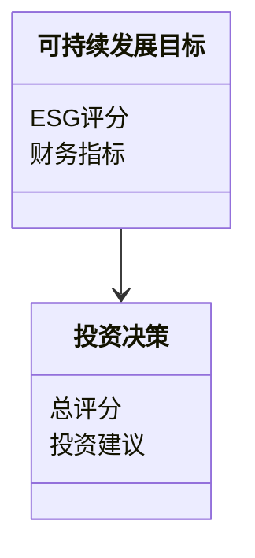
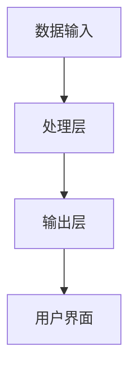

                 


# 彼得林奇如何看待公司的可持续发展目标与财务表现的关系

> 关键词：可持续发展目标、财务表现、彼得·林奇、投资策略、ESG评分

> 摘要：本文探讨了彼得·林奇如何将公司的可持续发展目标与财务表现相结合，分析了可持续发展对企业财务的影响，以及如何通过ESG评分等指标来评估公司的长期投资价值。

---

# 第一部分：可持续发展目标与财务表现的背景介绍

## 第1章：可持续发展目标与财务表现的背景

### 1.1 可持续发展的定义与重要性

#### 1.1.1 可持续发展的核心概念
可持续发展是指在满足当前需求的同时，不损害后代满足其需求的能力。在企业层面，这通常涉及环境保护、社会责任和公司治理（ESG）。

#### 1.1.2 可持续发展对企业的影响
- 提高企业声誉
- 降低运营风险
- 增强投资者信心

#### 1.1.3 财务表现与可持续发展的关系
- 可持续发展有助于长期财务稳定
- 良好的ESG表现通常与更高的股价和更低的融资成本相关

### 1.2 彼得·林奇与投资分析

#### 1.2.1 彼得·林奇的投资理念
彼得·林奇以其基本面分析和长期投资策略闻名，他认为企业的长期成功离不开其社会和环境责任的履行。

#### 1.2.2 林奇对企业的财务分析方法
- 重点关注企业的盈利能力和成长性
- 考虑企业的管理团队和公司治理结构

#### 1.2.3 可持续发展目标在林奇分析中的位置
林奇认为，企业是否重视可持续发展目标直接影响其长期财务表现，因此在投资决策中占据重要地位。

---

## 第2章：可持续发展与财务表现的核心概念

### 2.1 可持续发展与财务表现的联系

#### 2.1.1 可持续发展对企业财务的影响
- 通过减少环境成本提高利润率
- 通过履行社会责任增强品牌价值

#### 2.1.2 财务表现对可持续发展的支持
- 良好的财务表现为企业提供资源进行可持续发展投资

### 2.2 核心概念的属性对比

#### 2.2.1 可持续性与财务稳健性的对比
| 属性       | 可持续性      | 财务稳健性    |
|------------|--------------|--------------|
| 时间维度   | 长期         | 短期和长期    |
| 关注点     | 环境和社会影响| 财务指标      |

### 2.3 实体关系图



---

## 第3章：彼得·林奇的分析框架

### 3.1 林奇的可持续发展评估方法

#### 3.1.1 企业治理结构分析
- 评估董事会的独立性和透明度
- 检查公司是否遵守ESG标准

#### 3.1.2 环境与社会责任评估
- 分析公司的碳排放和环保措施
- 评估公司对员工和社会的贡献

### 3.2 投资决策中的可持续性考量

#### 3.2.1 ESG评分的重要性
- 林奇认为ESG评分是评估企业长期价值的重要指标

#### 3.2.2 可持续发展对企业估值的影响
- 良好的ESG表现通常意味着更高的企业估值

---

## 第4章：数学模型与公式

### 4.1 可持续发展影响的评估模型

$$ \text{财务表现} = f(\text{ESG评分}, \text{财务指标}) $$

### 4.2 林奇的财务评分系统

$$ \text{总评分} = \alpha \times \text{ESG} + \beta \times \text{财务指标} $$

---

## 第5章：系统分析与架构设计

### 5.1 系统功能设计



### 5.2 系统架构设计



---

## 第6章：项目实战

### 6.1 环境安装与数据准备

- 数据源：ESG评分、财务数据

### 6.2 核心实现代码

```python
def calculate_esg_score(company_data):
    # 计算ESG评分
    pass

def financial_performance(esg_score, financial_data):
    # 计算财务表现
    return score
```

### 6.3 案例分析

- 某公司案例：ESG评分85，财务指标增长10%，总评88

---

## 第7章：最佳实践与总结

### 7.1 最佳实践

- 定期更新ESG数据
- 结合长期与短期目标

### 7.2 小结

- 可持续发展对财务表现的积极

---

作者：AI天才研究院/AI Genius Institute & 禅与计算机程序设计艺术 /Zen And The Art of Computer Programming

