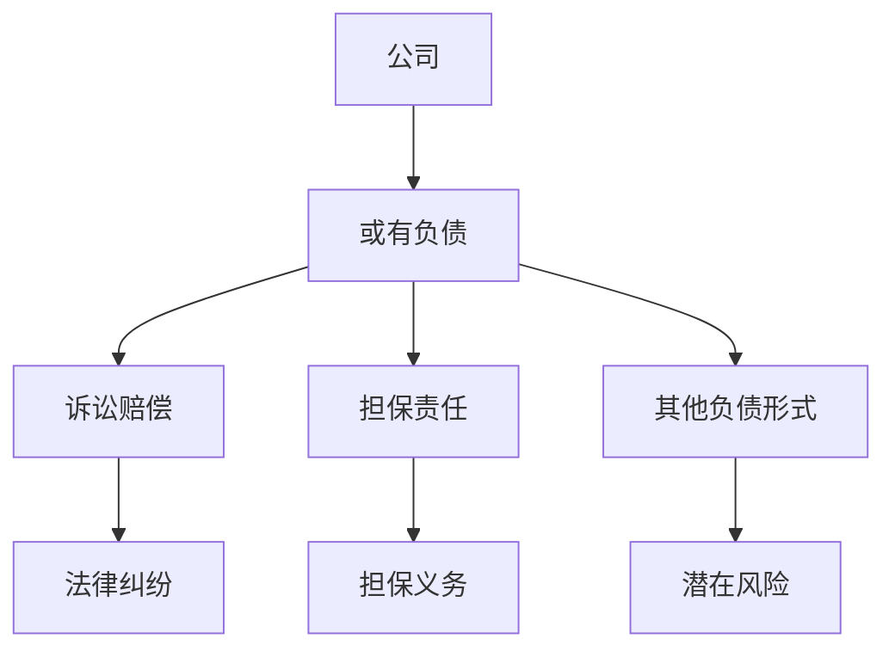

                 

# 彼得·林奇如何看待公司的或有负债对长期价值的影响

## 关键词：彼得·林奇，或有负债，公司价值，投资分析，财务风险

## 摘要：本文探讨了彼得·林奇如何分析公司的或有负债对长期价值的影响。通过详细分析或有负债的类型、评估方法及其对投资决策的影响，本文揭示了彼得·林奇的投资哲学和方法，以及他如何通过识别和管理或有负债风险来实现长期投资价值。

---

# 第一部分: 背景介绍与核心概念

## 第1章: 或有负债的基本概念与问题背景

### 1.1 或有负债的定义与特征

#### 1.1.1 或有负债的定义
或有负债（Contingent Liabilities）是指公司可能在未来发生的债务或财务责任，其存在取决于某些特定条件的满足或未来事件的发生。与明确的财务义务不同，或有负债具有不确定性，只有在特定情况下才会转化为实际的负债。

#### 1.1.2 或有负债的特征
- **不确定性**：或有负债的发生取决于未来的事件，其金额和发生时间不确定。
- **潜在性**：或有负债可能尚未记录在公司的财务报表中，但可能对公司的财务状况产生重大影响。
- **风险性**：或有负债可能引发财务风险，影响公司的偿债能力和信用评级。

#### 1.1.3 或有负债与公司长期价值的关系
或有负债可能对公司的长期价值产生正向或负向影响。正面影响可能源于或有负债的解决带来新的商业机会，而负面影响则可能来自或有负债引发的财务损失或声誉损害。

### 1.2 彼得·林奇与投资分析方法

#### 1.2.1 彼得·林奇的投资者背景
彼得·林奇（Peter Lynch）是美国著名的职业经理人和投资专家，以其在富达投资管理公司的长期任职期间表现出色而闻名。他以其深入的基本面分析和对公司管理层的严格评估而著称。

#### 1.2.2 林奇的投资哲学与方法
林奇的投资哲学强调对公司基本面的深入研究，包括财务状况、管理层能力和行业地位。他认为，投资者应关注公司的财务健康状况，尤其是那些可能影响长期价值的潜在风险因素。

#### 1.2.3 林奇对财务风险的关注
林奇在其投资分析中特别关注公司的财务风险，包括或有负债。他认为，潜在的财务风险可能影响公司的长期盈利能力，因此在评估公司时必须仔细审查这些潜在负债。

## 第2章: 或有负债对公司的潜在影响

### 2.1 或有负债的类型

#### 2.1.1 诉讼赔偿
公司可能因诉讼而产生的赔偿责任，如产品责任诉讼或雇佣纠纷，都是常见的诉讼赔偿类型。

#### 2.1.2 担保责任
公司为其他实体或个人提供的担保可能在被担保方无法履行债务时转化为公司的负债。

#### 2.1.3 其他或有负债形式
包括未决诉讼、环境责任、重组义务等，这些都可能成为公司潜在的或有负债。

### 2.2 或有负债的财务影响

#### 2.2.1 对公司财务状况的潜在影响
或有负债可能影响公司的资产负债表，增加潜在的负债，从而影响公司的偿债能力和财务稳定性。

#### 2.2.2 对公司估值的影响
未记录的或有负债可能被市场忽视，但一旦发生，可能会显著影响公司的估值和股价。

#### 2.2.3 对公司信用评级的影响
或有负债可能影响公司的信用评级，进而影响其融资成本和能力。

### 2.3 或有负债的法律与道德问题

#### 2.3.1 或有负债的法律风险
或有负债可能引发法律纠纷，增加公司的法律支出和时间成本。

#### 2.3.2 或有负债的道德考量
公司管理层在处理或有负债时，可能面临道德困境，需在短期利益和长期责任之间做出权衡。

#### 2.3.3 或有负债对管理层决策的影响
管理层需要在处理或有负债时做出明智决策，这可能影响公司的整体战略和运营。

## 第3章: 彼得·林奇如何看待或有负债对长期价值的影响

### 3.1 林奇对或有负债的重视

#### 3.1.1 林奇对或有负债的关注点
林奇在其投资分析中，特别关注公司的潜在负债，尤其是那些可能影响公司长期财务健康的风险因素。

#### 3.1.2 林奇对或有负债的分析方法
林奇通过深入研究公司的财务报表和管理层报告，识别潜在的或有负债，并评估其对公司的潜在影响。

#### 3.1.3 林奇对或有负债的案例分析
通过具体案例，林奇展示了如何分析公司的或有负债，并评估其对投资决策的影响。

### 3.2 林奇对或有负债的长期价值评估

#### 3.2.1 林奇的长期价值评估框架
林奇构建了一个综合评估框架，考虑公司的财务状况、行业地位、管理层能力和潜在风险因素。

#### 3.2.2 或有负债对长期价值的正向影响
在某些情况下，或有负债的解决可能为公司带来新的业务机会或战略优势。

#### 3.2.3 或有负债对长期价值的负向影响
或有负债可能导致财务损失、信用评级下降和市场信任度降低，从而影响公司的长期价值。

### 3.3 林奇对或有负债的管理建议

#### 3.3.1 如何识别和评估或有负债
投资者应仔细审查公司的财务报表和管理层报告，识别潜在的或有负债，并评估其可能的影响。

#### 3.3.2 如何管理或有负债风险
公司可以通过建立风险管理机制、加强内部控制系统和定期审查潜在负债来有效管理或有负债风险。

#### 3.3.3 林奇对投资者的建议
林奇建议投资者在评估公司时，应重视或有负债的潜在影响，并将其纳入长期价值评估框架中。

---

# 第二部分: 核心概念与联系

## 第4章: 或有负债的核心概念与原理

### 4.1 或有负债的核心概念

#### 4.1.1 或有负债的构成要素
或有负债的构成要素包括潜在的债务来源、触发条件和金额范围。

#### 4.1.2 或有负债的不确定性
或有负债的不确定性源于其依赖未来事件的发生，这使得其评估和管理更具挑战性。

#### 4.1.3 或有负债的可量化性
尽管或有负债具有不确定性，但通过概率分析和情景模拟，投资者可以对其潜在影响进行量化评估。

### 4.2 或有负债与其他财务概念的联系

#### 4.2.1 或有负债与资产负债表的关系
或有负债可能影响公司的资产负债表，增加潜在的负债，从而影响公司的财务状况和偿债能力。

#### 4.2.2 或有负债与损益表的关系
或有负债的解决可能影响公司的损益表，尤其是在赔偿支出和法律费用方面。

#### 4.2.3 或有负债与公司估值的关系
或有负债可能影响公司的市场估值，尤其是在市场对其潜在影响的预期下。

### 4.3 或有负债的实体关系图

---

## 第5章: 或有负债的评估与管理

### 5.1 或有负债的评估方法

#### 5.1.1 概率分析
通过评估或有负债发生的概率和潜在影响，投资者可以对其潜在影响进行量化。

#### 5.1.2 情景分析
情景分析可以帮助投资者评估不同情况下或有负债对公司财务状况的影响。

#### 5.1.3 风险调整贴现率
通过调整贴现率，投资者可以将或有负债的风险因素纳入长期价值评估。

### 5.2 或有负债的数学模型

#### 5.2.1 概率分布模型
$$ P(L) = \sum_{i=1}^{n} P_i \times L_i $$
其中，\( P_i \) 是负债 \( L_i \) 发生的概率。

#### 5.2.2 风险价值模型
$$ VaR = \alpha \times \text{标准差} $$
其中，\( \alpha \) 是置信水平。

### 5.3 或有负债的管理策略

#### 5.3.1 风险分散
通过多元化投资，投资者可以降低单一投资标的或有负债带来的风险。

#### 5.3.2 风险对冲
通过衍生品和其他金融工具，投资者可以对冲或有负债带来的风险。

#### 5.3.3 风险规避
在高风险情况下，投资者可以选择避免投资于存在重大或有负债的公司。

---

## 第6章: 或有负债对投资决策的影响

### 6.1 或有负债与投资决策的关系

#### 6.1.1 或有负债作为投资风险因素
或有负债是投资决策中的重要风险因素，可能影响投资者的长期回报。

#### 6.1.2 或有负债对投资组合的影响
通过评估或有负债，投资者可以优化投资组合，降低整体风险。

### 6.2 彼得·林奇的投资策略

#### 6.2.1 林奇的核心投资理念
林奇强调深入研究公司的基本面，包括财务状况、管理层能力和行业地位。

#### 6.2.2 林奇的长期投资策略
林奇倾向于长期投资，注重公司的长期价值创造，而非短期市场波动。

---

## 第7章: 实际案例分析

### 7.1 案例背景
以某公司为例，分析其或有负债对公司长期价值的影响。

### 7.2 案例分析

#### 7.2.1 公司概况
介绍公司的基本情况，包括行业地位、财务状况和管理层背景。

#### 7.2.2 或有负债的具体情况
分析公司面临的或有负债，包括类型、金额和潜在影响。

#### 7.2.3 林奇的分析与结论
基于林奇的投资哲学，分析或有负债对公司的长期价值的影响，并提出投资建议。

---

## 第8章: 总结与展望

### 8.1 本文总结
总结本文的主要内容，强调或有负债对长期价值的影响及其在投资分析中的重要性。

### 8.2 未来展望
展望未来，随着商业环境的变化，或有负债的评估和管理将面临新的挑战和机遇。

---

## 附录

### 附录A: 相关术语解释
对本文中涉及的关键术语进行详细解释。

### 附录B: 数据来源与参考文献
列出本文的数据来源和参考文献，确保内容的准确性和可追溯性。

---

## 作者信息

作者：AI天才研究院/AI Genius Institute & 禅与计算机程序设计艺术 /Zen And The Art of Computer Programming

---

以上是文章的目录结构和部分章节内容，我将按照这一结构逐步完成全文撰写。

