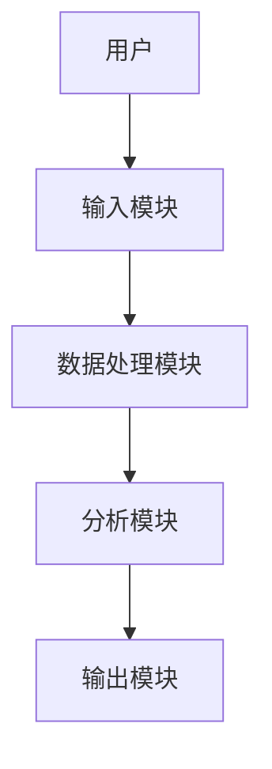
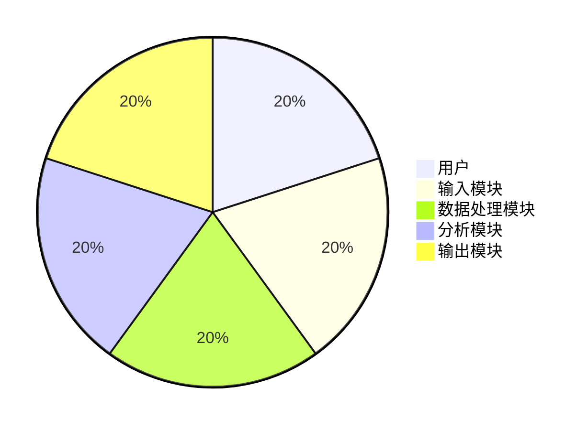

                 


# 彼得·林奇如何看待公司的或有负债风险

> 关键词：彼得·林奇、公司或有负债、财务风险、投资策略、风险管理、财务分析

> 摘要：本文探讨了彼得·林奇如何审视公司的或有负债风险，分析了或有负债的定义、识别方法、评估指标以及风险管理策略。通过系统的分析和实例，文章为投资者和管理层提供了实用的见解和策略。

---

## 第一部分: 公司或有负债风险的背景与概念

### 第1章: 或有负债的基本概念

#### 1.1 或有负债的定义与分类

##### 1.1.1 或有负债的定义
或有负债（Contingent Liabilities）是指公司潜在的债务或责任，其是否存在或金额取决于某些未来事件的发生。这些事件可能是法律诉讼的结果、合同义务、担保责任或其他不确定性因素。

##### 1.1.2 或有负债的主要分类
| 分类 | 描述 | 示例 |
|------|------|------|
| 担保责任 | 公司为其他方提供的担保 | 为子公司贷款提供担保 |
| 未决诉讼 | 未解决的法律诉讼或仲裁 | 因专利纠纷可能产生的赔偿 |
| 或有事项 | 可能导致公司承担义务的事项 | 未决的合同争议 |

##### 1.1.3 或有负债与公司财务健康的关系
或有负债可能影响公司的财务健康，尤其是在以下情况下：
- 或有负债金额较大，可能影响公司偿债能力。
- 或有负债的不确定性可能导致投资者对公司的信心下降。

---

#### 1.2 或有负债的产生背景

##### 1.2.1 现代企业面临的财务风险
企业在经营过程中面临多种财务风险，包括市场风险、信用风险和流动性风险。或有负债是信用风险的重要组成部分。

##### 1.2.2 或有负债在企业经营中的表现
或有负债通常隐藏在企业的财务报表之外，可能是由于管理层的决策或外部环境的变化引起。

##### 1.2.3 或有负债对企业信用评级的影响
或有负债的增加可能导致企业信用评级下降，进而影响融资成本和能力。

---

### 第2章: 或有负债与公司风险的关联

#### 2.1 或有负债对财务状况的影响

##### 2.1.1 或有负债对流动资产的影响
或有负债可能减少企业的流动资产，影响其短期偿债能力。

##### 2.1.2 或有负债对偿债能力的影响
通过负债比率和偿债能力指标，可以评估或有负债对公司的偿债压力。

##### 2.1.3 或有负债对股东权益的影响
或有负债可能侵蚀股东权益，影响公司的资本结构。

#### 2.2 或有负债与企业信用风险的联系
或有负债是信用风险的重要组成部分，可能引发连锁反应，影响企业融资。

#### 2.3 或有负债与公司治理的关系
有效的公司治理可以降低或有负债的风险，保护股东利益。

---

## 第二部分: 或有负债风险的识别与评估

### 第3章: 或有负债的识别方法

#### 3.1 识别或有负债的主要途径

##### 3.1.1 通过财务报表识别或有负债
- 资产负债表：检查是否有未记录的担保或未决诉讼。
- 利润表：分析或有负债对净利润的影响。

##### 3.1.2 通过法律合同识别或有负债
审阅合同中的担保条款、违约责任等。

##### 3.1.3 通过行业分析识别或有负债
分析行业内的常见或有负债类型。

#### 3.2 或有负债的财务报表分析

##### 3.2.1 资产负债表中的或有负债
- 担保责任通常在“其他应付款”中体现。
- 未决诉讼可能在“应付账款”中体现。

##### 3.2.2 利润表中的或有负债
或有负债可能影响公司的净利润，尤其是在法律诉讼中可能产生的赔偿。

##### 3.2.3 现金流量表中的或有负债
或有负债可能影响公司的现金流，尤其是在需要偿还债务时。

---

### 第4章: 或有负债风险的评估方法

#### 4.1 评估或有负债的主要指标

##### 4.1.1 负债比率分析
负债比率 = 总负债 / 总资产

##### 4.1.2 偿债能力指标
- 流动比率 = 流动资产 / 流动负债
- 速动比率 = (流动资产 - 存货) / 流动负债

##### 4.1.3 财务弹性指标
财务弹性 = 现金流量 / 或有负债金额

---

## 第三部分: 或有负债风险管理与投资策略

### 第5章: 或有负债风险管理策略

#### 5.1 或有负债的法律风险管理

##### 5.1.1 避免不必要的担保
审慎评估担保的必要性和风险。

##### 5.1.2 建立法律风险预警机制
定期审查合同，评估潜在的法律风险。

#### 5.2 或有负债的财务风险管理

##### 5.2.1 建立财务缓冲机制
保持足够的现金储备，应对或有负债的风险。

##### 5.2.2 优化资本结构
合理分配债务和股权，降低或有负债的影响。

---

### 第6章: 投资策略中的或有负债考量

#### 6.1 或有负债对投资决策的影响

##### 6.1.1 评估公司的或有负债情况
分析公司财务报表和法律风险。

##### 6.1.2 选择低或有负债风险的公司
优先投资财务健康、或有负债较少的公司。

#### 6.2 或有负债的市场表现

##### 6.2.1 或有负债对股价的影响
或有负债可能导致股价下跌，尤其是在风险暴露时。

##### 6.2.2 投资者如何应对
分散投资，避免过度集中于高或有负债风险的公司。

---

## 第四部分: 或有负债风险管理的系统与工具

### 第7章: 或有负债风险管理系统

#### 7.1 系统功能设计

##### 7.1.1 预警模块
实时监控或有负债的潜在风险。

##### 7.1.2 分析模块
提供财务指标分析和风险评估报告。

#### 7.2 系统架构设计

##### 7.2.1 数据流图


##### 7.2.2 系统架构图


---

## 第五部分: 项目实战与案例分析

### 第8章: 项目实战

#### 8.1 环境配置

##### 8.1.1 安装Python
```bash
python --version
pip install pandas
pip install numpy
```

#### 8.2 核心代码实现

##### 8.2.1 负债比率计算
```python
def calculate_liability_ratio(total_liabilities, total_assets):
    return total_liabilities / total_assets

# 示例数据
total_liabilities = 5000000
total_assets = 10000000
liability_ratio = calculate_liability_ratio(total_liabilities, total_assets)
print(f"负债比率：{liability_ratio}")
```

---

## 第六部分: 总结与最佳实践

### 第9章: 总结

#### 9.1 核心观点回顾
- 或有负债是公司财务健康的重要指标。
- 识别和评估或有负债是投资和管理的关键。

#### 9.2 最佳实践

##### 9.2.1 投资者
- 仔细分析公司的或有负债情况。
- 选择财务健康、治理良好的公司。

##### 9.2.2 管理者
- 建立有效的风险管理机制。
- 定期审查合同和财务报表。

---

## 作者：AI天才研究院/AI Genius Institute & 禅与计算机程序设计艺术 /Zen And The Art of Computer Programming

---

这篇文章系统地探讨了彼得·林奇如何看待公司的或有负债风险，从概念、识别、评估到管理策略，结合实际案例和系统设计，为投资者和企业管理者提供了实用的见解和策略。

