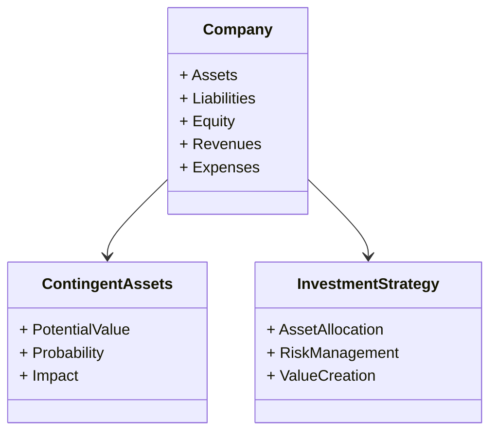
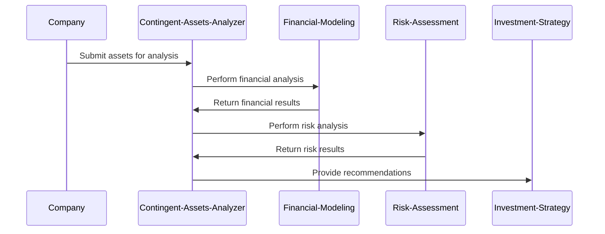

                 


# 彼得林奇如何看待公司的或有资产对长期价值创造的潜在贡献

---

## 关键词：
彼得·林奇，或有资产，企业价值，投资哲学，潜在贡献

---

## 摘要：
本文探讨了彼得·林奇对公司的或有资产如何影响长期价值创造的潜在贡献。通过分析或有资产的定义、分类、评估方法及其对财务和战略的影响，结合彼得·林奇的投资哲学，本文提出了如何在实际投资中应用这些理论。通过案例分析和系统设计，本文展示了如何将或有资产纳入企业价值评估，以实现长期价值最大化。

---

## 正文：

### 第1章：彼得·林奇与投资哲学

#### 1.1 彼得·林奇的背景与投资风格

彼得·林奇（Peter Lynch）是美国著名的投资专家，曾担任富达投资的经理，管理麦哲伦基金长达13年，创造了年均29%的回报率。他的投资哲学以价值投资为核心，强调深入分析公司的基本面，寻找具有强大竞争优势和增长潜力的企业。

彼得·林奇的投资风格强调长期持有优质股票，关注公司的内在价值和成长潜力。他认为，投资者应选择那些能够持续创造价值，并在市场中具有竞争优势的公司。这种哲学为他带来了巨大的成功，并为后来的投资者提供了宝贵的指导。

#### 1.2 或有资产的定义与重要性

或有资产（Contingent Assets）是指那些在特定条件下才能实现其价值的资产。这些资产的价值依赖于某些未来事件的发生或不发生。例如，未决诉讼的胜诉、期权协议的执行等都属于或有资产。

或有资产在企业价值评估中的重要性在于它们可能为公司带来额外的价值，但也可能带来潜在风险。彼得·林奇认为，这些资产的潜在贡献是公司长期价值的重要组成部分，尤其是在评估公司的潜在增长和风险时。

---

### 第2章：或有资产的核心概念

#### 2.1 或有资产与企业价值的关系

或有资产对企业价值的影响是多方面的。正面影响包括潜在的财务收益、市场地位提升和竞争优势的增强。负面影响则包括或有负债的潜在风险和不确定性，可能影响公司的财务健康和市场信誉。

彼得·林奇强调，投资者应仔细评估这些资产的潜在贡献，并将其纳入公司整体价值评估中。他认为，忽视或低估或有资产的潜在价值可能导致投资决策的失误。

#### 2.2 或有资产的分类与评估

或有资产可以分为以下几类：

1. **财务类或有资产**：如未决诉讼的胜诉、期权协议的执行等。
2. **法律类或有资产**：如知识产权的保护、专利的续展等。
3. **战略类或有资产**：如潜在的并购机会、合作伙伴关系等。

评估或有资产时，应考虑其发生的概率、潜在价值以及对公司的长期影响。彼得·林奇建议，投资者应采用定量和定性相结合的方法，全面评估这些资产的潜在贡献。

---

### 第3章：或有资产对长期价值的影响

#### 3.1 或有资产的财务影响

或有资产对财务报表的影响主要体现在资产负债表和利润表上。例如，未决诉讼的胜诉可能增加公司的资产和利润，而期权协议的执行可能增加公司的收入和现金流。

彼得·林奇认为，投资者应关注这些资产的潜在财务影响，并将其纳入公司的整体财务分析中。他强调，忽视或有资产的财务影响可能导致对公司的财务状况和价值评估的误判。

#### 3.2 或有资产的战略影响

或有资产对公司的战略影响同样重要。例如，潜在的并购机会可能为公司带来新的市场和增长点，而合作伙伴关系可能增强公司的竞争优势。

彼得·林奇认为，投资者应关注这些资产的战略价值，并将其纳入公司的长期战略规划中。他强调，这些资产可能成为公司未来增长的关键驱动力。

---

### 第4章：系统分析与架构设计

#### 4.1 问题场景介绍

在企业价值评估中，或有资产的分析是一个复杂的问题。投资者需要考虑这些资产的潜在价值、风险和对公司的长期影响。为了系统地分析这些资产，需要设计一个全面的架构。

#### 4.2 系统功能设计

##### 领域模型（Mermaid 类图）



##### 系统架构设计（Mermaid 架构图）


##### 系统交互流程（Mermaid 序列图）



---

### 第5章：项目实战

#### 5.1 环境安装与工具准备

为了进行或有资产的分析，需要安装以下工具：

1. **数据分析工具**：Python、Pandas、NumPy
2. **可视化工具**：Matplotlib、Seaborn
3. **估值模型**：Excel、Financial Modeling

#### 5.2 核心实现源代码

##### Python 代码示例（或有资产评估）

```python
import pandas as pd
import numpy as np

def evaluate_contingent_assets(assets, probabilities):
    """
    评估或有资产的潜在价值
    :param assets: 资产列表
    :param probabilities: 概率列表
    :return: 潜在价值
    """
    expected_value = 0
    for asset, prob in zip(assets, probabilities):
        expected_value += asset * prob
    return expected_value

# 示例数据
assets = [100, 200, 300]
probabilities = [0.3, 0.5, 0.2]

# 计算潜在价值
potential_value = evaluate_contingent_assets(assets, probabilities)
print(f"潜在价值：{potential_value}")
```

##### 代码解读与分析

上述代码示例展示了如何使用Python来评估或有资产的潜在价值。通过计算每个资产的期望值，可以得出其对长期价值的潜在贡献。

#### 5.3 实际案例分析

##### 案例背景介绍

假设某公司拥有一项未决诉讼的胜诉资产，潜在价值为1000万美元，胜诉概率为50%。公司管理层认为该资产可能为公司带来额外的现金流，从而提升公司价值。

##### 数据收集与处理

| 资产         | 潜在价值（美元） | 概率  |
|--------------|------------------|--------|
| 未决诉讼胜诉 | 10,000,000      | 0.5    |

##### 模型应用与结果分析

使用上述代码计算潜在价值：

potential_value = 10,000,000 * 0.5 = 5,000,000 美元

该资产的潜在价值为500万美元，显著提升了公司的长期价值。因此，彼得·林奇可能会建议投资者关注该资产的潜在贡献，并将其纳入公司的整体价值评估。

---

### 第6章：总结与展望

#### 6.1 本书内容回顾

本文探讨了彼得·林奇对或有资产在公司长期价值创造中的潜在贡献的看法。通过分析或有资产的定义、分类、评估方法及其对财务和战略的影响，结合彼得·林奇的投资哲学，本文提出了如何在实际投资中应用这些理论。

#### 6.2 投资建议与注意事项

- **关注或有资产的潜在贡献**：投资者应仔细评估或有资产的潜在价值，并将其纳入公司整体价值评估中。
- **风险管理**：或有资产的潜在风险可能对公司的财务状况和市场信誉产生重大影响，投资者应采取有效的风险管理措施。
- **长期投资**：彼得·林奇的投资哲学强调长期持有优质股票，关注公司的内在价值和成长潜力。投资者应保持长期投资的耐心和信心。

#### 6.3 未来展望

随着全球经济的不断发展和变化，或有资产的分析将变得更加复杂和重要。未来的研究可以进一步探讨或有资产在不同行业中的应用，以及如何利用新技术（如人工智能）来提高或有资产的评估精度和效率。

---

## 作者：AI天才研究院/AI Genius Institute & 禅与计算机程序设计艺术 /Zen And The Art of Computer Programming

