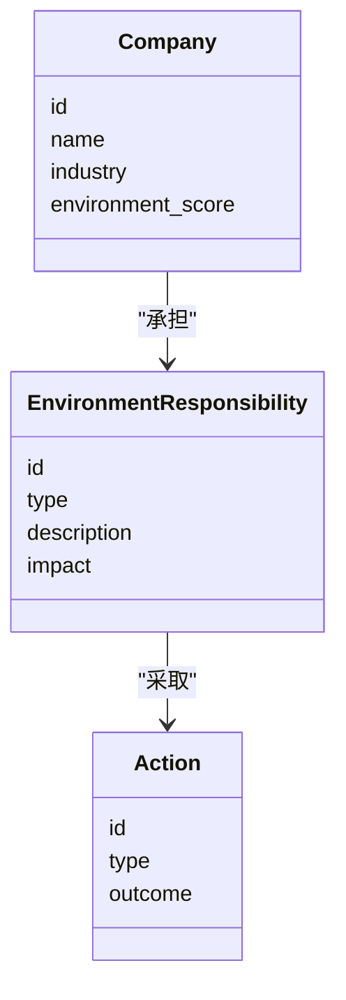
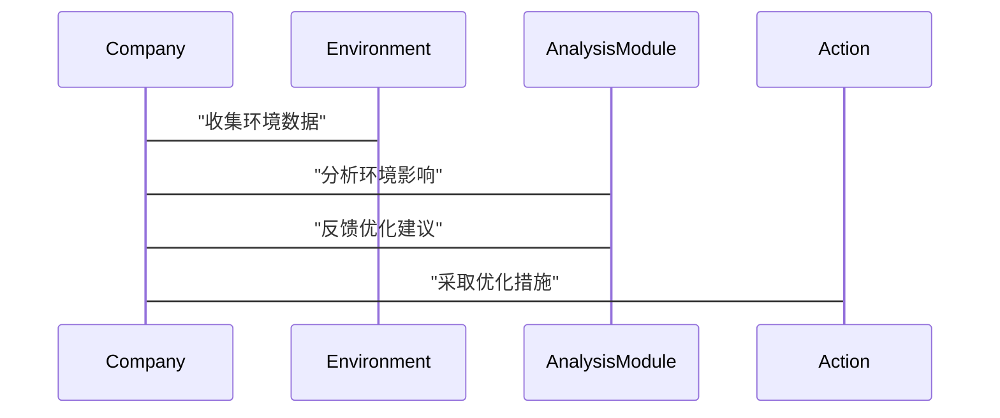

                 


# 彼得林奇如何看待公司的环境责任

> 关键词：环境责任、公司治理、彼得·林奇、投资理念、社会责任、风险管理、可持续发展

> 摘要：从投资视角探讨环境责任的重要性，分析彼得·林奇如何将环境责任纳入投资决策，以及环境责任对公司治理和社会可持续发展的影响。

---

# 第1章: 环境责任的背景介绍

## 1.1 环境责任的核心概念

### 1.1.1 环境责任的定义与内涵

环境责任是指企业在经营活动中对环境造成的影响负责，包括减少污染、节约资源、保护生态等方面。从投资角度来看，环境责任不仅是企业的社会责任，也是影响企业长期价值的重要因素。

### 1.1.2 环境责任的边界与外延

环境责任的边界包括企业直接和间接的环境影响，例如生产过程中的排放、供应链的环境影响等。外延则涉及企业如何通过技术创新、管理优化等方式减少环境负担。

### 1.1.3 环境责任与企业发展的关系

环境责任与企业发展的关系是辩证的。一方面，良好的环境责任管理可以提升企业的声誉和品牌形象，降低风险；另一方面，忽视环境责任可能导致法律风险和成本增加。

## 1.2 彼得·林奇的投资视角

### 1.2.1 投资与环境责任的关联

彼得·林奇认为，企业的环境责任直接影响其长期盈利能力。一个忽视环境责任的企业可能会面临更高的监管风险和运营成本，从而影响投资回报。

### 1.2.2 彼得·林奇的投资理念

林奇强调长期投资和基本面分析。他认为，企业对环境责任的重视是其长期竞争优势的重要组成部分，能够提升企业的可持续发展能力。

### 1.2.3 环境责任对企业价值的影响

环境责任良好的企业通常具有更强的抗风险能力和更高的市场信任度，这会提升企业的估值和投资吸引力。

## 1.3 环境责任的法规与趋势

### 1.3.1 全球环境法规的演变

全球范围内，环境法规日益严格，企业需要遵守更多的环保标准，这促使企业更加重视环境责任。

### 1.3.2 环境责任的行业趋势

随着消费者环保意识的增强，越来越多的行业开始将环境责任作为核心竞争力的一部分，特别是在科技、能源和制造行业。

### 1.3.3 环境责任对企业社会责任的影响

环境责任是企业社会责任（CSR）的重要组成部分，良好的环境责任表现能够提升企业的社会形象，吸引更多关注可持续发展的投资者。

---

# 第2章: 环境责任的核心概念与联系

## 2.1 环境责任的核心原理

### 2.1.1 环境责任的理论基础

环境责任的理论基础包括环境经济学和生态学，强调企业对环境的正外部性投资和负外部性规避。

### 2.1.2 环境责任与企业治理的关系

良好的公司治理是实现环境责任的关键，董事会和管理层需要将环境责任纳入战略决策。

### 2.1.3 环境责任与企业风险管理的联系

环境责任管理是企业风险管理的重要组成部分，能够帮助企业识别和应对环境风险，降低潜在损失。

## 2.2 核心概念对比分析

### 2.2.1 环境责任与社会责任的对比

环境责任是社会责任的一部分，更侧重于企业对环境的影响，而社会责任还包括员工权益、社区贡献等方面。

### 2.2.2 环境责任与企业利润的关系

短期来看，环境责任可能增加企业的成本，但长期来看，通过节能减排和资源优化，环境责任能够降低成本，提升利润。

### 2.2.3 环境责任与企业声誉的关联

良好的环境责任表现能够提升企业的声誉，增强市场信任度，从而为企业带来更多的商业机会。

## 2.3 ER实体关系图

```mermaid
erDiagram
    company {
        id : integer
        name : string
        industry : string
    }
    responsibility {
        id : integer
        type : string
        description : string
    }
    environment {
        id : integer
        status : string
        impact : string
    }
    action {
        id : integer
        type : string
        outcome : string
    }
    company --> responsibility : "承担"
    environment --> impact : "产生"
    responsibility --> action : "采取"
    action --> outcome : "实现"
```

---

# 第3章: 环境责任的评估与数学模型

## 3.1 环境责任评估方法

### 3.1.1 企业环境责任评估框架

评估框架包括企业环境政策、环境管理、环境绩效等方面。

### 3.1.2 环境责任评估指标

常用指标包括单位产品能耗、碳排放强度、废弃物回收率等。

### 3.1.3 评估模型的构建

评估模型需要综合考虑定量和定性因素，构建多维度的评价体系。

## 3.2 数学模型与公式

### 3.2.1 环境责任评分公式

$$ \text{总分} = \sum (\text{指标评分} \times \text{权重}) $$

### 3.2.2 环境影响评估公式

$$ \text{环境影响} = \sum (\text{活动} \times \text{影响因子}) $$

## 3.3 案例分析

### 3.3.1 某公司环境责任评估案例

以某制造企业为例，计算其环境责任评分，分析其环境表现。

### 3.3.2 彼得·林奇视角下的评估结果

从投资角度看，该企业的环境责任表现优秀，符合长期投资的价值标准。

---

# 第4章: 彼得·林奇的投资策略与环境责任

## 4.1 彼得·林奇的投资策略

### 4.1.1 投资策略的核心原则

林奇强调长期投资、基本面分析和企业竞争优势。

### 4.1.2 环境责任在投资决策中的权重

环境责任是林奇评估企业长期竞争力的重要因素之一。

### 4.1.3 长期投资与环境责任的关系

长期投资的成功与企业的可持续发展能力密切相关，环境责任是企业可持续发展的重要保障。

## 4.2 环境责任与投资回报的关联

### 4.2.1 环境责任良好的企业具有更高的抗风险能力

### 4.2.2 环境责任与企业创新和竞争力的提升

良好的环境责任管理能够推动企业技术创新，提升市场竞争力。

### 4.2.3 环境责任对企业估值的影响

环境责任良好的企业通常具有更高的估值和更强的市场吸引力。

---

# 第5章: 环境责任的系统分析与架构设计

## 5.1 系统分析

### 5.1.1 问题场景介绍

企业如何通过系统化的方法管理环境责任，提升竞争力。

### 5.1.2 项目介绍

构建企业环境责任管理系统，实现环境数据的采集、分析和优化。

## 5.2 系统功能设计

### 5.2.1 领域模型



### 5.2.2 系统架构设计


## 5.3 系统接口设计

### 5.3.1 环境数据接口

定义企业环境数据的采集和传输标准，确保数据的准确性和实时性。

### 5.3.2 环境责任报告接口

提供生成和输出环境责任报告的功能，便于企业展示和管理。

## 5.4 系统交互设计

### 5.4.1 企业与环境的交互



---

# 第6章: 环境责任的项目实战

## 6.1 环境安装与配置

### 6.1.1 环境搭建

安装必要的软件和工具，配置开发环境。

### 6.1.2 数据采集

收集企业的环境数据，包括能耗、排放等。

## 6.2 核心代码实现

### 6.2.1 环境责任评分算法

```python
def calculate_environment_score(data, weights):
    return sum(d * w for d, w in zip(data, weights))
```

### 6.2.2 环境影响评估算法

```python
def assess_environment_impact(activity, impact_factor):
    return activity * impact_factor
```

## 6.3 案例分析与解读

### 6.3.1 某公司环境责任实现案例

详细分析某企业的环境责任管理系统，展示其设计和实现过程。

### 6.3.2 系统实现与应用

通过代码实现环境责任管理系统，展示其功能和效果。

## 6.4 系统实现

### 6.4.1 系统核心代码

展示系统的核心代码，解释其功能和作用。

### 6.4.2 系统功能扩展

根据实际需求，扩展系统功能，提升环境责任管理的效率和效果。

---

# 第7章: 总结与展望

## 7.1 全文总结

### 7.1.1 核心内容回顾

总结全文的核心内容，强调环境责任的重要性。

### 7.1.2 彼得·林奇视角下的总结

从投资角度看，环境责任是企业长期价值的重要组成部分。

## 7.2 最佳实践 tips

### 7.2.1 环境责任管理的建议

企业应将环境责任纳入战略管理，建立完善的环境责任管理系统。

### 7.2.2 投资者视角的建议

投资者应关注企业的环境责任表现，将其作为投资决策的重要依据。

## 7.3 未来展望

### 7.3.1 环境责任的未来趋势

随着技术进步和社会发展，环境责任将更加重要，成为企业竞争力的核心要素。

### 7.3.2 环境责任与人工智能的结合

人工智能技术将为环境责任管理提供更高效、更精准的解决方案。

---

# 作者：AI天才研究院/AI Genius Institute & 禅与计算机程序设计艺术 /Zen And The Art of Computer Programming

