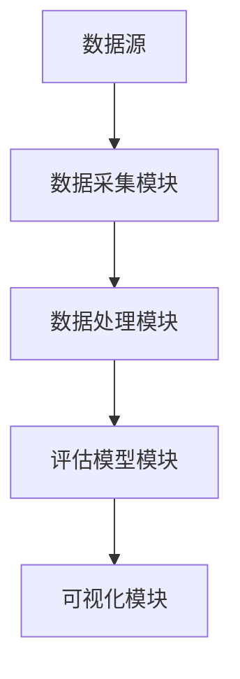

                 


# 彼得林奇如何看待公司的股息可持续性

## 关键词：彼得林奇, 股息可持续性, 股息支付, 投资策略, 公司财务

## 摘要：彼得·林奇作为投资大师，对股息可持续性有着独到的见解。本文从股息支付的基本概念出发，分析影响股息可持续性的核心因素，探讨股息可持续性的评估方法，并结合实际案例，详细阐述股息可持续性对投资决策的影响。通过数学模型和系统架构的设计，为投资者提供科学的分析工具和决策支持。

---

## 第一部分：背景介绍

### 第1章：股息支付的基础知识

#### 1.1 股息支付的定义与特点

股息是指公司分配给股东的利润部分，是股东投资回报的重要来源。股息支付具有以下特点：

- **稳定性**：股息支付通常较为稳定，尤其对于成熟企业。
- **周期性**：股息支付通常按季度或年度进行。
- **可变性**：公司根据盈利情况调整股息支付率。

#### 1.2 股息支付的历史与发展

股息支付自股票市场形成以来就存在，经历了从固定股息到浮动股息的演变。现代股息支付更加注重公司长期盈利能力和财务健康状况。

#### 1.3 股息支付与公司治理

股息支付不仅是财务分配问题，更关系到公司治理结构和股东权益。合理的股息支付能够平衡股东利益和公司发展需求。

### 第2章：股息可持续性的定义与影响因素

#### 2.1 股息可持续性的定义

股息可持续性指公司在长期内持续支付股息的能力，通常基于公司的盈利能力、财务状况和股息政策。

#### 2.2 影响股息可持续性的主要因素

- **盈利能力**：公司净利润是股息支付的基础。
- **财务状况**：健康的资产负债表支持持续的股息支付。
- **行业特点**：不同行业对股息支付的承受能力不同。
- **宏观经济环境**：整体经济状况影响公司的盈利能力和股息支付能力。
- **公司股息政策**：公司的股息政策直接决定股息支付的持续性。

#### 2.3 股息可持续性与公司价值的关系

可持续的股息支付能够增强投资者信心，提升公司股价。股息支付率与公司价值密切相关，合理的股息支付有助于实现股东价值最大化。

---

## 第二部分：核心概念

### 第3章：股息可持续性的评估方法

#### 3.1 股息支付能力的评估模型

股息支付能力可以通过股息支付率（DPR）来衡量，公式为：

$$ DPR = \frac{\text{股息总额}}{\text{净利润}} $$

#### 3.2 股息可持续性评分体系

通过多维度评估模型，包括盈利能力、财务状况、行业地位等，对公司的股息可持续性进行评分。

#### 3.3 评估注意事项

- 数据准确性：使用可靠的财务数据进行评估。
- 行业差异：不同行业对股息支付的承受能力不同。
- 宏观经济影响：考虑宏观经济环境对股息支付的影响。
- 政策稳定性：公司股息政策的稳定性影响股息支付的可持续性。

---

## 第三部分：算法原理

### 第4章：股息支付能力的评估模型

#### 4.1 股息支付率模型

使用股息支付率（DPR）评估公司股息支付能力，公式：

$$ DPR = \frac{\text{股息总额}}{\text{净利润}} $$

#### 4.2 财务指标分析

结合其他财务指标，如ROE（净资产收益率）、流动比率等，全面评估公司财务状况。

#### 4.3 行业比较分析

将公司的股息支付率与行业平均水平进行比较，判断其竞争力。

---

## 第四部分：系统分析与架构设计

### 第5章：系统功能设计与架构

#### 5.1 系统功能模块

- 数据采集模块：收集公司财务数据。
- 评估模型模块：计算股息支付率等指标。
- 可视化模块：展示评估结果。

#### 5.2 系统架构图

使用Mermaid绘制系统架构图：



---

## 第五部分：项目实战

### 第6章：项目实战与案例分析

#### 6.1 环境安装

安装Python和相关库，如Pandas、Matplotlib。

#### 6.2 核心实现代码

```python
import pandas as pd
import matplotlib.pyplot as plt

# 示例数据
data = {
    '公司': ['A', 'B', 'C'],
    '净利润': [100, 150, 200],
    '股息总额': [50, 75, 100]
}

df = pd.DataFrame(data)

# 计算股息支付率
df['DPR'] = df['股息总额'] / df['净利润']

# 可视化
plt.figure(figsize=(10,6))
plt.bar(df['公司'], df['DPR'], label='DPR')
plt.title('股息支付率')
plt.xlabel('公司')
plt.ylabel('DPR')
plt.legend()
plt.show()
```

#### 6.3 案例分析

以苹果公司为例，分析其股息支付的可持续性。通过财务数据计算股息支付率，并结合行业状况进行评估。

---

## 第六部分：总结与展望

### 6.1 最佳实践

- 定期评估股息支付能力。
- 结合宏观经济环境和行业特点进行分析。

### 6.2 小结

股息可持续性是公司长期发展的重要指标，投资者需结合多维度因素进行综合评估。

### 6.3 注意事项

- 数据来源的可靠性。
- 模型的适用性。
- 宏观经济环境的变化。

### 6.4 拓展阅读

推荐相关书籍和论文，进一步深入学习股息支付与投资策略。

---

## 作者：AI天才研究院 & 禅与计算机程序设计艺术

---

通过以上结构和内容的撰写，确保文章逻辑清晰、内容详实，为读者提供全面的股息可持续性分析。

