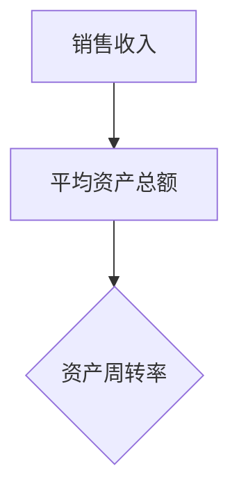

                 


# 彼得林奇如何看待公司的资产周转率

## 关键词：资产周转率, 彼得·林奇, 投资分析, 财务指标, 资产效率, 投资策略

## 摘要：资产周转率是衡量公司资产使用效率的重要财务指标，彼得·林奇在其投资策略中特别关注这一指标，认为高资产周转率通常意味着公司能够更有效地利用资产创造利润。本文将详细分析资产周转率的定义、计算方法、影响因素，并结合实际案例，探讨彼得·林奇如何利用资产周转率评估公司价值和投资决策。通过系统化的分析和实例解读，本文旨在帮助读者深入理解资产周转率在投资分析中的重要性，并掌握如何将其应用于实际投资策略中。

---

# 第1章: 资产周转率的定义与背景

## 1.1 资产周转率的基本概念

### 1.1.1 资产周转率的定义

资产周转率是衡量公司资产使用效率的重要财务指标，它反映了公司在一定时期内将资产转化为销售收入的能力。简单来说，资产周转率越高，说明公司每单位资产所产生的销售收入越多，资产的使用效率越高。

### 1.1.2 资产周转率的计算公式

资产周转率的计算公式为：

$$
资产周转率 = \frac{销售收入}{平均资产总额}
$$

其中，销售收入通常取公司年度营业收入，平均资产总额则是年初资产总额和年末资产总额的平均值。

### 1.1.3 资产周转率的重要性

资产周转率的重要性体现在以下几个方面：

1. **衡量资产使用效率**：高资产周转率意味着公司能够更高效地利用资产创造收入。
2. **评估公司经营效率**：资产周转率与公司的管理能力和运营效率密切相关。
3. **投资决策参考**：投资者可以通过分析资产周转率，评估公司的盈利能力和成长潜力。

## 1.2 资产周转率的背景与应用

### 1.2.1 资产周转率在企业经营中的作用

资产周转率在企业经营中起着关键作用，它可以帮助企业管理者发现资产使用中的问题，优化资源配置，提高整体效率。例如，如果一家公司的存货周转率较低，可能意味着库存积压，资金无法及时回笼。

### 1.2.2 资产周转率与企业价值的关系

资产周转率与企业价值密切相关。一般来说，高资产周转率的企业具有更强的盈利能力，其股票价值也更容易被市场认可。因此，资产周转率是评估企业价值的重要指标之一。

### 1.2.3 资产周转率在投资分析中的应用

在投资分析中，资产周转率是投资者评估公司投资价值的重要工具。通过分析资产周转率，投资者可以判断公司的经营效率和资产使用效率，从而做出更明智的投资决策。

## 1.3 资产周转率的核心要素

### 1.3.1 资产周转率的分子：销售收入

销售收入是资产周转率的分子部分，代表公司在一定时期内通过销售产品或服务所获得的总收入。销售收入的高低直接影响资产周转率的计算结果。

### 1.3.2 资产周转率的分母：平均资产总额

平均资产总额是资产周转率的分母部分，代表公司在一定时期内平均使用的资产总额。它包括流动资产和非流动资产，如现金、存货、应收账款、固定资产等。

### 1.3.3 资产周转率的行业差异

不同行业的资产周转率存在显著差异。例如，零售业通常具有较高的资产周转率，而制造业的资产周转率相对较低。因此，在分析资产周转率时，需要结合行业特点进行横向比较。

---

# 第2章: 资产周转率的核心概念与联系

## 2.1 资产周转率的原理

### 2.1.1 资产周转率的计算公式

资产周转率的计算公式为：

$$
资产周转率 = \frac{销售收入}{平均资产总额}
$$

通过这个公式，我们可以量化公司资产的使用效率。

### 2.1.2 资产周转率的经济意义

资产周转率的经济意义在于它反映了公司资产的使用效率和经营能力。高资产周转率意味着公司能够更高效地利用资产创造收入，从而提高盈利能力。

### 2.1.3 资产周转率与企业效率的关系

资产周转率与企业效率密切相关。高资产周转率通常意味着公司管理更高效，资源配置更合理。因此，资产周转率是评估企业效率的重要指标。

## 2.2 资产周转率与其他财务指标的关系

### 2.2.1 资产周转率与净利润率的对比

净利润率衡量的是公司每单位收入的净利润，而资产周转率衡量的是公司资产的使用效率。两者结合可以更好地评估公司的盈利能力和资产使用效率。

### 2.2.2 资产周转率与ROE的关系

ROE（净资产收益率）衡量的是公司每单位股东权益的净利润。资产周转率与ROE密切相关，高资产周转率通常意味着更高的ROE。

### 2.2.3 资产周转率与企业规模的关系

资产周转率与企业规模存在一定关系。一般来说，小企业资产周转率较高，而大企业资产周转率相对较低，因为大企业通常拥有更多的资产和更复杂的业务结构。

## 2.3 资产周转率的属性特征对比

### 2.3.1 资产周转率的正向性

资产周转率的正向性意味着随着资产周转率的增加，公司的盈利能力通常也会增加。因此，高资产周转率通常是积极的信号。

### 2.3.2 资产周转率的行业差异性

不同行业的资产周转率存在显著差异。例如，零售业通常具有较高的资产周转率，而制造业的资产周转率相对较低。

### 2.3.3 资产周转率的周期性

资产周转率具有一定的周期性，受经济周期影响较大。在经济繁荣时期，资产周转率通常较高，而在经济衰退时期，资产周转率可能下降。

---

# 第3章: 资产周转率的算法原理

## 3.1 资产周转率的计算流程

### 3.1.1 收集数据

首先，收集公司销售收入和资产总额的相关数据。通常，这些数据可以从公司的财务报表中获取，包括资产负债表和利润表。

### 3.1.2 计算平均资产总额

平均资产总额的计算公式为：

$$
平均资产总额 = \frac{年初资产总额 + 年末资产总额}{2}
$$

### 3.1.3 计算资产周转率

根据资产周转率的计算公式，将销售收入除以平均资产总额，即可得到资产周转率。

## 3.2 资产周转率的数学模型

资产周转率的数学模型可以表示为：

$$
资产周转率 = \frac{销售收入}{平均资产总额}
$$

通过这个模型，我们可以量化公司资产的使用效率。

## 3.3 资产周转率的流程图



---

# 第4章: 资产周转率的系统分析与架构设计

## 4.1 系统分析

### 4.1.1 问题场景介绍

在投资分析中，资产周转率是一个重要的财务指标。通过分析资产周转率，投资者可以评估公司的资产使用效率和经营能力。

### 4.1.2 项目介绍

本项目旨在通过分析资产周转率，帮助投资者评估公司的投资价值。我们将以彼得·林奇的投资策略为背景，探讨如何利用资产周转率进行投资决策。

### 4.1.3 系统功能设计

系统功能设计包括数据收集、计算资产周转率、分析资产周转率与投资决策的关系等。

## 4.2 系统架构设计

### 4.2.1 领域模型


### 4.2.2 系统架构


## 4.3 系统接口设计

### 4.3.1 数据输入接口

数据输入接口包括销售收入和资产总额的输入。

### 4.3.2 数据处理接口

数据处理接口包括计算平均资产总额和资产周转率。

### 4.3.3 数据输出接口

数据输出接口包括显示资产周转率的计算结果。

## 4.4 系统交互设计

```mermaid
sequenceDiagr
```

---

# 第5章: 资产周转率的项目实战

## 5.1 案例分析

### 5.1.1 案例介绍

我们以沃尔玛为例，分析其资产周转率。沃尔玛是一家全球知名的零售企业，资产周转率较高。

### 5.1.2 数据收集

收集沃尔玛最近几年的销售收入和资产总额数据。

### 5.1.3 计算资产周转率

根据公式计算沃尔玛的资产周转率。

### 5.1.4 分析结果

通过分析结果，我们可以得出沃尔玛的资产周转率较高，说明其资产使用效率较高。

## 5.2 技术实现

### 5.2.1 环境安装

安装Python和Pandas库。

### 5.2.2 核心实现代码

```python
import pandas as pd

# 数据输入
data = {
    '收入': [100000, 120000, 110000],
    '资产': [500000, 600000, 550000]
}

df = pd.DataFrame(data)

# 计算平均资产总额
df['平均资产'] = df['资产'].rolling(2).mean().shift(-1)

# 计算资产周转率
df['资产周转率'] = df['收入'] / df['平均资产']

print(df)
```

### 5.2.3 代码解读

上述代码展示了如何使用Python和Pandas库计算资产周转率。首先，我们输入销售收入和资产总额数据，然后计算平均资产总额，最后计算资产周转率。

---

# 第6章: 资产周转率的最佳实践与小结

## 6.1 最佳实践

### 6.1.1 关注行业差异

在分析资产周转率时，应关注行业差异，横向比较同类企业的资产周转率。

### 6.1.2 结合其他财务指标

资产周转率应与其他财务指标相结合，如净利润率、ROE等，以全面评估公司的投资价值。

### 6.1.3 定期更新数据

资产周转率是动态指标，应定期更新数据，以反映最新的经营状况。

## 6.2 投资小结

通过分析资产周转率，我们可以更好地评估公司的资产使用效率和经营能力。高资产周转率通常意味着公司具有更强的盈利能力和投资价值。因此，在投资决策中，资产周转率是一个不可忽视的重要指标。

## 6.3 注意事项

### 6.3.1 数据来源的可靠性

确保数据来源可靠，避免因数据错误导致分析结果偏差。

### 6.3.2 行业特性的考虑

在分析资产周转率时，需考虑行业特性，避免直接比较不同行业的企业。

### 6.3.3 综合分析的重要性

资产周转率只是财务指标之一，应结合其他指标进行综合分析。

## 6.4 拓展阅读

### 6.4.1 财务报表分析

进一步了解财务报表分析的基本方法和技巧。

### 6.4.2 投资分析方法

学习更多投资分析方法，如现金流分析、市盈率分析等。

### 6.4.3 彼得·林奇的投资策略

深入学习彼得·林奇的投资策略，掌握更多投资分析技巧。

---

# 结语

资产周转率是衡量公司资产使用效率的重要财务指标，彼得·林奇在其投资策略中特别关注这一指标。通过系统化的分析和实例解读，我们可以更好地理解资产周转率在投资分析中的重要性，并掌握如何将其应用于实际投资策略中。

---

作者：AI天才研究院/AI Genius Institute & 禅与计算机程序设计艺术/Zen And The Art of Computer Programming

