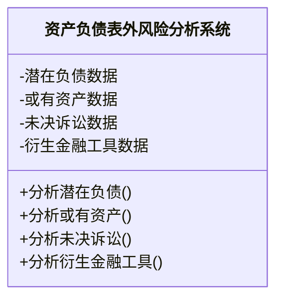

                 


# 彼得林奇如何看待公司的资产负债表外风险

## 关键词：资产负债表、外风险、彼得·林奇、财务分析、风险管理、投资策略

## 摘要：  
本文从彼得·林奇的视角出发，详细分析了公司资产负债表外风险的核心概念、分析方法和系统架构。通过定性分析与定量分析的结合，结合实际案例，展示了如何识别和评估资产负债表外风险，并提出了有效的管理策略。文章最后总结了彼得·林奇的风险管理思想，并展望了未来的发展趋势。

---

# 第一部分: 背景介绍与核心概念

## 第1章: 资产负债表外风险的背景与定义

### 1.1 资产负债表外风险的背景介绍

#### 1.1.1 什么是资产负债表外风险
资产负债表外风险（Off-Balance Sheet Risks）是指那些不在公司资产负债表上直接反映，但可能对公司的财务状况、经营成果或现金流量产生重大影响的潜在风险。这些风险通常源于公司的或有负债、未决诉讼、潜在的债务担保或其他表外承诺。

#### 1.1.2 资产负债表外风险的产生背景
随着企业经营的复杂化和全球化，越来越多的公司通过表外融资、衍生品交易或其他复杂的金融工具来优化资本结构和风险管理。然而，这些操作往往导致资产负债表外风险的增加。彼得·林奇作为一名资深的投资专家，非常关注这些潜在风险对公司价值的影响。

#### 1.1.3 彼得·林奇对资产负债表外风险的关注点
彼得·林奇在其投资分析中，特别关注资产负债表外风险对公司财务健康的影响。他认为，许多公司在财务报表中隐藏了大量潜在的负债和或有事项，这些事项可能在未来对公司造成重大冲击。因此，投资者必须深入挖掘这些表外风险，以全面评估公司的财务状况。

### 1.2 资产负债表外风险的核心概念

#### 1.2.1 资产负债表外风险的定义与特征
- **定义**：资产负债表外风险是指那些不在公司资产负债表上直接反映，但可能对公司的财务状况、经营成果或现金流量产生重大影响的潜在风险。
- **特征**：
  - 隐含性：这些风险通常隐藏在公司复杂的交易和承诺中，不易被普通投资者察觉。
  - 可能性：风险发生的可能性通常较低，但一旦发生，可能对公司的财务状况造成重大影响。
  - 复杂性：这些风险往往涉及复杂的法律、金融或商业结构，难以直接量化。

#### 1.2.2 资产负债表外风险与财务报表的关系
资产负债表外风险与财务报表的关系非常密切。虽然这些风险不在资产负债表中直接反映，但它们可能通过公司的或有负债、潜在的债务担保或其他表外承诺影响公司的财务状况。因此，投资者需要结合公司财务报表和其他公开信息，全面评估这些风险。

#### 1.2.3 资产负债表外风险的分类与边界
- **分类**：
  - 或有负债：公司可能承担的潜在负债，如未决诉讼、担保承诺等。
  - 潜在债务：公司可能在未来产生的债务，如融资租赁、售后回租等。
  - 衍生工具：公司使用的金融衍生工具，如期权、期货等。
- **边界**：
  - 资产负债表外风险的边界通常由公司的业务范围、法律环境和行业特点决定。

---

## 第2章: 资产负债表外风险的核心要素与分析框架

### 2.1 资产负债表外风险的核心要素

#### 2.1.1 潜性负债
潜性负债是指公司可能在未来承担的潜在负债，这些负债通常源于公司过去的交易或承诺，但尚未在财务报表中确认。例如，未决诉讼、担保承诺等。

#### 2.1.2 或有资产
或有资产是指公司可能在未来获得的资产，这些资产通常源于公司过去的交易或承诺，但尚未在财务报表中确认。例如，未决诉讼中的潜在赔偿收入。

#### 2.1.3 未决诉讼
未决诉讼是指公司正在涉及的尚未结案的诉讼或仲裁，这些诉讼可能对公司造成潜在的财务损失或收益。

#### 2.1.4 衍生金融工具
衍生金融工具是指公司使用的金融衍生工具，如期权、期货等。这些工具通常用于对冲风险，但也可能引入新的资产负债表外风险。

### 2.2 资产负债表外风险的分析框架

#### 2.2.1 资产负债表外风险的识别与评估
识别资产负债表外风险的第一步是了解公司可能涉及的表外交易和承诺。投资者需要仔细阅读公司公开的财务报表附注和其他相关文件，识别潜在的表外风险。

#### 2.2.2 资产负债表外风险的量化与度量
量化资产负债表外风险的难度较大，因为这些风险通常具有隐含性和复杂性。投资者可以通过分析公司财务报表中的相关指标，如或有负债的潜在影响、衍生工具的公允价值变化等，来度量这些风险。

#### 2.2.3 资产负债表外风险的管理与控制
控制资产负债表外风险的关键在于公司管理层和投资者的风险管理能力。公司可以通过建立完善的内部控制系统、加强表外交易的监控和披露，来降低这些风险的影响。

---

# 第二部分: 资产负债表外风险的分析方法

## 第3章: 资产负债表外风险的定性分析方法

### 3.1 定性分析的核心步骤

#### 3.1.1 识别潜在风险因素
投资者需要仔细阅读公司公开的财务报表附注和其他相关文件，识别潜在的表外风险。例如，公司可能涉及的未决诉讼、担保承诺等。

#### 3.1.2 分析风险因素的性质与影响
在识别出潜在的表外风险后，投资者需要分析这些风险的性质和影响。例如，未决诉讼可能对公司造成财务损失，但具体影响取决于案件的结果。

#### 3.1.3 评估风险的严重程度与可能性
投资者需要评估表外风险的严重程度和可能性。例如，未决诉讼的可能性较高，但其影响可能较小；而潜在的债务担保可能对公司造成较大的财务压力。

### 3.2 定性分析的实践案例

#### 3.2.1 某公司潜在负债的定性分析
以某公司为例，假设其涉及一项未决诉讼，可能需要承担一定的赔偿责任。投资者需要分析该诉讼的可能性、对公司财务状况的影响以及公司的应对措施。

#### 3.2.2 某行业或有资产的定性分析
以某行业为例，假设公司涉及一项潜在的赔偿收入，投资者需要分析该收入的可能性、对公司财务状况的影响以及公司的应对措施。

#### 3.2.3 某企业的未决诉讼风险分析
以某企业为例，假设其涉及一项未决诉讼，投资者需要分析该诉讼的可能性、对公司财务状况的影响以及公司的应对措施。

---

## 第4章: 资产负债表外风险的定量分析方法

### 4.1 定量分析的核心步骤

#### 4.1.1 数据收集与整理
投资者需要收集公司公开的财务报表数据，包括资产负债表、利润表、现金流量表等。同时，还需要收集公司公开的财务报表附注和其他相关文件，以获取表外风险的相关信息。

#### 4.1.2 风险量化模型的选择
投资者可以选择合适的定量分析模型，例如概率加权模型、蒙特卡洛模拟等，来量化表外风险的影响。

#### 4.1.3 模型参数的设定与调整
投资者需要根据公司的实际情况，设定模型的参数，例如风险发生的概率、影响程度等，并根据实际情况进行调整。

### 4.2 定量分析的数学模型与公式

#### 4.2.1 风险概率计算公式
$$ P = \frac{\text{历史发生次数}}{\text{总样本数}} $$

#### 4.2.2 风险影响程度计算公式
$$ I = \text{风险金额} \times \text{风险概率} $$

#### 4.2.3 综合风险指数计算公式
$$ R = P \times I $$

### 4.3 定量分析的实践案例

#### 4.3.1 某公司潜在负债的定量分析
以某公司为例，假设其涉及一项潜在负债，可能需要承担1000万美元的赔偿责任，且该责任发生的概率为5%。投资者可以通过上述公式计算该风险的影响。

#### 4.3.2 某行业或有资产的定量分析
以某行业为例，假设公司涉及一项潜在的赔偿收入，可能获得500万美元的赔偿，且该收入发生的概率为3%。投资者可以通过上述公式计算该风险的影响。

#### 4.3.3 某企业的未决诉讼风险量化
以某企业为例，假设其涉及一项未决诉讼，可能需要承担2000万美元的赔偿责任，且该责任发生的概率为10%。投资者可以通过上述公式计算该风险的影响。

---

# 第三部分: 资产负债表外风险的系统分析与架构设计

## 第5章: 资产负债表外风险的系统分析

### 5.1 系统分析的核心步骤

#### 5.1.1 问题场景介绍
投资者需要分析公司资产负债表外风险的系统结构，识别潜在风险因素，并评估其影响。

#### 5.1.2 系统功能设计
系统功能设计包括风险识别、风险评估、风险量化和风险监控等功能。

#### 5.1.3 系统架构设计
系统架构设计包括数据采集、数据处理、风险分析和结果展示等功能模块。

### 5.2 系统分析的 Mermaid 类图


---

## 第6章: 资产负债表外风险的实战案例

### 6.1 环境安装
投资者需要安装必要的数据分析工具，例如Excel、Python、R等。

### 6.2 系统核心实现源代码

#### 6.2.1 风险分析的Python代码
```python
import pandas as pd

def calculate_risk_probability(data):
    return data['历史发生次数'] / data['总样本数']

def calculate_risk_impact(data):
    return data['风险金额'] * calculate_risk_probability(data)

def calculate_total_risk(data):
    return calculate_risk_probability(data) * calculate_risk_impact(data)
```

### 6.3 代码应用解读与分析
通过对代码的分析，投资者可以量化表外风险的影响，并制定相应的风险管理策略。

### 6.4 实际案例分析和详细讲解剖析
通过具体案例的分析，投资者可以更好地理解表外风险的识别、评估和管理。

### 6.5 项目小结
总结项目的实施过程，提出改进建议和未来发展方向。

---

## 第7章: 总结与展望

### 7.1 彼得·林奇的风险管理思想
彼得·林奇强调，投资者必须深入挖掘公司的表外风险，以全面评估公司的财务状况。

### 7.2 未来的发展趋势
随着企业经营的复杂化和全球化，资产负债表外风险的管理将变得更加重要。投资者需要不断提高自身的分析能力，以应对不断变化的市场环境。

### 7.3 最佳实践 tips
- 投资者需要仔细阅读公司公开的财务报表附注和其他相关文件，识别潜在的表外风险。
- 投资者可以通过定性分析和定量分析的结合，全面评估表外风险的影响。
- 公司管理层需要加强表外交易的监控和披露，降低表外风险的影响。

### 7.4 小结
通过本文的分析，投资者可以更好地理解彼得·林奇如何看待公司的资产负债表外风险，并制定相应的投资策略。

---

# 作者：AI天才研究院/AI Genius Institute & 禅与计算机程序设计艺术 /Zen And The Art of Computer Programming

