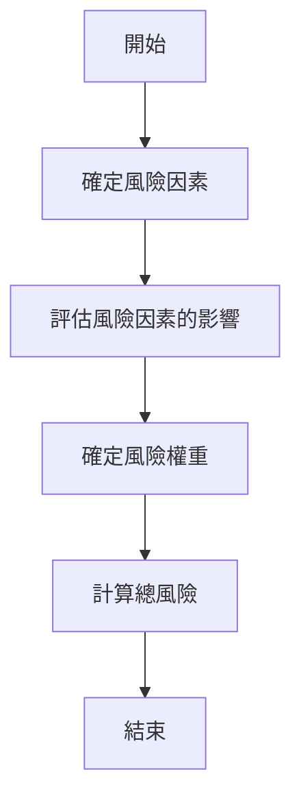

                 

# 彼得林奇如何看待公司的跨国经营风险

## 关键词：
- 跨国經營風險
- 彼得·林奇
- 風險管理
- 投資策略
- 國際市場

## 摘要：
本文深入探讨了彼得·林奇对公司在跨国经营中所面临的风险的独到见解。通过分析跨国经营的风险类型、影响因素以及应对策略，结合实际案例和数学模型，为读者提供系统化的风险管理方法和投资策略。本文旨在帮助企业在全球化背景下更好地识别、评估和应对跨国经营风险，确保稳健发展。

---

# 第一部分: 背景介紹與核心概念

## 第1章: 跨国經營風險的背景與概述

### 1.1 跨国經營風險的核心概念
#### 1.1.1 跨国經營的背景与发展
- 全球化的加速推动了跨国经营的普及。
- 企业的国际化扩展面临的复杂环境。
- 跨国經營的核心驱动力：市场扩展、资源优化配置。

#### 1.1.2 跨国經營風險的定义与内涵
- 跨国經營風險：企业在跨国经营过程中可能面临的各种不确定性因素，导致损失或收益低于预期的风险。
- 风险类型：政治风险、经济风险、法律风险、市场风险等。
- 风险的动态性：跨国经营环境的不断变化使得风险具有动态性和复杂性。

#### 1.1.3 跨国經營風險的边界与外延
- 边界：跨国经营中涉及的法律、文化、经济等因素。
- 外延：从单一国家扩展到多个国家的经营活动中可能遇到的风险。

### 1.2 跨国經營風險的問題背景
#### 1.2.1 全球化背景下跨国經營的复杂性
- 不同国家的法律法规差异。
- 市场环境的不确定性。
- 文化差异对经营管理的影响。

#### 1.2.2 跨国經營中常见的风险类型
- 政治风险：政策变化、政局不稳等。
- 经济风险：汇率波动、通货膨胀等。
- 法律风险：税收政策、知识产权保护等。
- 市场风险：市场需求波动、竞争加剧等。

#### 1.2.3 跨国經營風險对企业的影响
- 财务影响：汇率波动导致的财务损失。
- 经营影响：市场不适应导致的业务受阻。
- 声誉影响：跨国经营失败对企业形象的冲击。

---

## 第2章: 跨国經營風險的核心要素与联系

### 2.1 核心概念的原理分析
#### 2.1.1 跨国經營風險的构成要素
- 政治环境：政策变化、政局稳定。
- 经济环境：汇率波动、经济周期。
- 法律环境：税收政策、知识产权。
- 市场环境：市场需求、竞争状况。
- 文化环境：消费者习惯、商业文化。

#### 2.1.2 跨国經營風險的关键驱动因素
- 经济因素：汇率波动、通货膨胀。
- 政治因素：政策变化、政局不稳。
- 法律因素：税收政策、知识产权保护。
- 市场因素：市场需求波动、竞争加剧。

#### 2.1.3 跨国經營風險的相互作用机制
- 经济因素与政治因素的相互影响。
- 市场因素与法律因素的相互作用。
- 文化因素对市场行为的调节作用。

### 2.2 核心概念的对比分析
#### 2.2.1 跨国經營風險与国内經營風險的对比
- 风险来源的不同：国内风险主要来自国内市场，跨国风险涉及多个国家。
- 风险类型的差异：跨国风险更加多样化和复杂化。

#### 2.2.2 不同行業中的跨国經營風險特征
- 高科技行业：技术风险和知识产权风险突出。
- 制造业：原材料价格波动和贸易政策风险。
- 服务业：文化差异和市场准入障碍。

#### 2.2.3 跨国經營風險的地域差异性
- 发达国家与发展中国家的风险差异。
- 亚洲、欧洲、美洲等不同地区的风险特点。

---

## 第3章: 跨国經營風險的影響與后果

### 3.1 跨国經營風險对企业绩效的影响
#### 3.1.1 財務風險的影響
- 汇率波动导致的财务损失。
- 跨国并购中的资产评估风险。

#### 3.1.2 市場風險的影響
- 市场需求波动导致的销售收入下降。
- 竞争加剧导致的市场份额丢失。

#### 3.1.3 法律與政策風險的影響
- 税收政策变化导致的税负增加。
- 知识产权纠纷导致的法律成本上升。

### 3.2 跨国經營風險的管理挑战
#### 3.2.1 跨国經營中的文化差异
- 不同国家的商业习惯和消费者行为差异。
- 跨国团队的沟通与协调难度。

#### 3.2.2 跨国經營中的信息不对称
- 不同国家之间的信息传递障碍。
- 数据跨境传输的法律限制。

#### 3.2.3 跨国經營中的协调与控制难度
- 多个国家的业务协调复杂性。
- 中央与地方的政策差异导致的管理难度。

---

# 第二部分: 跨国經營風險的評估與管理

## 第4章: 跨国經營風險的評估模型

### 4.1 評估模型的原理
#### 4.1.1 評估模型的基本假设
- 风险因素的独立性假设。
- 风险影响的可量化性假设。

#### 4.1.2 評估模型的输入变量
- 各个国家的风险评分。
- 风险因素的权重分配。

#### 4.1.3 評估模型的输出结果
- 总体风险评分。
- 各个国家的风险排序。

### 4.2 評估模型的算法原理
#### 4.2.1 評估模型的数学公式
$$ R = \sum_{i=1}^{n} w_i \cdot r_i $$
其中，R为总风险，w_i为各风险因素的权重，r_i为各风险因素的评分。

#### 4.2.2 評估模型的流程图

---

## 第5章: 跨国經營風險的管理策略

### 5.1 跨国經營風險的管理框架
#### 5.1.1 風險管理的目標
- 最小化风险对企业的影响。
- 优化资源配置，提高企业竞争力。

#### 5.1.2 風險管理的組織結構
- 风险管理团队的构建。
- 各部门的风险管理职责。

#### 5.1.3 颫險管理的實施步驟
- 风险识别。
- 风险评估。
- 风险应对。

### 5.2 跨国經營風險的控制措施
#### 5.2.1 多元化戰略
- 通过多元化市场降低风险。
- 优化供应链管理。

#### 5.2.2 颫險緩釋措施
- 购买保險。
- 设立子公司分散风险。

#### 5.2.3 颫險監測与報告
- 定期風險評估。
- 颫險報告制度。

---

## 第6章: 跨国經營風險的案例分析

### 6.1 案例背景介紹
- 企業的跨国扩张背景。
- 面临的主要风险。

### 6.2 颫險評估与管理
- 风险识别与评估。
- 风险管理策略的实施。

### 6.3 案例小结
- 成功经验总结。
- 教训与启示。

---

## 第7章: 跨国經營風險的最佳实践与结论

### 7.1 最佳实践 tips
- 定期进行风险评估。
- 建立风险预警机制。
- 加强跨部门协同合作。

### 7.2 結論
- 跨国經營風險的复杂性要求企业具备全面的風險管理能力。
- 通过科学的評估模型和有效的管理策略，企业可以在全球化中实现稳健发展。

---

# 作者：AI天才研究院/AI Genius Institute & 禪與计算机程序设计藝術 /Zen And The Art of Computer Programming

