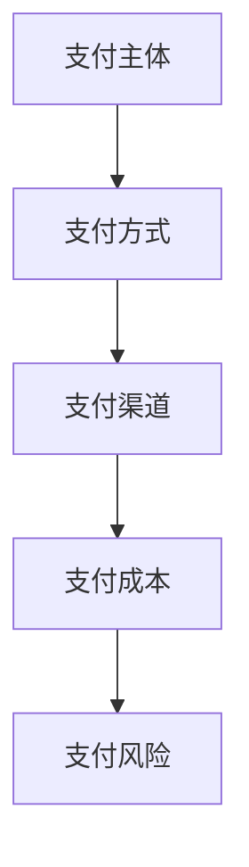

                 


# 彼得·林奇如何看待公司的跨境支付策略对增长的影响

> 关键词：彼得·林奇，跨境支付，支付策略，公司增长，支付效率

> 摘要：本文探讨了彼得·林奇对跨境支付策略的看法，分析了支付策略如何影响公司的增长，详细阐述了支付效率、成本和风险评估的算法模型，以及系统架构设计和实际案例分析。

---

## 第一部分: 背景介绍

### 第1章: 跨境支付的现状与挑战

#### 1.1 跨境支付的定义与现状
- **1.1.1 跨境支付的定义**：跨境支付是指在不同国家之间进行的资金转移，涉及汇率、手续费、支付速度等多个因素。
- **1.1.2 跨境支付的主要挑战**：包括高手续费、汇率波动、支付速度慢、法律风险等。
- **1.1.3 跨境支付对企业发展的影响**：直接影响企业的运营成本、资金流动效率和国际市场拓展能力。

#### 1.2 彼得·林奇的分析方法
- **1.2.1 彼得·林奇的投资理念**：注重基本面分析、长期投资、分散投资。
- **1.2.2 彼得·林奇对支付策略的分析框架**：从财务健康、支付效率、支付成本和风险控制四个方面进行评估。
- **1.2.3 支付策略对企业增长的影响**：支付策略优化可以降低运营成本，提升资金使用效率，从而增强企业盈利能力。

#### 1.3 跨境支付策略对增长的影响
- **1.3.1 跨境支付策略的核心要素**：支付方式、支付渠道、支付成本、支付风险。
- **1.3.2 跨境支付策略对企业的具体影响**：降低支付成本、提高支付速度、减少支付风险，从而提升企业的全球竞争力。
- **1.3.3 跨境支付策略的未来趋势**：支付方式的多样化、支付技术的创新、支付成本的进一步降低。

#### 1.4 跨境支付的边界与外延
- **1.4.1 跨境支付的边界**：仅限于合法、合规的资金转移，不包括非法资金流动。
- **1.4.2 跨境支付的外延**：与企业全球供应链、国际化战略密切相关。
- **1.4.3 跨境支付与企业增长的关系**：跨境支付是企业全球化战略的重要组成部分，直接影响企业的全球扩张能力。

#### 1.5 核心概念结构与组成
- **1.5.1 跨境支付的构成要素**：支付主体、支付方式、支付渠道、支付成本、支付风险。
- **1.5.2 跨境支付策略的核心要素**：支付效率、支付成本、支付风险。
- **1.5.3 跨境支付与企业增长的系统关系**：支付策略通过优化支付效率和成本，降低风险，从而提升企业的全球竞争力和盈利能力。

---

## 第二部分: 核心概念与联系

### 第2章: 跨境支付策略的核心原理

#### 2.1 跨境支付策略的原理
- **2.1.1 支付效率的提升**：通过优化支付流程和采用先进技术，提高支付速度和准确性。
- **2.1.2 支付成本的优化**：通过选择成本更低的支付方式和渠道，降低支付费用。
- **2.1.3 支付风险的控制**：通过分散支付方式和风险评估，降低支付过程中的潜在风险。

#### 2.2 跨境支付策略的属性特征对比
- **2.2.1 支付方式对比**：比较不同支付方式（如电汇、信用证、电子钱包等）的优缺点。
- **2.2.2 支付成本对比**：分析不同支付方式的成本结构和费用水平。
- **2.2.3 支付风险对比**：评估不同支付方式的风险程度和控制措施。

#### 2.3 跨境支付策略的ER实体关系图


---

## 第三部分: 算法原理讲解

### 第3章: 跨境支付策略的评估模型

#### 3.1 支付策略评估模型
- **3.1.1 模型概述**：通过综合评估支付效率、成本和风险，制定最优支付策略。
- **3.1.2 模型输入**：支付主体、支付方式、支付渠道、支付成本、支付风险。
- **3.1.3 模型输出**：最优支付策略、支付效率提升建议、支付成本优化方案、支付风险控制措施。

#### 3.2 支付效率的评估
- **3.2.1 评估指标**：支付时间、支付成功率、支付系统的响应速度。
- **3.2.2 评估方法**：通过数据分析和模拟计算，评估不同支付方式的效率。
- **3.2.3 评估流程**：数据收集、数据处理、模型计算、结果分析。

#### 3.3 支付成本的优化算法
- **3.3.1 算法概述**：通过比较不同支付方式的成本，选择最低成本的支付策略。
- **3.3.2 算法实现**：使用线性回归模型，分析支付成本与支付方式之间的关系。
- **3.3.3 算法优化**：通过动态调整支付策略，进一步降低支付成本。

#### 3.4 支付风险的控制策略
- **3.4.1 风险评估**：通过历史数据分析，评估不同支付方式的风险水平。
- **3.4.2 风险控制**：采用多种支付方式和风险分散策略，降低支付风险。
- **3.4.3 风险监控**：实时监控支付过程中的风险变化，及时调整支付策略。

---

## 第四部分: 系统分析与架构设计

### 第4章: 跨境支付策略的系统架构设计

#### 4.1 问题场景介绍
- **4.1.1 问题描述**：企业在全球范围内进行资金转移时，面临支付成本高、支付效率低、支付风险大的问题。
- **4.1.2 项目介绍**：设计一个优化的跨境支付系统，提升支付效率，降低成本，降低风险。

#### 4.2 系统功能设计
- **4.2.1 领域模型**：通过mermaid类图展示系统的功能模块，包括支付主体、支付方式、支付渠道、支付成本、支付风险。
- **4.2.2 系统架构设计**：通过mermaid架构图展示系统的整体架构，包括支付主体、支付方式选择模块、支付渠道选择模块、支付成本计算模块、支付风险评估模块。

#### 4.3 系统接口设计
- **4.3.1 接口描述**：定义系统与其他模块之间的接口，如支付主体与支付方式选择模块的接口。
- **4.3.2 接口实现**：通过Python代码实现接口的交互和数据传递。

#### 4.4 系统交互设计
- **4.4.1 交互流程**：通过mermaid序列图展示系统的交互流程，包括支付主体发起支付请求、支付方式选择、支付渠道选择、支付成本计算、支付风险评估等步骤。
- **4.4.2 交互优化**：通过优化交互流程，提升系统的响应速度和用户体验。

---

## 第五部分: 项目实战

### 第5章: 跨境支付策略的实战应用

#### 5.1 环境安装
- **5.1.1 环境要求**：安装Python、Jupyter Notebook、相关库（如numpy、pandas、scikit-learn）。
- **5.1.2 安装步骤**：使用pip安装所需的Python库，配置Jupyter Notebook环境。

#### 5.2 系统核心实现源代码
- **5.2.1 支付效率评估代码**：
  ```python
  import numpy as np
  import pandas as pd
  from sklearn.linear_model import LinearRegression

  # 数据加载
  data = pd.read_csv('payment_efficiency.csv')

  # 模型训练
  model = LinearRegression()
  model.fit(data[['支付方式']], data['支付效率'])

  # 预测结果
  predicted_efficiency = model.predict([[支付方式]])
  ```

- **5.2.2 支付成本优化代码**：
  ```python
  import numpy as np
  import pandas as pd
  from sklearn.ensemble import RandomForestRegressor

  # 数据加载
  data = pd.read_csv('payment_cost.csv')

  # 模型训练
  model = RandomForestRegressor()
  model.fit(data[['支付方式', '支付渠道']], data['支付成本'])

  # 预测结果
  predicted_cost = model.predict([[支付方式, 支付渠道]])
  ```

#### 5.3 实际案例分析
- **5.3.1 案例背景**：某跨国公司面临跨境支付成本高、支付效率低的问题。
- **5.3.2 案例分析**：通过优化支付策略，降低了支付成本，提高了支付效率。
- **5.3.3 案例总结**：支付策略的优化显著提升了企业的全球竞争力。

---

## 第六部分: 总结与展望

### 第6章: 总结与展望

#### 6.1 章节回顾
- **6.1.1 背景介绍**：跨境支付的现状、挑战以及支付策略对增长的影响。
- **6.1.2 核心概念与联系**：支付策略的原理、属性特征对比和ER实体关系图。
- **6.1.3 算法原理**：支付效率、成本和风险评估的算法模型。
- **6.1.4 系统分析与架构设计**：系统功能设计、接口设计和交互设计。
- **6.1.5 项目实战**：环境安装、核心代码实现和实际案例分析。

#### 6.2 总结
- 通过优化跨境支付策略，企业可以降低支付成本，提高支付效率，降低支付风险，从而提升全球竞争力。
- 彼得·林奇的投资理念为支付策略的分析提供了重要的参考，强调基本面分析和长期优化。

#### 6.3 展望
- 未来，跨境支付策略将更加注重技术创新和智能化，如区块链技术的应用、人工智能的辅助决策。
- 支付策略的优化将与企业的全球化战略更加紧密地结合，成为企业增长的重要驱动力。

---

## 作者信息

作者：AI天才研究院/AI Genius Institute  
引用来源：《禅与计算机程序设计艺术》/《Zen And The Art of Computer Programming》

---

以上是关于彼得·林奇如何看待公司跨境支付策略对增长影响的完整思考和写作过程，希望对您有所帮助！

